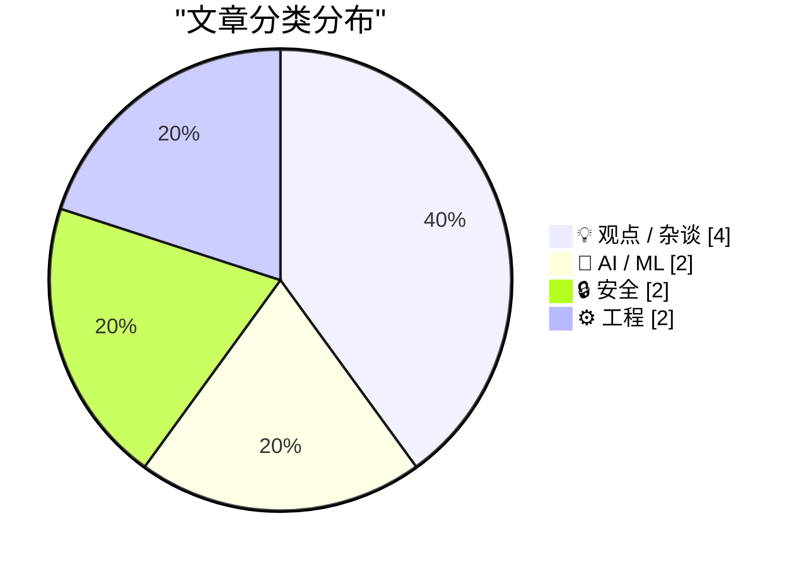
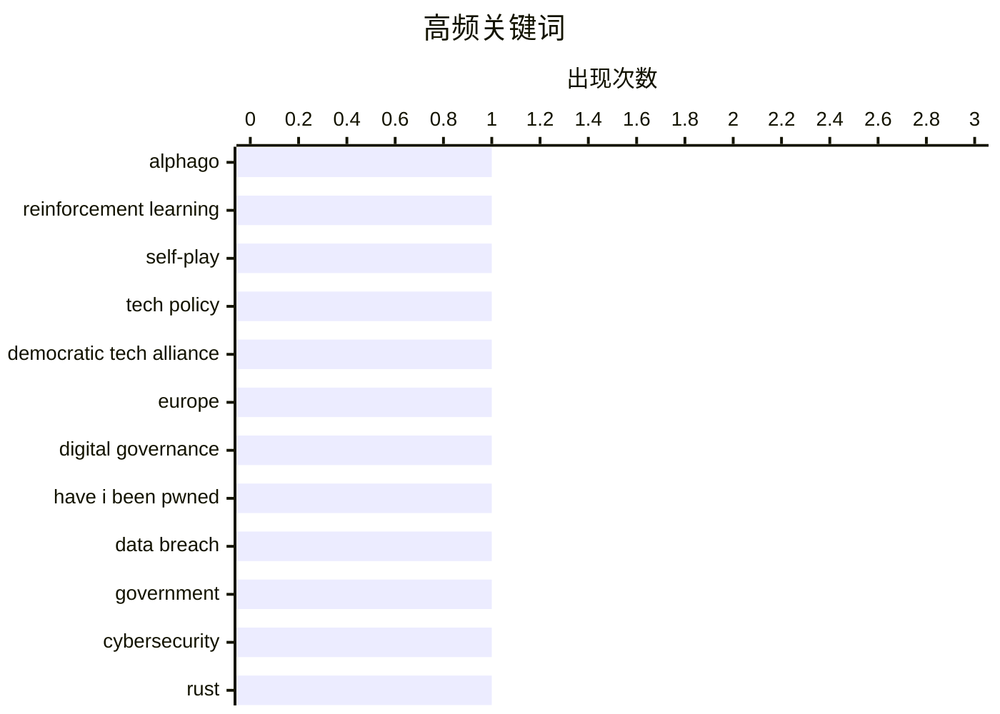

今日技术圈呈现三大趋势：一是AI讨论更加务实，既有关于AlphaGo技术底层逻辑的深度解析，也有对AI泡沫和AGI过度炒作的理性反思；二是安全领域动作频繁，苹果M5芯片memory integrity保护遭首次破解，同时 Have I Been Pwned 服务覆盖范围继续扩大；三是技术锁定思维正在转变，无论是React Native带来的跨平台灵活性还是托管代理的供应商依赖风险，都在提示开发者避免过早绑定单一平台。与此同时，欧洲民主科技联盟的成立则反映出全球科技监管协调正在加速。

<!--more-->


> 来自 Karpathy 推荐的 92 个顶级技术博客，AI 精选 Top 10

## 🏆 今日必读

🥇 **从零开始构建 AlphaGo**

[Eric Jang – Building AlphaGo from scratch](https://www.dwarkesh.com/p/eric-jang) — dwarkesh.com · 6 小时前 · 🤖 AI / ML

> AlphaGo 至今仍是展示智能核心要素的最清晰案例：搜索、从经验中学习和自我对弈。Eric Jang 在这篇文章中深入剖析了构建 AlphaGo 系统所需的基础组件，包括蒙特卡洛树搜索、策略网络和价值网络如何协同工作，以及如何通过自我对弈不断迭代提升水平。文章还讨论了强化学习在围棋这种复杂决策空间中的应用，以及为何围棋成为 AI 突破的理想试验场。

💡 **为什么值得读**: 对于想深入理解 AI 和强化学习原理的开发者而言，这篇文章提供了从理论到实践的完整视角，是理解当代 AI 如何获得超越人类能力的绝佳入门材料。

🏷️ AlphaGo, reinforcement learning, self-play

🥈 **首次民主科技联盟大会**

[The First Democratic Tech Alliance Assembly](https://berthub.eu/articles/posts/democratic-tech-alliance-may-2026/) — berthub.eu · 1 天前 · 💡 观点 / 杂谈

> 昨日在欧洲议会举行了首次民主科技联盟（DTA）成立大会。联盟成员涵盖欧洲多个主要政治团体，包括绿党/欧洲自由联盟、复兴欧洲（自由派/中间偏右）、欧洲人民党（基督教民主派、保守派和自由保守派）以及社会民主党进步联盟。这是一个广泛而务实的力量集合，为推动欧盟科技政策发展带来了新的希望。文章作者认为这次大会表明欧洲政治力量在科技监管和数字主权问题上正在形成前所未有的共识。

💡 **为什么值得读**: 关注欧洲科技政策和数字监管趋势的读者可以通过这篇文章了解欧盟在科技治理领域的最新政治动向及其对全球科技格局的潜在影响。

🏷️ tech policy, Democratic Tech Alliance, Europe, digital governance

🥉 **Welcoming the Bahamian Government to Have I Been Pwned**

[Welcoming the Bahamian Government to Have I Been Pwned](https://www.troyhunt.com/welcoming-the-bahamian-government-to-have-i-been-pwned/) — troyhunt.com · 1 天前 · 🔒 安全

> Today, we welcome the 44th government onboarded to Have I Been Pwned&#x2019;s free gov service: The Bahamas. The National Computer Incident Response Team of The Bahamas, CIRT-BS, now has access to mon

🏷️ Have I Been Pwned, data breach, government, cybersecurity

---

## 📊 数据概览

| 扫描源 | 抓取文章 | 时间范围 | 精选 |
|:---:|:---:|:---:|:---:|
| 88/92 | 2531 篇 → 45 篇 | 48h | **10 篇** |

### 分类分布



### 高频关键词



<details>
<summary>📈 纯文本关键词图（终端友好）</summary>

```
alphago                  │ ████████████████████ 1
reinforcement learning   │ ████████████████████ 1
self-play                │ ████████████████████ 1
tech policy              │ ████████████████████ 1
democratic tech alliance │ ████████████████████ 1
europe                   │ ████████████████████ 1
digital governance       │ ████████████████████ 1
have i been pwned        │ ████████████████████ 1
data breach              │ ████████████████████ 1
government               │ ████████████████████ 1
```

</details>

### 🏷️ 话题标签

**alphago**(1) · **reinforcement learning**(1) · **self-play**(1) · tech policy(1) · democratic tech alliance(1) · europe(1) · digital governance(1) · have i been pwned(1) · data breach(1) · government(1) · cybersecurity(1) · rust(1) · zig(1) · bun(1) · programming languages(1) · macos(1) · kernel exploit(1) · mte(1) · apple(1) · ai policy(1)

---

## 💡 观点 / 杂谈

### 1. 首次民主科技联盟大会

[The First Democratic Tech Alliance Assembly](https://berthub.eu/articles/posts/democratic-tech-alliance-may-2026/) — **berthub.eu** · 1 天前 · ⭐ 24/30

> 昨日在欧洲议会举行了首次民主科技联盟（DTA）成立大会。联盟成员涵盖欧洲多个主要政治团体，包括绿党/欧洲自由联盟、复兴欧洲（自由派/中间偏右）、欧洲人民党（基督教民主派、保守派和自由保守派）以及社会民主党进步联盟。这是一个广泛而务实的力量集合，为推动欧盟科技政策发展带来了新的希望。文章作者认为这次大会表明欧洲政治力量在科技监管和数字主权问题上正在形成前所未有的共识。

🏷️ tech policy, Democratic Tech Alliance, Europe, digital governance

---

### 2. 美国人工智能政策是一团糟

[US AI policy is a clumsy mess. Here’s what to do about it.](https://garymarcus.substack.com/p/us-ai-policy-is-a-clumsy-mess-heres) — **garymarcus.substack.com** · 8 小时前 · ⭐ 23/30

> 美国当前存在约 1200 项州级和联邦级人工智能相关法案，但却缺乏统一的政策框架。Gary Marcus 在这篇文章中批评了美国 AI 政策的混乱现状，并提出了系统性的改进建议。作者认为碎片化的监管环境不仅阻碍创新，也给企业带来合规困境，亟需建立清晰一致的国家级 AI 治理体系。

🏷️ AI policy, US regulation, legislation

---

### 3. AI 泡沫？第一部分

[Premium: What If...We're In An AI Bubble? (Part 1)](https://www.wheresyoured.at/premium-what-if-were-in-an-ai-bubble-part-1/) — **wheresyoured.at** · 5 小时前 · ⭐ 23/30

> 作者指出当前存在大量关于 AI 未来的错误推断，比如声称当今的模型已预示着通用人工智能（AGI）的到来，并会创造一个阻止人们构建软件公司或从事任何电脑工作的"永久下层阶级"。文章分析了这些过度乐观预测背后的逻辑缺陷，强调不应将当前 AI 能力与未来 AGI 混为一谈。

🏷️ AI bubble, industry analysis, speculation

---

### 4. Kickstarter 启动 "AI 后生活逆半人马拉指南"

[Pluralistic: Kickstarting "The Reverse Centaur's Guide to Life After AI" (14 May 2026)](https://pluralistic.net/2026/05/14/who-it-does-it-for/) — **pluralistic.net** · 1 天前 · ⭐ 22/30

> Cory Doctorow 的新书《AI 后生活逆半人马拉指南》即将在一月后出版。继上一次之后，亚马逊的垄断有声书平台再次拒绝托管该书，因此作者再次通过 Kickstarter 活动进行预售，包括 DRM-free 的有声书、电子书和印刷版。这次活动再次证明 DRM-free 不仅是触达读者的正确方式，也是最佳的商业模式。

🏷️ AI, criticism, reverse centaur

---

## 🤖 AI / ML

### 5. 从零开始构建 AlphaGo

[Eric Jang – Building AlphaGo from scratch](https://www.dwarkesh.com/p/eric-jang) — **dwarkesh.com** · 6 小时前 · ⭐ 24/30

> AlphaGo 至今仍是展示智能核心要素的最清晰案例：搜索、从经验中学习和自我对弈。Eric Jang 在这篇文章中深入剖析了构建 AlphaGo 系统所需的基础组件，包括蒙特卡洛树搜索、策略网络和价值网络如何协同工作，以及如何通过自我对弈不断迭代提升水平。文章还讨论了强化学习在围棋这种复杂决策空间中的应用，以及为何围棋成为 AI 突破的理想试验场。

🏷️ AlphaGo, reinforcement learning, self-play

---

### 6. 托管代理是新一代 Lambda

[Managed agents are the new Lambda](https://martinalderson.com/posts/managed-agents-are-the-new-lambda/?utm_source=rss&amp;utm_medium=rss&amp;utm_campaign=feed) — **martinalderson.com** · 1 天前 · ⭐ 23/30

> 托管代理（云托管的代理框架）功能强大，但将自己锁定在前沿实验室的平台上是风险极高的选择。作者将托管代理类比为 Lambda——最初由 AWS 主导的无服务器计算如今已成为 commoditized 的基础服务。类似地，今天的前沿代理平台未来可能成为通用基础设施，而早期锁定可能导致供应商依赖问题。文章建议采用更灵活的架构策略，避免过早被特定平台绑定。

🏷️ AI agents, cloud hosting, managed services, LLM

---

## 🔒 安全

### 7. Welcoming the Bahamian Government to Have I Been Pwned

[Welcoming the Bahamian Government to Have I Been Pwned](https://www.troyhunt.com/welcoming-the-bahamian-government-to-have-i-been-pwned/) — **troyhunt.com** · 1 天前 · ⭐ 24/30

> Today, we welcome the 44th government onboarded to Have I Been Pwned&#x2019;s free gov service: The Bahamas. The National Computer Incident Response Team of The Bahamas, CIRT-BS, now has access to mon

🏷️ Have I Been Pwned, data breach, government, cybersecurity

---

### 8. 研究人员公布突破 M5 内存完整性保护的 macOS 内核漏洞

[Aided by Mythos Preview, Researchers Announce MacOS Kernel Exploit Circumventing M5 Memory Integrity Enforcement](https://blog.calif.io/p/first-public-kernel-memory-corruption) — **daringfireball.net** · 22 小时前 · ⭐ 23/30

> 安全研究团队 Calif 宣布成功绕过了苹果 M5 芯片的内存完整性执行（MIE）保护机制，这是首个公开的 macOS 内核漏洞利用。MIE 是苹果基于 ARM MTE 设计的硬件辅助内存安全系统，是 M5 和 A19 的核心安全特性，旨在防止内存损坏漏洞。该漏洞由 Bruce Dang 于 4 月 25 日发现，团队在 Mythos Preview 的辅助下于 5 月 1 日完成完整的漏洞利用开发。研究团队表示将在苹果发布修复方案后公布 55 页的完整技术报告。

🏷️ MacOS, kernel exploit, MTE, Apple

---

## ⚙️ 工程

### 9. 编程语言不再那么 "锁定"

[Not so locked in any more](https://simonwillison.net/2026/May/14/not-so-locked-in/#atom-everything) — **simonwillison.net** · 23 小时前 · ⭐ 23/30

> 一家中型科技公司刚刚使用编码 Agent 完成了 iOS 和 Android 应用向 React Native 的重写。作者指出，他们选择 React Native 是因为该框架在过去几年中已大幅改进，已能满足其应用的所有需求。更为关键的是，如果未来发现这是错误决策，他们可以轻松地移植回原生开发——编程语言曾经是锁定技术，如今已变成可选项而非锁定因素。文章引用 Mitchell Hashimoto 的观点强调，当今技术生态中迁移成本已大幅降低。

🏷️ Rust, Zig, Bun, programming languages

---

### 10. 删除目录中除最近 10 个文件外的所有文件的常数空间线性时间算法

[A constant-space linear-time algorithm for deleting all but the 10 most recent files in a directory](https://devblogs.microsoft.com/oldnewthing/20260514-00/?p=112322) — **devblogs.microsoft.com/oldnewthing** · 1 天前 · ⭐ 22/30

> 作者介绍了一个常数空间、线性时间复杂度的算法，用于删除目录中除最近 10 个文件外的所有文件。该算法利用了已有的数据结构知识，无需额外的磁盘空间即可完成操作。文章详细解释了如何通过设计合理的数据结构，在保持常数空间复杂度的同时实现高效的文件管理。

🏷️ algorithm, file management, constant-space

---

*生成于 2026-05-16 22:18 | 扫描 88 源 → 获取 2531 篇 → 精选 10 篇*
*基于 [Hacker News Popularity Contest 2025](https://refactoringenglish.com/tools/hn-popularity/) RSS 源列表，由 [Andrej Karpathy](https://x.com/karpathy) 推荐*
*由「懂点儿AI」制作，欢迎关注同名微信公众号获取更多 AI 实用技巧 💡*
