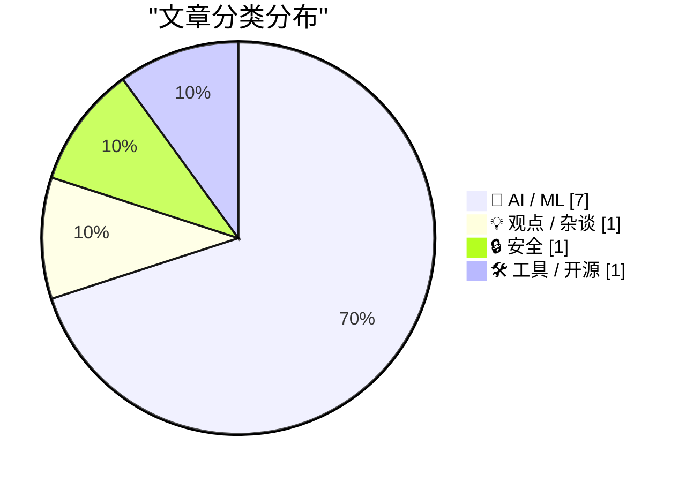
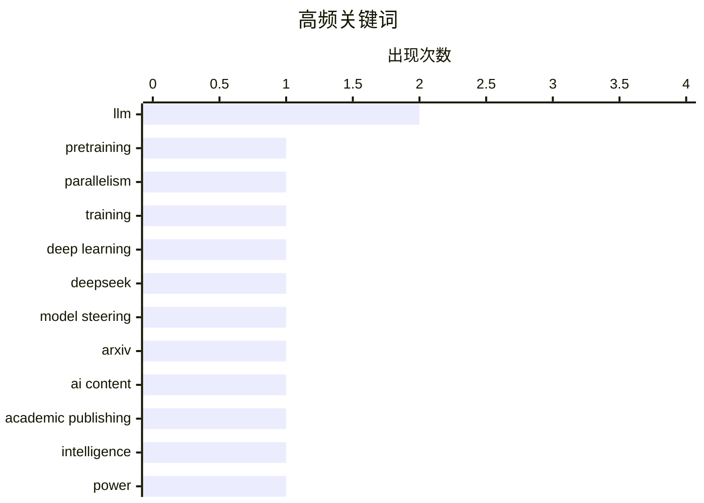

**今日看点：** 大模型预训练的并行策略与稳定性成为焦点，针对数千卡训练的通信拓扑优化和同步点削减成关键突破；本地运行消费级LLM的可行性显著提升，DeepSeek-V4-Flash配合引导向量技术使得模型行为实时调控告别纯理论阶段；学术界对AI生成内容的监管收紧，arXiv祭出一年禁刊重拳以维护文献可信度。

<!--more-->


> 来自 Karpathy 推荐的 92 个顶级技术博客，AI 精选 Top 10

## 🏆 今日必读

🥇 **关于预训练并行机制与失败训练运行的笔记**

[Notes on pretraining parallelisms and failed training runs.](https://www.dwarkesh.com/p/notes-on-pretraining-parallelisms) — dwarkesh.com · 3 小时前 · 🤖 AI / ML

> 文章深入探讨了大语言模型预训练中的并行训练策略，包括数据并行、流水线并行、张量并行等多种技术方案。作者基于实际失败案例，分析了常见训练问题的根源，如梯度同步异步、内存不平衡、计算通信重叠等。核心洞见是：预训练并行方案的选择对训练稳定性和效率有决定性影响，错误的并行配置可能导致数千卡训练在数小时后崩溃。文章还讨论了如何通过优化通信拓扑和减少同步点来提升大规模训练的稳定性。

💡 **为什么值得读**: 对于正在构建或维护大规模深度学习训练系统的工程师，这篇文章提供了宝贵的实战经验和避坑指南。

🏷️ pretraining, parallelism, training, deep learning

🥈 **DeepSeek-V4-Flash意味着LLM引导操控再次变得有趣**

[DeepSeek-V4-Flash means LLM steering is interesting again](https://seangoedecke.com/steering-vectors/) — seangoedecke.com · 22 小时前 · 🤖 AI / ML

> DeepSeek-V4-Flash是一款可在消费级硬件上运行的精简大模型，其性能足以与前沿模型的低配版竞争。antirez开发的DwarfStar 4项目将其适配到llama.cpp，使得在本地运行高质量LLM成为可能。更关键的是，DwarfStar 4将"引导向量"（steering vectors）作为一等公民内置，这意味着开发者可以直接操控模型中间层的激活来改变模型行为，而无需重新训练。这一技术突破使得LLM行为调控从理论走向实践，为AI工程带来了新的可能性。

💡 **为什么值得读**: 对于想在本地部署和定制LLM的开发者，这篇文章不仅介绍了可行方案，还展示了行为调控的前沿技术，适合对模型可控性感兴趣的工程师阅读。

🏷️ DeepSeek, LLM, model steering

🥉 **ArXiv新规：提交AI垃圾内容将面临一年禁刊**

[ArXiv to Ban Researchers for a Year if They Submit AI Slop](https://www.404media.co/new-arxiv-rules-ai-generated-papers-ban/) — daringfireball.net · 2 小时前 · 🤖 AI / ML

> arXiv近日宣布严厉打击AI生成垃圾内容的新政策：如果提交物包含不可争议的证据表明作者未检查LLM生成结果，作者将被禁止在arXiv发表一年，之后还必须先在同行评审 venues 发表才能恢复提交。这是「一次strike」政策，即发现一次即处罚。但学术诚信的核心在于：使用生成式AI工具产生不当语言、抄袭内容、偏见内容、错误、错误引用或误导性内容，责任仍在作者。文章指出，此规旨在维护科学文献的可信度。

💡 **为什么值得读**: 对于频繁在arXiv提交论文的研究者和学术作者，了解这一政策有助于避免因不了解规则而被误伤，尤其值得关注。

🏷️ ArXiv, AI content, academic publishing

---

## 📊 数据概览

| 扫描源 | 抓取文章 | 时间范围 | 精选 |
|:---:|:---:|:---:|:---:|
| 88/92 | 2532 篇 → 43 篇 | 48h | **10 篇** |

### 分类分布



### 高频关键词



<details>
<summary>📈 纯文本关键词图（终端友好）</summary>

```
llm                 │ ████████████████████ 2
pretraining         │ ██████████░░░░░░░░░░ 1
parallelism         │ ██████████░░░░░░░░░░ 1
training            │ ██████████░░░░░░░░░░ 1
deep learning       │ ██████████░░░░░░░░░░ 1
deepseek            │ ██████████░░░░░░░░░░ 1
model steering      │ ██████████░░░░░░░░░░ 1
arxiv               │ ██████████░░░░░░░░░░ 1
ai content          │ ██████████░░░░░░░░░░ 1
academic publishing │ ██████████░░░░░░░░░░ 1
```

</details>

### 🏷️ 话题标签

**llm**(2) · **pretraining**(1) · **parallelism**(1) · training(1) · deep learning(1) · deepseek(1) · model steering(1) · arxiv(1) · ai content(1) · academic publishing(1) · intelligence(1) · power(1) · ai philosophy(1) · cognitive science(1) · rlvr(1) · reinforcement learning(1) · science(1) · verification(1) · staff engineer(1) · copilot(1)

---

## 🤖 AI / ML

### 1. 关于预训练并行机制与失败训练运行的笔记

[Notes on pretraining parallelisms and failed training runs.](https://www.dwarkesh.com/p/notes-on-pretraining-parallelisms) — **dwarkesh.com** · 3 小时前 · ⭐ 27/30

> 文章深入探讨了大语言模型预训练中的并行训练策略，包括数据并行、流水线并行、张量并行等多种技术方案。作者基于实际失败案例，分析了常见训练问题的根源，如梯度同步异步、内存不平衡、计算通信重叠等。核心洞见是：预训练并行方案的选择对训练稳定性和效率有决定性影响，错误的并行配置可能导致数千卡训练在数小时后崩溃。文章还讨论了如何通过优化通信拓扑和减少同步点来提升大规模训练的稳定性。

🏷️ pretraining, parallelism, training, deep learning

---

### 2. DeepSeek-V4-Flash意味着LLM引导操控再次变得有趣

[DeepSeek-V4-Flash means LLM steering is interesting again](https://seangoedecke.com/steering-vectors/) — **seangoedecke.com** · 22 小时前 · ⭐ 26/30

> DeepSeek-V4-Flash是一款可在消费级硬件上运行的精简大模型，其性能足以与前沿模型的低配版竞争。antirez开发的DwarfStar 4项目将其适配到llama.cpp，使得在本地运行高质量LLM成为可能。更关键的是，DwarfStar 4将"引导向量"（steering vectors）作为一等公民内置，这意味着开发者可以直接操控模型中间层的激活来改变模型行为，而无需重新训练。这一技术突破使得LLM行为调控从理论走向实践，为AI工程带来了新的可能性。

🏷️ DeepSeek, LLM, model steering

---

### 3. ArXiv新规：提交AI垃圾内容将面临一年禁刊

[ArXiv to Ban Researchers for a Year if They Submit AI Slop](https://www.404media.co/new-arxiv-rules-ai-generated-papers-ban/) — **daringfireball.net** · 2 小时前 · ⭐ 25/30

> arXiv近日宣布严厉打击AI生成垃圾内容的新政策：如果提交物包含不可争议的证据表明作者未检查LLM生成结果，作者将被禁止在arXiv发表一年，之后还必须先在同行评审 venues 发表才能恢复提交。这是「一次strike」政策，即发现一次即处罚。但学术诚信的核心在于：使用生成式AI工具产生不当语言、抄袭内容、偏见内容、错误、错误引用或误导性内容，责任仍在作者。文章指出，此规旨在维护科学文献的可信度。

🏷️ ArXiv, AI content, academic publishing

---

### 4. 将智能与权力混为一谈的错误

[The mistake of conflating intelligence and power](https://www.dwarkesh.com/p/the-mistake-of-conflating-intelligence) — **dwarkesh.com** · 3 小时前 · ⭐ 25/30

> 文章探讨了一个关键概念误区：如果智能的定义是“在广泛领域实现目标的能力”，那么斯大林可能是有史以来最“智能”的人。这是一个思维实验，揭示了对「智能」定义的哲学困境：纯粹的通用问题解决能力与道德价值无关，智能本身不保证正向结果。文章进一步讨论了为什么将 intelligence 简单等同于 power 或 achievement 可能导致危险的误解。

🏷️ intelligence, power, AI philosophy, cognitive science

---

### 5. RLVR可能特别不擅长科学

[RLVR might be disproportionately bad at science](https://www.dwarkesh.com/p/rlvr-might-be-disproportionately) — **dwarkesh.com** · 3 小时前 · ⭐ 25/30

> Reinforcement Learning from Verified Reasoning (RLVR) 是当前提升LLM推理能力的主流方法，但其核心局限在于依赖可验证的奖励信号。文章指出，科学的验证闭环可能需要数十年甚至数百年，而且往往更好的理论实际上会做出更差的预测，这意味着RLVR在科学发现领域可能面临根本性挑战。与简单的数学证明不同，科学理论的验证需要实验和时间的双重考验。作者暗示：当AI接近科学前沿时，缺乏可验证信号的RLVR可能成为瓶颈。

🏷️ RLVR, reinforcement learning, science, verification

---

### 6. 作为Staff Engineer在2026年如何使用LLM

[How I use LLMs as a staff engineer in 2026](https://seangoedecke.com/how-i-use-llms-in-2026/) — **seangoedecke.com** · -102 分钟前 · ⭐ 24/30

> 文章总结了作者作为Staff Engineer使用LLM的实践：Copilot智能补全、处理不熟悉领域的小型战术性修改、一次性研究代码编写、提问学习新工具、大规模英文写作润色。但作者明确不用AI写自己熟悉领域的完整PR、在大型代码库中研究代码、写ADRs等技术文档。2026年的模型已大幅进化，agentic工作流成为可能。文章建议：在快速学习和原型探索阶段用AI，在需要深度代码理解的场景谨慎使用。

🏷️ LLM, staff engineer, Copilot

---

### 7. Greg Brockman正式执掌OpenAI产品

[Greg Brockman Officially Takes Control of Products at OpenAI, a Very Stable Well-Run Company](https://www.wired.com/story/openai-reorg-greg-brockman-product/) — **daringfireball.net** · 20 小时前 · ⭐ 23/30

> OpenAI近日宣布重组，联合创始人兼总裁Greg Brockman将正式领导公司产品战略，之前他曾在Fidji Simo（AGI deployment CEO）医疗休假期间临时负责产品管理。Simo目前仍在医疗休假中，公司预计她将回归并直接参与组织变革。消息源Wired报道称，此举是OpenAI统一产品线努力的一部分。

🏷️ OpenAI, Greg Brockman, product strategy

---

## 💡 观点 / 杂谈

### 8. AI是技术，不是产品

[★ AI Is Technology, Not a Product](https://daringfireball.net/2026/05/ai_is_technology_not_a_product) — **daringfireball.net** · 1 小时前 · ⭐ 24/30

> 一篇极短的评论文章，核心观点是：AI甚至不是一个功能(feature)，它就是技术本身。作者暗示当前行业过度将AI作为营销噱头，而忽视了其作为底层技术的本质属性。这是对AI炒作风潮的一次简洁反思。

🏷️ AI, product, technology

---

## 🔒 安全

### 9. 研究人员宣布macOS内核漏洞绕过M5内存安全防护

[Aided by Mythos Preview, Researchers Announce MacOS Kernel Exploit Circumventing M5 Memory Integrity Enforcement](https://blog.calif.io/p/first-public-kernel-memory-corruption) — **daringfireball.net** · 1 天前 · ⭐ 24/30

> 安全研究团队Calif宣布成功绕过了苹果M5芯片的MIE（Memory Integrity Enforcement）系统——这是基于ARM MTE的硬件内存安全防护，也是M5的旗舰安全功能。该漏洞在4月25日被意外发现，5月1日即实现完整利用。据作者称，这是首个公开的绕过M5 MIE的macOS内核漏洞，将于苹果发货后发布55页完整技术报告。Mythos Preview在此过程中协助了漏洞识别和利用开发。

🏷️ macOS, kernel exploit, MTE

---

## 🛠 工具 / 开源

### 10. QR码生成器工具发布

[QR code generator](https://simonwillison.net/2026/May/15/qr-code-generator/#atom-everything) — **simonwillison.net** · 1 天前 · ⭐ 23/30

> 作者宣布推出一个QR码生成器工具，支持URL/文本和WiFi网络两种模式。在WiFi模式下可填入SSID、密码、安全类型(wpa/wpa2/wpa3)、是否隐藏网络等参数，可自定义样式、尺寸、颜色等选项。工具由Claude协助开发，托管在Simon Willison的tools.simonwillison.net上。

🏷️ QR code, generator, web tool

---

*生成于 2026-05-17 22:18 | 扫描 88 源 → 获取 2532 篇 → 精选 10 篇*
*基于 [Hacker News Popularity Contest 2025](https://refactoringenglish.com/tools/hn-popularity/) RSS 源列表，由 [Andrej Karpathy](https://x.com/karpathy) 推荐*
*由「懂点儿AI」制作，欢迎关注同名微信公众号获取更多 AI 实用技巧 💡*
