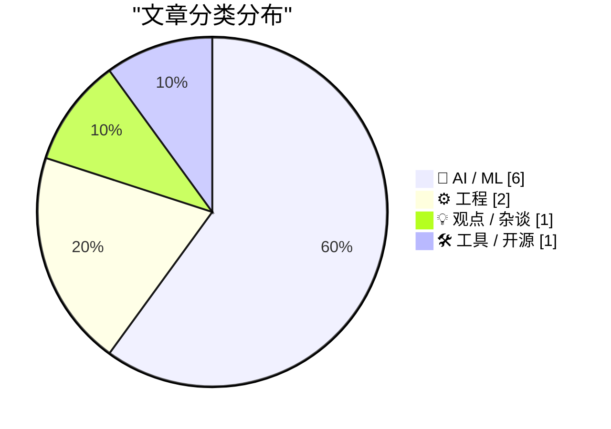
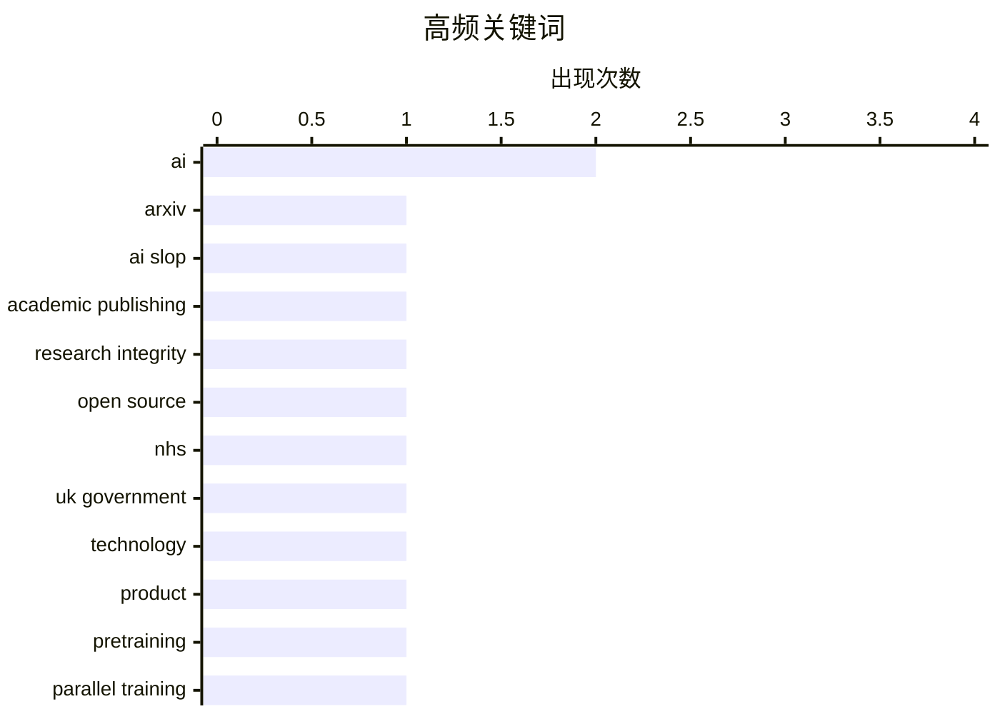

今日技术圈聚焦三大趋势：一是AI学术诚信建设加速，arXiv祭出一年禁令严惩AI生成垃圾内容，同时业界开始反思生成式AI的泡沫与局限；二是大模型应用进入深水区，OpenAI组织调整、Greg Brockman接管产品线，预示AI技术正从概念验证转向产品化落地；三是开源与闭源路线之争再起波澜，NHS放弃开源的决定引发广泛讨论，技术选型正回归商业现实而非盲目跟风。

<!--more-->


> 来自 Karpathy 推荐的 92 个顶级技术博客，AI 精选 Top 10

## 🏆 今日必读

🥇 **ArXiv将对提交AI生成垃圾内容的研究者实施一年禁令**

[ArXiv to Ban Researchers for a Year if They Submit AI Slop](https://www.404media.co/new-arxiv-rules-ai-generated-papers-ban/) — daringfireball.net · 1 天前 · 🤖 AI / ML

> ArXiv计算机科学部门主席Thomas Dietterich宣布，如果提交物包含AI生成的不当语言、抄袭内容、偏见内容、错误、虚假引用或误导性内容，作者将承担后果。新规实行一次违规即处罚的规则——研究者将被禁止在ArXiv发表一年，此后提交必须先在同行评审的出版物上发表。Dietterich表示，如果无法确认作者是否检查了LLM生成的结果，就无法信任论文中的任何内容。该规定现已明确处罚细则，允许申诉。

💡 **为什么值得读**: 对于使用AI辅助学术写作的研究者，这是了解主流预印本平台对AI生成内容态度的重要参考，直接影响未来投稿的合规策略。

🏷️ ArXiv, AI slop, academic publishing, research integrity

🥈 **GDS weighs in on the NHS's decision to retreat from Open Source**

[GDS weighs in on the NHS's decision to retreat from Open Source](https://simonwillison.net/2026/May/17/gds-weighs-in/#atom-everything) — simonwillison.net · 6 小时前 · ⚙️ 工程

> <p><strong><a href="https://shkspr.mobi/blog/2026/05/gds-weighs-in-on-the-nhss-decision-to-retreat-from-open-source/">GDS weighs in on the NHS&#x27;s decision to retreat from Open Source</a></strong><

🏷️ Open Source, NHS, UK Government

🥉 **★ AI Is Technology, Not a Product**

[★ AI Is Technology, Not a Product](https://daringfireball.net/2026/05/ai_is_technology_not_a_product) — daringfireball.net · 1 天前 · 💡 观点 / 杂谈

> It’s not even a feature. It’s just technology.

🏷️ AI, technology, product

---

## 📊 数据概览

| 扫描源 | 抓取文章 | 时间范围 | 精选 |
|:---:|:---:|:---:|:---:|
| 88/92 | 2532 篇 → 28 篇 | 48h | **10 篇** |

### 分类分布



### 高频关键词



<details>
<summary>📈 纯文本关键词图（终端友好）</summary>

```
ai                  │ ████████████████████ 2
arxiv               │ ██████████░░░░░░░░░░ 1
ai slop             │ ██████████░░░░░░░░░░ 1
academic publishing │ ██████████░░░░░░░░░░ 1
research integrity  │ ██████████░░░░░░░░░░ 1
open source         │ ██████████░░░░░░░░░░ 1
nhs                 │ ██████████░░░░░░░░░░ 1
uk government       │ ██████████░░░░░░░░░░ 1
technology          │ ██████████░░░░░░░░░░ 1
product             │ ██████████░░░░░░░░░░ 1
```

</details>

### 🏷️ 话题标签

**ai**(2) · **arxiv**(1) · **ai slop**(1) · academic publishing(1) · research integrity(1) · open source(1) · nhs(1) · uk government(1) · technology(1) · product(1) · pretraining(1) · parallel training(1) · distributed systems(1) · generative ai(1) · world models(1) · neurosymbolic ai(1) · ai scaling(1) · rlvr(1) · science(1) · verification(1)

---

## 🤖 AI / ML

### 1. ArXiv将对提交AI生成垃圾内容的研究者实施一年禁令

[ArXiv to Ban Researchers for a Year if They Submit AI Slop](https://www.404media.co/new-arxiv-rules-ai-generated-papers-ban/) — **daringfireball.net** · 1 天前 · ⭐ 25/30

> ArXiv计算机科学部门主席Thomas Dietterich宣布，如果提交物包含AI生成的不当语言、抄袭内容、偏见内容、错误、虚假引用或误导性内容，作者将承担后果。新规实行一次违规即处罚的规则——研究者将被禁止在ArXiv发表一年，此后提交必须先在同行评审的出版物上发表。Dietterich表示，如果无法确认作者是否检查了LLM生成的结果，就无法信任论文中的任何内容。该规定现已明确处罚细则，允许申诉。

🏷️ ArXiv, AI slop, academic publishing, research integrity

---

### 2. Notes on pretraining parallelisms and failed training runs.

[Notes on pretraining parallelisms and failed training runs.](https://www.dwarkesh.com/p/notes-on-pretraining-parallelisms) — **dwarkesh.com** · 1 天前 · ⭐ 24/30

> Deeply researched interviews

🏷️ pretraining, parallel training, AI, distributed systems

---

### 3. The illusion of Generative AI, the insanity of massive bets on hyperscaling, and the case for world models and neurosymbolic AI

[The illusion of Generative AI, the insanity of massive bets on hyperscaling, and the case for world models and neurosymbolic AI](https://garymarcus.substack.com/p/the-illusion-of-generative-ai-the) — **garymarcus.substack.com** · 14 小时前 · ⭐ 23/30

> Three excellent new interviews

🏷️ generative AI, world models, neurosymbolic AI, AI scaling

---

### 4. RLVR might be disproportionately bad at science

[RLVR might be disproportionately bad at science](https://www.dwarkesh.com/p/rlvr-might-be-disproportionately) — **dwarkesh.com** · 1 天前 · ⭐ 23/30

> the verification loop for theories can be on the order of decades and centuries, and even then we know today as the better theory can often actually make worse predictions

🏷️ RLVR, science, verification, reinforcement learning

---

### 5. How I use LLMs as a staff engineer in 2026

[How I use LLMs as a staff engineer in 2026](https://seangoedecke.com/how-i-use-llms-in-2026/) — **seangoedecke.com** · 22 小时前 · ⭐ 22/30

> <p>A bit over a year ago I wrote <a href="https://www.seangoedecke.com/how-i-use-llms/"><em>How I use LLMs as a staff engineer</em></a>. Here’s a brief summary of what I used AI for last year:</p>
<ul

🏷️ LLM, staff engineer, Copilot

---

### 6. Greg Brockman Officially Takes Control of Products at OpenAI, a Very Stable Well-Run Company

[Greg Brockman Officially Takes Control of Products at OpenAI, a Very Stable Well-Run Company](https://www.wired.com/story/openai-reorg-greg-brockman-product/) — **daringfireball.net** · 1 天前 · ⭐ 22/30

> Maxwell Zeff, reporting for Wired (News+ link):


  OpenAI told staff on Friday that it would reorganize the company
as part of an ongoing effort to unify its product offerings, Wired
has learned. Ope

🏷️ OpenAI, Greg Brockman, company reorganization, product strategy

---

## ⚙️ 工程

### 7. GDS weighs in on the NHS's decision to retreat from Open Source

[GDS weighs in on the NHS's decision to retreat from Open Source](https://simonwillison.net/2026/May/17/gds-weighs-in/#atom-everything) — **simonwillison.net** · 6 小时前 · ⭐ 24/30

> <p><strong><a href="https://shkspr.mobi/blog/2026/05/gds-weighs-in-on-the-nhss-decision-to-retreat-from-open-source/">GDS weighs in on the NHS&#x27;s decision to retreat from Open Source</a></strong><

🏷️ Open Source, NHS, UK Government

---

### 8. SQLAlchemy 2 In Practice - Chapter 8: SQLAlchemy and the Web

[SQLAlchemy 2 In Practice - Chapter 8: SQLAlchemy and the Web](https://blog.miguelgrinberg.com/post/sqlalchemy-2-in-practice---chapter-8-sqlalchemy-and-the-web) — **miguelgrinberg.com** · 1 天前 · ⭐ 23/30

> <p>This is the eighth and final chapter of my <a href="https://learn.miguelgrinberg.com/product/sqlalchemy2">SQLAlchemy 2 in Practice</a> book. If you'd like to support my work, I encourage you to buy

🏷️ SQLAlchemy, SQL, web development, database

---

## 💡 观点 / 杂谈

### 9. ★ AI Is Technology, Not a Product

[★ AI Is Technology, Not a Product](https://daringfireball.net/2026/05/ai_is_technology_not_a_product) — **daringfireball.net** · 1 天前 · ⭐ 24/30

> It’s not even a feature. It’s just technology.

🏷️ AI, technology, product

---

## 🛠 工具 / 开源

### 10. Make ZIP files smaller with ZIP Shrinker

[Make ZIP files smaller with ZIP Shrinker](https://evanhahn.com/make-zip-files-smaller-with-zip-shrinker/) — **evanhahn.com** · 1 天前 · ⭐ 22/30

> <p>I built ZIP Shrinker, a little browser tool to shrink ZIP files. It also works with formats that are secretly ZIPs underneath, like APK, EPUB, JAR, and many more.</p>
<p><a href="https://evanhahn.c

🏷️ ZIP Shrinker, compression, browser tool, APK

---

*生成于 2026-05-18 22:18 | 扫描 88 源 → 获取 2532 篇 → 精选 10 篇*
*基于 [Hacker News Popularity Contest 2025](https://refactoringenglish.com/tools/hn-popularity/) RSS 源列表，由 [Andrej Karpathy](https://x.com/karpathy) 推荐*
*由「懂点儿AI」制作，欢迎关注同名微信公众号获取更多 AI 实用技巧 💡*
