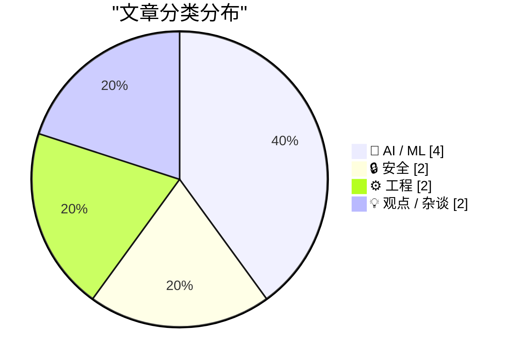
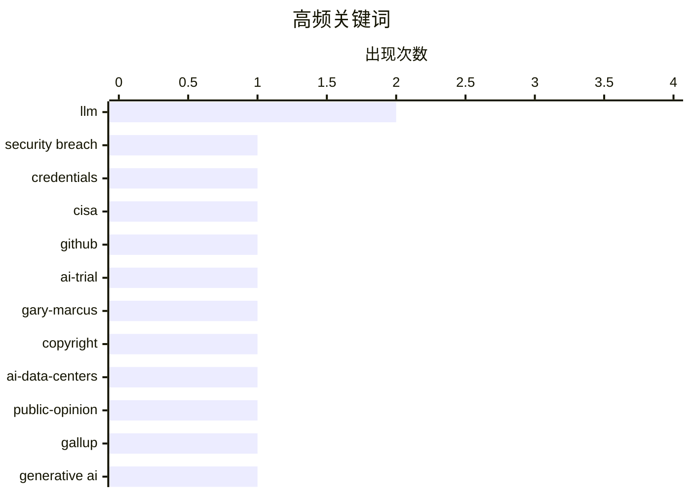

今日技术圈呈现三大主线：AI信任危机全面爆发，民调显示七成美国人反对本地建设AI数据中心，马斯克对OpenAI的诉讼亦遭败诉，折射出行业与公众关系的深层撕裂；与此同时，安全漏洞与数据泄露频发，CISA承包商在GitHub暴露政府云凭证敲响警钟，企业还需在勒索软件攻防中艰难抉择付费与否的两难困境；技术层面，行业开始集体反思 Scaling Law 的局限，Gary Marcus 等人士力推世界模型与神经符号 AI 作为替代路径，而实践层面试图为 AI 划定“辅助而非替代”的务实边界。

<!--more-->


> 来自 Karpathy 推荐的 92 个顶级技术博客，AI 精选 Top 10

## 🏆 今日必读

🥇 **CISA管理员在GitHub上泄露AWS GovCloud密钥**

[CISA Admin Leaked AWS GovCloud Keys on Github](https://krebsonsecurity.com/2026/05/cisa-admin-leaked-aws-govcloud-keys-on-github/) — krebsonsecurity.com · 1 小时前 · 🔒 安全

> 美国网络安全与基础设施安全局（CISA）的一名承包商在GitHub上公开了一个代码仓库，其中包含了多个高权限AWS GovCloud账户凭证以及大量内部系统的访问密钥。安全专家指出，该公开仓库详细记录了CISA内部构建、测试和部署软件的流程，被视为近年来最严重的政府数据泄露事件之一。此次泄露可能使攻击者获得美国政府敏感云基础设施的完全访问权限。

💡 **为什么值得读**: 这是涉及关键政府基础设施安全的重大泄露事件，对于关注云安全供应链风险的从业者具有重要警示意义。

🏷️ security breach, credentials, CISA, GitHub

🥈 **世纪AI审判以失败告终**

[The AI trial of the century ends with a whimper](https://garymarcus.substack.com/p/the-ai-trial-of-the-century-ends) — garymarcus.substack.com · 3 小时前 · 🤖 AI / ML

> Gary Marcus对近期一场重大AI相关法律案件的审判结果进行了评论。该案件引发了关于AI发展中关键问题的广泛讨论，但最终以令人失望的方式结束。文章暗示存在一些永远无法得知答案的问题，留给读者对AI法律边界和伦理争议的深层思考。Marcus以其一贯的批判视角分析了这一事件的深远影响。

💡 **为什么值得读**: Gary Marcus作为AI领域知名批评者，其对AI法律案件的解读有助于理解当前AI治理的核心矛盾。

🏷️ AI-trial, Gary-Marcus, copyright

🥉 **AI数据中心在美国引发广泛反对——跨越政治立场**

[AI Data Centers Are Deeply Unpopular, Across the Political Spectrum](https://news.gallup.com/poll/709772/americans-oppose-data-centers-area.aspx) — daringfireball.net · 7 小时前 · 🤖 AI / ML

> 盖洛普最新民调显示，70%的美国人反对在其当地建设AI数据中心，其中48%表示强烈反对，仅25%的人支持此类项目。这比同期对核电站建设的反对率（53%）还要高出18个百分点，创下自2001年以来核能问题上最高的反对纪录。值得注意的是，这种反感情绪呈现出明显的两党一致性，显示AI数据中心正成为科技行业面临的严峻公共关系挑战。

💡 **为什么值得读**: 这份民调揭示了AI基础设施扩张面临的巨大社会阻力，对判断AI产业发展趋势和政策走向有重要参考价值。

🏷️ AI-data-centers, public-opinion, Gallup

---

## 📊 数据概览

| 扫描源 | 抓取文章 | 时间范围 | 精选 |
|:---:|:---:|:---:|:---:|
| 88/92 | 2533 篇 → 33 篇 | 48h | **10 篇** |

### 分类分布



### 高频关键词



<details>
<summary>📈 纯文本关键词图（终端友好）</summary>

```
llm             │ ████████████████████ 2
security breach │ ██████████░░░░░░░░░░ 1
credentials     │ ██████████░░░░░░░░░░ 1
cisa            │ ██████████░░░░░░░░░░ 1
github          │ ██████████░░░░░░░░░░ 1
ai-trial        │ ██████████░░░░░░░░░░ 1
gary-marcus     │ ██████████░░░░░░░░░░ 1
copyright       │ ██████████░░░░░░░░░░ 1
ai-data-centers │ ██████████░░░░░░░░░░ 1
public-opinion  │ ██████████░░░░░░░░░░ 1
```

</details>

### 🏷️ 话题标签

**llm**(2) · **security breach**(1) · **credentials**(1) · cisa(1) · github(1) · ai-trial(1) · gary-marcus(1) · copyright(1) · ai-data-centers(1) · public-opinion(1) · gallup(1) · generative ai(1) · neurosymbolic ai(1) · world models(1) · ransomware(1) · data-breach(1) · pay(1) · open source(1) · nhs(1) · government(1)

---

## 🤖 AI / ML

### 1. 世纪AI审判以失败告终

[The AI trial of the century ends with a whimper](https://garymarcus.substack.com/p/the-ai-trial-of-the-century-ends) — **garymarcus.substack.com** · 3 小时前 · ⭐ 25/30

> Gary Marcus对近期一场重大AI相关法律案件的审判结果进行了评论。该案件引发了关于AI发展中关键问题的广泛讨论，但最终以令人失望的方式结束。文章暗示存在一些永远无法得知答案的问题，留给读者对AI法律边界和伦理争议的深层思考。Marcus以其一贯的批判视角分析了这一事件的深远影响。

🏷️ AI-trial, Gary-Marcus, copyright

---

### 2. AI数据中心在美国引发广泛反对——跨越政治立场

[AI Data Centers Are Deeply Unpopular, Across the Political Spectrum](https://news.gallup.com/poll/709772/americans-oppose-data-centers-area.aspx) — **daringfireball.net** · 7 小时前 · ⭐ 24/30

> 盖洛普最新民调显示，70%的美国人反对在其当地建设AI数据中心，其中48%表示强烈反对，仅25%的人支持此类项目。这比同期对核电站建设的反对率（53%）还要高出18个百分点，创下自2001年以来核能问题上最高的反对纪录。值得注意的是，这种反感情绪呈现出明显的两党一致性，显示AI数据中心正成为科技行业面临的严峻公共关系挑战。

🏷️ AI-data-centers, public-opinion, Gallup

---

### 3. 生成式AI的幻象、大规模过度扩张的疯狂，以及世界模型与神经符号AI的案例

[The illusion of Generative AI, the insanity of massive bets on hyperscaling, and the case for world models and neurosymbolic AI](https://garymarcus.substack.com/p/the-illusion-of-generative-ai-the) — **garymarcus.substack.com** · 1 天前 · ⭐ 24/30

> Gary Marcus汇集了三段高质量访谈，深入质疑当前生成式AI的发展范式。核心观点认为行业对GPT风格扩展路线的巨额投资存在系统性风险，主张转向世界模型（World Models）和神经符号AI（Neurosymbolic AI）作为更可持续的技术路径。文章揭示了Scaling Law在实践中的局限性，并探讨AI推理能力的真正实现方式需要结构性的方法论创新。

🏷️ generative AI, neurosymbolic AI, world models, LLM

---

### 4. 2026年我如何使用LLM：Staff Engineer的实践经验

[How I use LLMs as a staff engineer in 2026](https://seangoedecke.com/how-i-use-llms-in-2026/) — **seangoedecke.com** · 1 天前 · ⭐ 23/30

> 一位Staff Engineer分享了其使用AI工具一年来的经验清单。有效场景包括：Copilot智能代码补全、不熟悉领域的战术性修改、用完即弃的研究代码生成、新技术学习问答、以及紧急Bug排查。大幅避免的场景则是：让AI独立撰写熟悉的PR、生成架构决策记录（ADR）、以及大型代码库的搜索研究。核心原则是AI作为辅助工具而非替代者，始终需要人工审查和领域专业知识介入。

🏷️ LLM, productivity, tooling, engineering

---

## 🔒 安全

### 5. CISA管理员在GitHub上泄露AWS GovCloud密钥

[CISA Admin Leaked AWS GovCloud Keys on Github](https://krebsonsecurity.com/2026/05/cisa-admin-leaked-aws-govcloud-keys-on-github/) — **krebsonsecurity.com** · 1 小时前 · ⭐ 25/30

> 美国网络安全与基础设施安全局（CISA）的一名承包商在GitHub上公开了一个代码仓库，其中包含了多个高权限AWS GovCloud账户凭证以及大量内部系统的访问密钥。安全专家指出，该公开仓库详细记录了CISA内部构建、测试和部署软件的流程，被视为近年来最严重的政府数据泄露事件之一。此次泄露可能使攻击者获得美国政府敏感云基础设施的完全访问权限。

🏷️ security breach, credentials, CISA, GitHub

---

### 6. 每周更新504：勒索软件攻防博弈

[Weekly Update 504](https://www.troyhunt.com/weekly-update-504/) — **troyhunt.com** · 18 小时前 · ⭐ 24/30

> Troy Hunt在本周更新中聚焦企业面对勒索软件攻击时的"付赎还是不付赎"困境。作者提及Grafana在遭遇数据泄露威胁后选择了拒绝支付赎金的策略，并观察到近期有多家企业面临类似的勒索要挟。文章探讨了这一决策背后的安全考量、法律风险和公众沟通策略，为企业安全决策提供了实战参考。

🏷️ ransomware, data-breach, pay

---

## ⚙️ 工程

### 7. 英国政府数字服务就NHS放弃开源发表意见

[GDS weighs in on the NHS's decision to retreat from Open Source](https://simonwillison.net/2026/May/17/gds-weighs-in/#atom-everything) — **simonwillison.net** · 1 天前 · ⭐ 23/30

> 英国政府数字服务（GDS）于5月14日发布指南，就NHS因Project Glasswing安全漏洞披露而关闭开源仓库的决定表态。GDS明确建议"默认保持开放"，指出将代码库私有化会增加额外的交付和政策成本，并可能减少复用机会和安全审计。这一立场与NHS的封闭策略形成直接对立，体现了政府层面在安全披露与开源生态之间的理念分歧。

🏷️ open source, NHS, government, policy

---

### 8. 永远归咎他人：四维代码理解技巧

[Always Be Blaming](https://matklad.github.io/2026/05/18/always-be-blaming.html) — **matklad.github.io** · 22 小时前 · ⭐ 21/30

> 作者分享了提升代码理解能力的"四维"方法论，核心是培养将问题归因的能力。具体技巧包括：通过时间维度追溯代码演变历史，从空间维度分析模块间的依赖关系，从人际维度理解团队决策背景，以及从责任维度明确代码归属和变更原因。这种系统化的思维方式帮助开发者更快速地定位问题、理解遗留代码，并做出更好的架构决策。

🏷️ Rust, debugging, programming

---

## 💡 观点 / 杂谈

### 9. 陪审团一致否决马斯克对Altman的诉讼请求

[Jury Rejects Elon Musk’s Claim Against Sam Altman in Unanimous Verdict](https://www.nytimes.com/live/2026/05/18/technology/openai-trial-verdict-altman-musk?unlocked_article_code=1.jVA.Cc2V.IwYuu2r4SJfQ) — **daringfireball.net** · 4 小时前 · ⭐ 22/30

> 由9人组成的陪审团裁定Elon Musk针对OpenAI及Sam Altman的诉讼已超过三年诉讼时效。Musk于2024年夏提起诉讼，但陪审团认定他在2021年就已知道诉讼中指控的行为。这意味着这场估值730亿美元的AI公司与亿万富翁之间备受关注的法律纠纷以原告败诉告终。法官引用了一段关于陪审团本质的诗意陈述，称赞这一制度的民主性和局限性。

🏷️ OpenAI, Musk, lawsuit, legal

---

### 10. AI、人性与曼哈顿博士综合症

[‘AI, “Humanity”, and Dr. Manhattan Syndrome’](https://www.personfamiliar.com/p/ai-humanity-and-dr-manhattan-syndrome) — **daringfireball.net** · 5 小时前 · ⭐ 21/30

> 文章通过类比核能历史探讨AI发展中的公众沟通问题。作者指出，与当年核能行业一样，AI领域正在积累潜在的信任赤字——灾难尚未发生，但如果行业继续回避与普通人的真诚对话，当真正危机来临时将缺乏社会缓冲。文章强调核能先驱者在1976年就承认"我们严重忽略了公众认知"，但未能及时行动，最终导致了行业衰落。当前AI行业同样面临赢得人心的紧迫挑战。

🏷️ AI, public-perception, nuclear-power, Dr-Manhattan

---

*生成于 2026-05-19 22:18 | 扫描 88 源 → 获取 2533 篇 → 精选 10 篇*
*基于 [Hacker News Popularity Contest 2025](https://refactoringenglish.com/tools/hn-popularity/) RSS 源列表，由 [Andrej Karpathy](https://x.com/karpathy) 推荐*
*由「懂点儿AI」制作，欢迎关注同名微信公众号获取更多 AI 实用技巧 💡*
