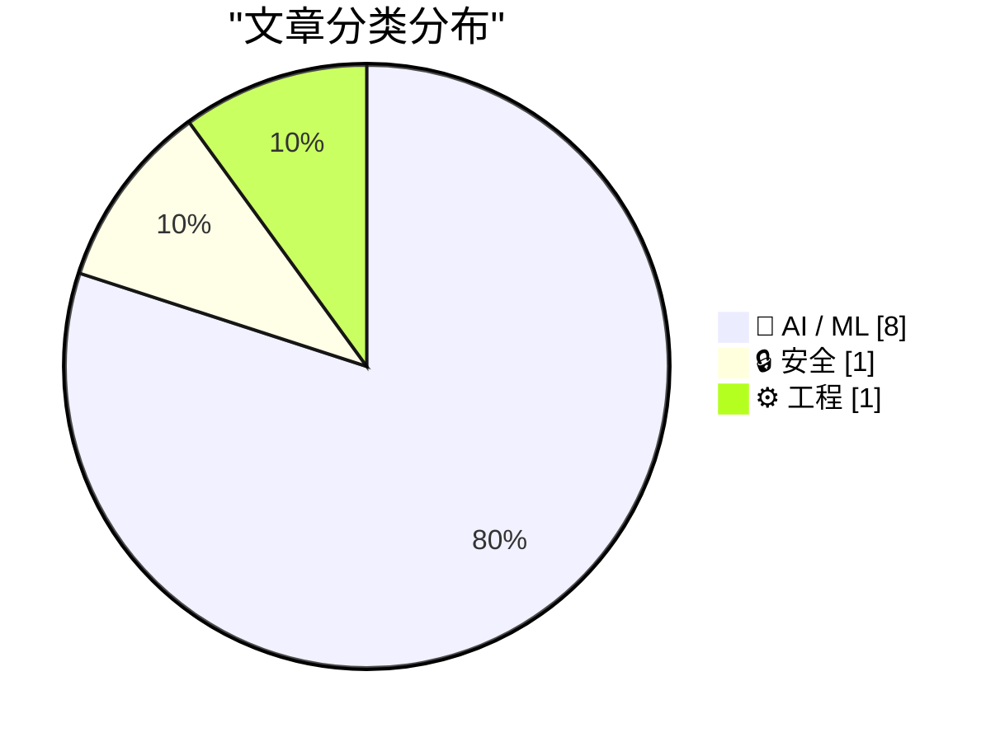
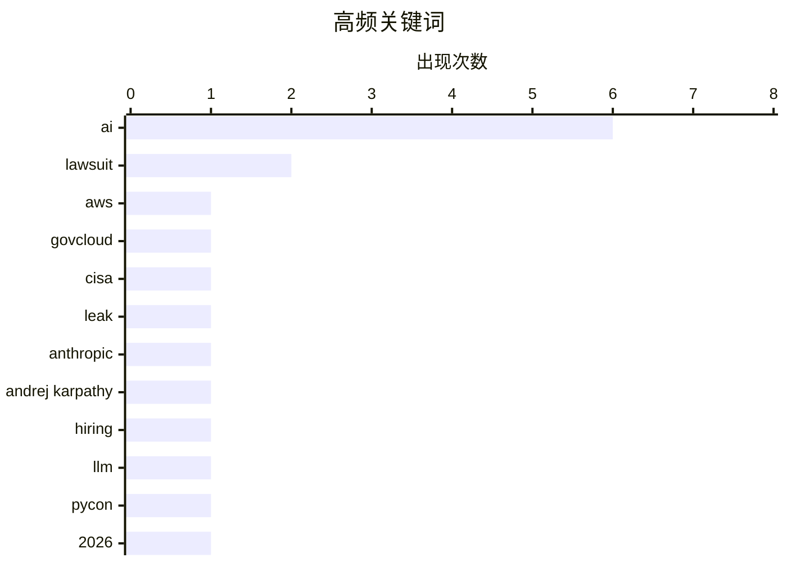

今日AI领域呈现核心人物流动与法律博弈并行的局面：Andrej Karpathy重返大模型研究加入Anthropic，马斯克对OpenAI的诉讼则因超过时效被陪审团驳回，OpenAI估值已达7300亿美元。与此同时，美国民众对AI数据中心的反对率创下71%的新高，AI经济性与实际应用成本正成为行业新挑战。CISA承包商在GitHub意外泄露AWS GovCloud高权限凭证，则再次敲响了关键基础设施安全警钟。

<!--more-->


> 来自 Karpathy 推荐的 92 个顶级技术博客，AI 精选 Top 10

## 🏆 今日必读

🥇 **CISA承包商在GitHub上泄露AWS GovCloud密钥**

[CISA Admin Leaked AWS GovCloud Keys on Github](https://krebsonsecurity.com/2026/05/cisa-admin-leaked-aws-govcloud-keys-on-github/) — krebsonsecurity.com · 1 天前 · 🔒 安全

> 美国网络安全与基础设施安全局（CISA）的一名承包商在公开的GitHub仓库中泄露了多个高权限AWS GovCloud账户凭证以及大量CISA内部系统凭证。该泄露包括详细描述CISA内部软件构建、测试和部署流程的文件。安全专家称，这是近年来最严重的政府数据泄露事件之一，暴露了美国关键基础设施安全机构内部运作的敏感细节。

💡 **为什么值得读**: 任何关心政府网络安全、供应链安全和敏感凭证管理的安全从业者都应阅读，了解这起严重泄露事件的来龙去脉和教训。

🏷️ AWS, GovCloud, CISA, leak

🥈 **Andrej Karpathy加入Anthropic**

[Andrej Karpathy Joined Anthropic](https://x.com/karpathy/status/2056753169888334312) — daringfireball.net · 6 小时前 · 🤖 AI / ML

> 知名AI研究员Andrej Karpathy宣布加入Anthropic，他曾在2015年共同创立OpenAI，2017-2022年担任特斯拉AI总监（直接向马斯克汇报），2023年重返OpenAI，2024年离职创办AI教育公司Eureka Labs。Karpathy去年2月提出了「vibe coding」（氛围编程）概念。他表示非常兴奋能够回到前沿LLM研究岗位，认为未来几年将是LLM领域的关键形成期。

💡 **为什么值得读**: Karpathy作为AI领域的明星人物，其职业动向反映了大模型研究的前沿方向，对关注AI行业发展的人具有重要参考价值。

🏷️ Anthropic, Andrej Karpathy, AI, hiring

🥉 **Simon Willison五分钟回顾近六个月LLM发展**

[The last six months in LLMs in five minutes](https://simonwillison.net/2026/May/19/5-minute-llms/#atom-everything) — simonwillison.net · 21 小时前 · 🤖 AI / ML

> 这是Simon Willison在PyCon US 2026上的五分钟闪电演讲，总结近六个月大语言模型领域的最新发展。该演讲使用了他最新的注解演示工具制作，包含Annotated Presentations的幻灯片。由于原文主要是图片形式的幻灯片，无法提取具体技术内容。

💡 **为什么值得读**: 适合想快速了解近半年LLM领域关键进展的开发者和技术爱好者，尤其是关注AI工具和实践发展的群体。

🏷️ LLM, AI, PyCon, 2026

---

## 📊 数据概览

| 扫描源 | 抓取文章 | 时间范围 | 精选 |
|:---:|:---:|:---:|:---:|
| 88/92 | 2553 篇 → 36 篇 | 48h | **10 篇** |

### 分类分布



### 高频关键词



<details>
<summary>📈 纯文本关键词图（终端友好）</summary>

```
ai              │ ████████████████████ 6
lawsuit         │ ███████░░░░░░░░░░░░░ 2
aws             │ ███░░░░░░░░░░░░░░░░░ 1
govcloud        │ ███░░░░░░░░░░░░░░░░░ 1
cisa            │ ███░░░░░░░░░░░░░░░░░ 1
leak            │ ███░░░░░░░░░░░░░░░░░ 1
anthropic       │ ███░░░░░░░░░░░░░░░░░ 1
andrej karpathy │ ███░░░░░░░░░░░░░░░░░ 1
hiring          │ ███░░░░░░░░░░░░░░░░░ 1
llm             │ ███░░░░░░░░░░░░░░░░░ 1
```

</details>

### 🏷️ 话题标签

**ai**(6) · **lawsuit**(2) · **aws**(1) · govcloud(1) · cisa(1) · leak(1) · anthropic(1) · andrej karpathy(1) · hiring(1) · llm(1) · pycon(1) · 2026(1) · musk(1) · openai(1) · jury(1) · apple(1) · tim cook(1) · market cap(1) · regulation(1) · ai data center(1)

---

## 🤖 AI / ML

### 1. Andrej Karpathy加入Anthropic

[Andrej Karpathy Joined Anthropic](https://x.com/karpathy/status/2056753169888334312) — **daringfireball.net** · 6 小时前 · ⭐ 26/30

> 知名AI研究员Andrej Karpathy宣布加入Anthropic，他曾在2015年共同创立OpenAI，2017-2022年担任特斯拉AI总监（直接向马斯克汇报），2023年重返OpenAI，2024年离职创办AI教育公司Eureka Labs。Karpathy去年2月提出了「vibe coding」（氛围编程）概念。他表示非常兴奋能够回到前沿LLM研究岗位，认为未来几年将是LLM领域的关键形成期。

🏷️ Anthropic, Andrej Karpathy, AI, hiring

---

### 2. Simon Willison五分钟回顾近六个月LLM发展

[The last six months in LLMs in five minutes](https://simonwillison.net/2026/May/19/5-minute-llms/#atom-everything) — **simonwillison.net** · 21 小时前 · ⭐ 24/30

> 这是Simon Willison在PyCon US 2026上的五分钟闪电演讲，总结近六个月大语言模型领域的最新发展。该演讲使用了他最新的注解演示工具制作，包含Annotated Presentations的幻灯片。由于原文主要是图片形式的幻灯片，无法提取具体技术内容。

🏷️ LLM, AI, PyCon, 2026

---

### 3. 陪审团驳回马斯克对Altman的诉讼

[Jury Rejects Elon Musk’s Claim Against Sam Altman in Unanimous Verdict](https://www.nytimes.com/live/2026/05/18/technology/openai-trial-verdict-altman-musk?unlocked_article_code=1.jVA.Cc2V.IwYuu2r4SJfQ) — **daringfireball.net** · 1 天前 · ⭐ 24/30

> 由9人组成的陪审团一致裁定，马斯克对OpenAI及其CEO Sam Altman的诉讼已超过三年诉讼时效期限。马斯克于2024年夏季提起诉讼，但陪审团认定其最早在2021年就知悉案中涉及的行为。OpenAI目前估值7300亿美元。法官Gonzalez Rogers引用了陪审团制度的历史意义：「陪审团反映社会的态度和习俗，它只为当下存在，根据其局限性主持正义」。

🏷️ Musk, OpenAI, lawsuit, jury

---

### 4. 库克时代的苹果帝国

[‘John Appleseed’](https://om.co/2026/04/20/john-appleseed/) — **daringfireball.net** · 1 天前 · ⭐ 23/30

> 2011年8月库克接替乔布斯时，苹果市值约3500亿美元；目前已接近4万亿美元，涨幅超过1000%。营收从2011财年的1080亿美元增至2025财年的4160亿美元以上，增长近4倍。，苹果将服务业务打造为年收入1000亿美元的业务。库克运营苹果15年，历经疫情、两次贸易战、供应链重构，从纯硬件转型为硬件+服务+芯片多元化。尽管库克并非产品愿景者，但他成功保持了苹果的辉煌。

🏷️ Apple, Tim Cook, market cap, AI

---

### 5. 世纪AI审判低调落幕

[The AI trial of the century ends with a whimper](https://garymarcus.substack.com/p/the-ai-trial-of-the-century-ends) — **garymarcus.substack.com** · 1 天前 · ⭐ 23/30

> Gary Marcus在Substack上撰文分析这场被称为「世纪AI审判」的案件如何低调结束，指出有些事情我们可能永远不会知道。

🏷️ AI, lawsuit, regulation

---

### 6. 美国民众强烈反对AI数据中心建设

[AI Data Centers Are Deeply Unpopular, Across the Political Spectrum](https://news.gallup.com/poll/709772/americans-oppose-data-centers-area.aspx) — **daringfireball.net** · 1 天前 · ⭐ 22/30

> 盖洛普民调显示，70%的美国人反对在本地建设AI数据中心，其中48%强烈反对；仅25%支持，7%强烈支持。AI数据中心的反对率（71%）甚至高于核电站（53%），创盖洛普此类民调反对率新高。反对情绪跨越党派分歧，呈现广泛的两党共识，被形容为「科技行业绝对的消息和营销灾难」。

🏷️ AI data center, public opinion, Gallup, opposition

---

### 7. 人类瓶颈

[Human Bottlenecks](https://borretti.me/article/human-bottlenecks) — **borretti.me** · 1 天前 · ⭐ 22/30

> 文章探讨为什么AI不会大幅提升人类能力，论述AI作为人类增强工具的局限性。

🏷️ AI, human augmentation, productivity

---

### 8. AI太贵了

[AI Is Too Expensive](https://www.wheresyoured.at/ai-is-too-expensive/) — **wheresyoured.at** · 6 小时前 · ⭐ 22/30

> 文章认为当前AI技术成本过高，分析AI经济性的问题。

🏷️ AI, cost, econometrics

---

## 🔒 安全

### 9. CISA承包商在GitHub上泄露AWS GovCloud密钥

[CISA Admin Leaked AWS GovCloud Keys on Github](https://krebsonsecurity.com/2026/05/cisa-admin-leaked-aws-govcloud-keys-on-github/) — **krebsonsecurity.com** · 1 天前 · ⭐ 26/30

> 美国网络安全与基础设施安全局（CISA）的一名承包商在公开的GitHub仓库中泄露了多个高权限AWS GovCloud账户凭证以及大量CISA内部系统凭证。该泄露包括详细描述CISA内部软件构建、测试和部署流程的文件。安全专家称，这是近年来最严重的政府数据泄露事件之一，暴露了美国关键基础设施安全机构内部运作的敏感细节。

🏷️ AWS, GovCloud, CISA, leak

---

## ⚙️ 工程

### 10. FediMeteo HAProxy与高效利用snac线程

[FediMeteo, HAProxy, and the art of not wasting snac threads](https://it-notes.dragas.net/2026/05/18/fedimeteo-haproxy-and-the-art-of-not-wasting-snac-threads/) — **it-notes.dragas.net** · 1 天前 · ⭐ 22/30

> FediMeteo是一个由个人项目发展而成的全球天气服务平台，运行在FreeBSD、jails、简单脚本和snac架构上。文章主要讲述系统优化实践，探讨如何通过HAProxy等工具高效利用snac线程，避免资源浪费。

🏷️ HAProxy, Fediverse, performance, sysadmin

---

*生成于 2026-05-20 22:18 | 扫描 88 源 → 获取 2553 篇 → 精选 10 篇*
*基于 [Hacker News Popularity Contest 2025](https://refactoringenglish.com/tools/hn-popularity/) RSS 源列表，由 [Andrej Karpathy](https://x.com/karpathy) 推荐*
*由「懂点儿AI」制作，欢迎关注同名微信公众号获取更多 AI 实用技巧 💡*
