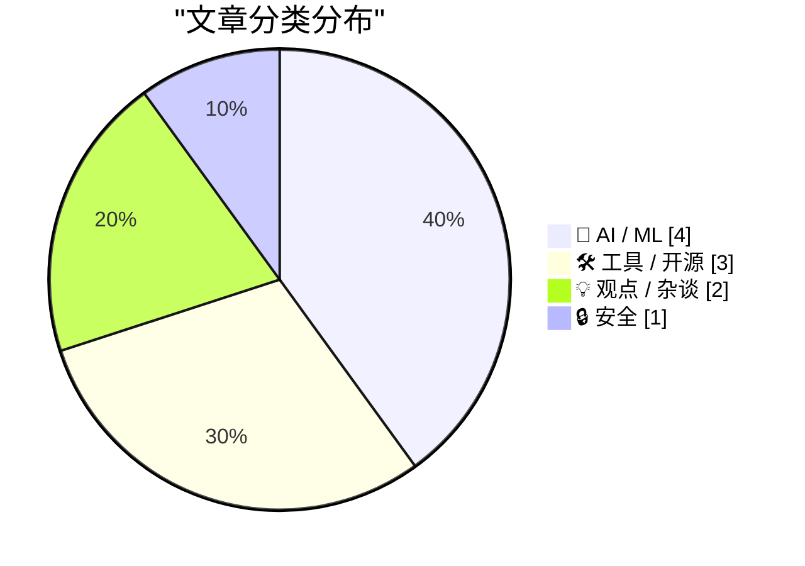
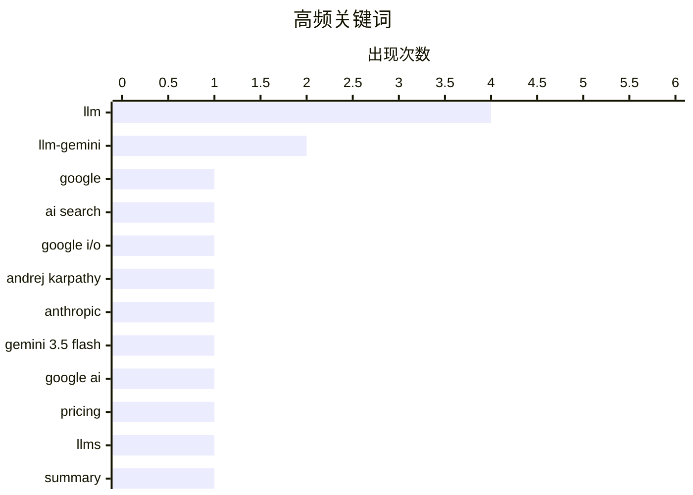

Google搜索框时隔25年首次重大改版，转向对话式交互与多模态输入，标志着传统搜索向AI助手形态的范式转移。与此同时，Andrej Karpathy重返一线加入Anthropic、Google全量部署Gemini 3.5 Flash等动向，折射出大厂围绕LLM前沿人才的竞争日趋白热化。实用层面则呈现两极分化：一方面插件生态、流式输出等工具快速迭代，推动LLM可落地性持续增强；另一方面，“提示词即技术债务”、C++内存安全漏洞等反思性讨论也在提醒行业，AI工程化的深层挑战才刚刚显现。

<!--more-->


> 来自 Karpathy 推荐的 92 个顶级技术博客，AI 精选 Top 10

## 🏆 今日必读

🥇 **25年来首次改变：Google因AI革命重塑搜索框**

[NYT: ‘Powered by A.I., Google Changes Its Search Box for the First Time in 25 Years’](https://www.nytimes.com/2026/05/19/business/google-seach-bar-ai-gemini.html?unlocked_article_code=1.jlA.95yh.ptfBUHf-rBtB&amp;smid=url-share) — daringfireball.net · 57 分钟前 · 🤖 AI / ML

> Google搜索框在过去25年间始终保持长条形简约设计，但AI技术的发展使人们能够输入更长、更复杂的问题，如整支球队晋级的概率分析。周二，Google宣布自2001年以来首次调整搜索框尺寸，使其更大且更具交互性。新搜索框现在支持用户上传照片和视频进行查询，并可以在主搜索页面的聊天机器人中追问后续问题。《纽约时报》认为这是google.com主页自上线以来最显著的变化，标志着搜索引擎从关键词匹配向对话式搜索的转型。

💡 **为什么值得读**: 如果你关心Google搜索产品的演进方向和对AI的投入，这篇报道揭示了搜索交互方式即将发生的根本性变革。

🏷️ Google, AI Search, Google I/O

🥈 **AI研究明星Andrej Karpathy加入Anthropic**

[Andrej Karpathy Joined Anthropic](https://x.com/karpathy/status/2056753169888334312) — daringfireball.net · 1 天前 · 🤖 AI / ML

> 深度学习领域知名研究者Andrej Karpathy宣布加入Anthropic，他将专注于LLM前沿研究。Karpathy是OpenAI联合创始人（2015年），曾于2017-2022年担任特斯拉AI总监直接向Elon Musk汇报，后于2023年重返OpenAI，2024年离开后创立了AI教育公司Eureka Labs。他表示对未来几年LLM的发展感到兴奋，计划同时回归R&D工作并继续其热爱的教育事业。Karpathy在今年2月创造了"vibe coding"（氛围编程）这一术语，在开发者社区影响广泛。

💡 **为什么值得读**: Karpathy是AI领域最具影响力的人物之一，他的职业选择往往预示着行业方向，值得关注Anthropic将如何利用其 expertise。

🏷️ Andrej Karpathy, Anthropic, LLM

🥉 **Google发布Gemini 3.5 Flash：全面应用于核心产品**

[Gemini 3.5 Flash: more expensive, but Google plan to use it for everything](https://simonwillison.net/2026/May/19/gemini-35-flash/#atom-everything) — simonwillison.net · 23 小时前 · 🤖 AI / ML

> 在Google I/O大会上，Google正式发布了Gemini 3.5 Flash，该模型跳过了-preview后缀直接进入通用可用阶段。此次发布标志着Google将在所有核心产品中大规模部署该模型：覆盖全球数十亿用户的Gemini应用和Google搜索AI Mode、面向开发者的Google Antigravity平台和AI Studio及Android Studio、以及企业级的Gemini Enterprise Agent Platform。这是Google首次将最新的Flash级别模型同时推向消费者、开发者和企业三个层面。

💡 **为什么值得读**: Gemini 3.5 Flash是Google有史以来应用范围最广的模型，理解其定位有助于把握Google的AI战略全貌。

🏷️ Gemini 3.5 Flash, Google AI, pricing, LLM

---

## 📊 数据概览

| 扫描源 | 抓取文章 | 时间范围 | 精选 |
|:---:|:---:|:---:|:---:|
| 88/92 | 2553 篇 → 31 篇 | 48h | **10 篇** |

### 分类分布



### 高频关键词



<details>
<summary>📈 纯文本关键词图（终端友好）</summary>

```
llm              │ ████████████████████ 4
llm-gemini       │ ██████████░░░░░░░░░░ 2
google           │ █████░░░░░░░░░░░░░░░ 1
ai search        │ █████░░░░░░░░░░░░░░░ 1
google i/o       │ █████░░░░░░░░░░░░░░░ 1
andrej karpathy  │ █████░░░░░░░░░░░░░░░ 1
anthropic        │ █████░░░░░░░░░░░░░░░ 1
gemini 3.5 flash │ █████░░░░░░░░░░░░░░░ 1
google ai        │ █████░░░░░░░░░░░░░░░ 1
pricing          │ █████░░░░░░░░░░░░░░░ 1
```

</details>

### 🏷️ 话题标签

**llm**(4) · **llm-gemini**(2) · **google**(1) · ai search(1) · google i/o(1) · andrej karpathy(1) · anthropic(1) · gemini 3.5 flash(1) · google ai(1) · pricing(1) · llms(1) · summary(1) · pycon 2026(1) · overview(1) · prompts(1) · technical debt(1) · best practices(1) · token speed(1) · simulation(1) · interactive(1)

---

## 🤖 AI / ML

### 1. 25年来首次改变：Google因AI革命重塑搜索框

[NYT: ‘Powered by A.I., Google Changes Its Search Box for the First Time in 25 Years’](https://www.nytimes.com/2026/05/19/business/google-seach-bar-ai-gemini.html?unlocked_article_code=1.jlA.95yh.ptfBUHf-rBtB&amp;smid=url-share) — **daringfireball.net** · 57 分钟前 · ⭐ 29/30

> Google搜索框在过去25年间始终保持长条形简约设计，但AI技术的发展使人们能够输入更长、更复杂的问题，如整支球队晋级的概率分析。周二，Google宣布自2001年以来首次调整搜索框尺寸，使其更大且更具交互性。新搜索框现在支持用户上传照片和视频进行查询，并可以在主搜索页面的聊天机器人中追问后续问题。《纽约时报》认为这是google.com主页自上线以来最显著的变化，标志着搜索引擎从关键词匹配向对话式搜索的转型。

🏷️ Google, AI Search, Google I/O

---

### 2. AI研究明星Andrej Karpathy加入Anthropic

[Andrej Karpathy Joined Anthropic](https://x.com/karpathy/status/2056753169888334312) — **daringfireball.net** · 1 天前 · ⭐ 28/30

> 深度学习领域知名研究者Andrej Karpathy宣布加入Anthropic，他将专注于LLM前沿研究。Karpathy是OpenAI联合创始人（2015年），曾于2017-2022年担任特斯拉AI总监直接向Elon Musk汇报，后于2023年重返OpenAI，2024年离开后创立了AI教育公司Eureka Labs。他表示对未来几年LLM的发展感到兴奋，计划同时回归R&D工作并继续其热爱的教育事业。Karpathy在今年2月创造了"vibe coding"（氛围编程）这一术语，在开发者社区影响广泛。

🏷️ Andrej Karpathy, Anthropic, LLM

---

### 3. Google发布Gemini 3.5 Flash：全面应用于核心产品

[Gemini 3.5 Flash: more expensive, but Google plan to use it for everything](https://simonwillison.net/2026/May/19/gemini-35-flash/#atom-everything) — **simonwillison.net** · 23 小时前 · ⭐ 25/30

> 在Google I/O大会上，Google正式发布了Gemini 3.5 Flash，该模型跳过了-preview后缀直接进入通用可用阶段。此次发布标志着Google将在所有核心产品中大规模部署该模型：覆盖全球数十亿用户的Gemini应用和Google搜索AI Mode、面向开发者的Google Antigravity平台和AI Studio及Android Studio、以及企业级的Gemini Enterprise Agent Platform。这是Google首次将最新的Flash级别模型同时推向消费者、开发者和企业三个层面。

🏷️ Gemini 3.5 Flash, Google AI, pricing, LLM

---

### 4. Simon Willison五分钟回顾近半年LLM发展

[The last six months in LLMs in five minutes](https://simonwillison.net/2026/May/19/5-minute-llms/#atom-everything) — **simonwillison.net** · 1 天前 · ⭐ 25/30

> Simon Willison在PyCon US 2026进行了五分钟的闪电演讲，使用其annotated presentation工具总结了最近六个月LLM领域的重大发展。这份带有注释的幻灯片记录了关键的时间线、主要发布和技术突破，是快速了解LLM领域近期动态的高效资源。

🏷️ LLMs, summary, PyCon 2026, overview

---

## 🛠 工具 / 开源

### 5. 10 tokens/秒到底是什么概念？

[How fast is 10 tokens per second really?](https://simonwillison.net/2026/May/20/tokens-per-second/#atom-everything) — **simonwillison.net** · 4 小时前 · ⭐ 24/30

> 开发者Mike Veerman创建了一个简洁的HTML应用，用于模拟LLM的token输出速度。该工具可以让用户直观感受到模型标注的每秒token数实际意味着什么——速度范围从5 token/秒到800 token/秒。例如当你看到某模型宣传"30 tokens/秒"时，这个模拟器能帮助你建立真实的速度感知。

🏷️ LLM, token speed, simulation, interactive

---

### 6. llm-gemini插件0.32版支持Gemini 3.5 Flash

[llm-gemini 0.32](https://simonwillison.net/2026/May/19/llm-gemini-2/#atom-everything) — **simonwillison.net** · 22 小时前 · ⭐ 24/30

> Simon Willison的llm-gemini插件发布0.32版本，新增对gemini-3.5-flash模型的支持。这是该插件的重要更新，允许用户通过LLM接口调用最新的Google模型。作者此前已发布关于Gemini 3.5 Flash的详细评测笔记。

🏷️ llm-gemini, Gemini 3.5, plugin, release

---

### 7. llm-gemini 0.32a0alpha版支持推理token流式输出

[llm-gemini 0.32a0](https://simonwillison.net/2026/May/19/llm-gemini/#atom-everything) — **simonwillison.net** · 1 天前 · ⭐ 23/30

> llm-gemini插件发布0.32a0 alpha版本，兼容llm>=0.32a0，新增多流式推理token输出的能力。这一功能允许用户实时获取模型的推理过程，对于调试和优化提示工程非常有价值。

🏷️ llm-gemini, reasoning tokens, streaming, alpha

---

## 💡 观点 / 杂谈

### 8. 提示词也是技术债务

[Prompts are technical debt too](https://seangoedecke.com/prompts-are-technical-debt-too/) — **seangoedecke.com** · 22 小时前 · ⭐ 25/30

> 如同"所有代码都是技术债务"是业界共识，AI项目的提示文件同样构成技术债务。许多大型AI项目现在拥有大量代码库特定的提示文件，包括AGENTS.md、CLAUDE.md、子目录中的对应文件以及skills等。每增加一个提示文件都增加了系统的复杂性和维护负担，未来所有变更都需要考虑这些现有提示文件。作者认为工程师应该像尽量少写代码一样，尽量减少提示的使用，以降低长期维护成本。

🏷️ prompts, technical debt, LLM, best practices

---

### 9. 生成式AI会是科技行业的越战吗？

[Could generative AI turn out to be the tech industry’s Vietnam? And could public backlash lead AI to a better place?](https://garymarcus.substack.com/p/could-generative-ai-could-turn-out) — **garymarcus.substack.com** · 6 小时前 · ⭐ 24/30

> Gary Marcus探讨了一个具有争议性的问题：生成式AI是否可能成为科技行业的"越南战争"——一个投入巨大但最终带来负面影响的转折点？同时分析了公众反对声音如何可能推动AI走向更有益的发展方向。文章思考了AI技术发展与社会接受度之间的复杂关系。

🏷️ generative AI, public backlash, tech industry, AI future

---

## 🔒 安全

### 10. 又是C++：Windows Defender内存安全漏洞 CVE-2026-45584

["No way to prevent this" say users of only language where this regularly happens](https://xeiaso.net/shitposts/no-way-to-prevent-this/CVE-2026-45584/) — **xeiaso.net** · 22 小时前 · ⭐ 23/30

> CVE-2026-45584是针对微软Windows的严重安全漏洞，影响Windows Defender病毒扫描器，可导致内存安全问题和任意代码执行。该漏洞源于相关组件使用C++编写——这是唯一一种频繁出现此类漏洞的编程语言。据统计数据，C++编写的项目中存在memory safety漏洞的概率是其他语言的20倍，过去50年全球90%的内存安全漏洞都发生在C++项目中。

🏷️ CVE, Windows, memory safety

---

*生成于 2026-05-21 22:18 | 扫描 88 源 → 获取 2553 篇 → 精选 10 篇*
*基于 [Hacker News Popularity Contest 2025](https://refactoringenglish.com/tools/hn-popularity/) RSS 源列表，由 [Andrej Karpathy](https://x.com/karpathy) 推荐*
*由「懂点儿AI」制作，欢迎关注同名微信公众号获取更多 AI 实用技巧 💡*
