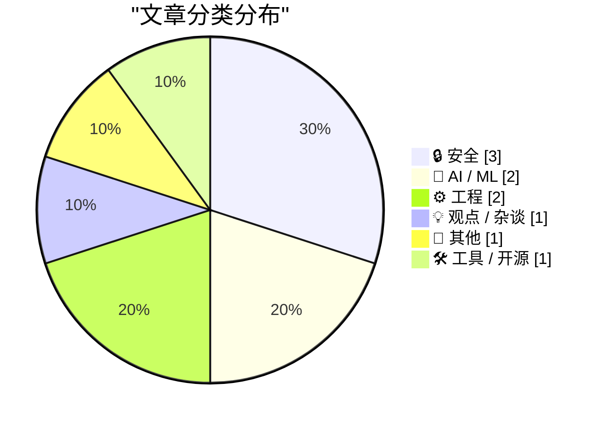
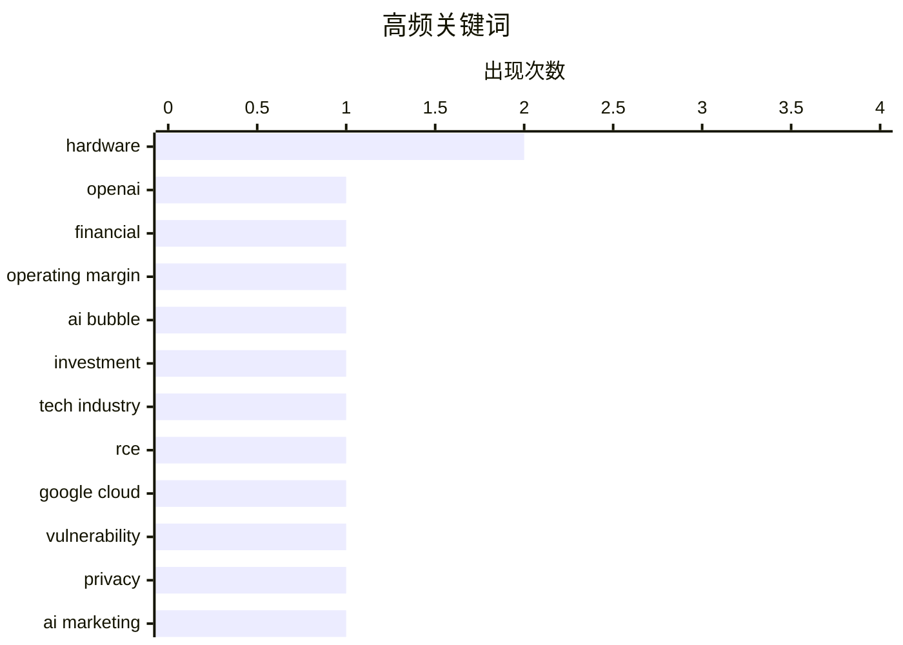

今日AI行业面临现实检验：OpenAI季度收入虽达57亿美元但运营利润率仍深陷-122%亏损，ChatGPT增长已现瓶颈，叠加市场对AI泡沫的持续争议，行业正从盲目扩张转向盈利压力下的理性审视。与此同时，云安全和隐私合规领域频爆漏洞，Google Cloud顶级漏洞赏金达148,337美元，FTC亦对“主动监听”类AI营销公司开出近百万美元罚单，显示安全隐私监管趋严。另据产业链消息，全球内存产能紧张致HBM需求激增，消费电子产品正面临新一轮涨价潮。

<!--more-->


> 来自 Karpathy 推荐的 92 个顶级技术博客，AI 精选 Top 10

## 🏆 今日必读

🥇 **OpenAI 2026年Q1收入57亿美元但运营利润率仅-122%，ChatGPT增长已陷入停滞**

[News: OpenAI Had A Negative 122% Non-GAAP Operating Margin In Q1 2026, and ChatGPT Growth Has Stalled](https://www.wheresyoured.at/news-openai-had-a-negative-122-operating-margin-in-q1-2026-and-chatgpt-growth-has-stalled/) — wheresyoured.at · 1 天前 · 🤖 AI / ML

> 据知情人士透露，OpenAI 2026年第一季度收入约为57亿美元，但调整后的运营利润率仅为-122%，意味着每收入1美元就亏损1.22美元。ChatGPT的用户增长已经停滞，不再呈现过去的爆发式增长态势。非GAAP负利润率反映出公司在算力和人才上的巨额投入。该文分析了OpenAI当前的财务困境及其对AI行业格局的潜在影响。

💡 **为什么值得读**: 这是目前关于OpenAI财务状况最详细的公开报道，提供关键的业务指标和市场信号，帮助读者判断AI行业的投资热度是否见顶。

🏷️ OpenAI, financial, operating margin

🥈 **如果我们现在处于AI泡沫中怎么办？(第二部分)**

[Premium: What If...We're In An AI Bubble? (Part 2)](https://www.wheresyoured.at/premium-what-if-were-in-an-ai-bubble-part-2/) — wheresyoured.at · 1 天前 · 💡 观点 / 杂谈

> 作者继续探讨AI泡沫的系列话题，分析过去几年提出的多个关键问题及其可能的后果。这是继上周第一部分之后的深度延续，聚焦于泡沫破裂时可能引发的连锁反应和市场重估。作者基于多年观察，对AI行业的可持续性提出质疑，并设想了多种极端情景下的行业走向。

💡 **为什么值得读**: 该系列文章以系统性思维分析AI行业的潜在风险，适合对AI投资和产业周期有兴趣的读者深入思考市场逻辑。

🏷️ AI bubble, investment, tech industry

🥉 **从信息泄露到远程代码执行：Google Cloud生产环境中的148,337美元漏洞赏金**

[StubZero: $148,337 RCE in Google Cloud Production](https://brutecat.com/articles/google-cloud-rce) — brutecat.com · 1 天前 · 🔒 安全

> 安全研究员通过一条Discord消息发现漏洞利用链，从信息泄露到实现Google Cloud生产环境的远程代码执行（RCE），获得148,337美元漏洞赏金。攻击链路包含两个关键缺失环节，从发现到漏洞利用窗口仅为一个小时。三个月后，类似漏洞再次被发现，暴露出云平台供应链的安全隐患。本文还原了完整的攻击路径和安全发现过程。

💡 **为什么值得读**: 这是一个真实的高额漏洞案例，详细展示了云环境从信息泄露到RCE的攻击链，对云安全研究者和运维人员具有重要参考价值。

🏷️ RCE, Google Cloud, vulnerability

---

## 📊 数据概览

| 扫描源 | 抓取文章 | 时间范围 | 精选 |
|:---:|:---:|:---:|:---:|
| 86/92 | 2534 篇 → 31 篇 | 48h | **10 篇** |

### 分类分布



### 高频关键词



<details>
<summary>📈 纯文本关键词图（终端友好）</summary>

```
hardware         │ ████████████████████ 2
openai           │ ██████████░░░░░░░░░░ 1
financial        │ ██████████░░░░░░░░░░ 1
operating margin │ ██████████░░░░░░░░░░ 1
ai bubble        │ ██████████░░░░░░░░░░ 1
investment       │ ██████████░░░░░░░░░░ 1
tech industry    │ ██████████░░░░░░░░░░ 1
rce              │ ██████████░░░░░░░░░░ 1
google cloud     │ ██████████░░░░░░░░░░ 1
vulnerability    │ ██████████░░░░░░░░░░ 1
```

</details>

### 🏷️ 话题标签

**hardware**(2) · **openai**(1) · **financial**(1) · operating margin(1) · ai bubble(1) · investment(1) · tech industry(1) · rce(1) · google cloud(1) · vulnerability(1) · privacy(1) · ai marketing(1) · ftc(1) · memory(1) · consumer electronics(1) · ai demand(1) · chip design(1) · gpu(1) · tpu(1) · ai risk(1)

---

## 🔒 安全

### 1. 从信息泄露到远程代码执行：Google Cloud生产环境中的148,337美元漏洞赏金

[StubZero: $148,337 RCE in Google Cloud Production](https://brutecat.com/articles/google-cloud-rce) — **brutecat.com** · 1 天前 · ⭐ 25/30

> 安全研究员通过一条Discord消息发现漏洞利用链，从信息泄露到实现Google Cloud生产环境的远程代码执行（RCE），获得148,337美元漏洞赏金。攻击链路包含两个关键缺失环节，从发现到漏洞利用窗口仅为一个小时。三个月后，类似漏洞再次被发现，暴露出云平台供应链的安全隐患。本文还原了完整的攻击路径和安全发现过程。

🏷️ RCE, Google Cloud, vulnerability

---

### 2. FTC要求Cox Media Group等三家公司因"主动监听"AI营销服务欺骗客户支付近100万美元和解金

[FTC to Require Cox Media Group, Two Other Firms to Pay Nearly $1 Million to Settle Charges They Deceived Customers About “Active Listening” AI-Powered Marketing Service](https://simonwillison.net/2026/May/22/ftc-active-listening/#atom-everything) — **simonwillison.net** · 1 天前 · ⭐ 24/30

> FTC对Cox Media Group及两家公司处以近100万美元罚款，和解理由是这些公司涉嫌欺骗客户。2024年Cox被曝出向广告商销售基于"主动监听"的服务，声称智能设备能通过监听用户对话实时获取购买意向数据，并与行为数据结合进行精准营销。作者认为"主动监听"的概念存在严重隐私争议，FTC的执法行动确认了这一违规性质。

🏷️ privacy, AI marketing, FTC

---

### 3. 不要自己编写加密算法

[Don't Roll Your Own ...](https://susam.net/do-not-roll-your-own.html) — **susam.net** · 22 小时前 · ⭐ 22/30

> 作者借用了密码学界的经典原则"不要自己编写加密算法"，炮轰现代Web开发中的类似反模式。作者批评了一些开发者放着成熟的Web框架不用、偏爱自己从头搭建安全系统的行为，认为这种方式与金融系统不使用经验证的加密库同理。真正的专业做法是使用经过社区审查和实战检验的开源工具，而非盲目造轮子。

🏷️ cryptography, security, web design

---

## 🤖 AI / ML

### 4. OpenAI 2026年Q1收入57亿美元但运营利润率仅-122%，ChatGPT增长已陷入停滞

[News: OpenAI Had A Negative 122% Non-GAAP Operating Margin In Q1 2026, and ChatGPT Growth Has Stalled](https://www.wheresyoured.at/news-openai-had-a-negative-122-operating-margin-in-q1-2026-and-chatgpt-growth-has-stalled/) — **wheresyoured.at** · 1 天前 · ⭐ 27/30

> 据知情人士透露，OpenAI 2026年第一季度收入约为57亿美元，但调整后的运营利润率仅为-122%，意味着每收入1美元就亏损1.22美元。ChatGPT的用户增长已经停滞，不再呈现过去的爆发式增长态势。非GAAP负利润率反映出公司在算力和人才上的巨额投入。该文分析了OpenAI当前的财务困境及其对AI行业格局的潜在影响。

🏷️ OpenAI, financial, operating margin

---

### 5. 只有一种糟糕的AI场景

[There is only one bad AI scenario](https://geohot.github.io//blog/jekyll/update/2026/05/23/one-bad-scenario.html) — **geohot.github.io** · 15 小时前 · ⭐ 23/30

> 作者反驳了AI末日论中的两种典型叙事：天网式失控AI（人类奋起反抗）和灰蛊式纳米机器人（自底向上毁灭）。作者认为这两种都需要与现实产生重大断裂，不切实际。真正的危险在于AI持续优化现有社会的"驯化"目标函数，使人类在渐进式中失去自主性，而非骤然的物种灭绝。这是一个反直觉的AI风险思考。

🏷️ AI risk, existential, safety

---

## ⚙️ 工程

### 6. 从零开始的芯片设计：Reiner Pope解密计算架构

[Reiner Pope – Chip design from the bottom up](https://www.dwarkesh.com/p/reiner-pope-2) — **dwarkesh.com** · 1 天前 · ⭐ 23/30

> 作者从基础逻辑门出发，逐步解释为何GPU、TPU、FPGA和人类大脑的架构呈现当前形态。文章探讨了不同计算范式的设计哲学，比较了并行处理、专用加速器和通用处理器的优劣，以及生物神经系统与硅基芯片的根本差异。这是一个面向硬件架构爱好者的深度技术漫谈。

🏷️ chip design, GPU, TPU, hardware

---

### 7. 关于Palantir的一些笔记与替代方案思考

[Some notes on how we ended up with Palantir & how to replace it](https://berthub.eu/articles/posts/some-notes-on-palantir/) — **berthub.eu** · 13 小时前 · ⭐ 22/30

> 公众对政府使用Palantir软件感到愤怒，呼吁开发更具欧洲价值观的反感开源替代品。但作者指出，问题不仅是软件本身——Palantir本质上是一个数据经纪商和大型个人信息数据库。仅仅替换软件而不改变数据基础设施和控制权结构，无法真正解决问题。理解Palantir如何运作是开发有效替代品的第一步。

🏷️ government, data platform, open source, Palantir

---

## 💡 观点 / 杂谈

### 8. 如果我们现在处于AI泡沫中怎么办？(第二部分)

[Premium: What If...We're In An AI Bubble? (Part 2)](https://www.wheresyoured.at/premium-what-if-were-in-an-ai-bubble-part-2/) — **wheresyoured.at** · 1 天前 · ⭐ 25/30

> 作者继续探讨AI泡沫的系列话题，分析过去几年提出的多个关键问题及其可能的后果。这是继上周第一部分之后的深度延续，聚焦于泡沫破裂时可能引发的连锁反应和市场重估。作者基于多年观察，对AI行业的可持续性提出质疑，并设想了多种极端情景下的行业走向。

🏷️ AI bubble, investment, tech industry

---

## 📝 其他

### 9. 内存短缺正在导致消费电子产品的重新定价

[The memory shortage is causing a repricing of consumer electronics](https://simonwillison.net/2026/May/22/memory-shortage/#atom-everything) — **simonwillison.net** · 1 天前 · ⭐ 23/30

> 全球仅存三家大型内存制造商，其晶圆产能固定，需在DDR、LPDDR和HBM之间分配。HBM此前仅占2%的晶圆配比，因AI数据中心需求激增，预计2026年底将达20%。单个GB的HBM消耗超过DDR/LPDDR三倍以上的晶圆产能。内存厂商已学会控制产能以维持高利润，导致使用内存的消费产品将显著涨价。

🏷️ memory, consumer electronics, AI demand

---

## 🛠 工具 / 开源

### 10. Raspberry Pi 6及微控制器开发的最新消息

[News about Raspberry Pi 6 and Microcontroller Development](https://www.jeffgeerling.com/blog/2026/news-about-raspberry-pi-6-and-microcontroller-development/) — **jeffgeerling.com** · 1 天前 · ⭐ 21/30

> 树莓派CEO Eben Upton等三位核心工程师在Reddit AMA中透露，Pi 6有望在2026或2027年发布。根据历史发布节奏（Raspberry Pi 2012、Pi 2 2015、Pi 3 2016、Pi 4 2019、Pi 5 2023），通常间隔3-4年。本次AMA提供了关于下一代树莓派功能和定位的技术讨论。

🏷️ Raspberry Pi, hardware, microcontroller

---

*生成于 2026-05-24 22:18 | 扫描 86 源 → 获取 2534 篇 → 精选 10 篇*
*基于 [Hacker News Popularity Contest 2025](https://refactoringenglish.com/tools/hn-popularity/) RSS 源列表，由 [Andrej Karpathy](https://x.com/karpathy) 推荐*
*由「懂点儿AI」制作，欢迎关注同名微信公众号获取更多 AI 实用技巧 💡*
