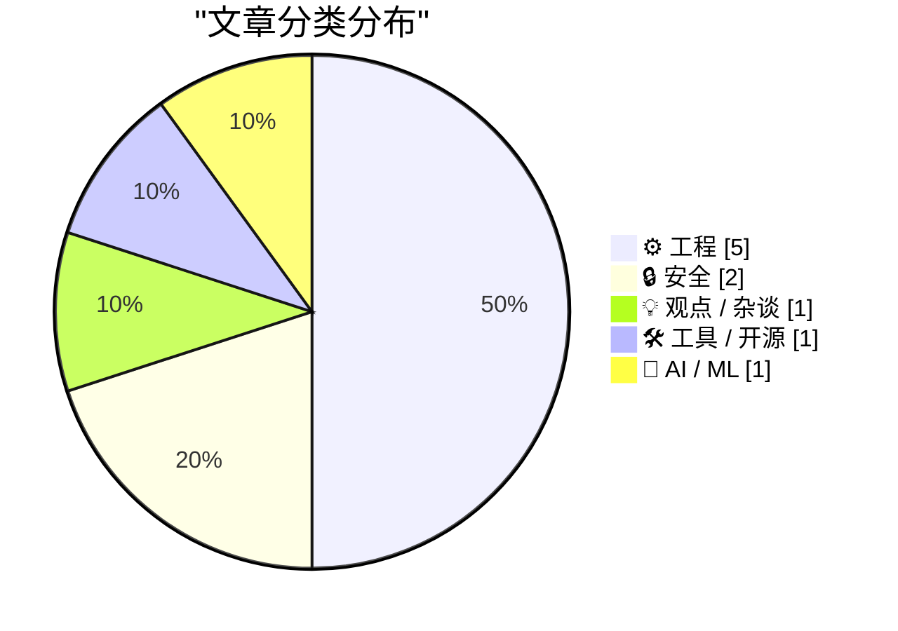
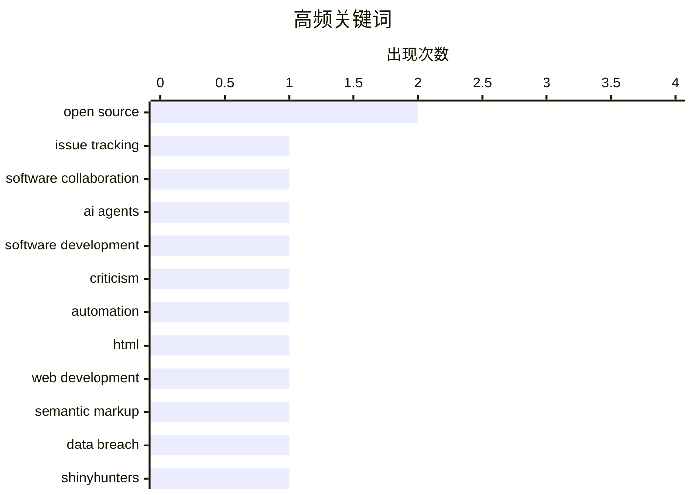

今日的技术焦点集中在三个维度：首先，AI 生成内容暴露出的质量问题引发反思，从 AI 撰写 bug 报告的混乱表达到 AI agent 可能成为软件开发史上最“昂贵”的误区，行业正在重新审视 AI 在工程流程中的角色定位。与此同时，安全领域的动态表明供应链防护正变得紧迫——无论是 ShinyHunters 还是软件签名的价值，都在一次次安全事件后才被充分认知，这促使开发者转向更成熟、经社区验证的基础设施工具，而非自行造轮子。

<!--more-->


> 来自 Karpathy 推荐的 92 个顶级技术博客，AI 精选 Top 10

## 🏆 今日必读

🥇 **引用 Armin Ronacher 关于 AI 生成 Issue 的看法**

[Quoting Armin Ronacher](https://simonwillison.net/2026/May/24/armin-ronacher/#atom-everything) — simonwillison.net · 3 小时前 · ⚙️ 工程

> AI 生成的 issue 报告往往充满问题：表述混乱、对根因的猜测不准确但却自信满满，还包含伪造的最小复现案例和对错误代码的错误类比。Armin Ronacher 建议 issue 应简化为四个要点：我运行了什么命令、期望发生什么、实际发生了什么、以及具体的错误日志或截图。他强调 issue 应该用自己的话描述人类实际观察到的情况，而不是让 AI 重写后变得面目全非。

💡 **为什么值得读**: 这篇短文揭示了当前开源社区面临的 AI 生成噪音问题的本质，值得所有维护者和提交者阅读反思。

🏷️ open source, issue tracking, software collaboration

🥈 **永恒的"Sloptember"**

[The Eternal Sloptember](https://geohot.github.io//blog/jekyll/update/2026/05/24/the-eternal-sloptember.html) — geohot.github.io · 15 小时前 · 💡 观点 / 杂谈

> 作者认为将 AI agents 引入软件开发将是该领域最昂贵的错误之一。Agents 无法真正编程，它们只是设计用来模仿编程分布的高度复杂的统计模型。输出是有缺陷的，但这种方式越来越难检测——这正是一个日益准确的统计模型的预期行为。随着模型变得更准确，其错误也会变得更微妙更难发现。

💡 **为什么值得读**: 这是一个与主流AI辅助编程热潮对立的反向思考，提供了关于AI agent局限性的深刻洞见。

🏷️ AI agents, software development, criticism, automation

🥉 **重新认识 HTML <dl> 元素**

[On the <dl>](https://simonwillison.net/2026/May/23/on-the-dl/#atom-everything) — simonwillison.net · 1 天前 · ⚙️ 工程

> 文章总结了关于 HTML <dl> (description list) 元素的四个要点：一个 <dt> 可以跟多个 <dd>；可以用 <div> 包裹 <dt> 和 <dd> 进行样式分组；可以通过 ARIA 添加标签；以及自 2008 年 HTML5 草案以来它被称为「描述列表」而非「定义列表」。这些细节对于正确使用语义化 HTML 很重要。

💡 **为什么值得读**: 虽然篇幅简短，但纠正了常见的术语误解，是前端开发者需要掌握的 HTML 基础知识。

🏷️ HTML, web development, semantic markup

---

## 📊 数据概览

| 扫描源 | 抓取文章 | 时间范围 | 精选 |
|:---:|:---:|:---:|:---:|
| 87/92 | 2511 篇 → 22 篇 | 48h | **10 篇** |

### 分类分布



### 高频关键词



<details>
<summary>📈 纯文本关键词图（终端友好）</summary>

```
open source            │ ████████████████████ 2
issue tracking         │ ██████████░░░░░░░░░░ 1
software collaboration │ ██████████░░░░░░░░░░ 1
ai agents              │ ██████████░░░░░░░░░░ 1
software development   │ ██████████░░░░░░░░░░ 1
criticism              │ ██████████░░░░░░░░░░ 1
automation             │ ██████████░░░░░░░░░░ 1
html                   │ ██████████░░░░░░░░░░ 1
web development        │ ██████████░░░░░░░░░░ 1
semantic markup        │ ██████████░░░░░░░░░░ 1
```

</details>

### 🏷️ 话题标签

**open source**(2) · **issue tracking**(1) · **software collaboration**(1) · ai agents(1) · software development(1) · criticism(1) · automation(1) · html(1) · web development(1) · semantic markup(1) · data breach(1) · shinyhunters(1) · instructure(1) · ransomware(1) · sigstore(1) · tuf(1) · software supply chain(1) · signing(1) · package management(1) · npm(1)

---

## ⚙️ 工程

### 1. 引用 Armin Ronacher 关于 AI 生成 Issue 的看法

[Quoting Armin Ronacher](https://simonwillison.net/2026/May/24/armin-ronacher/#atom-everything) — **simonwillison.net** · 3 小时前 · ⭐ 24/30

> AI 生成的 issue 报告往往充满问题：表述混乱、对根因的猜测不准确但却自信满满，还包含伪造的最小复现案例和对错误代码的错误类比。Armin Ronacher 建议 issue 应简化为四个要点：我运行了什么命令、期望发生什么、实际发生了什么、以及具体的错误日志或截图。他强调 issue 应该用自己的话描述人类实际观察到的情况，而不是让 AI 重写后变得面目全非。

🏷️ open source, issue tracking, software collaboration

---

### 2. 重新认识 HTML <dl> 元素

[On the <dl>](https://simonwillison.net/2026/May/23/on-the-dl/#atom-everything) — **simonwillison.net** · 1 天前 · ⭐ 22/30

> 文章总结了关于 HTML <dl> (description list) 元素的四个要点：一个 <dt> 可以跟多个 <dd>；可以用 <div> 包裹 <dt> 和 <dd> 进行样式分组；可以通过 ARIA 添加标签；以及自 2008 年 HTML5 草案以来它被称为「描述列表」而非「定义列表」。这些细节对于正确使用语义化 HTML 很重要。

🏷️ HTML, web development, semantic markup

---

### 3. 不要自己造轮子

[Don't Roll Your Own ...](https://susam.net/do-not-roll-your-own.html) — **susam.net** · 1 天前 · ⭐ 21/30

> 文章将密码学领域的「不要自己写加密算法」的原則延伸到现代 Web 开发实践。作者认为同样的逻辑适用于 Web 框架和基础设施工具：不建议使用未经广泛审查的自研实现，而应使用经过社区验证的标准方案。二十年前业内确实存在诸多有缺陷的自研加密实现，如今标准做法是用经过同行评审的加密库。

🏷️ web design, cryptography, security, best practices

---

### 4. 用 Pi 构建 Pi：AI 生成 issue 的实践

[Building Pi With Pi](https://lucumr.pocoo.org/2026/5/24/pi-oss/) — **lucumr.pocoo.org** · 22 小时前 · ⭐ 20/30

> 作者描述了用 AI agent 项目 Pi 来开发 Pi 本身的体验。构建过程中的一个有趣变化是 issue 描述不仅面向维护者，还直接用作 Pi 系统的提示词输入，这改变了 issue 追踪器的角色定位。AI 重写过的 issue 往往变得质量很低，这种「狗粮效应」帮助他们理解了 AI 生成内容的问题所在。

🏷️ Raspberry Pi, open source, project management

---

### 5. 我的极简内存安全 Go rsync 如何避免漏洞

[How my minimal, memory-safe Go rsync steers clear of vulnerabilities](https://michael.stapelberg.ch/posts/2026-05-24-minimal-memory-safe-go-rsync-vulns/) — **michael.stapelberg.ch** · 7 小时前 · ⭐ 20/30

> 文章介绍了一个用极简、内存安全的 Go 语言实现的 rsync 工具，它避免了传统 rsync 实现中的常见安全漏洞。核心改进在于正确校验 Checksum 长度，防止因校验值不完整导致的拒绝服务攻击或数据损坏。Google Security 团队提供了相关报告。

🏷️ Go, rsync, memory safety, vulnerability

---

## 🔒 安全

### 6. 每周更新 505

[Weekly Update 505](https://www.troyhunt.com/weekly-update-505/) — **troyhunt.com** · 20 小时前 · ⭐ 22/30

> Troy Hunt 记录了 ShinyHunters 黑客组织在 Instructure 勒索事件后的安静期。距他首次听说支付赎金的消息几乎正好两周，这一事件涉及大规模数据泄露。全文主要是对近期网络安全威胁动态的跟踪报道。

🏷️ data breach, ShinyHunters, Instructure, ransomware

---

### 7. 签名是为了那些艰难的日子

[Signing is for the bad days](https://nesbitt.io/2026/05/24/signing-is-for-the-bad-days.html) — **nesbitt.io** · 12 小时前 · ⭐ 21/30

> TUF、in-toto 和 Sigstore 这些软件签名框架在没有出问题的时候看起来毫无意义。作者指出这些工具的价值只有在「着火」时才能体现——即发生安全事件或供应链攻击时才显示出重要性。这反映了事后防御与事前防护之间的典型困境。

🏷️ Sigstore, TUF, software supply chain, signing

---

## 💡 观点 / 杂谈

### 8. 永恒的"Sloptember"

[The Eternal Sloptember](https://geohot.github.io//blog/jekyll/update/2026/05/24/the-eternal-sloptember.html) — **geohot.github.io** · 15 小时前 · ⭐ 23/30

> 作者认为将 AI agents 引入软件开发将是该领域最昂贵的错误之一。Agents 无法真正编程，它们只是设计用来模仿编程分布的高度复杂的统计模型。输出是有缺陷的，但这种方式越来越难检测——这正是一个日益准确的统计模型的预期行为。随着模型变得更准确，其错误也会变得更微妙更难发现。

🏷️ AI agents, software development, criticism, automation

---

## 🛠 工具 / 开源

### 9. 本周包管理热点：2026年5月23日

[This Week in Package Management: 23 May 2026](https://nesbitt.io/2026/05/23/this-week-in-package-management.html) — **nesbitt.io** · 1 天前 · ⭐ 21/30

> 这是一篇包管理领域的每周新闻汇总，涵盖来自各语言包管理生态的发布、安全公告和技术文章。包括 npm、pip、Cargo 等主流包管理器的更新动态和安全补丁信息。

🏷️ package management, npm, releases, advisories

---

## 🤖 AI / ML

### 10. 只有一个糟糕的 AI 场景

[There is only one bad AI scenario](https://geohot.github.io//blog/jekyll/update/2026/05/23/one-bad-scenario.html) — **geohot.github.io** · 1 天前 · ⭐ 21/30

> 作者反驳了 AI 末日论中的两种流行想象：失控的超级 AI（如天网）和灰蛊（Gray goo）式的纳米机器人灾难。他认为这些假设都需要与现实出现重大断裂，不太可能成真。真正的危险在于 AI 继续优化当前的「驯化」社会目标函数——即让人类变得依赖和被动，而非直接的物理消灭。这种渐进式的风险更容易被忽视。

🏷️ AI safety, doomsday, Skynet, risk

---

*生成于 2026-05-25 22:18 | 扫描 87 源 → 获取 2511 篇 → 精选 10 篇*
*基于 [Hacker News Popularity Contest 2025](https://refactoringenglish.com/tools/hn-popularity/) RSS 源列表，由 [Andrej Karpathy](https://x.com/karpathy) 推荐*
*由「懂点儿AI」制作，欢迎关注同名微信公众号获取更多 AI 实用技巧 💡*
