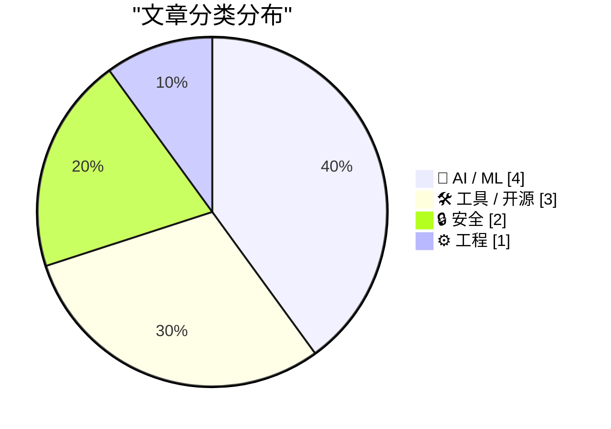
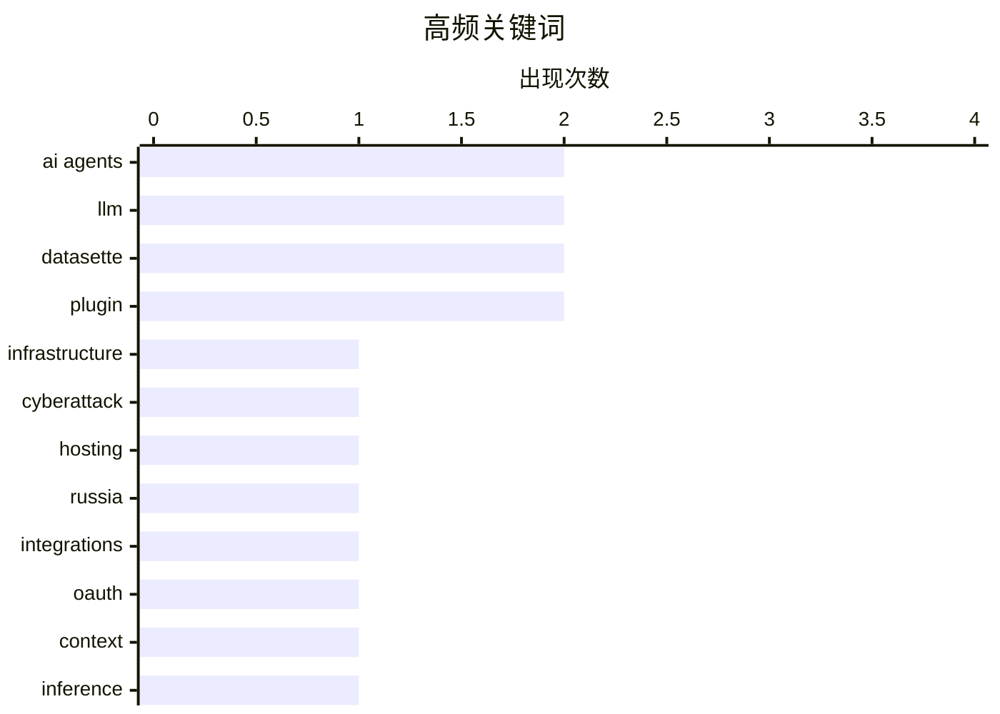

**今日看点：** 安全领域传出重大动向，荷兰当局查封800台服务器并逮捕涉嫌协助俄罗斯情报机构进行网络攻击的托管商运营商；同时，用内存安全的Go语言重写rsync等基础工具的安全实践引发关注。AI应用层面则呈现两条分化路径：一方面WorkOS Pipes等预建集成中间件试图解决AI代理获取业务上下文的碎片化难题，另一方面围绕“AI代理是否将成为史上最大教训”的反思性讨论浮现，暗含对模型准确性与输出损坏之间悖论的关注。本地化推理亦有进展，基于Mac Studio的DwarfStar项目展示了消费级硬件运行大模型的可能性。

<!--more-->


> 来自 Karpathy 推荐的 92 个顶级技术博客，AI 精选 Top 10

## 🏆 今日必读

🥇 **荷兰查封800台服务器 逮捕2名协助俄网络攻击的托管商运营者**

[Netherlands Seizes 800 Servers, Arrests 2 for Aiding Cyberattacks](https://krebsonsecurity.com/2026/05/netherlands-seizes-800-servers-arrests-2-for-aiding-cyberattacks/) — krebsonsecurity.com · 8 小时前 · 🔒 安全

> 荷兰执法部门逮捕了两家互联网托管公司的联合创始人，罪名是为俄罗斯情报机构在欧盟境内实施网络攻击、影响力行动和虚假信息宣传活动提供IT基础设施。这两家公司与此前被欧盟制裁的Stark Industries Solutions有关联，该ISP被认定为俄罗斯网络间谍活动的频繁阵地。当局于2025年通过KrebsOnSecurity报道锁定这两名嫌疑人，目前案件仍在进一步调查中。

💡 **为什么值得读**: 安全从业者可借此了解西方国家打击为国家级网络威胁提供基础设施的托管商的最新执法动态。

🏷️ infrastructure, cyberattack, hosting, Russia

🥈 **WorkOS Pipes：为AI代理提供上下文的预构建集成连接器**

[WorkOS: ‘Agents Need Context. Ship the Integrations That Give It to Them.’](https://workos.com/docs/pipes?utm_source=daringfireball&amp;utm_medium=newsletter&amp;utm_campaign=q22026) — daringfireball.net · 7 小时前 · 🤖 AI / ML

> 文章指出当前多阶段AI代理面临的核心困境——真正有价值的业务上下文不在自有数据库中，而在用户日常使用的第三方工具里，每缺少一个集成就意味着需要单独开发一套OAuth流程和令牌生命周期管理。WorkOS Pipes推出预建连接器，支持GitHub、Slack、Salesforce、Google Drive等多个平台，自动处理OAuth授权、令牌刷新和凭证存储，AI代理可在任务执行的每个步骤实时调用真实供应商API获取新鲜令牌，从而持续获得完整上下文。

💡 **为什么值得读**: 开发多Agent系统或AI应用集成的工程师可快速了解如何低成本解决第三方工具授权和上下文获取难题。

🏷️ AI agents, integrations, OAuth, context

🥉 **DwarfStar项目：在Mac Studio上分发式运行大语言模型推理**

[Distributing LLM inference in DwarfStar](http://antirez.com/news/167) — antirez.com · 7 小时前 · 🤖 AI / ML

> 出于成本考量，高端NVIDIA显卡加服务器电费高昂，尤其是需要足够VRAM运行超大模型时。作者转向Apple Mac Studio M3 Ultra（统一内存512GB方案），通过DwarfStar实现分布式LLM推理，实测DeepSeek v4 PRO可达150 tokens/s预填充和~10-13 tokens/s解码速度。即使使用2bit量化，模型仍保持良好可用性，能够完成编写C编译器等复杂任务，约12k人民币的总花费即可在家运行前沿模型。

💡 **为什么值得读**: 适合想以较低成本在本地部署和实验大模型的个人开发者及小型团队阅读参考。

🏷️ LLM, inference, Apple Silicon, distributed computing

---

## 📊 数据概览

| 扫描源 | 抓取文章 | 时间范围 | 精选 |
|:---:|:---:|:---:|:---:|
| 88/92 | 2562 篇 → 29 篇 | 48h | **10 篇** |

### 分类分布



### 高频关键词



<details>
<summary>📈 纯文本关键词图（终端友好）</summary>

```
ai agents      │ ████████████████████ 2
llm            │ ████████████████████ 2
datasette      │ ████████████████████ 2
plugin         │ ████████████████████ 2
infrastructure │ ██████████░░░░░░░░░░ 1
cyberattack    │ ██████████░░░░░░░░░░ 1
hosting        │ ██████████░░░░░░░░░░ 1
russia         │ ██████████░░░░░░░░░░ 1
integrations   │ ██████████░░░░░░░░░░ 1
oauth          │ ██████████░░░░░░░░░░ 1
```

</details>

### 🏷️ 话题标签

**ai agents**(2) · **llm**(2) · **datasette**(2) · plugin(2) · infrastructure(1) · cyberattack(1) · hosting(1) · russia(1) · integrations(1) · oauth(1) · context(1) · inference(1) · apple silicon(1) · distributed computing(1) · database(1) · sql(1) · software development(1) · llm criticism(1) · automation(1) · agent(1)

---

## 🤖 AI / ML

### 1. WorkOS Pipes：为AI代理提供上下文的预构建集成连接器

[WorkOS: ‘Agents Need Context. Ship the Integrations That Give It to Them.’](https://workos.com/docs/pipes?utm_source=daringfireball&amp;utm_medium=newsletter&amp;utm_campaign=q22026) — **daringfireball.net** · 7 小时前 · ⭐ 24/30

> 文章指出当前多阶段AI代理面临的核心困境——真正有价值的业务上下文不在自有数据库中，而在用户日常使用的第三方工具里，每缺少一个集成就意味着需要单独开发一套OAuth流程和令牌生命周期管理。WorkOS Pipes推出预建连接器，支持GitHub、Slack、Salesforce、Google Drive等多个平台，自动处理OAuth授权、令牌刷新和凭证存储，AI代理可在任务执行的每个步骤实时调用真实供应商API获取新鲜令牌，从而持续获得完整上下文。

🏷️ AI agents, integrations, OAuth, context

---

### 2. DwarfStar项目：在Mac Studio上分发式运行大语言模型推理

[Distributing LLM inference in DwarfStar](http://antirez.com/news/167) — **antirez.com** · 7 小时前 · ⭐ 24/30

> 出于成本考量，高端NVIDIA显卡加服务器电费高昂，尤其是需要足够VRAM运行超大模型时。作者转向Apple Mac Studio M3 Ultra（统一内存512GB方案），通过DwarfStar实现分布式LLM推理，实测DeepSeek v4 PRO可达150 tokens/s预填充和~10-13 tokens/s解码速度。即使使用2bit量化，模型仍保持良好可用性，能够完成编写C编译器等复杂任务，约12k人民币的总花费即可在家运行前沿模型。

🏷️ LLM, inference, Apple Silicon, distributed computing

---

### 3. 永恒的错误：AI代理将成为软件开发史上最昂贵的教训

[The Eternal Sloptember](https://geohot.github.io//blog/jekyll/update/2026/05/24/the-eternal-sloptember.html) — **geohot.github.io** · 1 天前 · ⭐ 23/30

> 作者认为将AI代理引入软件开发将是该领域历史上最昂贵的错误之一。AI代理本质上只是设计用来模仿编程分布的高级统计模型，其输出虽然损坏，但这种损坏正变得越来越难以察觉，而这恰恰是模型准确性日益提高的必然结果。

🏷️ AI agents, software development, LLM criticism, automation

---

### 4. 遛狗时进行的AI访谈：用简单语言解释复杂事物

[Walking the dog with Claude](http://xania.org/202605/walking-the-dog?utm_source=feed&amp;utm_medium=rss) — **xania.org** · 1 天前 · ⭐ 22/30

> 这是一次在户外遛狗场景下进行的AI对话访谈，探讨如何用通俗易懂的语言向非技术背景人群解释复杂的技术概念，访谈氛围轻松但内容富有洞见。

🏷️ AI, education, communication, interview

---

## 🛠 工具 / 开源

### 5. Datasette 1.0a30：新增可自定义的「跳转至」菜单功能

[datasette 1.0a30](https://simonwillison.net/2026/May/24/datasette/#atom-everything) — **simonwillison.net** · 22 小时前 · ⭐ 23/30

> Datasette 1.0a30版本发布重要新功能「Jump to...」跳转菜单，用户按/键可快速搜索数据库、表和调试选项。文章详细介绍了新的jump_items_sql()插件钩子，允许插件作者自主添加需检索的自定义条目，并提供了使用示例。该功能现已上线latest.datasette.io可供体验。

🏷️ Datasette, database, plugin, SQL

---

### 6. Datasette-agent 0.1a4：Jump菜单新增AI代理对话启动入口

[datasette-agent 0.1a4](https://simonwillison.net/2026/May/24/datasette-agent/#atom-everything) — **simonwillison.net** · 22 小时前 · ⭐ 22/30

> 基于Datasette 1.0a30新增的makeJumpSections() JavaScript插件钩子，datasette-agent 0.1a4版本将AI代理聊天界面深度集成到Jump菜单中。用户按/键召唤菜单后，可直接输入如「count entries」等指令启动代理对话，让AI完成数据统计任务后返回结果，当前示例可准确返回3300条记录数。

🏷️ Datasette, agent, LLM, plugin

---

### 7. 我用内存安全的Go重写rsync：最小化攻击面与漏洞隔离

[How my minimal, memory-safe Go rsync steers clear of vulnerabilities](https://michael.stapelberg.ch/posts/2026-05-24-minimal-memory-safe-go-rsync-vulns/) — **michael.stapelberg.ch** · 1 天前 · ⭐ 22/30

> 作者分享了如何用内存安全的Go语言完全重写rsync工具的心得，通过摒弃传统的C语言实现，从根本上避免了缓冲区溢出、校验和不正确验证等多类安全漏洞，显著降低了软件的攻击面。文中引用了Google安全报告来说明 improperly checksum length validation 问题的严重性。

🏷️ Go language, rsync, memory safety, vulnerability

---

## 🔒 安全

### 8. 荷兰查封800台服务器 逮捕2名协助俄网络攻击的托管商运营者

[Netherlands Seizes 800 Servers, Arrests 2 for Aiding Cyberattacks](https://krebsonsecurity.com/2026/05/netherlands-seizes-800-servers-arrests-2-for-aiding-cyberattacks/) — **krebsonsecurity.com** · 8 小时前 · ⭐ 24/30

> 荷兰执法部门逮捕了两家互联网托管公司的联合创始人，罪名是为俄罗斯情报机构在欧盟境内实施网络攻击、影响力行动和虚假信息宣传活动提供IT基础设施。这两家公司与此前被欧盟制裁的Stark Industries Solutions有关联，该ISP被认定为俄罗斯网络间谍活动的频繁阵地。当局于2025年通过KrebsOnSecurity报道锁定这两名嫌疑人，目前案件仍在进一步调查中。

🏷️ infrastructure, cyberattack, hosting, Russia

---

### 9. Troy Hunt每周更新505：Instructure勒索软件事件后续

[Weekly Update 505](https://www.troyhunt.com/weekly-update-505/) — **troyhunt.com** · 1 天前 · ⭐ 22/30

> 两周前沸沸扬扬的Instructure勒索软件事件有新进展，攻击者ShinyHunters在获取巨额赎金后突然沉寂。记录于周六早晨，距离首次传出支付消息几乎恰好两周整，Troy Hunt正在持续关注事态发展。

🏷️ data breach, ransomware,  threat intelligence

---

## ⚙️ 工程

### 10. FediMeto服务：处理时区问题与维护现有架构稳定性的艺术

[FediMeteo, timezones, and the art of not breaking what already works](https://it-notes.dragas.net/2026/05/25/fedimeteo-timezones-and-the-art-of-not-breaking-what-already-works/) — **it-notes.dragas.net** · 13 小时前 · ⭐ 21/30

> 作者曾撰文介绍FediMeto——一个由小型FreeBSD VPS驱动的全球天气预报服务的诞生，以及如何使用HAProxy减少到达snac的请求线程。更新的文章聚焦服务面临的时区处理挑战，涉及静态首页每小时重建、城市预报页面、RSS订阅、Fediverse实例数据刷新等众多需协调时区的组件，作者强调在引入新功能的同时必须谨慎避免破坏已有的稳定工作流程。

🏷️ Fediverse, timezones, federation, software maintenance

---

*生成于 2026-05-26 22:18 | 扫描 88 源 → 获取 2562 篇 → 精选 10 篇*
*基于 [Hacker News Popularity Contest 2025](https://refactoringenglish.com/tools/hn-popularity/) RSS 源列表，由 [Andrej Karpathy](https://x.com/karpathy) 推荐*
*由「懂点儿AI」制作，欢迎关注同名微信公众号获取更多 AI 实用技巧 💡*
