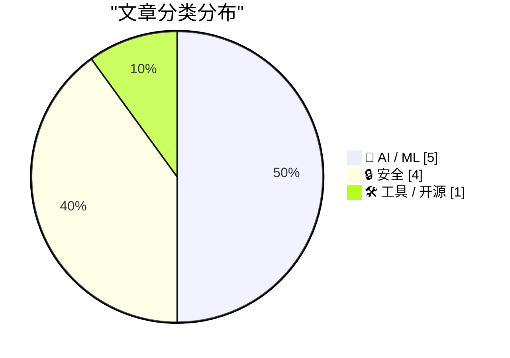
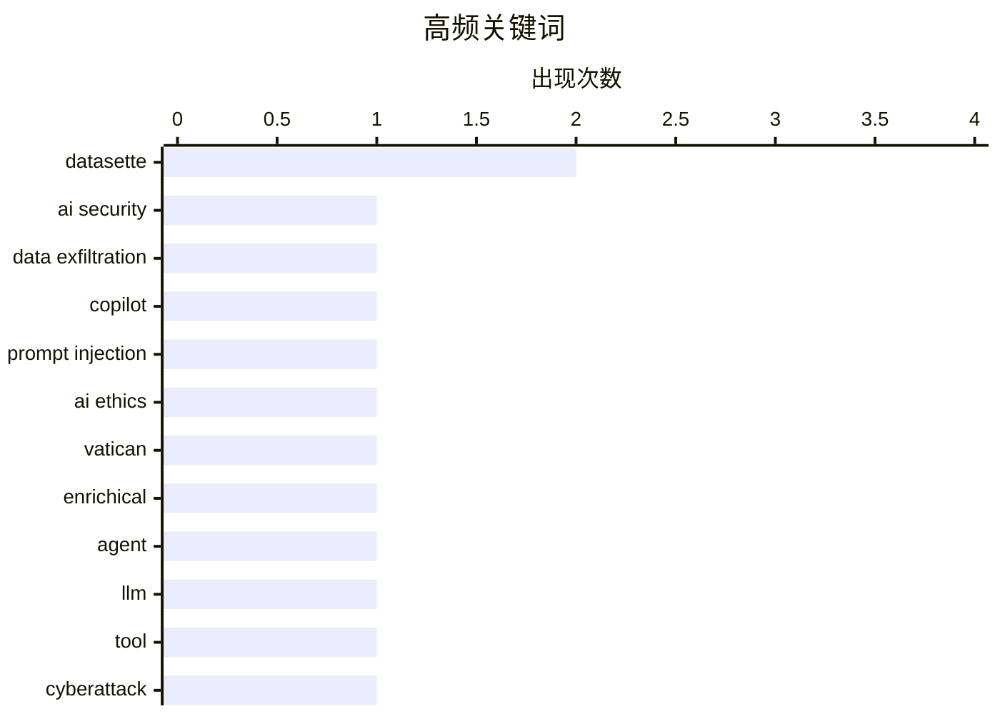

今日技术圈呈现两大核心动向：一方面，AI 领域的监管与商业反思正在加速——梵蒂冈首次发布 AI 人权通喻的同时，优步高管公开质疑 AI 投入产出比，行业正从盲目扩张转向审视实际价值；另一方面，安全风险持续高发，微软 Copilot 与特朗普移动网站均曝出数据泄露漏洞，荷兰更是破获一起疑似俄方网络攻击基础设施案件，全球网络安全形势日趋复杂。

<!--more-->


> 来自 Karpathy 推荐的 92 个顶级技术博客，AI 精选 Top 10

## 🏆 今日必读

🥇 **Microsoft Copilot Cowork 可被利用导致文件泄露**

[Microsoft Copilot Cowork Exfiltrates Files](https://simonwillison.net/2026/May/26/copilot-cowork-exfiltrates-files/#atom-everything) — simonwillison.net · 6 小时前 · 🔒 安全

> 文章披露了 Microsoft Copilot Cowork 产品中的严重安全漏洞：代理可向用户自身收件箱发送邮件，这些邮件中的外部图片会触发对外部网站的请求，导致数据被泄露。攻击者通过 Prompt 注入可让代理发送包含恶意图片的邮件，当用户打开邮件时，攻击者能远程获取用户身份验证信息。此外，由于 OneDrive 可创建预认证下载链接，攻击者还能利用此漏洞泄露用户文件。

💡 **为什么值得读**: 这是首个被公开记录的 AI agent 产品数据外泄案例，对所有开发代理系统的人都是警示

🏷️ AI security, data exfiltration, Copilot, prompt injection

🥈 **教皇利奥十四世关于 AI 的通谕笔记**

[Notes on Pope Leo XIV's encyclical on AI](https://simonwillison.net/2026/May/25/encyclical-on-ai/#atom-everything) — simonwillison.net · 22 小时前 · 🤖 AI / ML

> 梵蒂冈发布了教皇利奥十四世的通谕《人类的辉煌》，这是关于 AI 时代保护人权的明确阐述。教皇选择「利奥」之名是为了致敬 1891 年发表《新时代》通谕的教皇利奥十三世，该通谕论述了资本与劳动的权益。文中强调了 AI 融入现代社会时的伦理责任，呼吁在技术创新与人性尊严之间保持平衡。

💡 **为什么值得读**: 这是宗教领袖对 AI 伦理最正式的声明之一，内容清晰有深度，值得关注 AI 伦理讨论的读者阅读

🏷️ AI ethics, Vatican, enrichical

🥉 **datasette-agent 0.1a4 发布**

[datasette-agent 0.1a4](https://simonwillison.net/2026/May/24/datasette-agent/#atom-everything) — simonwillison.net · 1 天前 · 🤖 AI / ML

> Datasette Agent 0.1a4 版本发布，新增通过 Jump 菜单启动 AI 对话的功能。用户在任何页面按下「/」键即可呼出 Jump 菜单，其中包含「Start a new agent chat」选项，可直接开始 AI 代理对话。该功能利用了 Datasette 1.0a30 中新增的 makeJumpSections() JavaScript 插件钩子实现。

💡 **为什么值得读**: 展示了数据查询与 AI agent 深度结合的实用交互设计，适合需要将 AI 能力嵌入数据工具的开发者参考

🏷️ agent, datasette, LLM, tool

---

## 📊 数据概览

| 扫描源 | 抓取文章 | 时间范围 | 精选 |
|:---:|:---:|:---:|:---:|
| 88/92 | 2562 篇 → 39 篇 | 48h | **10 篇** |

### 分类分布



### 高频关键词



<details>
<summary>📈 纯文本关键词图（终端友好）</summary>

```
datasette         │ ████████████████████ 2
ai security       │ ██████████░░░░░░░░░░ 1
data exfiltration │ ██████████░░░░░░░░░░ 1
copilot           │ ██████████░░░░░░░░░░ 1
prompt injection  │ ██████████░░░░░░░░░░ 1
ai ethics         │ ██████████░░░░░░░░░░ 1
vatican           │ ██████████░░░░░░░░░░ 1
enrichical        │ ██████████░░░░░░░░░░ 1
agent             │ ██████████░░░░░░░░░░ 1
llm               │ ██████████░░░░░░░░░░ 1
```

</details>

### 🏷️ 话题标签

**datasette**(2) · **ai security**(1) · **data exfiltration**(1) · copilot(1) · prompt injection(1) · ai ethics(1) · vatican(1) · enrichical(1) · agent(1) · llm(1) · tool(1) · cyberattack(1) · netherlands(1) · infrastructure(1) · database(1) · sqlite(1) · release(1) · llm inference(1) · distributed(1) · consumer hardware(1)

---

## 🤖 AI / ML

### 1. 教皇利奥十四世关于 AI 的通谕笔记

[Notes on Pope Leo XIV's encyclical on AI](https://simonwillison.net/2026/May/25/encyclical-on-ai/#atom-everything) — **simonwillison.net** · 22 小时前 · ⭐ 24/30

> 梵蒂冈发布了教皇利奥十四世的通谕《人类的辉煌》，这是关于 AI 时代保护人权的明确阐述。教皇选择「利奥」之名是为了致敬 1891 年发表《新时代》通谕的教皇利奥十三世，该通谕论述了资本与劳动的权益。文中强调了 AI 融入现代社会时的伦理责任，呼吁在技术创新与人性尊严之间保持平衡。

🏷️ AI ethics, Vatican, enrichical

---

### 2. datasette-agent 0.1a4 发布

[datasette-agent 0.1a4](https://simonwillison.net/2026/May/24/datasette-agent/#atom-everything) — **simonwillison.net** · 1 天前 · ⭐ 24/30

> Datasette Agent 0.1a4 版本发布，新增通过 Jump 菜单启动 AI 对话的功能。用户在任何页面按下「/」键即可呼出 Jump 菜单，其中包含「Start a new agent chat」选项，可直接开始 AI 代理对话。该功能利用了 Datasette 1.0a30 中新增的 makeJumpSections() JavaScript 插件钩子实现。

🏷️ agent, datasette, LLM, tool

---

### 3. 在 DwarfStar 中分发 LLM 推理

[Distributing LLM inference in DwarfStar](http://antirez.com/news/167) — **antirez.com** · 1 天前 · ⭐ 23/30

> 文章介绍 DwarfStar 项目如何在消费级硬件上分发大语言模型推理。通过优化，Mac Studio M3 Ultra（512GB 统一内存）可运行 DeepSeek V4 PRO 模型，预填充速度达 150 token/s，解码速度 10-13 token/s。即使使用 2 位量化，模型仍保持良好性能。这一方案使普通用户以约 12000 美元成本运行前沿模型成为可能。

🏷️ LLM inference, distributed, consumer hardware, Apple Silicon

---

### 4. WorkOS：让 AI 代理获得上下文的集成方案

[WorkOS: ‘Agents Need Context. Ship the Integrations That Give It to Them.’](https://workos.com/docs/pipes?utm_source=daringfireball&amp;utm_medium=newsletter&amp;utm_campaign=q22026) — **daringfireball.net** · 1 天前 · ⭐ 21/30

> WorkOS 推出 Pipes 产品，解决 AI agent 无法获取工具内上下文的问题。Pipes 提供预构建的 GitHub、Slack、Salesforce、Google Drive 等连接器，自动处理 OAuth 流程、令牌刷新和凭证存储。开发者无需重复搭建每个集成的认证管道，AI 代理可在任务执行的每一步获取最新的真实 API 数据。

🏷️ AI agents, integrations, context, WorkOS

---

### 5. 优步 COO 表示 AI 未带来预期的生产力提升

[If enough other companies report the same, the bubble pops. 🫧](https://garymarcus.substack.com/p/if-enough-other-companies-report) — **garymarcus.substack.com** · 8 小时前 · ⭐ 21/30

> Gary Marcus 报道breaking news：优步 COO Andrew Macdonald 表示他未看到增加 AI 投入带来相应的生产力收益。该消息暗示 AI 在企业应用中可能存在投资回报率不达标的问题，引发对当前 AI 投资热潮的反思。

🏷️ AI costs, productivity, enterprise AI

---

## 🔒 安全

### 6. Microsoft Copilot Cowork 可被利用导致文件泄露

[Microsoft Copilot Cowork Exfiltrates Files](https://simonwillison.net/2026/May/26/copilot-cowork-exfiltrates-files/#atom-everything) — **simonwillison.net** · 6 小时前 · ⭐ 24/30

> 文章披露了 Microsoft Copilot Cowork 产品中的严重安全漏洞：代理可向用户自身收件箱发送邮件，这些邮件中的外部图片会触发对外部网站的请求，导致数据被泄露。攻击者通过 Prompt 注入可让代理发送包含恶意图片的邮件，当用户打开邮件时，攻击者能远程获取用户身份验证信息。此外，由于 OneDrive 可创建预认证下载链接，攻击者还能利用此漏洞泄露用户文件。

🏷️ AI security, data exfiltration, Copilot, prompt injection

---

### 7. 荷兰扣押 800 台服务器并逮捕 2 人

[Netherlands Seizes 800 Servers, Arrests 2 for Aiding Cyberattacks](https://krebsonsecurity.com/2026/05/netherlands-seizes-800-servers-arrests-2-for-aiding-cyberattacks/) — **krebsonsecurity.com** · 1 天前 · ⭐ 24/30

> 荷兰当局逮捕了两家互联网托管公司的所有者，怀疑其为俄罗斯网络攻击提供基础设施。这两家公司先前接管了被欧盟制裁的 Stark Industries Solutions 的技术设施，后者被认为常被俄罗斯情报机构用于网络攻击。这两家公司还被指帮助俄罗斯在欧盟境内进行虚假信息宣传活动。

🏷️ cyberattack, Netherlands, infrastructure

---

### 8. 不丹政府加入 Have I Been Pwned 服务

[Welcoming the Bhutanese Government to Have I Been Pwned](https://www.troyhunt.com/welcoming-the-bhutanese-government-to-have-i-been-pwned/) — **troyhunt.com** · 23 小时前 · ⭐ 23/30

> 不丹计算机应急响应小组（BtCIRT）加入了 Have I Been Pwned 的免费政府服务，成为第 45 个参与国。BtCIRT 作为不丹国家计算机应急响应团队，可监控不丹政府域名是否出现在数据泄露事件中，帮助保护政府机构的账户安全。

🏷️ HIBP, government, data breach

---

### 9. Trump Mobile 网站暴露潜在客户信息

[Trump Mobile Website Exposed the Number of Pre-Orders — Both Completed and Abandoned — and the Associated Customer Information](https://www.theguardian.com/us-news/2026/may/23/trump-mobile-investigating-potential-exposure-of-would-be-customers-personal-information) — **daringfireball.net** · 1 天前 · ⭐ 20/30

> Trump Mobile 网站被发现存在数据泄露漏洞，全名、地址和电话等客户信息被暴露。程序员 Jonathan Soma 分析代码后发现，系统采用了常见电商模式，每个潜在订单添加一个 ID，最终可达 27,224 条记录。由于代码反映的是支付前最后一步，未完成的订单也被记录，实际预购数量可能更低。目前事件由独立网络安全专业人士协助调查。

🏷️ data leak, privacy, Trump Mobile, pre-order

---

## 🛠 工具 / 开源

### 10. datasette 1.0a30 发布

[datasette 1.0a30](https://simonwillison.net/2026/May/24/datasette/#atom-everything) — **simonwillison.net** · 1 天前 · ⭐ 23/30

> Datasette 1.0a30 版本重大更新：推出可自定义的「Jump to...」菜单，用户按下「/」键可快速跳转到数据库、表或调试选项，搜索结果实时过滤。同时新增 jump_items_sql() 插件钩子，允许插件向 Jump 菜单添加自定义项目，增强了 Datasette 的扩展性。

🏷️ datasette, database, SQLite, release

---

*生成于 2026-05-27 22:18 | 扫描 88 源 → 获取 2562 篇 → 精选 10 篇*
*基于 [Hacker News Popularity Contest 2025](https://refactoringenglish.com/tools/hn-popularity/) RSS 源列表，由 [Andrej Karpathy](https://x.com/karpathy) 推荐*
*由「懂点儿AI」制作，欢迎关注同名微信公众号获取更多 AI 实用技巧 💡*
