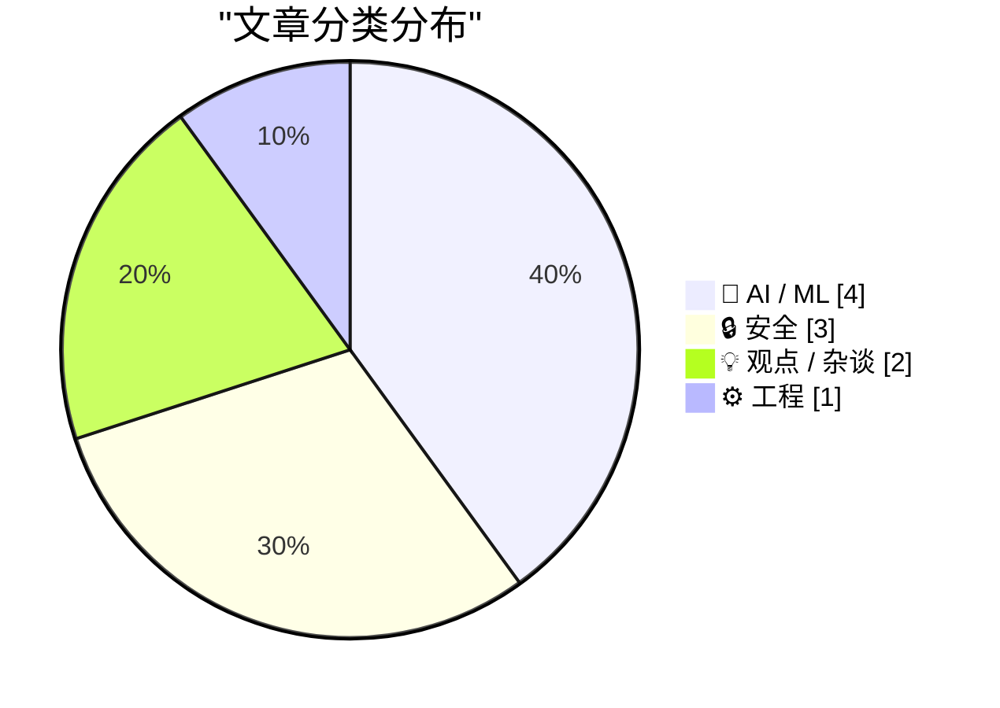
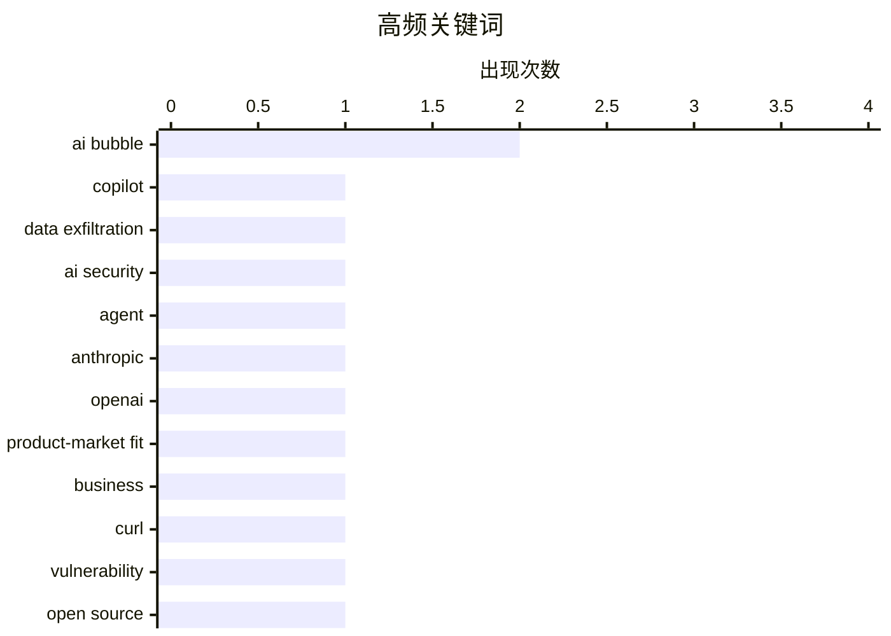

今日技术圈呈现三大热点：一是AI投资回报率引发争议，优步直言未看到AI成本增长对应的生产力提升，与Anthropic、OpenAI实现盈利形成对比，行业提效叙事正遭受质疑；二是AI安全威胁持续升级，curl团队安全报告激增至去年4-5倍，Microsoft Copilot亦曝严重漏洞，全球泄露监测网络继续扩张；三是匿名新秀Hy3强势登顶OpenRouter榜单，以未知身份实现压倒性性能优势，为竞争激烈的模型格局增添悬念。

<!--more-->


> 来自 Karpathy 推荐的 92 个顶级技术博客，AI 精选 Top 10

## 🏆 今日必读

🥇 **Microsoft Copilot Cowork 超范围泄露文件漏洞**

[Microsoft Copilot Cowork Exfiltrates Files](https://simonwillison.net/2026/May/26/copilot-cowork-exfiltrates-files/#atom-everything) — simonwillison.net · 1 天前 · 🔒 安全

> Microsoft Copilot Cowork 存在严重安全漏洞，可被攻击者利用窃取用户文件。攻击原理是代理向用户自身邮箱发送包含外部图片的邮件，当用户打开邮件时，外部网站会发起网络请求从而泄露数据。由于 OneDrive 可生成预认证下载链接，成功的提示注入攻击能让这些下载链接被泄露到外部服务器。

💡 **为什么值得读**: 这是首个针对微软 Copilot Workspace 产品的大规模数据泄露攻击案例，对所有 AI 助手用户都有警示意义。

🏷️ Copilot, data exfiltration, AI security, agent

🥈 **Anthropic 和 OpenAI 已找到产品市场契合点**

[I think Anthropic and OpenAI have found product-market fit](https://simonwillison.net/2026/May/27/product-market-fit/#atom-everything) — simonwillison.net · 5 小时前 · 💡 观点 / 杂谈

> Anthropic 被传即将实现首次盈利季度，企业客户正按 API 价格付费而非尝试降低成本。大量公司惊讶于内部员工使用 LLM 导致的账单费用激增，这反映了两个厂商都已成功实现产品市场契合，并正在加大投入。企业级应用场景的刚性需求支撑了高价位商业模式。

💡 **为什么值得读**: 揭示了 AI 大模型商业化的核心逻辑：企业用户愿为 productivity 支付溢价，而非单纯追求低成本。

🏷️ Anthropic, OpenAI, product-market fit, business

🥉 **curl 项目面临前所未有的安全压力**

[The pressure](https://simonwillison.net/2026/May/26/the-pressure/#atom-everything) — simonwillison.net · 22 小时前 · 🔒 安全

> curl 安全团队收到的安全报告数量达到 2024 年的 4-5 倍，是 2025 年的两倍，平均每天超过一份详细的长篇报告。这是该团队首次面对如此高强度的压力，作者妻子也开始担忧其工作时长和工作生活平衡问题。高质量的 AI 辅助安全发现大量涌现，但处理压力已超出团队极限。

💡 **为什么值得读**: 为所有开源项目维护者敲响警钟：AI 在提升安全发现效率的同时，也带来了指数级增长的响应压力。

🏷️ curl, vulnerability, open source, security

---

## 📊 数据概览

| 扫描源 | 抓取文章 | 时间范围 | 精选 |
|:---:|:---:|:---:|:---:|
| 88/92 | 2563 篇 → 37 篇 | 48h | **10 篇** |

### 分类分布



### 高频关键词



<details>
<summary>📈 纯文本关键词图（终端友好）</summary>

```
ai bubble          │ ████████████████████ 2
copilot            │ ██████████░░░░░░░░░░ 1
data exfiltration  │ ██████████░░░░░░░░░░ 1
ai security        │ ██████████░░░░░░░░░░ 1
agent              │ ██████████░░░░░░░░░░ 1
anthropic          │ ██████████░░░░░░░░░░ 1
openai             │ ██████████░░░░░░░░░░ 1
product-market fit │ ██████████░░░░░░░░░░ 1
business           │ ██████████░░░░░░░░░░ 1
curl               │ ██████████░░░░░░░░░░ 1
```

</details>

### 🏷️ 话题标签

**ai bubble**(2) · **copilot**(1) · **data exfiltration**(1) · ai security(1) · agent(1) · anthropic(1) · openai(1) · product-market fit(1) · business(1) · curl(1) · vulnerability(1) · open source(1) · security(1) · productivity(1) · industry(1) · cost(1) · hy3(1) · llm(1) · openrouter(1) · language model(1)

---

## 🤖 AI / ML

### 1. 优步称未看到与 AI 投入成正比的生产力提升

[If enough other companies report the same, the bubble pops. 🫧](https://garymarcus.substack.com/p/if-enough-other-companies-report) — **garymarcus.substack.com** · 1 天前 · ⭐ 24/30

> 优步首席运营官 Andrew Macdonald 表示，公司并未看到与 AI 成本增长相匹配的生产力收益。这一表态与业界普遍宣称的 AI 提效叙事形成矛盾，引发对 AI 投资回报率的质疑。若更多公司报告类似情况，可能导致 AI 泡沫破裂。

🏷️ AI bubble, productivity, industry, cost

---

### 2. 神秘的 Hy3 LLM 大幅领先 OpenRouter 模型排行榜

[The mysterious Hy3 LLM is topping OpenRouter Model Rankings by a large margin](https://minimaxir.com/2026/05/openrouter-hy3/) — **minimaxir.com** · 1 天前 · ⭐ 23/30

> Hy3 这款匿名 LLM 以显著优势占据 OpenRouter 模型排行榜首位，性能远超其他竞争对手。其身份和架构目前尚未公开，但在多个基准测试中展现出压制性优势，引发行业关注和猜测。

🏷️ Hy3, LLM, OpenRouter, language model

---

### 3. 教皇利奥十四世发布 AI 伦理通谕《Magnifica Humanitas》

[Notes on Pope Leo XIV's encyclical on AI](https://simonwillison.net/2026/May/25/encyclical-on-ai/#atom-everything) — **simonwillison.net** · 1 天前 · ⭐ 21/30

> 梵蒂冈发布教皇利奥十四世的 AI 主题通谕《Magnifica Humanitas》，这是关于 AI 时代保护人类最具前瞻性的官方文件之一。教皇选择「利奥」之名是为致敬发布《劳工问题》通谕的教皇利奥十三世，体现了对数字时代劳工权益的关注。

🏷️ Vatican, AI ethics, papal encyclical

---

### 4. AI 泡沫不同于互联网泡沫

[Pluralistic: The AI bubble isn't like the internet bubble (26 May 2026)](https://pluralistic.net/2026/05/26/the-ai-will-continue/) — **pluralistic.net** · 1 天前 · ⭐ 20/30

> AI 泡沫与互联网泡沫的本质区别在于：互联网是用户主动寻求的工具，而 AI 却常被强制推给员工使用。这种被动采纳模式可能导致更高的失败风险。Lotus Notes 等早期办公软件的兴衰史也说明，全功能套件并非总能成功。

🏷️ AI bubble, internet history, tech economy

---

## 🔒 安全

### 5. Microsoft Copilot Cowork 超范围泄露文件漏洞

[Microsoft Copilot Cowork Exfiltrates Files](https://simonwillison.net/2026/May/26/copilot-cowork-exfiltrates-files/#atom-everything) — **simonwillison.net** · 1 天前 · ⭐ 26/30

> Microsoft Copilot Cowork 存在严重安全漏洞，可被攻击者利用窃取用户文件。攻击原理是代理向用户自身邮箱发送包含外部图片的邮件，当用户打开邮件时，外部网站会发起网络请求从而泄露数据。由于 OneDrive 可生成预认证下载链接，成功的提示注入攻击能让这些下载链接被泄露到外部服务器。

🏷️ Copilot, data exfiltration, AI security, agent

---

### 6. curl 项目面临前所未有的安全压力

[The pressure](https://simonwillison.net/2026/May/26/the-pressure/#atom-everything) — **simonwillison.net** · 22 小时前 · ⭐ 24/30

> curl 安全团队收到的安全报告数量达到 2024 年的 4-5 倍，是 2025 年的两倍，平均每天超过一份详细的长篇报告。这是该团队首次面对如此高强度的压力，作者妻子也开始担忧其工作时长和工作生活平衡问题。高质量的 AI 辅助安全发现大量涌现，但处理压力已超出团队极限。

🏷️ curl, vulnerability, open source, security

---

### 7. 不丹政府加入 Have I Been Pwned

[Welcoming the Bhutanese Government to Have I Been Pwned](https://www.troyhunt.com/welcoming-the-bhutanese-government-to-have-i-been-pwned/) — **troyhunt.com** · 1 天前 · ⭐ 21/30

> 不丹计算机事件响应团队 BtCIRT 成为 HIBP 免费政府服务的第 45 个成员，将可监控不丹政府域名是否出现在数据泄露事件中。这进一步扩大了全球政府数据泄露预警网络的覆盖范围。

🏷️ HIBP, Bhutan, data breach, government

---

## 💡 观点 / 杂谈

### 8. Anthropic 和 OpenAI 已找到产品市场契合点

[I think Anthropic and OpenAI have found product-market fit](https://simonwillison.net/2026/May/27/product-market-fit/#atom-everything) — **simonwillison.net** · 5 小时前 · ⭐ 24/30

> Anthropic 被传即将实现首次盈利季度，企业客户正按 API 价格付费而非尝试降低成本。大量公司惊讶于内部员工使用 LLM 导致的账单费用激增，这反映了两个厂商都已成功实现产品市场契合，并正在加大投入。企业级应用场景的刚性需求支撑了高价位商业模式。

🏷️ Anthropic, OpenAI, product-market fit, business

---

### 9. 使用我的脑子

[Using My Fucking Brain](https://terriblesoftware.org/2026/05/27/using-my-fucking-brain/) — **terriblesoftware.org** · 9 小时前 · ⭐ 21/30

> AI 的真正价值在于延伸人脑能力，而非悄然替代原本需要思考的部分。当 AI 开始代替人做决策而非辅助决策时，危险就产生了——用户会失去独立判断能力和批判性思维的训练机会。

🏷️ AI, cognition, human thinking, technology

---

## ⚙️ 工程

### 10. SQLAlchemy 2 实践指南习题解答

[SQLAlchemy 2 In Practice - Solutions to the Exercises](https://blog.miguelgrinberg.com/post/sqlalchemy-2-in-practice---solutions-to-the-exercises) — **miguelgrinberg.com** · 2 小时前 · ⭐ 23/30

> 本书提供了 SQLAlchemy 2 完整教程系列的全部习题解答，覆盖了 ORM 映射、会话管理、关系配置等核心主题。读者可通过实际练习掌握 SQLAlchemy 2 的最佳实践方式和最新 API 用法。

🏷️ SQLAlchemy, Python, database, tutorial

---

*生成于 2026-05-28 22:18 | 扫描 88 源 → 获取 2563 篇 → 精选 10 篇*
*基于 [Hacker News Popularity Contest 2025](https://refactoringenglish.com/tools/hn-popularity/) RSS 源列表，由 [Andrej Karpathy](https://x.com/karpathy) 推荐*
*由「懂点儿AI」制作，欢迎关注同名微信公众号获取更多 AI 实用技巧 💡*
