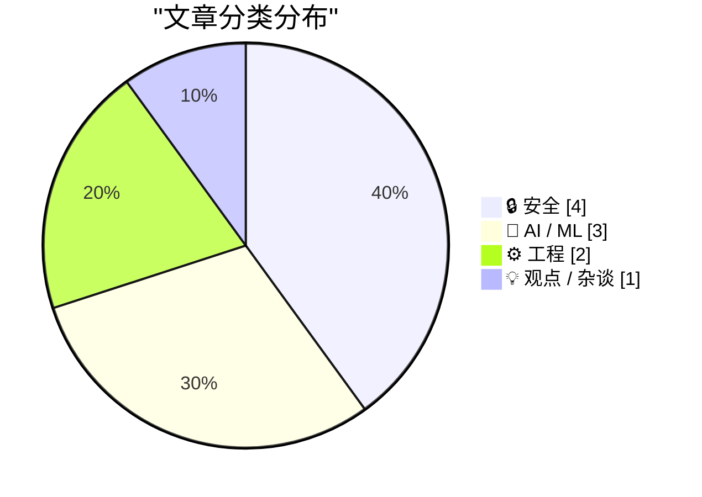
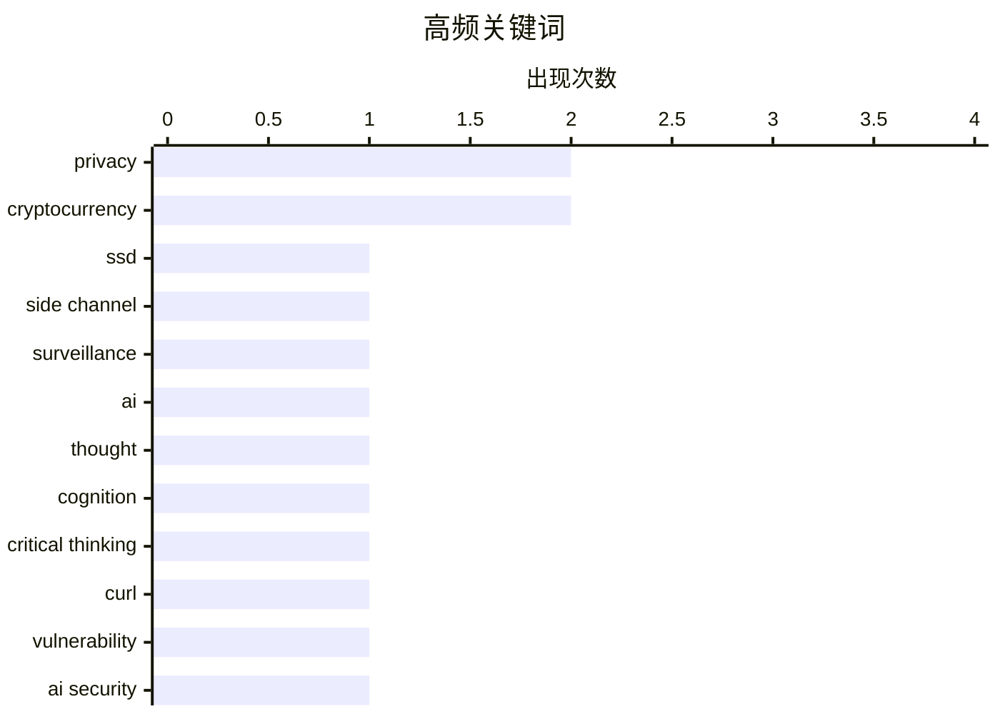

今天的热点集中在安全与AI两大领域。安全方面，新型SSD侧信道攻击暴露了硬件底层的新攻击面，同时curl项目正面临史上最大规模的安全报告潮。在AI方向，Anthropic和OpenAI已验证PMF并进入企业级付费市场，但业界也开始反思AI替代人类决策的边界以及AI投资的真实ROI问题。工程实践层面，SQLAlchemy 2与Windows异步编程等技术深化的同时，开发者社区正探索更细粒度的安全沙箱方案。

<!--more-->


> 来自 Karpathy 推荐的 92 个顶级技术博客，AI 精选 Top 10

## 🏆 今日必读

🥇 **研究人员发现新侧信道攻击：可通过SSD活动分析监视网页访客**

[Researchers Publish Method to Surveil Web Page Visitors by Analyzing Their SSD Activity](https://arstechnica.com/security/2026/05/websites-have-a-new-way-to-spy-on-visitors-analyzing-their-ssd-activity/) — daringfireball.net · 8 小时前 · 🔒 安全

> 安全研究人员提出一种新型网页访客监视技术，通过分析用户SSD的物理活动（如电磁辐射、数据缓存、访问时间）来推断访问的网站和敏感数据。不同于传统侧信道攻击，该方法利用现代浏览器内置的复杂功能——包括完整办公套件、照片视频编辑器乃至IDE——扩大了攻击面。攻击者无需入侵目标网站，仅通过测量SSD的响应特征即可解密加密流量或推断浏览历史。研究人员指出，这一发现揭示了端到端加密在面对物理侧信道时的局限性。

💡 **为什么值得读**: 这是首个公开的SSD侧信道监视技术研究，对所有使用固态硬盘的网民都有隐私威胁，适合安全从业者和普通用户了解最新攻击手段。

🏷️ SSD, privacy, side channel, surveillance

🥈 **使用我的大脑**

[Using My Fucking Brain](https://terriblesoftware.org/2026/05/27/using-my-fucking-brain/) — terriblesoftware.org · 1 天前 · 🤖 AI / ML

> AI作为人类脑力的延伸非常有价值，但当它悄悄取代本应保留给人类思考的功能时，就会变得危险。作者认为问题的关键在于边界的模糊——AI可以帮助思考，但不应替代思考的主动性。这篇博客引发了关于AI如何影响人类认知能力的反思。对任何依赖AI进行日常决策的人都有警示意义。

💡 **为什么值得读**: 简洁有力地提出了AI时代每个人都需要思考的核心问题：我们是否正在丧失独立思考的能力？

🏷️ AI, thought, cognition, critical thinking

🥉 **压力之下：curl项目面临的安全报告海啸**

[The pressure](https://simonwillison.net/2026/May/26/the-pressure/#atom-everything) — simonwillison.net · 1 天前 · 🔒 安全

> curl项目团队正经历前所未有的安全压力，安全报告数量是2024年的4-5倍，是2025年的两倍，目前平均每天收到超过一份详细的安全报告。报告质量空前提高，通常非常详尽和冗长。维护者Daniel Stenberg的妻子首次对 他的工作量和工作生活平衡表示担忧。这是curl项目中主要从事脑力工作的安全团队成员从未经历过的高优先级工作洪流。

💡 **为什么值得读**: 让开源维护者和贡献者了解真实的安全压力困境，也提醒社区如何更好地支持开源项目。

🏷️ curl, vulnerability, AI security

---

## 📊 数据概览

| 扫描源 | 抓取文章 | 时间范围 | 精选 |
|:---:|:---:|:---:|:---:|
| 87/92 | 2535 篇 → 32 篇 | 48h | **10 篇** |

### 分类分布



### 高频关键词



<details>
<summary>📈 纯文本关键词图（终端友好）</summary>

```
privacy           │ ████████████████████ 2
cryptocurrency    │ ████████████████████ 2
ssd               │ ██████████░░░░░░░░░░ 1
side channel      │ ██████████░░░░░░░░░░ 1
surveillance      │ ██████████░░░░░░░░░░ 1
ai                │ ██████████░░░░░░░░░░ 1
thought           │ ██████████░░░░░░░░░░ 1
cognition         │ ██████████░░░░░░░░░░ 1
critical thinking │ ██████████░░░░░░░░░░ 1
curl              │ ██████████░░░░░░░░░░ 1
```

</details>

### 🏷️ 话题标签

**privacy**(2) · **cryptocurrency**(2) · **ssd**(1) · side channel(1) · surveillance(1) · ai(1) · thought(1) · cognition(1) · critical thinking(1) · curl(1) · vulnerability(1) · ai security(1) · kl divergence(1) · statistics(1) · mathematics(1) · machine learning(1) · python(1) · sqlalchemy(1) · database(1) · orm(1)

---

## 🔒 安全

### 1. 研究人员发现新侧信道攻击：可通过SSD活动分析监视网页访客

[Researchers Publish Method to Surveil Web Page Visitors by Analyzing Their SSD Activity](https://arstechnica.com/security/2026/05/websites-have-a-new-way-to-spy-on-visitors-analyzing-their-ssd-activity/) — **daringfireball.net** · 8 小时前 · ⭐ 26/30

> 安全研究人员提出一种新型网页访客监视技术，通过分析用户SSD的物理活动（如电磁辐射、数据缓存、访问时间）来推断访问的网站和敏感数据。不同于传统侧信道攻击，该方法利用现代浏览器内置的复杂功能——包括完整办公套件、照片视频编辑器乃至IDE——扩大了攻击面。攻击者无需入侵目标网站，仅通过测量SSD的响应特征即可解密加密流量或推断浏览历史。研究人员指出，这一发现揭示了端到端加密在面对物理侧信道时的局限性。

🏷️ SSD, privacy, side channel, surveillance

---

### 2. 压力之下：curl项目面临的安全报告海啸

[The pressure](https://simonwillison.net/2026/May/26/the-pressure/#atom-everything) — **simonwillison.net** · 1 天前 · ⭐ 24/30

> curl项目团队正经历前所未有的安全压力，安全报告数量是2024年的4-5倍，是2025年的两倍，目前平均每天收到超过一份详细的安全报告。报告质量空前提高，通常非常详尽和冗长。维护者Daniel Stenberg的妻子首次对 他的工作量和工作生活平衡表示担忧。这是curl项目中主要从事脑力工作的安全团队成员从未经历过的高优先级工作洪流。

🏷️ curl, vulnerability, AI security

---

### 3. 沙箱中的疯狂舞步

[Dancing mad with sandboxing](https://xeiaso.net/blog/2026/dancing-mad-sandboxing/) — **xeiaso.net** · 22 小时前 · ⭐ 23/30

> Kefka是一个Go原生shell沙箱，包含coreutils、通过WebAssembly运行的Python等组件。文章详细介绍了开发这座「疯狂之作」的过程和设计考量。

🏷️ sandbox, Go, WebAssembly, shell

---

### 4. 多元主义：死死抓住（2026年5月28日）

[Pluralistic: Hold on for dear life (28 May 2026)](https://pluralistic.net/2026/05/28/we-live-in-a-society/) — **pluralistic.net** · 10 小时前 · ⭐ 22/30

> 涵盖多个科技话题的综合博客：密钥管理的重要性、Object Permanence与Web 2.0所有权、EFF拯救博主来源、非色情内容的灰色地带、加拿大保守党称市场而非政府将帮助洪灾受害者、以及Oracle在Java API案中败诉等多则新闻。

🏷️ cryptocurrency, key management, wallet, privacy

---

## 🤖 AI / ML

### 5. 使用我的大脑

[Using My Fucking Brain](https://terriblesoftware.org/2026/05/27/using-my-fucking-brain/) — **terriblesoftware.org** · 1 天前 · ⭐ 26/30

> AI作为人类脑力的延伸非常有价值，但当它悄悄取代本应保留给人类思考的功能时，就会变得危险。作者认为问题的关键在于边界的模糊——AI可以帮助思考，但不应替代思考的主动性。这篇博客引发了关于AI如何影响人类认知能力的反思。对任何依赖AI进行日常决策的人都有警示意义。

🏷️ AI, thought, cognition, critical thinking

---

### 6. 将K-L散度转化为度量

[Turning K-L divergence into a metric](https://www.johndcook.com/blog/2026/05/27/jensen-shannon/) — **johndcook.com** · 20 小时前 · ⭐ 24/30

> Kullback-Leibler（K-L）散度定义为两个随机变量X和Y之间的差异，非负且仅在X和Y同分布时为零。但它不是度量，因为不满足对称性。文章介绍了Jeffreys散度通过取KL(X,Y)和KL(Y,X)的平均值来解决对称性问题。进一步引入了Jensen-Shannon散度，作为另一种对称的散度衡量方式。每种方法都有其适用场景和数学特性。

🏷️ KL divergence, statistics, mathematics, machine learning

---

### 7. 我认为Anthropic和OpenAI已找到产品市场契合

[I think Anthropic and OpenAI have found product-market fit](https://simonwillison.net/2026/May/27/product-market-fit/#atom-everything) — **simonwillison.net** · 1 天前 · ⭐ 23/30

> Anthropic据传即将实现首个盈利季度，多家公司惊讶于LLM账单的昂贵程度。OpenAI和Anthropic都已找到产品市场契合，企业客户现在开始按API价格付费。两家公司都在加大投入。这一现象表明大型语言模型已经真正进入企业应用市场，AI付费模式得到验证。

🏷️ Anthropic, product-market fit, OpenAI

---

## ⚙️ 工程

### 8. SQLAlchemy 2实践 - 练习解答

[SQLAlchemy 2 In Practice - Solutions to the Exercises](https://blog.miguelgrinberg.com/post/sqlalchemy-2-in-practice---solutions-to-the-exercises) — **miguelgrinberg.com** · 1 天前 · ⭐ 24/30

> Miguel Grinberg的SQLAlchemy 2实践系列文章的练习解答。读者可以在他的商店或Amazon购买完整书籍获取详细内容。该系列面向想要掌握SQLAlchemy 2的Python开发者，提供系统的实践指导和练习。

🏷️ Python, SQLAlchemy, database, ORM

---

### 9. 在多个协程间共享单个Windows Runtime IAsyncOperation的结果（第一部分）

[Sharing the result of a single Windows Runtime IAsyncOperation among multiple coroutines, part 1](https://devblogs.microsoft.com/oldnewthing/20260527-00/?p=112361) — **devblogs.microsoft.com/oldnewthing** · 1 天前 · ⭐ 21/30

> 解释如何在多个协程间缓存和共享单个Windows Runtime IAsyncOperation操作的结果，包括缓存有效性的判断和处理。这是Windows异步编程系列的第一部分。

🏷️ Windows Runtime, async, caching, coroutine

---

## 💡 观点 / 杂谈

### 10. 三大IPO的坏消息

[Breaking: bad news for three of the biggest IPOs in history](https://garymarcus.substack.com/p/breaking-bad-news-for-three-of-the) — **garymarcus.substack.com** · 2 小时前 · ⭐ 22/30

> Gary Marcus报道三家最大的AI相关公司正面临困境，客户终于意识到数百万美元的费用没有带来真正的显著投资回报。消费者和企业开始认识到AI投资的ROI问题，这可能是AI行业的转折点。

🏷️ IPO, cryptocurrency, token, market

---

*生成于 2026-05-29 22:18 | 扫描 87 源 → 获取 2535 篇 → 精选 10 篇*
*基于 [Hacker News Popularity Contest 2025](https://refactoringenglish.com/tools/hn-popularity/) RSS 源列表，由 [Andrej Karpathy](https://x.com/karpathy) 推荐*
*由「懂点儿AI」制作，欢迎关注同名微信公众号获取更多 AI 实用技巧 💡*
