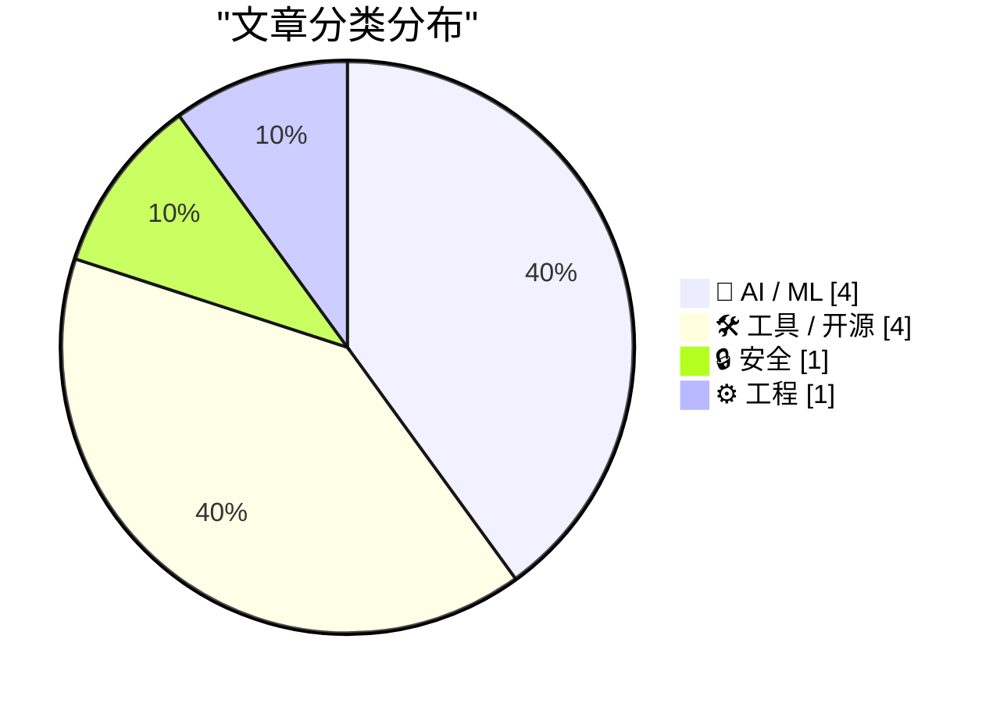
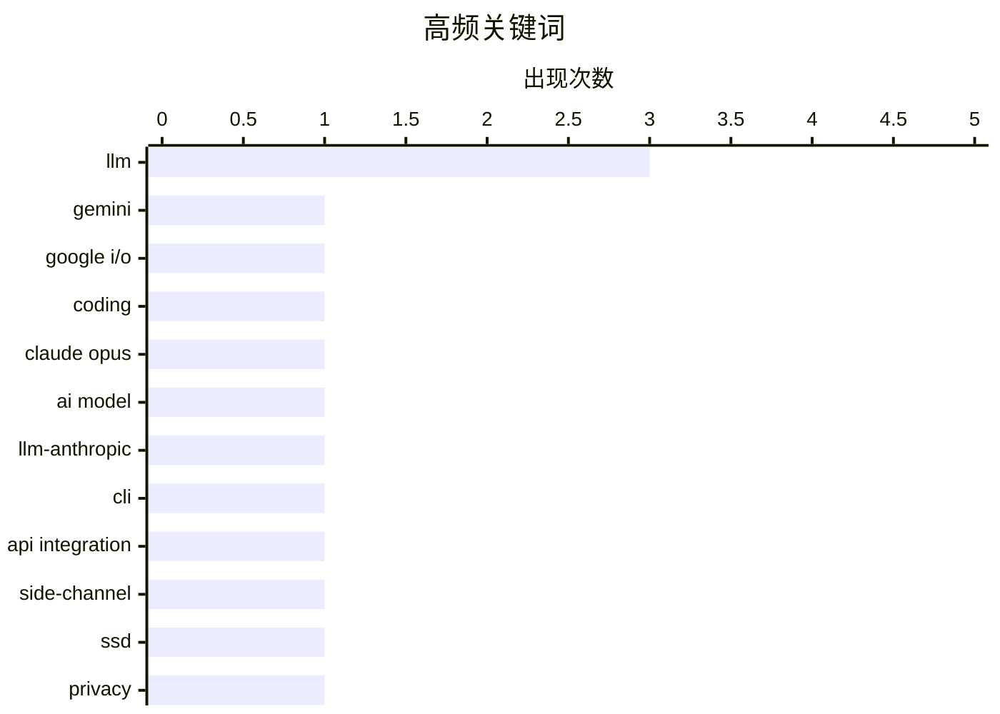

今日技术圈呈现两大显著趋势：一是AI大模型竞争加剧，谷歌Gemini因编程能力短板面临质疑，而Anthropic则凭借Claude 4.8“诚实度”训练和收入爆发式增长（年化470亿美元）强势崛起，两者形成鲜明对比；二是AI安全与信任问题备受关注，从模型幻觉治理到SSD侧信道攻击新研究，安全攻防正在向新的维度扩展。与此同时，开发者工具生态持续进化，SQLite引入AGENTS.md引导AI代理协作，Datasette等开源工具相继释放新能力，开源社区正加速适配AI时代的新型工作流程。

<!--more-->


> 来自 Karpathy 推荐的 92 个顶级技术博客，AI 精选 Top 10

## 🏆 今日必读

🥇 **Gemini 到底怎么了？**

[What's going on with Gemini?](https://martinalderson.com/posts/whats-going-on-with-gemini/?utm_source=rss&amp;utm_medium=rss&amp;utm_campaign=feed) — martinalderson.com · 22 小时前 · 🤖 AI / ML

> 谷歌在 I/O 大会上发布的 Gemini 3.5 Flash 是焦点模型，主打快速响应但成本高昂且编程能力中等。该模型更适合作为谷歌内部自用的模型，原因在于其 TPU 架构优势能为谷歌提供服务，而对于外部用户而言性价比欠佳。真正的核心问题在于谷歌在编程代理（coding agents）领域存在明显短板，这才是其需要真正解决的问题。

💡 **为什么值得读**: 如果你关注 AI 模型选型，这篇文章提供了难得的内部视角，揭示了 Gemini 对内对外成本效益差异的根本原因。

🏷️ Gemini, Google I/O, LLM, coding

🥈 **Claude Opus 4.8：一次温和但实在的改进**

[Claude Opus 4.8: "a modest but tangible improvement"](https://simonwillison.net/2026/May/28/claude-opus-4-8/#atom-everything) — simonwillison.net · 22 小时前 · 🤖 AI / ML

> Anthropic 发布了 Claude Opus 4.8，官方坦诚地将其定位为相比前代的温和增量改进。最显著的改进体现在「诚实度」训练——模型被训练为避免做出无法支撑的声称，拒绝在没有证据的情况下自信地下结论。这一改进回应了 AI 领域中普遍存在的「幻觉」问题，即模型过度自信地给出错误答案。

💡 **为什么值得读**: 对于关心 AI 可信度和安全性的读者，这篇文章揭示了一个关键方向：模型的能力提升固然重要，但学会「知道自己不知道」才是当前最核心的挑战。

🏷️ Claude Opus, LLM, AI model

🥉 **llm-anthropic 0.25.1 发布**

[llm-anthropic 0.25.1](https://simonwillison.net/2026/May/28/llm-anthropic/#atom-everything) — simonwillison.net · 22 小时前 · 🛠 工具 / 开源

> llm-anthropic 插件推出 0.25.1 版本，新增支持 Claude Opus 4.8 模型。新增 `-o fast 1` 选项以支持启用快速模式的组织用户。此外，默认 max_tokens 参数现在默认为各模型的最大输出上限，而非固定的 8,192。该版本由 Simon Willison 发布，用于生成 pelicans 项目。

💡 **为什么值得读**: 这是面向开发者的小版本更新通知，包含实用参数调整，适合正在使用该工具的用户参考。

🏷️ llm-anthropic, CLI, API integration

---

## 📊 数据概览

| 扫描源 | 抓取文章 | 时间范围 | 精选 |
|:---:|:---:|:---:|:---:|
| 88/92 | 2565 篇 → 33 篇 | 48h | **10 篇** |

### 分类分布



### 高频关键词



<details>
<summary>📈 纯文本关键词图（终端友好）</summary>

```
llm             │ ████████████████████ 3
gemini          │ ███████░░░░░░░░░░░░░ 1
google i/o      │ ███████░░░░░░░░░░░░░ 1
coding          │ ███████░░░░░░░░░░░░░ 1
claude opus     │ ███████░░░░░░░░░░░░░ 1
ai model        │ ███████░░░░░░░░░░░░░ 1
llm-anthropic   │ ███████░░░░░░░░░░░░░ 1
cli             │ ███████░░░░░░░░░░░░░ 1
api integration │ ███████░░░░░░░░░░░░░ 1
side-channel    │ ███████░░░░░░░░░░░░░ 1
```

</details>

### 🏷️ 话题标签

**llm**(3) · **gemini**(1) · **google i/o**(1) · coding(1) · claude opus(1) · ai model(1) · llm-anthropic(1) · cli(1) · api integration(1) · side-channel(1) · ssd(1) · privacy(1) · surveillance(1) · datasette(1) · python(1) · data visualization(1) · ai future(1) · tokenmaxxing(1) · predictions(1) · anthropic(1)

---

## 🤖 AI / ML

### 1. Gemini 到底怎么了？

[What's going on with Gemini?](https://martinalderson.com/posts/whats-going-on-with-gemini/?utm_source=rss&amp;utm_medium=rss&amp;utm_campaign=feed) — **martinalderson.com** · 22 小时前 · ⭐ 25/30

> 谷歌在 I/O 大会上发布的 Gemini 3.5 Flash 是焦点模型，主打快速响应但成本高昂且编程能力中等。该模型更适合作为谷歌内部自用的模型，原因在于其 TPU 架构优势能为谷歌提供服务，而对于外部用户而言性价比欠佳。真正的核心问题在于谷歌在编程代理（coding agents）领域存在明显短板，这才是其需要真正解决的问题。

🏷️ Gemini, Google I/O, LLM, coding

---

### 2. Claude Opus 4.8：一次温和但实在的改进

[Claude Opus 4.8: "a modest but tangible improvement"](https://simonwillison.net/2026/May/28/claude-opus-4-8/#atom-everything) — **simonwillison.net** · 22 小时前 · ⭐ 24/30

> Anthropic 发布了 Claude Opus 4.8，官方坦诚地将其定位为相比前代的温和增量改进。最显著的改进体现在「诚实度」训练——模型被训练为避免做出无法支撑的声称，拒绝在没有证据的情况下自信地下结论。这一改进回应了 AI 领域中普遍存在的「幻觉」问题，即模型过度自信地给出错误答案。

🏷️ Claude Opus, LLM, AI model

---

### 3. tokenmaxxing 衰落之后会怎样？

[What happens next, after the decline of tokenmaxxing?](https://garymarcus.substack.com/p/what-happens-next-after-the-decline) — **garymarcus.substack.com** · 4 小时前 · ⭐ 22/30

> 文章探讨了 tokenmaxxing（Token 数量最大化策略）衰退之后的两种截然不同的未来预测。作者 Gary Marcus 提出了两套预测方案，但内容中未展开详述具体内容。该文章是订阅形式，作者计划进一步阐述。

🏷️ LLM, AI future, tokenmaxxing, predictions

---

### 4. Anthropic 年度经常性收入达 470 亿美元

[Anthropic's run-rate revenue hits $47 billion](https://simonwillison.net/2026/May/29/anthropic/#atom-everything) — **simonwillison.net** · 20 小时前 · ⭐ 21/30

> Anthropic 在 650 亿美元的 H 轮融资公告中披露，其年度经常性收入（run-rate revenue）已于本月突破 470 亿美元。这是通过将最近一个月收入乘以 12 计算得出的年化预测值。收入增长迅速：2025 年底约 90 亿，2026 年 4 月增至 300 亿，如今已达 470 亿，反映了企业采纳的爆发式增长。

🏷️ Anthropic, Claude, funding, revenue

---

## 🛠 工具 / 开源

### 5. llm-anthropic 0.25.1 发布

[llm-anthropic 0.25.1](https://simonwillison.net/2026/May/28/llm-anthropic/#atom-everything) — **simonwillison.net** · 22 小时前 · ⭐ 24/30

> llm-anthropic 插件推出 0.25.1 版本，新增支持 Claude Opus 4.8 模型。新增 `-o fast 1` 选项以支持启用快速模式的组织用户。此外，默认 max_tokens 参数现在默认为各模型的最大输出上限，而非固定的 8,192。该版本由 Simon Willison 发布，用于生成 pelicans 项目。

🏷️ llm-anthropic, CLI, API integration

---

### 6. Datasette 1.0a31：支持 SQL 写入查询和存储查询

[datasette 1.0a31](https://simonwillison.net/2026/May/29/datasette/#atom-everything) — **simonwillison.net** · 18 小时前 · ⭐ 23/30

> 开源工具 Datasette 发布 1.0a31 alpha 版本，带来两个主要新功能：具有权限的用户可以执行写操作 SQL 查询，并可将查询保存为「存储查询」。存储查询支持设为私有或供其他用户共享使用。该版本是 Datasette 近期博客发布的三项新功能之一，博客上线两周来已发布多篇功能介绍文章。

🏷️ Datasette, Python, data visualization

---

### 7. 与沙盒共舞

[Dancing mad with sandboxing](https://xeiaso.net/blog/2026/dancing-mad-sandboxing/) — **xeiaso.net** · 1 天前 · ⭐ 21/30

> 文章详细介绍了一款名为 Kefka 的 Go 语言原生 Shell 沙盒工具，集成了 coreutils、Python Wasm 运行时间等组件。作者分享了在实现这套系统过程中遇到的种种技术挑战和「疯狂」的解决方案。具体内容包括如何将 Python 通过 WebAssembly 集成到 Go 原生环境中，以及相关的安全机制设计。

🏷️ sandboxing, Go, shell, WebAssembly

---

### 8. 包管理器的包管理器

[Package managers that package package managers](https://nesbitt.io/2026/05/28/package-managers-that-package-package-managers.html) — **nesbitt.io** · 1 天前 · ⭐ 20/30

> 文章列举了多种包管理器的安装命令：brew install、spack install、conda install、cargo install、uv tool install、pip install、poetry add、pdm add、conan。这些命令分别对应不同语言和场景下的包管理工具，形成了一个有趣的递进关系——从系统级包管理直到特定语言的依赖管理。

🏷️ package manager, development tools, dependency management

---

## 🔒 安全

### 9. 研究称可通过 SSD 活动分析监控网页访客

[Researchers Publish Method to Surveil Web Page Visitors by Analyzing Their SSD Activity](https://arstechnica.com/security/2026/05/websites-have-a-new-way-to-spy-on-visitors-analyzing-their-ssd-activity/) — **daringfireball.net** · 1 天前 · ⭐ 24/30

> 研究人员发表论文披露了一种利用固态硬盘（SSD）活动监控网页访客的新技术。该攻击利用 side channel 旁路攻击，通过测量物理特性如电磁辐射、数据缓存和任务执行时间来解密加密流量并推断敏感数据。随着浏览器功能日益复杂（在线 IDE、办公套件等），攻击面显著扩大。这类 SSD 侧信道攻击此前未被充分关注。

🏷️ side-channel, SSD, privacy, surveillance

---

## ⚙️ 工程

### 10. SQLite 引入 AGENTS.md 文件

[sqlite AGENTS.md](https://simonwillison.net/2026/May/27/sqlite-agents/#atom-everything) — **simonwillison.net** · 1 天前 · ⭐ 19/30

> SQLite 代码库五天前新增了 AGENTS.md 文件，但该文件并非为自身开发准备，而是为指向 SQLite 代码库的 AI 代理提供指导。文件明确指出：SQLite 不接受未经事先协议和法律文件备案的 PR，代理代码也不被接受，但欢迎附带可重现测试用例的代理 bug 报告。文档型的补丁演示欢迎用于参考目的，人工开发者会审核概念证明后再自行重实现。

🏷️ SQLite, agents, open source

---

*生成于 2026-05-30 22:18 | 扫描 88 源 → 获取 2565 篇 → 精选 10 篇*
*基于 [Hacker News Popularity Contest 2025](https://refactoringenglish.com/tools/hn-popularity/) RSS 源列表，由 [Andrej Karpathy](https://x.com/karpathy) 推荐*
*由「懂点儿AI」制作，欢迎关注同名微信公众号获取更多 AI 实用技巧 💡*
