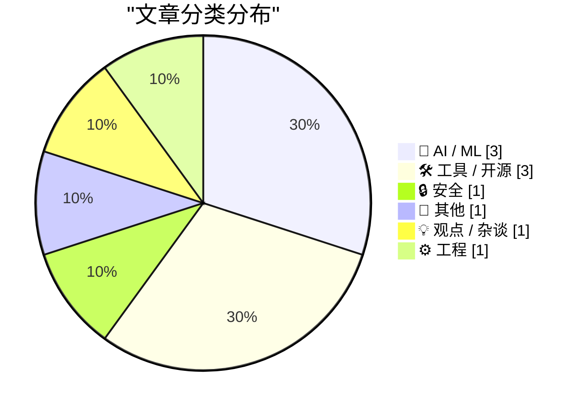
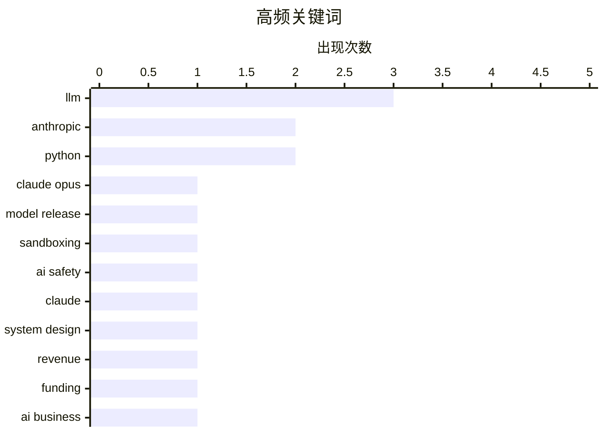

今日看点：Anthropic近期成为焦点，不仅旗下Claude模型更新至4.8版本强调“诚实性”以减少夸大其词，还公布了三层沙箱安全架构，并在最新一轮65亿美元融资中披露年化收入已突破470亿美元，数月间增长超5倍。与此同时，业界对大模型过度追求token消耗的反思增多，Gary Marcus等人开始探讨“tokenmaxxing”范式衰退后的可能走向，而Google Gemini系列则因定位模糊遭受质疑，行业分化趋势明显。开发者工具侧，Datasette和Pyodide等项目的更新继续推动Web端工程能力的边界拓展。

<!--more-->


> 来自 Karpathy 推荐的 92 个顶级技术博客，AI 精选 Top 10

## 🏆 今日必读

🥇 **Claude Opus 4.8：一次不大但切实的改进**

[Claude Opus 4.8: "a modest but tangible improvement"](https://simonwillison.net/2026/May/28/claude-opus-4-8/#atom-everything) — simonwillison.net · 1 天前 · 🤖 AI / ML

> Anthropic发布了Claude Opus 4.8，官方坦率地将其描述为相比前代模型的"一次不大但切实的改进"。该版本的核心改进之一是「诚实性」，训练模型避免做出无法支撑的 Claims，避免过早下结论。Anthropic同时表示正在开发与Opus能力相近但成本更低的模型。这篇文章赞扬了AI实验室诚实披露产品局限性的做法。

💡 **为什么值得读**: 如果你关心AI模型的能力边界和AI公司的诚信表达，这篇短文提供了有价值的视角——看领先实验室如何平衡吹嘘与诚实。

🏷️ Claude Opus, LLM, model release, Anthropic

🥈 **Anthropic如何在各产品中隔离Claude**

[How we contain Claude across products](https://simonwillison.net/2026/May/30/how-we-contain-claude/#atom-everything) — simonwillison.net · 41 分钟前 · 🔒 安全

> Anthropic详细公布了其多层次沙箱技术架构，用于在不同产品（Claude.ai、Claude Code、Claude Cowork）中约束AI代理的行为。该架构结合进程沙箱、虚拟机、文件系统边界和出口控制四种技术手段。其核心原则是确保凭据永不进入沙箱，从而无法被泄露。Claude.ai使用gVisor，macOS本地运行的Claude Code使用Seatbelt，Linux上使用Bubblewrap。

💡 **为什么值得读**: 对AI安全架构感兴趣的技术人员能从中学到实际的产品级隔离方案，了解如何从系统设计层面防止数据泄露。

🏷️ sandboxing, AI safety, Claude, system design

🥉 **Anthropic年化收入突破470亿美元**

[Anthropic's run-rate revenue hits $47 billion](https://simonwillison.net/2026/May/29/anthropic/#atom-everything) — simonwillison.net · 1 天前 · 📝 其他

> Anthropic在65亿美元H轮融资公告中披露，其年化收入已突破470亿美元，较今年2月进一步大幅增长。回溯其收入增长轨迹：2025年底约90亿美元→2026年4月初突破300亿美元→2026年5月达470亿美元。数月内增长超过5倍。Anthropic通过年度收入乘以12的方式计算「run-rate revenue」。

💡 **为什么值得读**: 要快速了解Anthropic商业增长现状和AI基础模型公司的市场规模演变，这组最新财务数据极具参考价值。

🏷️ Anthropic, revenue, funding, AI business

---

## 📊 数据概览

| 扫描源 | 抓取文章 | 时间范围 | 精选 |
|:---:|:---:|:---:|:---:|
| 88/92 | 2565 篇 → 32 篇 | 48h | **10 篇** |

### 分类分布



### 高频关键词



<details>
<summary>📈 纯文本关键词图（终端友好）</summary>

```
llm           │ ████████████████████ 3
anthropic     │ █████████████░░░░░░░ 2
python        │ █████████████░░░░░░░ 2
claude opus   │ ███████░░░░░░░░░░░░░ 1
model release │ ███████░░░░░░░░░░░░░ 1
sandboxing    │ ███████░░░░░░░░░░░░░ 1
ai safety     │ ███████░░░░░░░░░░░░░ 1
claude        │ ███████░░░░░░░░░░░░░ 1
system design │ ███████░░░░░░░░░░░░░ 1
revenue       │ ███████░░░░░░░░░░░░░ 1
```

</details>

### 🏷️ 话题标签

**llm**(3) · **anthropic**(2) · **python**(2) · claude opus(1) · model release(1) · sandboxing(1) · ai safety(1) · claude(1) · system design(1) · revenue(1) · funding(1) · ai business(1) · llm-anthropic(1) · library(1) · api integration(1) · gemini(1) · google ai(1) · coding(1) · ai(1) · bubble(1)

---

## 🤖 AI / ML

### 1. Claude Opus 4.8：一次不大但切实的改进

[Claude Opus 4.8: "a modest but tangible improvement"](https://simonwillison.net/2026/May/28/claude-opus-4-8/#atom-everything) — **simonwillison.net** · 1 天前 · ⭐ 26/30

> Anthropic发布了Claude Opus 4.8，官方坦率地将其描述为相比前代模型的"一次不大但切实的改进"。该版本的核心改进之一是「诚实性」，训练模型避免做出无法支撑的 Claims，避免过早下结论。Anthropic同时表示正在开发与Opus能力相近但成本更低的模型。这篇文章赞扬了AI实验室诚实披露产品局限性的做法。

🏷️ Claude Opus, LLM, model release, Anthropic

---

### 2. Gemini怎么了？

[What's going on with Gemini?](https://martinalderson.com/posts/whats-going-on-with-gemini/?utm_source=rss&amp;utm_medium=rss&amp;utm_campaign=feed) — **martinalderson.com** · 1 天前 · ⭐ 24/30

> Google在I/O大会上发布的Gemini 3.5 Flash速度快但成本高，且编程能力平庸。更合理的解读是，这是Google为自家服务（TPU优势）量身打造的模型，而非面向外部开发者的通用编程助手。Google在编码代理方面的真正弱点在于其整体产品策略，而非单一模型性能。

🏷️ Gemini, Google AI, LLM, coding

---

### 3. tokenmaxxing衰退之后会发生什么？

[What happens next, after the decline of tokenmaxxing?](https://garymarcus.substack.com/p/what-happens-next-after-the-decline) — **garymarcus.substack.com** · 1 天前 · ⭐ 22/30

> Gary Marcus探讨了在tokenmaxxing（最大化token消耗）范式衰退之后，AI领域可能出现的变化和发展方向，呈现了两套不同的预测。作者是AI领域的知名评论者，曾多次对大语言模型的发展提出质疑性观点。

🏷️ LLM, AI prediction, tokenmaxxing

---

## 🛠 工具 / 开源

### 4. llm-anthropic 0.25.1 版本发布

[llm-anthropic 0.25.1](https://simonwillison.net/2026/May/28/llm-anthropic/#atom-everything) — **simonwillison.net** · 1 天前 · ⭐ 24/30

> llm-anthropic插件发布0.25.1版本，新增支持Claude Opus 4.8模型（claude-opus-4.8）。新增-o fast 1选项，支持启用了fast模式的组织使用快速模式。每个模型的默认max_tokens现调整为该模型的最大输出token数，而非固定的8192。

🏷️ llm-anthropic, Python, library, API integration

---

### 5. 通过Pyodide和服务工作者在浏览器中运行Python ASGI应用

[Running Python ASGI apps in the browser via Pyodide + a service worker](https://simonwillison.net/2026/May/30/pyodide-asgi-browser/#atom-everything) — **simonwillison.net** · 1 小时前 · ⭐ 22/30

> 作者研究在浏览器中使用Pyodide（WebAssembly）和服务工作者替代Web Workers来运行Python ASGI应用。此前方案使用Web Workers拦截导航获取HTML，但无法执行<script>标签中的JavaScript，导致部分功能失效。新方案利用服务工作者的请求拦截能力，解决了这一兼容性难题，使Datasette Lite能完整运行所有功能。

🏷️ Pyodide, ASGI, browser, Python

---

### 6. datasette 1.0a31 发布

[datasette 1.0a31](https://simonwillison.net/2026/May/29/datasette/#atom-everything) — **simonwillison.net** · 1 天前 · ⭐ 22/30

> datasette 1.0a31是另一个重要的alpha版本更新，带来两大新功能：有权限的用户可执行SQL写操作查询，以及可保存存储查询（由「canned queries」重命名）供私人使用或其他成员共用。Datasette博客两周前上线以来已发布三篇功能介绍文章。

🏷️ datasette, SQLite, open source, data tools

---

## 🔒 安全

### 7. Anthropic如何在各产品中隔离Claude

[How we contain Claude across products](https://simonwillison.net/2026/May/30/how-we-contain-claude/#atom-everything) — **simonwillison.net** · 41 分钟前 · ⭐ 24/30

> Anthropic详细公布了其多层次沙箱技术架构，用于在不同产品（Claude.ai、Claude Code、Claude Cowork）中约束AI代理的行为。该架构结合进程沙箱、虚拟机、文件系统边界和出口控制四种技术手段。其核心原则是确保凭据永不进入沙箱，从而无法被泄露。Claude.ai使用gVisor，macOS本地运行的Claude Code使用Seatbelt，Linux上使用Bubblewrap。

🏷️ sandboxing, AI safety, Claude, system design

---

## 📝 其他

### 8. Anthropic年化收入突破470亿美元

[Anthropic's run-rate revenue hits $47 billion](https://simonwillison.net/2026/May/29/anthropic/#atom-everything) — **simonwillison.net** · 1 天前 · ⭐ 24/30

> Anthropic在65亿美元H轮融资公告中披露，其年化收入已突破470亿美元，较今年2月进一步大幅增长。回溯其收入增长轨迹：2025年底约90亿美元→2026年4月初突破300亿美元→2026年5月达470亿美元。数月内增长超过5倍。Anthropic通过年度收入乘以12的方式计算「run-rate revenue」。

🏷️ Anthropic, revenue, funding, AI business

---

## 💡 观点 / 杂谈

### 9. 假如我们正身处AI泡沫？（第三部分）Premium

[Premium: What If...We're In An AI Bubble? (Part 3)](https://www.wheresyoured.at/premium-what-if-were-in-an-ai-bubble-part-3/) — **wheresyoured.at** · 1 天前 · ⭐ 23/30

> 这是关于AI泡沫系列的第三部分Premium文章，需要付费订阅才能阅读完整内容。由于无法访问正文，此处仅记录标题信息。

🏷️ AI, bubble, investment, industry

---

## ⚙️ 工程

### 10. Intel 8087浮点芯片内部微代码：寄存器交换

[Microcode inside the Intel 8087 floating-point chip: register exchange](http://www.righto.com/feeds/5917097192784199241/comments/default) — **righto.com** · 5 小时前 · ⭐ 22/30

> Intel 8087协处理器于1980年推出，可将浮点运算速度提升高达100倍。作者所在的Opcode Collective正在逆向工程这款芯片的微代码。以FXCH（浮点交换指令）为例，本以为简单的寄存器交换操作实际上使用了14条微指令来实现，体现了芯片内部算法的复杂性。该芯片奠定了现代浮点标准的基础。

🏷️ Intel 8087, microcode, floating-point

---

*生成于 2026-05-31 22:18 | 扫描 88 源 → 获取 2565 篇 → 精选 10 篇*
*基于 [Hacker News Popularity Contest 2025](https://refactoringenglish.com/tools/hn-popularity/) RSS 源列表，由 [Andrej Karpathy](https://x.com/karpathy) 推荐*
*由「懂点儿AI」制作，欢迎关注同名微信公众号获取更多 AI 实用技巧 💡*
