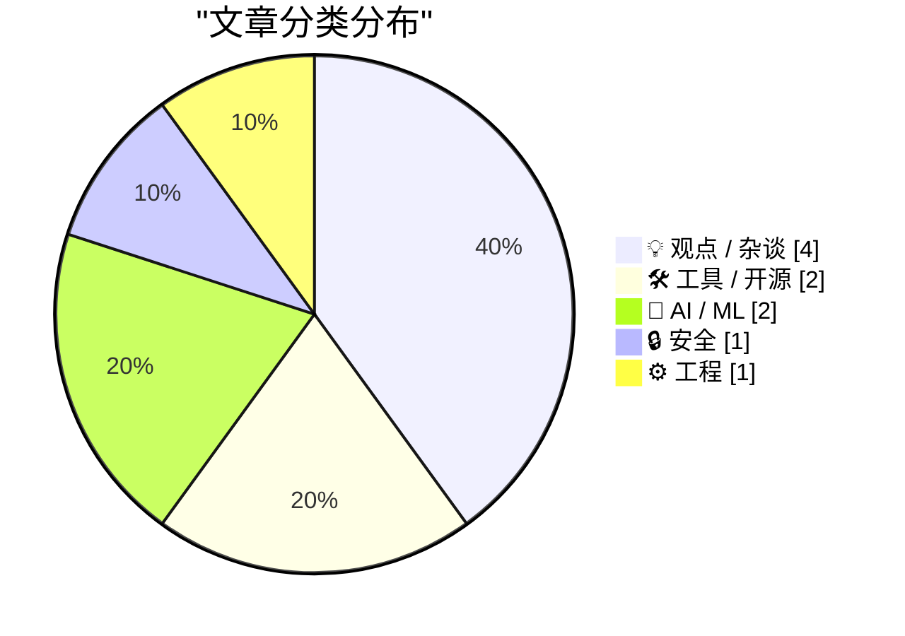
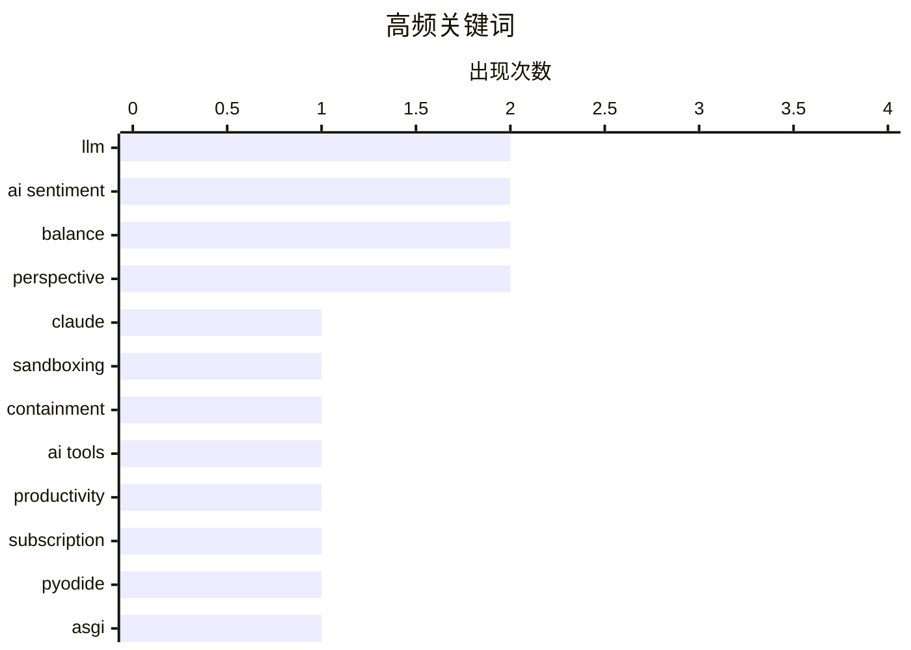

今日技术圈聚焦三大议题：AI安全隔离进入实质落地阶段，Anthropic公开多层沙箱技术细节，通过进程隔离、虚拟机和出口控制从根本上防止数据泄露；同时，关于AI实际价值的反思持续升温，多位从业者指出AI虽能提升效率却常令人陷入多任务“注意力涣散”，真正帮助完成目标的能力存疑；软件工程范式也在转变，业界开始倾向采用Agent模式替代传统Pipeline，让大模型参与控制流管理以获得更高灵活性。整体呈现技术深化与理性审视并行的态势。

<!--more-->


> 来自 Karpathy 推荐的 92 个顶级技术博客，AI 精选 Top 10

## 🏆 今日必读

🥇 **我们如何在各产品中隔离Claude**

[How we contain Claude across products](https://simonwillison.net/2026/May/30/how-we-contain-claude/#atom-everything) — simonwillison.net · 1 天前 · 🔒 安全

> Anthropic公开了其产品组合的沙箱技术实现细节，包括Claude.ai、Claude Code和Claude Cowork。核心策略是通过进程沙箱、虚拟机、文件系统边界和出口控制来约束AI代理的行动范围。Claude.ai采用gVisor实现隔离，Claude Code在macOS使用Seatbelt、在Linux使用Bubblewrap，而Claude Cowork运行完整虚拟机。最关键的原则是确保凭证永不进入沙箱，从根本上防止数据外泄。

💡 **为什么值得读**: 如果你关注AI安全问题，这篇文章提供了业界领先公司的具体沙箱实施方案，非常有参考价值。

🏷️ Claude, sandboxing, containment

🥈 **解决方案可能是取消我的AI订阅**

[The solution might be cancelling my AI subscription](https://simonwillison.net/2026/May/31/the-solution-might-be-cancelling-my-ai-subscription/#atom-everything) — simonwillison.net · 5 小时前 · 💡 观点 / 杂谈

> David Wilson分享了他用AI工具建造16+个项目的经历，发现大多数项目最终都没有解决最初的问题。作者认为AI是"核弹级别的ADHD注意力涣散器"，他和朋友们同时开着3个屏幕做完全不相关的"项目"，对结果缺乏承诺，时间明显被浪费。这是一种非常真实的问题，AI并没有真正帮助他完成需要完成的事情。

💡 **为什么值得读**: 如果你感觉AI工具让你的注意力更加分散而不是更高效，这篇文章会让你非常有共鸣。

🏷️ AI tools, productivity, subscription

🥉 **通过Pyodide在浏览器中运行Python ASGI应用**

[Running Python ASGI apps in the browser via Pyodide + a service worker](https://simonwillison.net/2026/May/30/pyodide-asgi-browser/#atom-everything) — simonwillison.net · 1 天前 · 🛠 工具 / 开源

> Datasette Lite是Simon Willison的完全运行在浏览器中的数据库查看器，最初使用Web Workers拦截导航操作来运行Python应用，但无法执行JavaScript。现在改用Service Workers方案成功解决了这个问题。通过在Pyodide中使用Service Workers，可以在不破坏原有功能的前提下运行Python ASGI应用。

💡 **为什么值得读**: 对于想在浏览器环境中运行Python应用的开发者，这个技术方案提供了实用的新思路。

🏷️ Pyodide, ASGI, browser, Python

---

## 📊 数据概览

| 扫描源 | 抓取文章 | 时间范围 | 精选 |
|:---:|:---:|:---:|:---:|
| 88/92 | 2566 篇 → 26 篇 | 48h | **10 篇** |

### 分类分布



### 高频关键词



<details>
<summary>📈 纯文本关键词图（终端友好）</summary>

```
llm          │ ████████████████████ 2
ai sentiment │ ████████████████████ 2
balance      │ ████████████████████ 2
perspective  │ ████████████████████ 2
claude       │ ██████████░░░░░░░░░░ 1
sandboxing   │ ██████████░░░░░░░░░░ 1
containment  │ ██████████░░░░░░░░░░ 1
ai tools     │ ██████████░░░░░░░░░░ 1
productivity │ ██████████░░░░░░░░░░ 1
subscription │ ██████████░░░░░░░░░░ 1
```

</details>

### 🏷️ 话题标签

**llm**(2) · **ai sentiment**(2) · **balance**(2) · perspective(2) · claude(1) · sandboxing(1) · containment(1) · ai tools(1) · productivity(1) · subscription(1) · pyodide(1) · asgi(1) · browser(1) · python(1) · agents(1) · pipelines(1) · architecture(1) · package manager(1) · npm(1) · releases(1)

---

## 💡 观点 / 杂谈

### 1. 解决方案可能是取消我的AI订阅

[The solution might be cancelling my AI subscription](https://simonwillison.net/2026/May/31/the-solution-might-be-cancelling-my-ai-subscription/#atom-everything) — **simonwillison.net** · 5 小时前 · ⭐ 24/30

> David Wilson分享了他用AI工具建造16+个项目的经历，发现大多数项目最终都没有解决最初的问题。作者认为AI是"核弹级别的ADHD注意力涣散器"，他和朋友们同时开着3个屏幕做完全不相关的"项目"，对结果缺乏承诺，时间明显被浪费。这是一种非常真实的问题，AI并没有真正帮助他完成需要完成的事情。

🏷️ AI tools, productivity, subscription

---

### 2. 我从技术行业退休，去过离线生活

[I Am Retiring from Tech to Live Offline](https://simonwillison.net/2026/May/30/retiring-from-tech-to-live-offline/#atom-everything) — **simonwillison.net** · 1 天前 · ⭐ 21/30

> Chad Whitacre是一位开源贡献者，他正在采取具体步骤离开技术行业，包括不再参与开源项目。他认为AI是最后一根稻草，并提到印度某个岛屿的土著群体杀死任何外来者，以及宾夕法尼亚州的阿米什人也在以一种类似的方式保存一种可能需要的生活方式。

🏷️ tech career, digital detox, lifestyle

---

### 3. 引用Daniel Jalkut

[Quoting Daniel Jalkut](https://simonwillison.net/2026/May/30/daniel-jalkut/#atom-everything) — **simonwillison.net** · 1 天前 · ⭐ 21/30

> Daniel Jalkut在Mastodon上表达了他对AI的看法：本质上，每个反对AI的人都太反对了，每个支持AI的人都太支持了。这是一个温和且理性的观点，试图在两个极端之间找到平衡。

🏷️ AI sentiment, balance, perspective

---

### 4. Daniel Jalkut谈AI

[Daniel Jalkut on AI](https://mastodon.social/@danielpunkass/116639318125898071) — **daringfireball.net** · 1 天前 · ⭐ 21/30

> 这是Daniel Jalkut在同一话题上的进一步阐述，他强调了对AI的两个极端态度都存在问题。不同的社交网络（Mastodon、Bluesky、Threads）上的回复讨论也反映了这些平台之间的文化和算法差异。

🏷️ AI sentiment, balance, perspective

---

## 🛠 工具 / 开源

### 5. 通过Pyodide在浏览器中运行Python ASGI应用

[Running Python ASGI apps in the browser via Pyodide + a service worker](https://simonwillison.net/2026/May/30/pyodide-asgi-browser/#atom-everything) — **simonwillison.net** · 1 天前 · ⭐ 23/30

> Datasette Lite是Simon Willison的完全运行在浏览器中的数据库查看器，最初使用Web Workers拦截导航操作来运行Python应用，但无法执行JavaScript。现在改用Service Workers方案成功解决了这个问题。通过在Pyodide中使用Service Workers，可以在不破坏原有功能的前提下运行Python ASGI应用。

🏷️ Pyodide, ASGI, browser, Python

---

### 6. 本周包管理动态：2026年5月30日

[This Week in Package Management: 30 May 2026](https://nesbitt.io/2026/05/30/this-week-in-package-management.html) — **nesbitt.io** · 1 天前 · ⭐ 23/30

> 这是NESBITT.IO每周发布的包管理领域新闻汇总，涵盖发布、安全公告和来自包管理生态各领域的文章。

🏷️ package manager, npm, releases, advisories

---

## 🤖 AI / ML

### 7. 教皇似乎比Hinton更懂AI

[The Pope appears to understand AI better than Geoffrey Hinton does.](https://garymarcus.substack.com/p/the-pope-appears-to-understand-ai) — **garymarcus.substack.com** · 5 小时前 · ⭐ 22/30

> Gary Marcus评论了一个有趣的现象：教皇似乎比Geoffrey Hinton更理解人工智能。这引发了一个思考：一个东西说了什么并不能告诉你它是如何说出这句话的。这暗示了AI系统的能力与其实际理解之间可能存在差距。

🏷️ AI, Geoffrey Hinton, LLM, AI understanding

---

### 8. 引用Karen Kwok谈Anthropic的收入循环

[Quoting Karen Kwok for Reuters Breakingviews](https://simonwillison.net/2026/May/31/anthropic-run-rate/#atom-everything) — **simonwillison.net** · 20 小时前 · ⭐ 20/30

> 根据Reuters Breakingviews的报道，Anthropic定义了两种"收入循环"计算方式：用过去28天的消费客户销售额乘以13，加上月度订阅收入的12个月，两者相加得出年度收入。这个定义比简单的年收入更能反映公司的经常性收入能力。

🏷️ Anthropic, revenue, business model

---

## 🔒 安全

### 9. 我们如何在各产品中隔离Claude

[How we contain Claude across products](https://simonwillison.net/2026/May/30/how-we-contain-claude/#atom-everything) — **simonwillison.net** · 1 天前 · ⭐ 26/30

> Anthropic公开了其产品组合的沙箱技术实现细节，包括Claude.ai、Claude Code和Claude Cowork。核心策略是通过进程沙箱、虚拟机、文件系统边界和出口控制来约束AI代理的行动范围。Claude.ai采用gVisor实现隔离，Claude Code在macOS使用Seatbelt、在Linux使用Bubblewrap，而Claude Cowork运行完整虚拟机。最关键的原则是确保凭证永不进入沙箱，从根本上防止数据外泄。

🏷️ Claude, sandboxing, containment

---

## ⚙️ 工程

### 10. 构建Agent，而不是Pipeline

[Build agents, not pipelines](https://seangoedecke.com/build-agents-not-pipelines/) — **seangoedecke.com** · 22 小时前 · ⭐ 23/30

> 在计算机程序中使用LLM有两种方式：Pipeline或Agent——即用代码表达控制流，或将控制权交给LLM。Pipeline模式下所有步骤都是预定义的，适合固定流程；Agent模式下LLM可以管理控制流，使用工具自主决策。推荐采用Agent模式而不是Pipeline，这样系统能够更加灵活地应对复杂任务。

🏷️ LLM, agents, pipelines, architecture

---

*生成于 2026-06-01 22:18 | 扫描 88 源 → 获取 2566 篇 → 精选 10 篇*
*基于 [Hacker News Popularity Contest 2025](https://refactoringenglish.com/tools/hn-popularity/) RSS 源列表，由 [Andrej Karpathy](https://x.com/karpathy) 推荐*
*由「懂点儿AI」制作，欢迎关注同名微信公众号获取更多 AI 实用技巧 💡*
