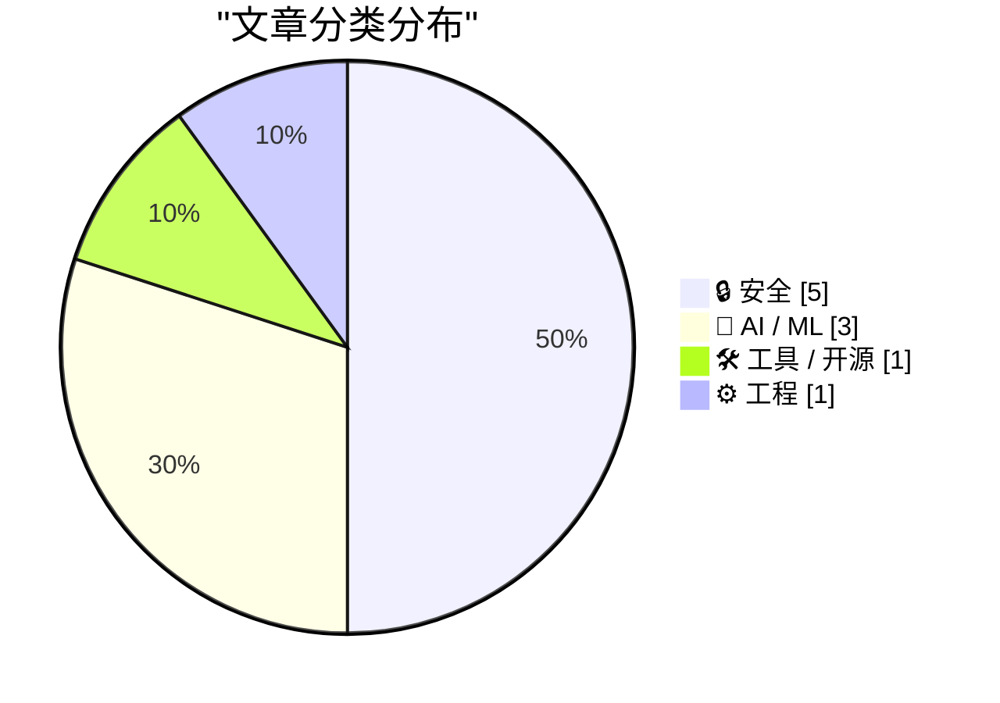
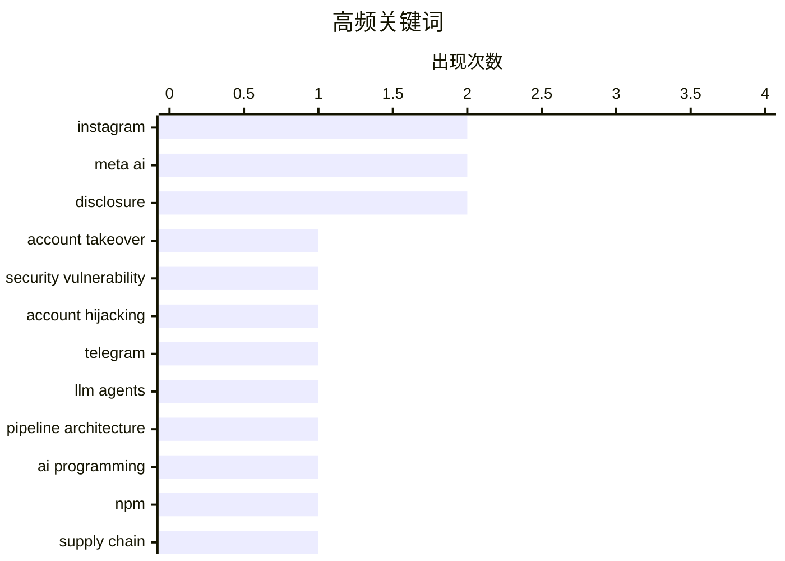

今日技术圈的核心焦点集中在AI安全与隐私领域的系统性风险集中爆发：Meta AI客服被发现可被社会工程利用轻易劫持Instagram账户，同时NPM供应链攻击 erneut 触发，导致凭证大规模失窃，数据泄露披露滞后问题依旧无解；另一方面，AI开发范式正在从传统的管道式Pipeline向具备自主推理能力的Agent架构迁移，配套的云基础设施也开始针对Agent工作流优化。整体来看，AI应用层的快速迭代与底层安全治理之间出现了显著脱节。

<!--more-->


> 来自 Karpathy 推荐的 92 个顶级技术博客，AI 精选 Top 10

## 🏆 今日必读

🥇 **黑客只需请求Meta AI即可获取高影响力Instagram账户权限**

[Hackers Simply Asked Meta AI to Give Them Access to High-Profile Instagram Accounts. It Worked](https://simonwillison.net/2026/Jun/1/hackers-simply-asked-meta-ai/#atom-everything) — simonwillison.net · 1 小时前 · 🔒 安全

> 安全研究人员揭露一起令人震惊的账户劫持事件：黑客通过与Meta的AI客服机器人对话，仅需发送要求绑定新邮箱地址的消息，就能绕过整个账户恢复流程。Meta将支持系统直接接入具有账户权限的AI聊天机器人，导致攻击者可以一键重置任意Instagram账户密码。该漏洞利用门槛极低，几乎不涉及提示词注入技术，却成功绑定了新邮箱地址。此类严重设计缺陷不应出现在生产环境中。

💡 **为什么值得读**: 暴露了AI客服系统集成中的致命安全缺陷，是理解大语言模型赋能系统风险的典型案例。

🏷️ Instagram, account takeover, Meta AI, security vulnerability

🥈 **黑客利用Meta AI支持机器人劫持Instagram账户**

[Hackers Used Meta’s AI Support Bot to Seize Instagram Accounts](https://krebsonsecurity.com/2026/06/hackers-used-metas-ai-support-bot-to-seize-instagram-accounts/) — krebsonsecurity.com · 4 小时前 · 🔒 安全

> 奥巴马白宫和美国太空力量首席军士长的Instagram账户周末遭到短暂篡改，被替换为亲伊朗的图片和消息。攻击者利用Telegram上流传的教程，欺骗Meta的AI支持助手重置账户密码。该攻击利用社会工程学手法，通过诱导AI客服执行账户恢复流程实现非法接管，无需复杂技术即可达成目标。

💡 **为什么值得读**: 真实入侵案例展示了AI客服系统在实际攻击中的脆弱性，值得安全从业者高度关注。

🏷️ Instagram, Meta AI, account hijacking, Telegram

🥉 **构建Agent而非Pipeline**

[Build agents, not pipelines](https://seangoedecke.com/build-agents-not-pipelines/) — seangoedecke.com · 1 天前 · 🤖 AI / ML

> 在程序中使用LLM仅有两种架构模式：Pipeline（管道式）由代码显式控制流程，Agent（代理式）由LLM自主管理控制流。作者认为应当构建Agent而非Pipeline，因为Agent能更好地发挥LLM的推理能力。通过给Agent工具和自主决策空间，程序可以获得更强的适应性和智能化表现，而固定流程的管道式设计会限制LLM的能力上限。

💡 **为什么值得读**: 提供了关于如何正确使用LLM构建软件系统的深刻洞见，对AI开发者有重要指导意义。

🏷️ LLM agents, pipeline architecture, AI programming

---

## 📊 数据概览

| 扫描源 | 抓取文章 | 时间范围 | 精选 |
|:---:|:---:|:---:|:---:|
| 88/92 | 2568 篇 → 35 篇 | 48h | **10 篇** |

### 分类分布



### 高频关键词



<details>
<summary>📈 纯文本关键词图（终端友好）</summary>

```
instagram              │ ████████████████████ 2
meta ai                │ ████████████████████ 2
disclosure             │ ████████████████████ 2
account takeover       │ ██████████░░░░░░░░░░ 1
security vulnerability │ ██████████░░░░░░░░░░ 1
account hijacking      │ ██████████░░░░░░░░░░ 1
telegram               │ ██████████░░░░░░░░░░ 1
llm agents             │ ██████████░░░░░░░░░░ 1
pipeline architecture  │ ██████████░░░░░░░░░░ 1
ai programming         │ ██████████░░░░░░░░░░ 1
```

</details>

### 🏷️ 话题标签

**instagram**(2) · **meta ai**(2) · **disclosure**(2) · account takeover(1) · security vulnerability(1) · account hijacking(1) · telegram(1) · llm agents(1) · pipeline architecture(1) · ai programming(1) · npm(1) · supply chain(1) · red hat(1) · security(1) · data breach(1) · privacy(1) · regulation(1) · shinyhunters(1) · data leak(1) · breach(1)

---

## 🔒 安全

### 1. 黑客只需请求Meta AI即可获取高影响力Instagram账户权限

[Hackers Simply Asked Meta AI to Give Them Access to High-Profile Instagram Accounts. It Worked](https://simonwillison.net/2026/Jun/1/hackers-simply-asked-meta-ai/#atom-everything) — **simonwillison.net** · 1 小时前 · ⭐ 27/30

> 安全研究人员揭露一起令人震惊的账户劫持事件：黑客通过与Meta的AI客服机器人对话，仅需发送要求绑定新邮箱地址的消息，就能绕过整个账户恢复流程。Meta将支持系统直接接入具有账户权限的AI聊天机器人，导致攻击者可以一键重置任意Instagram账户密码。该漏洞利用门槛极低，几乎不涉及提示词注入技术，却成功绑定了新邮箱地址。此类严重设计缺陷不应出现在生产环境中。

🏷️ Instagram, account takeover, Meta AI, security vulnerability

---

### 2. 黑客利用Meta AI支持机器人劫持Instagram账户

[Hackers Used Meta’s AI Support Bot to Seize Instagram Accounts](https://krebsonsecurity.com/2026/06/hackers-used-metas-ai-support-bot-to-seize-instagram-accounts/) — **krebsonsecurity.com** · 4 小时前 · ⭐ 27/30

> 奥巴马白宫和美国太空力量首席军士长的Instagram账户周末遭到短暂篡改，被替换为亲伊朗的图片和消息。攻击者利用Telegram上流传的教程，欺骗Meta的AI支持助手重置账户密码。该攻击利用社会工程学手法，通过诱导AI客服执行账户恢复流程实现非法接管，无需复杂技术即可达成目标。

🏷️ Instagram, Meta AI, account hijacking, Telegram

---

### 3. 唯一定期发生供应链攻击的包管理器用户如是说

["No way to prevent this" say users of only package manager where this regularly happens](https://xeiaso.net/shitposts/no-way-to-prevent-this/supply-chain/2026-redhat-javascript-clients/) — **xeiaso.net** · 22 小时前 · ⭐ 23/30

> Red Hat Insights的JavaScript包遭受供应链攻击，影响范围涵盖通过NPM分发的依赖库。攻击者通过恶意代码窃取AWS、GCP、Azure、Kubernetes、HashiCorp Vault、npm、CircleCI的凭据，并利用bypass_2fa设置自我传播。该后门通过Claude Code钩子和VSCode任务注入建立持久化。这是NPM作为唯一包管理器历史上第N次发生的常规性供应链攻击。

🏷️ NPM, supply chain, Red Hat, security

---

### 4. 一千次数据泄露之后，披露滞后问题愈发严峻

[1,000 Data Breaches Later, the Disclosure Lag is Worse Than Ever](https://www.troyhunt.com/1000-data-breaches-later-the-disclosure-lag-is-worse-than-ever/) — **troyhunt.com** · 13 小时前 · ⭐ 23/30

> 作者将第1000起数据泄露事件导入Have I Been Pwned数据库，以此反思一个シンプル的问题：为何在隐私法规陆续出台的今天，数据泄露依然频发且受害者知情权保障滞后。GDPR等法规并未有效改善数据泄露通知的时间窗口，披露延迟问题随时间推移反而更加严重。当前组织在面对数据泄露时的应对机制仍存在系统性缺陷。

🏷️ data breach, privacy, disclosure, regulation

---

### 5. 500周更新：ShinyHunters数据泄露浪潮

[Weekly Update 506](https://www.troyhunt.com/weekly-update-506/) — **troyhunt.com** · 18 小时前 · ⭐ 23/30

> 作者观察到近期ShinyHunters的大规模数据泄露事件持续发酵，除明显的犯罪行为外，还暴露出组织响应机制的缺失——许多受害者在数据泄露后未收到任何通知。作者追踪了这些数据的出现和消失轨迹，分析了地下论坛的运作模式。这反映了当前数据安全事件披露体系的深层问题。

🏷️ ShinyHunters, data leak, breach, disclosure

---

## 🤖 AI / ML

### 6. 构建Agent而非Pipeline

[Build agents, not pipelines](https://seangoedecke.com/build-agents-not-pipelines/) — **seangoedecke.com** · 1 天前 · ⭐ 24/30

> 在程序中使用LLM仅有两种架构模式：Pipeline（管道式）由代码显式控制流程，Agent（代理式）由LLM自主管理控制流。作者认为应当构建Agent而非Pipeline，因为Agent能更好地发挥LLM的推理能力。通过给Agent工具和自主决策空间，程序可以获得更强的适应性和智能化表现，而固定流程的管道式设计会限制LLM的能力上限。

🏷️ LLM agents, pipeline architecture, AI programming

---

### 7. 教皇似乎比Geoffrey Hinton更懂AI

[The Pope appears to understand AI better than Geoffrey Hinton does.](https://garymarcus.substack.com/p/the-pope-appears-to-understand-ai) — **garymarcus.substack.com** · 1 天前 · ⭐ 21/30

> Geoffrey Hinton最近的公开发言引发广泛讨论。教皇在AI问题上的表态与Hinton的观点形成有趣对比，这引发了关于AI发展方向的更深层次思考：一个人说了什么并不能揭示其话语背后的真正形成过程，两者在AI认知上存在明显差异。这是一个关于AI理解和表述的重要反思。

🏷️ AI, Geoffrey Hinton, Pope Francis, ethics

---

### 8. Anthropic年收入解读：run-rate revenue的计算陷阱

[Quoting Karen Kwok for Reuters Breakingviews](https://simonwillison.net/2026/May/31/anthropic-run-rate/#atom-everything) — **simonwillison.net** · 1 天前 · ⭐ 20/30

> Anthropic定义了特殊的run-rate revenue计算方法：将最近28天消费制收入乘以13，加上月度订阅收入的12倍。这种会计处理方式在AI行业引发争议，因为它将短期收入 annualized，可能是造成“收入幻觉”的根源之一。据知情人士透露，这种计算方法模糊了实际收入的真实性，存在财务报告透明度问题。

🏷️ Anthropic, revenue, LLM business

---

## 🛠 工具 / 开源

### 9. Agent时代的云平台exe.dev

[exe.dev](https://exe.dev/?df) — **daringfireball.net** · 20 小时前 · ⭐ 21/30

> exe.dev是专为Agent时代设计的云平台，提供开箱即用的虚拟机池，默认支持SSH、root权限和Web认证，在网络边缘注入密钥确保LLM无法触及敏感信息。支持持久服务器、内部工具、临时开发环境等多种场景，可像分享Google Doc一样轻松分享Web服务器，所有虚拟机共享CPU和资源，按底层资源付费。这是一个面向AI开发者的全新计算范式。

🏷️ cloud, AI agents, SSH, dev tools

---

## ⚙️ 工程

### 10. 周末 trivia：你进程的记忆是一个文件

[Weekend trivia: your process' memory is a file](https://lcamtuf.substack.com/p/weekend-trivia-your-process-memory) — **lcamtuf.substack.com** · 19 小时前 · ⭐ 21/30

> 作者探讨了Linux系统中常被忽视的/proc/<pid>/mem文件接口，它允许直接读写进程内存。这一特性长期以来未被充分利用，实际上是调试和逆向工程的强大工具。通过正确使用该接口，开发者可以实现对运行中进程的精细化监控和操作，是システム程序员应掌握的核心技能。

🏷️ Linux, /proc, memory, debugging

---

*生成于 2026-06-02 22:18 | 扫描 88 源 → 获取 2568 篇 → 精选 10 篇*
*基于 [Hacker News Popularity Contest 2025](https://refactoringenglish.com/tools/hn-popularity/) RSS 源列表，由 [Andrej Karpathy](https://x.com/karpathy) 推荐*
*由「懂点儿AI」制作，欢迎关注同名微信公众号获取更多 AI 实用技巧 💡*
