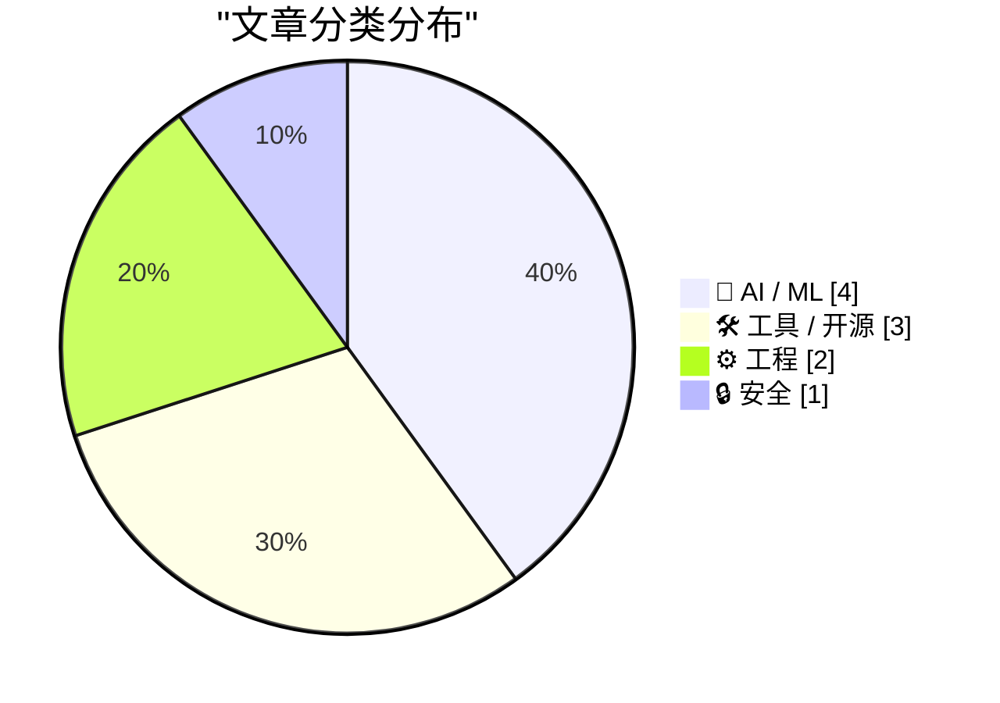
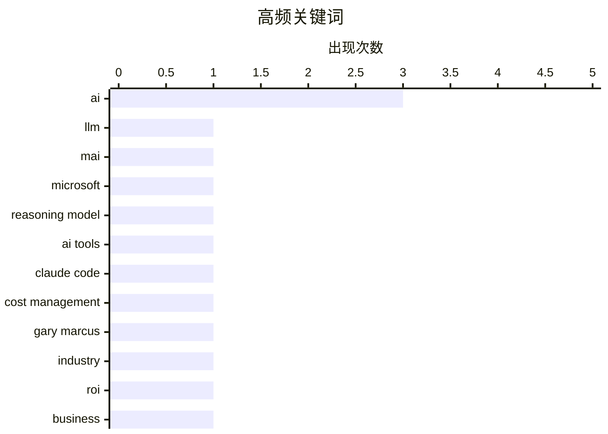

今日技术圈聚焦三大趋势：一是微软发布低活跃参数高性能的MAI系列模型，大模型正朝着高效专业化方向迭代；二是继此前AI投资回报争议后，Uber近日宣布限制AI编码工具的月度消费额度，引发企业对AI成本管控的新一轮讨论。与此同时，安全与工程实践领域也有新进展：Datasette Agent发布采用WebAssembly沙箱的MicroPython版本，探索安全代码执行新范式，菲律宾政府则加入Have I Been Pwned数据泄露监控服务，强化政府域名的安全防护。

<!--more-->


> 来自 Karpathy 推荐的 92 个顶级技术博客，AI 精选 Top 10

## 🏆 今日必读

🥇 **微软发布新型MAI模型**

[Microsoft's new MAI models](https://simonwillison.net/2026/Jun/2/microsofts-new-models/#atom-everything) — simonwillison.net · 23 小时前 · 🤖 AI / ML

> 微软宣布推出两款新型文本大语言模型：MAI-Thinking-1（推理模型，总参数量1T，活跃参数35B，仅向特定早期合作伙伴开放）和MAI-Code-1-Flash（总参数量137B，活跃参数5B，专为GitHub Copilot和VS Code设计）。MAI-Thinking-1在盲测中被认为优于Sonnet 4.6，这对于一个35B参数的模型来说相当出色。两款模型的活跃参数量都明显低于当前主流大模型。

💡 **为什么值得读**: 这是了解小参数模型能力边界以及微软AI战略布局的重要窗口，35B参数模型能达到与更大模型相当的性能可能预示行业转向高效模型设计。

🏷️ LLM, MAI, Microsoft, reasoning model

🥈 **Uber限制Claude Code等AI工具使用以控制成本**

[Uber Caps Usage of AI Tools Like Claude Code to Manage Costs](https://simonwillison.net/2026/Jun/3/uber-caps-usage/#atom-everything) — simonwillison.net · 10 小时前 · ⚙️ 工程

> Uber将所有员工每月在每个AI编码工具上的token消费限额设定为1500美元，该限制已在近几个月内实施，仅适用于Cursor或Claude Code等代理型编码软件。这一举措源于Uber在2026年前四个月就耗尽了全年AI预算，反映出Token消耗型AI编程工具的高成本问题。每个工具的预算相互独立，员工可在不同工具间分配额度。

💡 **为什么值得读**: 反映了当前AI编码工具在企业应用中的成本失控现状，其1500美元的月度限额为企业AI支出管理提供了具体参考案例。

🏷️ AI tools, Claude Code, cost management

🥉 **Breaking: When dreams for AI sanity come true**

[Breaking: When dreams for AI sanity come true](https://garymarcus.substack.com/p/breaking-when-dreams-for-ai-sanity) — garymarcus.substack.com · 1 天前 · 🤖 AI / ML

> A true life moment for your correspondent

🏷️ AI, Gary Marcus, industry

---

## 📊 数据概览

| 扫描源 | 抓取文章 | 时间范围 | 精选 |
|:---:|:---:|:---:|:---:|
| 88/92 | 2569 篇 → 37 篇 | 48h | **10 篇** |

### 分类分布



### 高频关键词



<details>
<summary>📈 纯文本关键词图（终端友好）</summary>

```
ai              │ ████████████████████ 3
llm             │ ███████░░░░░░░░░░░░░ 1
mai             │ ███████░░░░░░░░░░░░░ 1
microsoft       │ ███████░░░░░░░░░░░░░ 1
reasoning model │ ███████░░░░░░░░░░░░░ 1
ai tools        │ ███████░░░░░░░░░░░░░ 1
claude code     │ ███████░░░░░░░░░░░░░ 1
cost management │ ███████░░░░░░░░░░░░░ 1
gary marcus     │ ███████░░░░░░░░░░░░░ 1
industry        │ ███████░░░░░░░░░░░░░ 1
```

</details>

### 🏷️ 话题标签

**ai**(3) · **llm**(1) · **mai**(1) · microsoft(1) · reasoning model(1) · ai tools(1) · claude code(1) · cost management(1) · gary marcus(1) · industry(1) · roi(1) · business(1) · video(1) · developers(1) · streaming(1) · mathematics(1) · psychology(1) · compiler(1) · inlining(1) · jit(1)

---

## 🤖 AI / ML

### 1. 微软发布新型MAI模型

[Microsoft's new MAI models](https://simonwillison.net/2026/Jun/2/microsofts-new-models/#atom-everything) — **simonwillison.net** · 23 小时前 · ⭐ 26/30

> 微软宣布推出两款新型文本大语言模型：MAI-Thinking-1（推理模型，总参数量1T，活跃参数35B，仅向特定早期合作伙伴开放）和MAI-Code-1-Flash（总参数量137B，活跃参数5B，专为GitHub Copilot和VS Code设计）。MAI-Thinking-1在盲测中被认为优于Sonnet 4.6，这对于一个35B参数的模型来说相当出色。两款模型的活跃参数量都明显低于当前主流大模型。

🏷️ LLM, MAI, Microsoft, reasoning model

---

### 2. Breaking: When dreams for AI sanity come true

[Breaking: When dreams for AI sanity come true](https://garymarcus.substack.com/p/breaking-when-dreams-for-ai-sanity) — **garymarcus.substack.com** · 1 天前 · ⭐ 24/30

> A true life moment for your correspondent

🏷️ AI, Gary Marcus, industry

---

### 3. AI Doesn't Have ROI

[AI Doesn't Have ROI](https://www.wheresyoured.at/ai-doesnt-have-roi/) — **wheresyoured.at** · 1 天前 · ⭐ 24/30

> If you liked this piece, you should subscribe to my premium newsletter. It&#x2019;s $70 a year, or $7 a month, and in return you get a weekly newsletter that&#x2019;s usually anywhere from 5,000 to 18

🏷️ AI, ROI, business

---

### 4. Why things will eventually fall apart

[Why things will eventually fall apart](https://garymarcus.substack.com/p/why-things-will-eventually-fall-apart) — **garymarcus.substack.com** · 1 天前 · ⭐ 23/30

> The math, and the psychology

🏷️ AI, mathematics, psychology

---

## 🛠 工具 / 开源

### 5. [Sponsor] Mux — Video for Developers

[[Sponsor] Mux — Video for Developers](https://www.mux.com/?utm_campaign=fireball&amp;utm_source=DF) — **daringfireball.net** · 1 天前 · ⭐ 23/30

> Mux is what developers reach for when they need to do more with video. Video files are packed with data and context waiting to be unlocked.

Mux Robots are AI workflows that unlock that data inside yo

🏷️ video, developers, streaming

---

### 6. Datasette Agent MicroPython 0.1alpha发布

[datasette-agent-micropython 0.1a0](https://simonwillison.net/2026/Jun/2/datasette-agent-micropython/#atom-everything) — **simonwillison.net** · 1 天前 · ⭐ 22/30

> Simon Willison发布了Datasette Agent的MicroPython alpha版本（0.1a0），该工具旨在安全地生成和执行Python代码。使用WebAssembly沙箱技术，截至目前GPT-5.5尚未成功突破沙箱隔离。这是Datasette Agent项目向安全代码执行能力演进的重要里程碑。

🏷️ Datasette Agent, MicroPython, sandbox

---

### 7. 粘贴文件编辑器工具

[Pasted File Editor](https://simonwillison.net/2026/Jun/2/pasted-file-editor/#atom-everything) — **simonwillison.net** · 1 天前 · ⭐ 22/30

> Simon Willison基于Claude Codex构建了一个原型工具，可将大量文本直接粘贴到网页应用中并自动识别为文件附件。该工具支持直接打开文件（包括图片显示为缩略图）或拖拽文件到文本区域，与Claude.ai的大文件粘贴功能类似但可在任何环境使用。

🏷️ tool, file editor, Claude

---

## ⚙️ 工程

### 8. Uber限制Claude Code等AI工具使用以控制成本

[Uber Caps Usage of AI Tools Like Claude Code to Manage Costs](https://simonwillison.net/2026/Jun/3/uber-caps-usage/#atom-everything) — **simonwillison.net** · 10 小时前 · ⭐ 24/30

> Uber将所有员工每月在每个AI编码工具上的token消费限额设定为1500美元，该限制已在近几个月内实施，仅适用于Cursor或Claude Code等代理型编码软件。这一举措源于Uber在2026年前四个月就耗尽了全年AI预算，反映出Token消耗型AI编程工具的高成本问题。每个工具的预算相互独立，员工可在不同工具间分配额度。

🏷️ AI tools, Claude Code, cost management

---

### 9. 内联启发式方法综述

[A survey of inlining heuristics](https://bernsteinbear.com/blog/inlining-heuristics/?utm_source=rss) — **bernsteinbear.com** · 22 小时前 · ⭐ 23/30

> 文章探讨编译器尤其是JIT编译器中的函数内联优化策略。作者指出方法（函数）通常很小，尤其是在Ruby等动态语言中，这导致编译器难以获得足够的上下文进行深度优化。通过多个实际代码示例，分析了小型方法对编译器优化的挑战，以及内联决策对运行时性能的影响。

🏷️ compiler, inlining, JIT, optimization

---

## 🔒 安全

### 10. 菲律宾政府加入Have I Been Pwned服务

[Welcoming the Philippine Government to Have I Been Pwned](https://www.troyhunt.com/welcoming-the-philippine-government-to-have-i-been-pwned/) — **troyhunt.com** · 18 小时前 · ⭐ 21/30

> 菲律宾国家CERT与信息通信技术部合作，使菲律宾成为第46个加入HIBP免费政府服务的机构。政府可监控其官方域名是否出现在数据泄露事件中，这是HIBP帮助政府和组织应对数据泄露风险的最新进展。

🏷️ data breach, HIBP, government

---

*生成于 2026-06-04 22:18 | 扫描 88 源 → 获取 2569 篇 → 精选 10 篇*
*基于 [Hacker News Popularity Contest 2025](https://refactoringenglish.com/tools/hn-popularity/) RSS 源列表，由 [Andrej Karpathy](https://x.com/karpathy) 推荐*
*由「懂点儿AI」制作，欢迎关注同名微信公众号获取更多 AI 实用技巧 💡*
