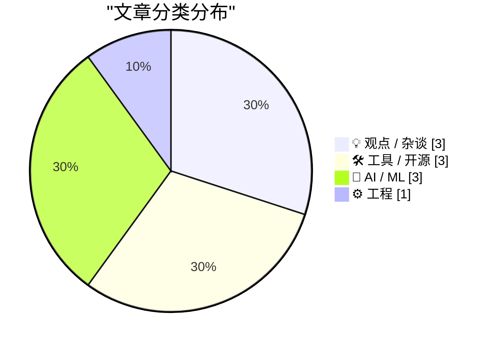
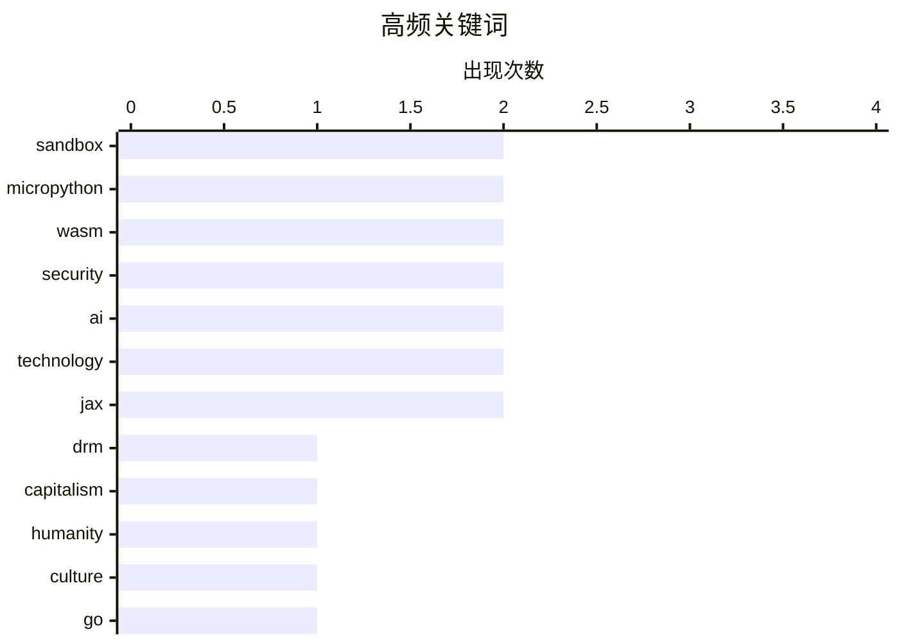

今日看点：WebAssembly正成为代码沙箱的新宠，MicroPython+WASM方案为浏览器和服务器端提供轻量安全的Python执行环境；AI安全防护持续加码，OpenAI推出Lockdown Mode应对提示注入攻击的数据外泄风险；与此同时，AI泡沫争议持续发酵，业界开始反思模型泛滥与批评策略的有效性。

<!--more-->


> 来自 Karpathy 推荐的 92 个顶级技术博客，AI 精选 Top 10

## 🏆 今日必读

🥇 **使用MicroPython和WASM在沙箱中运行Python代码**

[Running Python code in a sandbox with MicroPython and WASM](https://simonwillison.net/2026/Jun/6/micropython-in-a-sandbox/#atom-everything) — simonwillison.net · 18 小时前 · ⚙️ 工程

> 作者Simon Willison尝试多年寻找理想的代码沙箱方案，最终采用MicroPython+WebAssembly实现。他发布了alpha包micropython-wasm，并将其用于Datasette Agent的代码执行沙箱插件。该方案利用WebAssembly的内存隔离特性，在浏览器和服务器端都能实现安全的Python代码执行环境。MicroPython相比完整Python更轻量，更适合编译为WASM在沙箱中运行。

💡 **为什么值得读**: 如果你需要构建安全的代码执行环境，这篇文章提供了最新的WASM沙箱实现思路和具体技术方案。

🏷️ sandbox, MicroPython, WASM, security

🥈 **批评万物机器**

[Pluralistic: Criticizing the everything machine (06 Jun 2026)](https://pluralistic.net/2026/06/06/applied-counterescatology/) — pluralistic.net · 4 小时前 · 💡 观点 / 杂谈

> 本文是Cory Doctorow的博客文章，讨论AI领域的批评方法。作者以Gish Gallop（密集攻势）为切入点，描述了在有限时间内回应大量 Claims 的困境。文章探讨了技术评论的策略问题，涉及DRM、奢侈品假货、能源等话题。作者认为面对AI的各种问题，需要更有针对性的批评方式而非泛泛而谈。

💡 **为什么值得读**: 这篇文章为技术评论者提供了有深度的批评方法论，适合关心如何有效评论AI技术的人阅读。

🏷️ AI, DRM, technology, capitalism

🥉 **完善人性**

[Pluralistic: Refining humanity (05 Jun 2026)](https://pluralistic.net/2026/06/05/defining-humanity/) — pluralistic.net · 1 天前 · 💡 观点 / 杂谈

> 本文是Cory Doctorow讨论知识理解方式的博客文章。作者认为向他人解释是检验自己理解程度的最佳方法，通过解释会发现自己认为是"显而易见"的事物实际上充满歧义和矛盾。文章引用了Blackadder喜剧片段来说明这一原则，讨论了在技术时代如何保持对复杂问题的清晰理解。

💡 **为什么值得读**: 这是一篇关于学习方法和思维方式的短文，适合想加深对技术问题理解的读者。

🏷️ technology, humanity, AI, culture

---

## 📊 数据概览

| 扫描源 | 抓取文章 | 时间范围 | 精选 |
|:---:|:---:|:---:|:---:|
| 81/92 | 2425 篇 → 35 篇 | 48h | **10 篇** |

### 分类分布



### 高频关键词



<details>
<summary>📈 纯文本关键词图（终端友好）</summary>

```
sandbox     │ ████████████████████ 2
micropython │ ████████████████████ 2
wasm        │ ████████████████████ 2
security    │ ████████████████████ 2
ai          │ ████████████████████ 2
technology  │ ████████████████████ 2
jax         │ ████████████████████ 2
drm         │ ██████████░░░░░░░░░░ 1
capitalism  │ ██████████░░░░░░░░░░ 1
humanity    │ ██████████░░░░░░░░░░ 1
```

</details>

### 🏷️ 话题标签

**sandbox**(2) · **micropython**(2) · **wasm**(2) · security(2) · ai(2) · technology(2) · jax(2) · drm(1) · capitalism(1) · humanity(1) · culture(1) · go(1) · tigris(1) · s3(1) · sdk(1) · cli(1) · openai(1) · lockdown mode(1) · api(1) · perplexity(1)

---

## 💡 观点 / 杂谈

### 1. 批评万物机器

[Pluralistic: Criticizing the everything machine (06 Jun 2026)](https://pluralistic.net/2026/06/06/applied-counterescatology/) — **pluralistic.net** · 4 小时前 · ⭐ 24/30

> 本文是Cory Doctorow的博客文章，讨论AI领域的批评方法。作者以Gish Gallop（密集攻势）为切入点，描述了在有限时间内回应大量 Claims 的困境。文章探讨了技术评论的策略问题，涉及DRM、奢侈品假货、能源等话题。作者认为面对AI的各种问题，需要更有针对性的批评方式而非泛泛而谈。

🏷️ AI, DRM, technology, capitalism

---

### 2. 完善人性

[Pluralistic: Refining humanity (05 Jun 2026)](https://pluralistic.net/2026/06/05/defining-humanity/) — **pluralistic.net** · 1 天前 · ⭐ 24/30

> 本文是Cory Doctorow讨论知识理解方式的博客文章。作者认为向他人解释是检验自己理解程度的最佳方法，通过解释会发现自己认为是"显而易见"的事物实际上充满歧义和矛盾。文章引用了Blackadder喜剧片段来说明这一原则，讨论了在技术时代如何保持对复杂问题的清晰理解。

🏷️ technology, humanity, AI, culture

---

### 3. AI泡沫批判指南3.0

[Premium: The Hater's Guide To The AI Bubble 3.0](https://www.wheresyoured.at/premium-the-haters-guide-to-the-ai-bubble-3-0/) — **wheresyoured.at** · 1 天前 · ⭐ 21/30

> 这是作者关于AI行业泡沫的第三篇批评文章。去年作者写了第一篇关于AI泡沫的指南，随后又写了第二卷。现在作者意识到"volume"的说法有问题，进行了更新。

🏷️ AI bubble, industry critique, AI trends

---

## 🛠 工具 / 开源

### 4. 为Go应用赋予Tigris超能力

[Giving your Go apps Tigris superpowers](https://www.tigrisdata.com/blog/storage-sdk-go/) — **xeiaso.net** · -2982 分钟前 · ⭐ 23/30

> Tigris是S3兼容的对象存储，但其独有功能（bucket forking、snapshots、object renaming等）需要专门SDK才能使用。作者为Tigris编写了Go SDK，提供两个版本：storage包作为S3客户端的替代品，提供Tigris特有操作的一流方法；simplestorage是更高级的单桶客户端，从环境推断配置。SDK可增量采用，无需重构现有S3代码。

🏷️ Go, Tigris, S3, SDK

---

### 5. micropython-wasm 0.1a2发布

[micropython-wasm 0.1a2](https://simonwillison.net/2026/Jun/6/micropython-wasm/#atom-everything) — **simonwillison.net** · 17 小时前 · ⭐ 22/30

> 作者发布了micropython-wasm的0.1a2版本，新增了CLI工具。该版本受博客文章启发而添加，方便用户直接试用沙箱功能。micropython-wasm是作者用于代码执行沙箱的实验项目，使用MicroPython+WebAssembly实现。

🏷️ MicroPython, WASM, CLI, sandbox

---

### 6. JAX后端和设备

[JAX backends and devices](https://www.gilesthomas.com/2026/06/jax-backends-and-devices) — **gilesthomas.com** · 1 天前 · ⭐ 21/30

> 作者继续JAX迁移项目，需要加载大型数据集。数据集是FineWeb-GPT2-token的train split，包含10,248,871,837个16位无符号整数，总计约19GiB。通过safetensors.flax的load_file函数可以加载数据。

🏷️ JAX, backend, devices, framework

---

## 🤖 AI / ML

### 7. OpenAI帮助：Lockdown模式

[OpenAI Help: Lockdown Mode](https://simonwillison.net/2026/Jun/5/openai-help-lockdown-mode/#atom-everything) — **simonwillison.net** · 22 小时前 · ⭐ 22/30

> OpenAI推出了Lockdown Mode安全功能，已向个人账户（Free、Go、Plus、Pro）和自助ChatGPT Business账户推出。该功能通过限制出站网络请求来防止提示注入攻击的最后一阶段数据泄露，但不会阻止提示注入出现在ChatGPT处理的内容中。这是一个针对数据外泄的安全防护措施。

🏷️ OpenAI, Lockdown Mode, security, API

---

### 8. 审视Perplexity

[Checking in on Perplexity](https://daringfireball.net/linked/2025/08/05/regarding-those-rumors-of-apple-pursuing-an-acquisition-of-perplexity) — **daringfireball.net** · 1 天前 · ⭐ 21/30

> 本文是John Gruber对Perplexity现状的评论文章。作者认为Apple不太可能收购Perplexity，该公司已滑入AI初创公司的" afterthought"层级。作者回顾了去年Perplexity的各种营销噱头，认为之前建议Apple收购的声音已经消失。

🏷️ Perplexity, Apple, AI search, partnership

---

### 9. 在Flax中使用Safetensors

[Using Safetensors with Flax](https://www.gilesthomas.com/2026/06/flax-and-safetensors) — **gilesthomas.com** · 1 天前 · ⭐ 21/30

> 作者正在将PyTorch LLM代码迁移到JAX/Flax，需要使用Safetensors存储模型检查点。官方Safetensors文档没有直接提及JAX实现，但文档中有Flax API链接实际上是JAX API。通过使用safetensors.flax的load_file函数可以加载检查点数据。

🏷️ Safetensors, Flax, JAX, LLM

---

## ⚙️ 工程

### 10. 使用MicroPython和WASM在沙箱中运行Python代码

[Running Python code in a sandbox with MicroPython and WASM](https://simonwillison.net/2026/Jun/6/micropython-in-a-sandbox/#atom-everything) — **simonwillison.net** · 18 小时前 · ⭐ 24/30

> 作者Simon Willison尝试多年寻找理想的代码沙箱方案，最终采用MicroPython+WebAssembly实现。他发布了alpha包micropython-wasm，并将其用于Datasette Agent的代码执行沙箱插件。该方案利用WebAssembly的内存隔离特性，在浏览器和服务器端都能实现安全的Python代码执行环境。MicroPython相比完整Python更轻量，更适合编译为WASM在沙箱中运行。

🏷️ sandbox, MicroPython, WASM, security

---

*生成于 2026-06-07 22:18 | 扫描 81 源 → 获取 2425 篇 → 精选 10 篇*
*基于 [Hacker News Popularity Contest 2025](https://refactoringenglish.com/tools/hn-popularity/) RSS 源列表，由 [Andrej Karpathy](https://x.com/karpathy) 推荐*
*由「懂点儿AI」制作，欢迎关注同名微信公众号获取更多 AI 实用技巧 💡*
