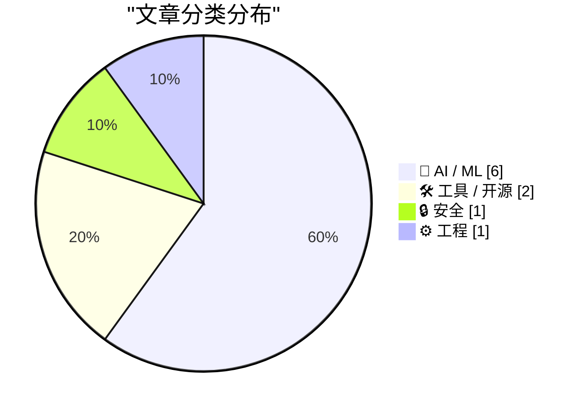
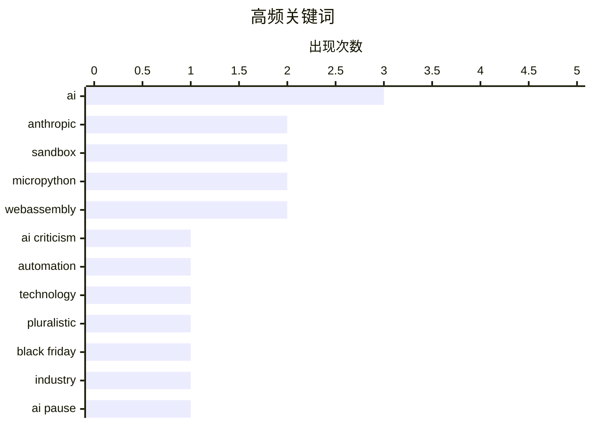

今日技术圈聚焦三大趋势：一是AI行业进入反思期，从对技术过度神化的批判到对生成低质量内容（slop）泛滥的担忧，Gary Marcus等多位从业者呼吁关注AI实效而非泡沫；二是AI安全防护成为焦点，OpenAI推出锁定模式应对提示注入攻击，同时社区探索用WebAssembly构建安全的代码执行沙箱；三是工程实践持续进化，LLM代理在项目维护和测试自动化方面展现出超越传统手写代码的潜力，但仍被认为更适合增量开发而非全新架构。

<!--more-->


> 来自 Karpathy 推荐的 92 个顶级技术博客，AI 精选 Top 10

## 🏆 今日必读

🥇 **批评万物机器**

[Pluralistic: Criticizing the everything machine (06 Jun 2026)](https://pluralistic.net/2026/06/06/applied-counterescatology/) — pluralistic.net · 1 天前 · 🤖 AI / ML

> 文章探讨了AI技术被过度神化的问题，作者以「Gish Gallop」（密集攻击战术）来形容AI讨论中常见的情况：一次对话中被要求回应过多观点，导致无法有效辩论。作者以一次13分钟广播采访为例，说明在有限时间内回应AI复杂问题时面临的困境。文章还讨论了DRM与版权、议会与数字版权、假冒奢侈品、媒体「向后靠」消费模式等话题。

💡 **为什么值得读**: 如果你对AI技术的实际局限性有疑问，想了解技术博主对AI炒作的看法，这篇文章提供了有深度的批评视角。

🏷️ AI criticism, automation, technology, pluralistic

🥈 **AI的黑色星期五**

[AI’s Black Friday](https://garymarcus.substack.com/p/ais-black-friday) — garymarcus.substack.com · 1 天前 · 🤖 AI / ML

> Gary Marcus讨论了AI领域近期发生的重大事件。虽然标题用了「黑色星期五」的隐喻，但摘要中未提供具体事件细节。文章似乎在反思AI行业近期的发展动态和变化。

💡 **为什么值得读**: Gary Marcus是AI领域知名评论者，如果你关注AI行业动态和需要了解重要事件的分析，这篇文章提供了他的见解。

🏷️ AI, Black Friday, industry, Anthropic

🥉 **不，安thropic并未呼吁暂停AI开发**

[No, Anthropic did not call for a pause on AI development](https://garymarcus.substack.com/p/no-anthropic-did-not-call-for-a-pause) — garymarcus.substack.com · 1 天前 · 🤖 AI / ML

> 针对近期关于Anthropic要求暂停AI开发的传闻，Gary Marcus明确澄清：Anthropic并未呼吁暂停AI开发。文章对这一误解进行了纠正。

💡 **为什么值得读**: 如果你关注AI安全治理和行业政策动态，想了解Anthropic的真实立场，这篇文章提供了权威澄清。

🏷️ Anthropic, AI pause, myth-busting, AI development

---

## 📊 数据概览

| 扫描源 | 抓取文章 | 时间范围 | 精选 |
|:---:|:---:|:---:|:---:|
| 87/92 | 2554 篇 → 30 篇 | 48h | **10 篇** |

### 分类分布



### 高频关键词



<details>
<summary>📈 纯文本关键词图（终端友好）</summary>

```
ai           │ ████████████████████ 3
anthropic    │ █████████████░░░░░░░ 2
sandbox      │ █████████████░░░░░░░ 2
micropython  │ █████████████░░░░░░░ 2
webassembly  │ █████████████░░░░░░░ 2
ai criticism │ ███████░░░░░░░░░░░░░ 1
automation   │ ███████░░░░░░░░░░░░░ 1
technology   │ ███████░░░░░░░░░░░░░ 1
pluralistic  │ ███████░░░░░░░░░░░░░ 1
black friday │ ███████░░░░░░░░░░░░░ 1
```

</details>

### 🏷️ 话题标签

**ai**(3) · **anthropic**(2) · **sandbox**(2) · micropython(2) · webassembly(2) · ai criticism(1) · automation(1) · technology(1) · pluralistic(1) · black friday(1) · industry(1) · ai pause(1) · myth-busting(1) · ai development(1) · security(1) · productivity(1) · criticism(1) · gary marcus(1) · cli(1) · lockdown mode(1)

---

## 🤖 AI / ML

### 1. 批评万物机器

[Pluralistic: Criticizing the everything machine (06 Jun 2026)](https://pluralistic.net/2026/06/06/applied-counterescatology/) — **pluralistic.net** · 1 天前 · ⭐ 24/30

> 文章探讨了AI技术被过度神化的问题，作者以「Gish Gallop」（密集攻击战术）来形容AI讨论中常见的情况：一次对话中被要求回应过多观点，导致无法有效辩论。作者以一次13分钟广播采访为例，说明在有限时间内回应AI复杂问题时面临的困境。文章还讨论了DRM与版权、议会与数字版权、假冒奢侈品、媒体「向后靠」消费模式等话题。

🏷️ AI criticism, automation, technology, pluralistic

---

### 2. AI的黑色星期五

[AI’s Black Friday](https://garymarcus.substack.com/p/ais-black-friday) — **garymarcus.substack.com** · 1 天前 · ⭐ 24/30

> Gary Marcus讨论了AI领域近期发生的重大事件。虽然标题用了「黑色星期五」的隐喻，但摘要中未提供具体事件细节。文章似乎在反思AI行业近期的发展动态和变化。

🏷️ AI, Black Friday, industry, Anthropic

---

### 3. 不，安thropic并未呼吁暂停AI开发

[No, Anthropic did not call for a pause on AI development](https://garymarcus.substack.com/p/no-anthropic-did-not-call-for-a-pause) — **garymarcus.substack.com** · 1 天前 · ⭐ 24/30

> 针对近期关于Anthropic要求暂停AI开发的传闻，Gary Marcus明确澄清：Anthropic并未呼吁暂停AI开发。文章对这一误解进行了纠正。

🏷️ Anthropic, AI pause, myth-busting, AI development

---

### 4. Slop、生产力，以及为何AI驱动的世界正在快速走向无意义

[Slop, productivity, and why the AI-fueled world is going nowhere mighty fast](https://garymarcus.substack.com/p/slop-productivity-and-why-the-ai) — **garymarcus.substack.com** · 6 小时前 · ⭐ 23/30

> 文章讨论了AI生成的低质量内容（slop）对生产力影响的问题。Gary Marcus引用了FT记者John Burn-Murdoch的图表，分析了AI驱动世界的现状和趋势。文章探讨了AI内容泛滥如何影响信息质量和生产效率。

🏷️ AI, productivity, criticism, Gary Marcus

---

### 5. OpenAI帮助：锁定模式

[OpenAI Help: Lockdown Mode](https://simonwillison.net/2026/Jun/5/openai-help-lockdown-mode/#atom-everything) — **simonwillison.net** · 1 天前 · ⭐ 22/30

> OpenAI的Lockdown Mode（锁定模式）功能现已向符合条件的个人账户（包括免费版、Go版、Plus版和Pro版）及自助ChatGPT Business账户推出。该模式旨在防止提示注入攻击的最后阶段数据外泄，通过限制外向网络请求来阻止敏感数据传输给攻击者。但需注意，锁定模式不能阻止提示注入本身出现在ChatGPT处理的内容中，如缓存的网页内容或上传文件中的注入仍可能影响响应行为或准确性。

🏷️ Lockdown Mode, OpenAI, AI safety, privacy

---

### 6. 使用LLM代理启动新项目的思考

[Thoughts on starting new projects with LLM agents](https://eli.thegreenplace.net/2026/thoughts-on-starting-new-projects-with-llm-agents/) — **eli.thegreenplace.net** · 21 小时前 · ⭐ 21/30

> 作者分享了使用LLM代理帮助重构Python项目（pycparser）的经验， rewrite成功了。但对于从零开始的新项目（greenfield projects），作者持更谨慎的态度，认为LLM代理在维护和增量工作上更有效，而不太适合全新项目的初始架构决策。

🏷️ LLM, code generation, software engineering

---

## 🛠 工具 / 开源

### 7. micropython-wasm 0.1a2版本发布

[micropython-wasm 0.1a2](https://simonwillison.net/2026/Jun/6/micropython-wasm/#atom-everything) — **simonwillison.net** · 1 天前 · ⭐ 22/30

> 这是micropython-wasm的版本更新发布，增加了CLI功能。作者Simon Willison在第一版博客文章中发现需要CLI来展示「Try it yourself」部分的功能，因此添加了命令行界面。该项目使用WebAssembly运行MicroPython代码，用于安全的代码执行沙箱环境。

🏷️ MicroPython, WebAssembly, CLI, sandbox

---

### 8. 为你的Go应用赋予Tigris超级能力

[Giving your Go apps Tigris superpowers](https://www.tigrisdata.com/blog/storage-sdk-go/) — **xeiaso.net** · -1542 分钟前 · ⭐ 21/30

> Tigris是S3兼容的存储服务，但一些专属功能（如bucket forking、snapshots、object renaming）需要使用专用Go SDK来实现。作者介绍了Tigris Go SDK的两个版本：storage包作为S3客户端的直接替代品，提供Tigris特定操作的一流方法；simplestorage是更高级的客户端，为常见单bucket场景从环境推断配置。该SDK支持增量采用Tigris特性，无需重构现有S3代码。

🏷️ Go, Tigris, S3, SDK

---

## 🔒 安全

### 9. 使用MicroPython和WASM在沙箱中运行Python代码

[Running Python code in a sandbox with MicroPython and WASM](https://simonwillison.net/2026/Jun/6/micropython-in-a-sandbox/#atom-everything) — **simonwillison.net** · 1 天前 · ⭐ 23/30

> 作者Simon Willison介绍了一种使用MicroPython和WebAssembly构建安全沙箱的方案。他发布了alpha版本包micropython-wasm，并将其用于Datasette Agent的代码执行沙箱插件datasette-agent-micropython。文章详细阐述了对沙箱的需求：安全隔离、资源限制、网络控制等，并解释了为何WebAssembly是实现沙箱的理想技术选择。

🏷️ sandbox, MicroPython, WebAssembly, security

---

## ⚙️ 工程

### 10. 软件测试的新时代

[A new era for software testing](http://antirez.com/news/168) — **antirez.com** · 12 小时前 · ⭐ 20/30

> 文章探讨了自动编程在软件测试领域的变革性影响。作者antirez认为，虽然AI生成的代码在结构和复杂度上通常不如最佳手写代码，但AI测试能够超越「还算过得去」的手写测试质量。更重要的是，在软件QA和测试领域，LLM开启了全新的自动化流程，且在质量上没有妥协。

🏷️ automated testing, AI, software quality

---

*生成于 2026-06-08 22:18 | 扫描 87 源 → 获取 2554 篇 → 精选 10 篇*
*基于 [Hacker News Popularity Contest 2025](https://refactoringenglish.com/tools/hn-popularity/) RSS 源列表，由 [Andrej Karpathy](https://x.com/karpathy) 推荐*
*由「懂点儿AI」制作，欢迎关注同名微信公众号获取更多 AI 实用技巧 💡*
