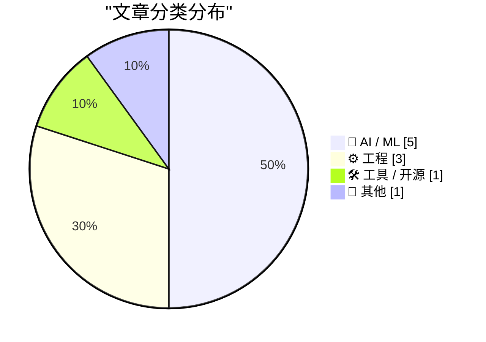
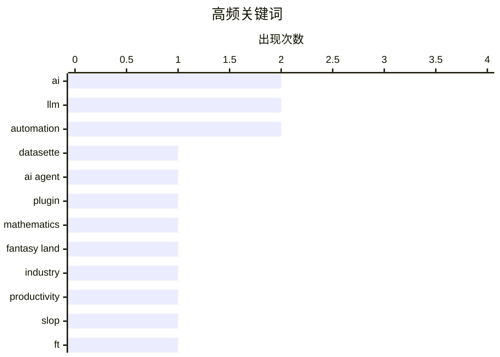

今日技术圈呈现三大趋势：首先，AI行业正遭遇深层次质疑——从生产力悖论到样本效率黑洞，多方声音警示AI发展可能存在数据依赖过度、产出质量下滑的可持续性问题；其次，xAI等公司从技术探索转向数据中心租赁等商业运营，揭示AI竞赛已进入务实变现阶段；再次，在工程实践中，AI在代码测试和重构领域展现出比自动编程更高的价值，而SwiftUI等开发工具则暴露出“易开发”与“好开发”之间的鸿沟。

<!--more-->


> 来自 Karpathy 推荐的 92 个顶级技术博客，AI 精选 Top 10

## 🏆 今日必读

🥇 **datasette-agent-edit 0.1a0 版本发布：面向 Datasette Agent 的文本编辑插件**

[datasette-agent-edit 0.1a0](https://simonwillison.net/2026/Jun/7/datasette-agent-edit/#atom-everything) — simonwillison.net · 22 小时前 · 🛠 工具 / 开源

> Datasette Agent 发布新插件 datasette-agent-edit 0.1a0，支持对现有文本进行协作式编辑，包括 Markdown、SQL 查询和 SVG 文件等场景。作者参考了 Claude 文本编辑器的设计，实现了 view（带行号查看文件）、str_replace（精确字符串替换）和 insert（指定行号后插入）三个核心工具。该插件旨在解决代理编辑文本的技术难题，为 Datasette 生态提供更强大的文本处理能力。

💡 **为什么值得读**: 如果你正在开发 AI 代理或需要实现文本编辑功能，这篇文章提供了具体可参考的工具设计模式和实现思路。

🏷️ Datasette, AI agent, plugin

🥈 **整个行业被疯狂的数学所支撑**

[An entire industry is being propped up by math that is insane.](https://garymarcus.substack.com/p/an-entire-industry-is-being-propped) — garymarcus.substack.com · 3 小时前 · 🤖 AI / ML

> Gary Marcus 在本文中批评当前 AI 行业过度依赖数学模型，认为这种基础存在根本性问题。他将现状描述为"fantasy land"（幻想之地），暗示许多所谓 AI 突破实际上缺乏坚实的理论基础。Marcus 是知名的 AI 批评者，此前多次对大语言模型的可靠性和安全性提出质疑。本文是他对 AI 行业技术路线的持续反思。

💡 **为什么值得读**: 如果你想了解 AI 领域内部人士对该行业现状的深度批评和反思，这篇文章提供了有价值的观点。

🏷️ AI, mathematics, fantasy land, industry

🥉 **Slop、生产力，以及为何 AI 驱动的世界正在一事无成**

[Slop, productivity, and why the AI-fueled world is going nowhere mighty fast](https://garymarcus.substack.com/p/slop-productivity-and-why-the-ai) — garymarcus.substack.com · 1 天前 · 🤖 AI / ML

> Gary Marcus 讨论了 AI 生产力悖论：尽管 AI 技术蓬勃发展，但实际产出价值却令人质疑。他引用 FT 记者 John Burn-Murdoch 的图表，说明 AI 驱动世界并未带来预期的生产力提升。Marcus 认为 AI 领域存在大量"slop"——即低质量、无意义的内容产出。他警告 AI 行业可能正在重蹈过去科技泡沫的覆辙，表面上繁荣实则空洞。

💡 **为什么值得读**: 这篇文章帮助你理解 AI 生产力争议的核心，适合关心 AI 行业实际价值的读者。

🏷️ AI, productivity, slop, FT

---

## 📊 数据概览

| 扫描源 | 抓取文章 | 时间范围 | 精选 |
|:---:|:---:|:---:|:---:|
| 87/92 | 2556 篇 → 31 篇 | 48h | **10 篇** |

### 分类分布



### 高频关键词



<details>
<summary>📈 纯文本关键词图（终端友好）</summary>

```
ai           │ ████████████████████ 2
llm          │ ████████████████████ 2
automation   │ ████████████████████ 2
datasette    │ ██████████░░░░░░░░░░ 1
ai agent     │ ██████████░░░░░░░░░░ 1
plugin       │ ██████████░░░░░░░░░░ 1
mathematics  │ ██████████░░░░░░░░░░ 1
fantasy land │ ██████████░░░░░░░░░░ 1
industry     │ ██████████░░░░░░░░░░ 1
productivity │ ██████████░░░░░░░░░░ 1
```

</details>

### 🏷️ 话题标签

**ai**(2) · **llm**(2) · **automation**(2) · datasette(1) · ai agent(1) · plugin(1) · mathematics(1) · fantasy land(1) · industry(1) · productivity(1) · slop(1) · ft(1) · sample efficiency(1) · ai scaling(1) · data(1) · xai(1) · gpu(1) · datacentre(1) · reit(1) · swiftui(1)

---

## 🤖 AI / ML

### 1. 整个行业被疯狂的数学所支撑

[An entire industry is being propped up by math that is insane.](https://garymarcus.substack.com/p/an-entire-industry-is-being-propped) — **garymarcus.substack.com** · 3 小时前 · ⭐ 24/30

> Gary Marcus 在本文中批评当前 AI 行业过度依赖数学模型，认为这种基础存在根本性问题。他将现状描述为"fantasy land"（幻想之地），暗示许多所谓 AI 突破实际上缺乏坚实的理论基础。Marcus 是知名的 AI 批评者，此前多次对大语言模型的可靠性和安全性提出质疑。本文是他对 AI 行业技术路线的持续反思。

🏷️ AI, mathematics, fantasy land, industry

---

### 2. Slop、生产力，以及为何 AI 驱动的世界正在一事无成

[Slop, productivity, and why the AI-fueled world is going nowhere mighty fast](https://garymarcus.substack.com/p/slop-productivity-and-why-the-ai) — **garymarcus.substack.com** · 1 天前 · ⭐ 24/30

> Gary Marcus 讨论了 AI 生产力悖论：尽管 AI 技术蓬勃发展，但实际产出价值却令人质疑。他引用 FT 记者 John Burn-Murdoch 的图表，说明 AI 驱动世界并未带来预期的生产力提升。Marcus 认为 AI 领域存在大量"slop"——即低质量、无意义的内容产出。他警告 AI 行业可能正在重蹈过去科技泡沫的覆辙，表面上繁荣实则空洞。

🏷️ AI, productivity, slop, FT

---

### 3. 样本效率黑洞

[The sample efficiency black hole](https://www.dwarkesh.com/p/the-sample-efficiency-black-hole) — **dwarkesh.com** · 4 小时前 · ⭐ 24/30

> 作者用形象的比喻揭示 AI 模型的深层问题：表面上 AI 展现出强大的能力，但实际上其核心存在一个"看不见的数据黑洞"——模型对训练数据的需求远超预期。尽管 AI 能力如星系般璀璨，但其基础依赖于海量数据这一不可见且难以持续的资源。本文探讨了当前大语言模型在数据效率上面临的根本性挑战，暗示 AI 发展可能存在不可持续性。

🏷️ LLM, sample efficiency, AI scaling, data

---

### 4. 使用 LLM 代理启动新项目的思考

[Thoughts on starting new projects with LLM agents](https://eli.thegreenplace.net/2026/thoughts-on-starting-new-projects-with-llm-agents/) — **eli.thegreenplace.net** · 1 天前 · ⭐ 23/30

> Eli 用 LLM 代理成功重构了他的 Python 项目（包括 pycparser），他分享了几点关键经验：1) LLM 代理在代码重构方面表现出色，比从零开始新项目更可靠；2) 项目重写取得了成功，此后维护没有问题；3) 但在完全陌生的领域使用 LLM 代理仍有挑战。他强调重构现有项目是 LLM 代理的最佳用例之一。

🏷️ LLM, AI agents, development tools, automation

---

### 5. AI 正在放缓

[AI Is Slowing Down](https://www.wheresyoured.at/ai-is-slowing-down/) — **wheresyoured.at** · 6 小时前 · ⭐ 22/30

> AI 发展速度正在放缓是本文的核心主题。文章来自一个付费订阅的高质量 AI 分析通讯，作者定期发布关于 NVIDIA、Anthropic 等公司的深度分析（通常 5000-18000 字）。虽然摘要本身没有透露具体数据，但文章暗示 AI 行业可能正面临增长瓶颈，这与行业内其他观察者的担忧相呼应。

🏷️ AI slowdown, LLM development, industry trends

---

## ⚙️ 工程

### 6. xAI 更像数据中心 REIT 而非前沿实验室

[xAI is looking more like a datacentre REIT than a frontier lab](https://martinalderson.com/posts/xais-new-rental-business/?utm_source=rss&amp;utm_medium=rss&amp;utm_campaign=feed) — **martinalderson.com** · 22 小时前 · ⭐ 24/30

> xAI 正在向数据中心租赁业务转型，而非继续作为前沿 AI 研究实验室运营。据报道，xAI 向 Anthropic 和 Google 出租大量 GPU 算力。作者分析这背后可能有三个原因：1) 为 SpaceX IPO 做财务优化；2) 实际存在算力短缺；3) 真正的数据中心优势。这种转变标志着 xAI 从技术探索转向商业运营。

🏷️ xAI, GPU, datacentre, REIT

---

### 7. SwiftUI 只让开发糟糕应用变得更容易

[★ SwiftUI Only Makes It Easy to Develop Bad Apps](https://daringfireball.net/2026/06/swiftui_only_makes_it_easy_to_develop_bad_apps) — **daringfireball.net** · 20 小时前 · ⭐ 23/30

> John Gruber 批评 SwiftUI 的核心理念问题：苹果过去宣称其平台不仅易于开发应用，更能开发高质量的原生应用。这对 AppKit 和 UIKit 仍然成立，但 SwiftUI 自发布七年来从未实现这一承诺。SwiftUI 虽然降低了开发门槛，但也使得开发质量低劣的应用变得更容易——它只做到了"easy to develop apps"，而非"easy to develop good apps"。文章还批评了苹果开发者营销的虚伪性。

🏷️ SwiftUI, iOS, app development

---

### 8. 软件测试的新时代

[A new era for software testing](http://antirez.com/news/168) — **antirez.com** · 1 天前 · ⭐ 23/30

> Redis 作者 antirez 认为自动编程（AI 写代码）虽能大幅缩短开发时间，但在代码质量上仍不及优秀的手写代码。然而在 QA 和测试领域，AI 带来了根本性变革——传统测试依赖本地测试和集成测试，而 AI 可以开启全新的、更高质量的自动化测试方式，且无需在质量上妥协。作者认为这是 AI 在软件开发中最有价值的应用场景之一。

🏷️ software testing, automation, programming

---

## 🛠 工具 / 开源

### 9. datasette-agent-edit 0.1a0 版本发布：面向 Datasette Agent 的文本编辑插件

[datasette-agent-edit 0.1a0](https://simonwillison.net/2026/Jun/7/datasette-agent-edit/#atom-everything) — **simonwillison.net** · 22 小时前 · ⭐ 25/30

> Datasette Agent 发布新插件 datasette-agent-edit 0.1a0，支持对现有文本进行协作式编辑，包括 Markdown、SQL 查询和 SVG 文件等场景。作者参考了 Claude 文本编辑器的设计，实现了 view（带行号查看文件）、str_replace（精确字符串替换）和 insert（指定行号后插入）三个核心工具。该插件旨在解决代理编辑文本的技术难题，为 Datasette 生态提供更强大的文本处理能力。

🏷️ Datasette, AI agent, plugin

---

## 📝 其他

### 10. 复制我的风格

[Copping My Style](https://feed.tedium.co/link/15204/17355475/adobe-creator-act-style-protection-commentary) — **tedium.co** · 1 天前 · ⭐ 22/30

> 讨论艺术风格的法律保护问题：目前美国法律无法保护艺术风格，但 Adobe 支持的一项法案提议引入这种保护，作为对 AI 生成艺术的回应。作者认为这涉及复杂的法律和伦理问题，艺术风格的边界本身就模糊。该法案被视为大型科技公司应对 AI 版权争议的一种策略。

🏷️ artistic style, copyright, Adobe, AI legislation

---

*生成于 2026-06-09 22:18 | 扫描 87 源 → 获取 2556 篇 → 精选 10 篇*
*基于 [Hacker News Popularity Contest 2025](https://refactoringenglish.com/tools/hn-popularity/) RSS 源列表，由 [Andrej Karpathy](https://x.com/karpathy) 推荐*
*由「懂点儿AI」制作，欢迎关注同名微信公众号获取更多 AI 实用技巧 💡*
