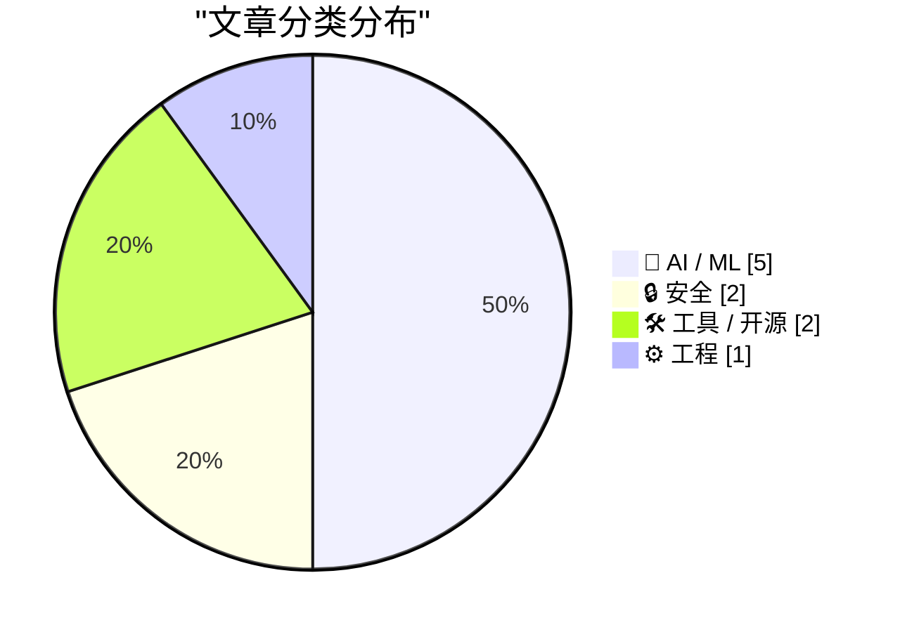
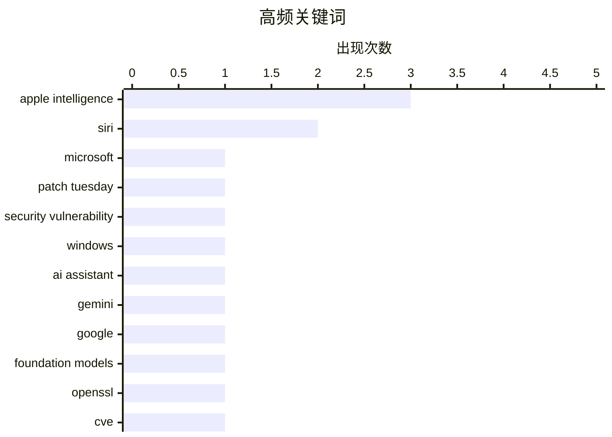

今日技术圈呈现两大核心议题：苹果在WWDC上全面发力AI，Siri与Apple Intelligence系统将AI能力深度融入iOS生态，并强调隐私优先的云端架构；同时，安全形势依然严峻，微软单月发布创纪录的200个漏洞补丁，OpenSSL再曝C语言内存安全漏洞，引发对传统代码安全性的警示。

<!--more-->


> 来自 Karpathy 推荐的 92 个顶级技术博客，AI 精选 Top 10

## 🏆 今日必读

🥇 **2026年6月创下纪录的补丁星期二**

[A Record-Breaking Patch Tuesday for June 2026](https://krebsonsecurity.com/2026/06/a-record-breaking-patch-tuesday-for-june-2026/) — krebsonsecurity.com · 10 分钟前 · 🔒 安全

> 微软今日发布安全更新，共修复约200个Windows系统及支持软件的安全漏洞，创下月度补丁星期二修复数量的新纪录。其中近36个漏洞被标记为最高等级的“严重“级别。目前至少有3个漏洞的利用代码已公开披露，意味这些漏洞可能已被攻击者利用。

💡 **为什么值得读**: 安全运维和系统管理员需要立即评估修复优先级，了解哪些漏洞已在野外被利用。

🏷️ Microsoft, Patch Tuesday, security vulnerability, Windows

🥈 **苹果发布Siri AI**

[Apple Introduces Siri AI](https://www.apple.com/newsroom/2026/06/apple-introduces-siri-ai-a-profoundly-more-capable-and-personal-assistant/) — daringfireball.net · 4 小时前 · 🤖 AI / ML

> 新版Siri基于Apple Intelligence构建，支持跨应用个人上下文理解。用户可让Siri查找朋友在消息中推荐的餐厅、从旧邮件中提取酒店确认号，或调取最近旅行的照片。Siri AI还支持跨应用操作，如从零起草邮件、编辑和分享照片集，并具备屏幕感知能力，可回答与屏幕上内容相关的问题。

💡 **为什么值得读**: iOS用户和开发者需要了解Siri的重大升级，判断是否值得升级设备体验。

🏷️ Siri, Apple Intelligence, AI assistant

🥉 **苹果WWDC宣布全新Apple Intelligence系统**

[Apple’s WWDC Announcement of the New Apple Intelligence System](https://www.apple.com/newsroom/2026/06/apple-intelligence-brings-powerful-ai-capabilities-into-everyday-experiences/) — daringfireball.net · 5 小时前 · 🤖 AI / ML

> 新系统由下一代Apple Foundation Models驱动，与Google及其Gemini模型深度整合。模型可在设备端和服务器上运行，采用Private Cloud Compute保护隐私。整个架构从模型到核心操作系统技术都以隐私优先为设计原则，将iPhone的隐私和安全扩展到云端。

💡 **为什么值得读**: 关注AI架构和隐私保护方案的技术决策者不应错过这篇官方声明。

🏷️ Apple Intelligence, Gemini, Google, foundation models

---

## 📊 数据概览

| 扫描源 | 抓取文章 | 时间范围 | 精选 |
|:---:|:---:|:---:|:---:|
| 87/92 | 2556 篇 → 41 篇 | 48h | **10 篇** |

### 分类分布



### 高频关键词



<details>
<summary>📈 纯文本关键词图（终端友好）</summary>

```
apple intelligence     │ ████████████████████ 3
siri                   │ █████████████░░░░░░░ 2
microsoft              │ ███████░░░░░░░░░░░░░ 1
patch tuesday          │ ███████░░░░░░░░░░░░░ 1
security vulnerability │ ███████░░░░░░░░░░░░░ 1
windows                │ ███████░░░░░░░░░░░░░ 1
ai assistant           │ ███████░░░░░░░░░░░░░ 1
gemini                 │ ███████░░░░░░░░░░░░░ 1
google                 │ ███████░░░░░░░░░░░░░ 1
foundation models      │ ███████░░░░░░░░░░░░░ 1
```

</details>

### 🏷️ 话题标签

**apple intelligence**(3) · **siri**(2) · **microsoft**(1) · patch tuesday(1) · security vulnerability(1) · windows(1) · ai assistant(1) · gemini(1) · google(1) · foundation models(1) · openssl(1) · cve(1) · vulnerability(1) · security(1) · wwdc(1) · real-time(1) · llm(1) · code generation(1) · performance(1) · apple(1)

---

## 🤖 AI / ML

### 1. 苹果发布Siri AI

[Apple Introduces Siri AI](https://www.apple.com/newsroom/2026/06/apple-introduces-siri-ai-a-profoundly-more-capable-and-personal-assistant/) — **daringfireball.net** · 4 小时前 · ⭐ 25/30

> 新版Siri基于Apple Intelligence构建，支持跨应用个人上下文理解。用户可让Siri查找朋友在消息中推荐的餐厅、从旧邮件中提取酒店确认号，或调取最近旅行的照片。Siri AI还支持跨应用操作，如从零起草邮件、编辑和分享照片集，并具备屏幕感知能力，可回答与屏幕上内容相关的问题。

🏷️ Siri, Apple Intelligence, AI assistant

---

### 2. 苹果WWDC宣布全新Apple Intelligence系统

[Apple’s WWDC Announcement of the New Apple Intelligence System](https://www.apple.com/newsroom/2026/06/apple-intelligence-brings-powerful-ai-capabilities-into-everyday-experiences/) — **daringfireball.net** · 5 小时前 · ⭐ 25/30

> 新系统由下一代Apple Foundation Models驱动，与Google及其Gemini模型深度整合。模型可在设备端和服务器上运行，采用Private Cloud Compute保护隐私。整个架构从模型到核心操作系统技术都以隐私优先为设计原则，将iPhone的隐私和安全扩展到云端。

🏷️ Apple Intelligence, Gemini, Google, foundation models

---

### 3. 苹果WWDC AI演示为实时真实录制

[Apple’s WWDC AI Demos Were Real and in Real Time](https://techcrunch.com/2026/06/08/apples-wwdc-ai-demos-looked-more-real-after-250m-false-ad-settlement/) — **daringfireball.net** · 4 小时前 · ⭐ 24/30

> 苹果在WWDC 2026的AI演示采用一次性连续拍摄方式呈现，虽然经过预录制但更贴近真实功能展示。与2024年经过精心制作视频但实际承诺超过成品的演示不同，2026年演示更能证明功能的实际可用性。

🏷️ Apple Intelligence, WWDC, Siri, real-time

---

### 4. LLM生成的代码近乎良好

[LLMs and almost good code](https://entropicthoughts.com/llms-and-almost-good-code) — **entropicthoughts.com** · 1 天前 · ⭐ 24/30

> 前沿LLM处理简单任务时，生成的代码复杂度平均比必要程度高约10%。这种额外复杂性往往被接受，因为代码能立即解决当前问题。但这种做法可能对长期代码维护产生负面影响。

🏷️ LLM, code generation, performance

---

### 5. 样本效率黑洞

[The sample efficiency black hole](https://www.dwarkesh.com/p/the-sample-efficiency-black-hole) — **dwarkesh.com** · 1 天前 · ⭐ 23/30

> 当前顶尖AI模型虽然表面能力出众，但核心存在一个难以察觉的“数据黑洞”，正是这个黑洞使得模型实际上需要海量训练数据来维持运作，这可能是一个未被重视的根本性问题。

🏷️ AI, sample efficiency, machine learning, data

---

## 🔒 安全

### 6. 2026年6月创下纪录的补丁星期二

[A Record-Breaking Patch Tuesday for June 2026](https://krebsonsecurity.com/2026/06/a-record-breaking-patch-tuesday-for-june-2026/) — **krebsonsecurity.com** · 10 分钟前 · ⭐ 26/30

> 微软今日发布安全更新，共修复约200个Windows系统及支持软件的安全漏洞，创下月度补丁星期二修复数量的新纪录。其中近36个漏洞被标记为最高等级的“严重“级别。目前至少有3个漏洞的利用代码已公开披露，意味这些漏洞可能已被攻击者利用。

🏷️ Microsoft, Patch Tuesday, security vulnerability, Windows

---

### 7. “无法预防”——只有这种语言才会定期发生此类事件

["No way to prevent this" say users of only language where this regularly happens](https://xeiaso.net/shitposts/no-way-to-prevent-this/memory-safety/CVE-2026-45447/) — **xeiaso.net** · 22 小时前 · ⭐ 25/30

> CVE-2026-45447漏洞影响OpenSSL项目，为PKCS7_verify()中的堆使用后释放错误。受影响组件使用C语言编写，而该语言是唯一能定期产生此类漏洞的编程语言。过去50年，全球90%的内存安全漏洞都发生在C语言项目中，使用C语言的项目存在安全漏洞的概率是其他语言的20倍。

🏷️ OpenSSL, CVE, vulnerability, security

---

## 🛠 工具 / 开源

### 8. 苹果WWDC 2026主题演讲

[Apple WWDC 2026 Keynote](https://www.youtube.com/watch?v=hF8swzNR1-o) — **daringfireball.net** · 4 小时前 · ⭐ 23/30

> 主题演讲时长76分钟（含片尾彩蛋音乐视频），较往年缩短约半小时。

🏷️ Apple, WWDC 2026, keynote, announcement

---

### 9. [赞助] WorkOS推出auth.md——代理注册开放协议

[[Sponsor] WorkOS Launches auth.md — an Open Protocol for Agent Registration](https://youtu.be/Dqp_b8GHLXU?t=1074) — **daringfireball.net** · 17 小时前 · ⭐ 23/30

> auth.md是一种开放协议，通过在服务端根目录暴露单一机器可读的Markdown文件，使AI代理能动态发现OAuth保护的资源元数据、解析所需权限范围并完成身份认证。WorkOS AuthKit提供原生支持，可开箱即用实现该协议。

🏷️ auth.md, OAuth, AI agents, protocol

---

## ⚙️ 工程

### 10. ★ SwiftUI只会让开发劣质应用变得更容易

[★ SwiftUI Only Makes It Easy to Develop Bad Apps](https://daringfireball.net/2026/06/swiftui_only_makes_it_easy_to_develop_bad_apps) — **daringfireball.net** · 1 天前 · ⭐ 23/30

> 苹果曾宣称开发平台应用不仅容易，而且能开发出符合规范的优质原生应用。AppKit和UIKit仍保持这一优势，但SwiftUI自推出7年以来从未实现这一目标。

🏷️ SwiftUI, UI framework, app development

---

*生成于 2026-06-10 22:18 | 扫描 87 源 → 获取 2556 篇 → 精选 10 篇*
*基于 [Hacker News Popularity Contest 2025](https://refactoringenglish.com/tools/hn-popularity/) RSS 源列表，由 [Andrej Karpathy](https://x.com/karpathy) 推荐*
*由「懂点儿AI」制作，欢迎关注同名微信公众号获取更多 AI 实用技巧 💡*
