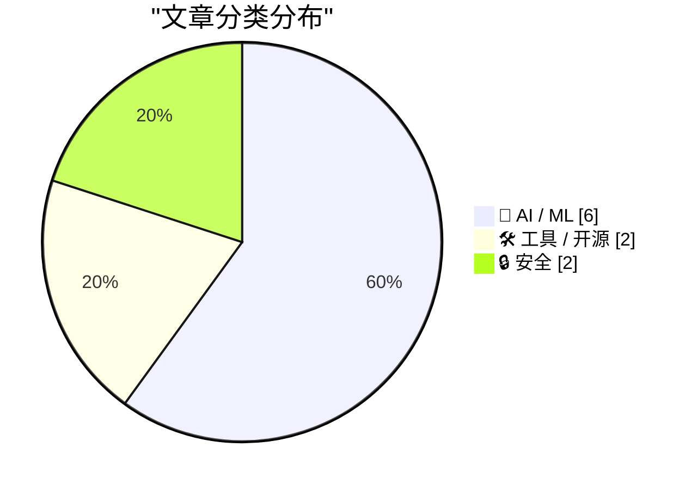
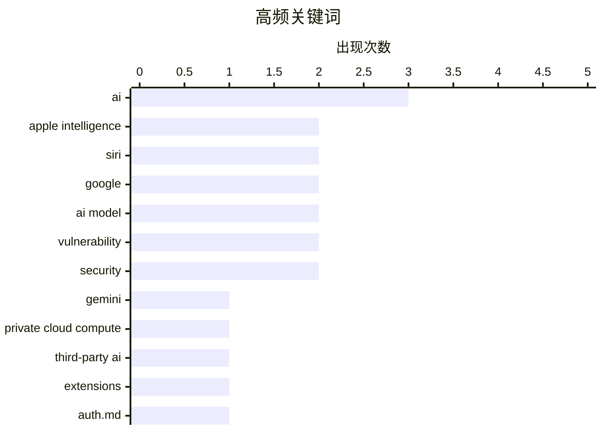

今日技术圈焦点集中在AI领域：苹果在WWDC上正式推出Apple Intelligence系统，Siri全面升级为AI版本，同时Google因AI幻觉问题引发法律责任讨论，显示AI应用正从技术探索转向合规问责阶段。安全方面迎来创纪录的Patch Tuesday更新，修复大量漏洞。开发者工具层面，WorkOS发布auth.md开放协议，推动AI代理注册的标准化进程。

<!--more-->


> 来自 Karpathy 推荐的 92 个顶级技术博客，AI 精选 Top 10

## 🏆 今日必读

🥇 **Apple’s WWDC Announcement of the New Apple Intelligence System**

[Apple’s WWDC Announcement of the New Apple Intelligence System](https://www.apple.com/newsroom/2026/06/apple-intelligence-brings-powerful-ai-capabilities-into-everyday-experiences/) — daringfireball.net · 1 天前 · 🤖 AI / ML

> Apple’s WWDC Announcement of the New Apple Intelligence System

🏷️ Apple Intelligence, Gemini, Private Cloud Compute

🥈 **From the Annals of People Having Knowledge of the Matter, Siri AI Extensions Edition**

[From the Annals of People Having Knowledge of the Matter, Siri AI Extensions Edition](https://www.bloomberg.com/news/articles/2026-03-26/apple-plans-to-open-up-siri-to-rival-ai-assistants-beyond-chatgpt-in-ios-27) — daringfireball.net · 1 天前 · 🤖 AI / ML

> From the Annals of People Having Knowledge of the Matter, Siri AI Extensions Edition

🏷️ Siri, third-party AI, extensions

🥉 **Apple Introduces Siri AI**

[Apple Introduces Siri AI](https://www.apple.com/newsroom/2026/06/apple-introduces-siri-ai-a-profoundly-more-capable-and-personal-assistant/) — daringfireball.net · 1 天前 · 🤖 AI / ML

> Apple Introduces Siri AI

🏷️ Siri, AI, Apple Intelligence

---

## 📊 数据概览

| 扫描源 | 抓取文章 | 时间范围 | 精选 |
|:---:|:---:|:---:|:---:|
| 87/92 | 2556 篇 → 38 篇 | 48h | **10 篇** |

### 分类分布



### 高频关键词



<details>
<summary>📈 纯文本关键词图（终端友好）</summary>

```
ai                    │ ████████████████████ 3
apple intelligence    │ █████████████░░░░░░░ 2
siri                  │ █████████████░░░░░░░ 2
google                │ █████████████░░░░░░░ 2
ai model              │ █████████████░░░░░░░ 2
vulnerability         │ █████████████░░░░░░░ 2
security              │ █████████████░░░░░░░ 2
gemini                │ ███████░░░░░░░░░░░░░ 1
private cloud compute │ ███████░░░░░░░░░░░░░ 1
third-party ai        │ ███████░░░░░░░░░░░░░ 1
```

</details>

### 🏷️ 话题标签

**ai**(3) · **apple intelligence**(2) · **siri**(2) · google(2) · ai model(2) · vulnerability(2) · security(2) · gemini(1) · private cloud compute(1) · third-party ai(1) · extensions(1) · auth.md(1) · ai agents(1) · oauth(1) · protocol(1) · diffusiongemma(1) · text generation(1) · claude(1) · fable 5(1) · performance(1)

---

## 🤖 AI / ML

### 1. Apple’s WWDC Announcement of the New Apple Intelligence System

[Apple’s WWDC Announcement of the New Apple Intelligence System](https://www.apple.com/newsroom/2026/06/apple-intelligence-brings-powerful-ai-capabilities-into-everyday-experiences/) — **daringfireball.net** · 1 天前 · ⭐ 28/30

> Apple’s WWDC Announcement of the New Apple Intelligence System

🏷️ Apple Intelligence, Gemini, Private Cloud Compute

---

### 2. From the Annals of People Having Knowledge of the Matter, Siri AI Extensions Edition

[From the Annals of People Having Knowledge of the Matter, Siri AI Extensions Edition](https://www.bloomberg.com/news/articles/2026-03-26/apple-plans-to-open-up-siri-to-rival-ai-assistants-beyond-chatgpt-in-ios-27) — **daringfireball.net** · 1 天前 · ⭐ 26/30

> From the Annals of People Having Knowledge of the Matter, Siri AI Extensions Edition

🏷️ Siri, third-party AI, extensions

---

### 3. Apple Introduces Siri AI

[Apple Introduces Siri AI](https://www.apple.com/newsroom/2026/06/apple-introduces-siri-ai-a-profoundly-more-capable-and-personal-assistant/) — **daringfireball.net** · 1 天前 · ⭐ 25/30

> Apple Introduces Siri AI

🏷️ Siri, AI, Apple Intelligence

---

### 4. DiffusionGemma

[DiffusionGemma](https://simonwillison.net/2026/Jun/10/diffusiongemma/#atom-everything) — **simonwillison.net** · 2 小时前 · ⭐ 24/30

> DiffusionGemma

🏷️ DiffusionGemma, Google, text generation, AI model

---

### 5. Initial impressions of Claude Fable 5

[Initial impressions of Claude Fable 5](https://simonwillison.net/2026/Jun/9/claude-fable-5/#atom-everything) — **simonwillison.net** · 22 小时前 · ⭐ 24/30

> Initial impressions of Claude Fable 5

🏷️ Claude, Fable 5, AI model, performance

---

### 6. Breaking: Google liable for hallucinations

[Breaking: Google liable for hallucinations](https://garymarcus.substack.com/p/breaking-google-liable-for-hallucinations) — **garymarcus.substack.com** · 5 小时前 · ⭐ 23/30

> Breaking: Google liable for hallucinations

🏷️ Google, AI, hallucination, legal

---

## 🛠 工具 / 开源

### 7. [Sponsor] WorkOS Launches auth.md — an Open Protocol for Agent Registration

[[Sponsor] WorkOS Launches auth.md — an Open Protocol for Agent Registration](https://youtu.be/Dqp_b8GHLXU?t=1074) — **daringfireball.net** · 1 天前 · ⭐ 25/30

> [Sponsor] WorkOS Launches auth.md — an Open Protocol for Agent Registration

🏷️ auth.md, AI agents, OAuth, protocol

---

### 8. llm 0.32a3

[llm 0.32a3](https://simonwillison.net/2026/Jun/9/llm/#atom-everything) — **simonwillison.net** · 23 小时前 · ⭐ 22/30

> llm 0.32a3

🏷️ llm, CLI, AI, tool

---

## 🔒 安全

### 9. A Record-Breaking Patch Tuesday for June 2026

[A Record-Breaking Patch Tuesday for June 2026](https://krebsonsecurity.com/2026/06/a-record-breaking-patch-tuesday-for-june-2026/) — **krebsonsecurity.com** · 1 天前 · ⭐ 24/30

> A Record-Breaking Patch Tuesday for June 2026

🏷️ Microsoft, Patch Tuesday, vulnerability, security

---

### 10. "No way to prevent this" say users of only language where this regularly happens

["No way to prevent this" say users of only language where this regularly happens](https://xeiaso.net/shitposts/no-way-to-prevent-this/memory-safety/CVE-2026-45447/) — **xeiaso.net** · 1 天前 · ⭐ 23/30

> "No way to prevent this" say users of only language where this regularly happens

🏷️ OpenSSL, CVE, vulnerability, security

---

*生成于 2026-06-11 22:18 | 扫描 87 源 → 获取 2556 篇 → 精选 10 篇*
*基于 [Hacker News Popularity Contest 2025](https://refactoringenglish.com/tools/hn-popularity/) RSS 源列表，由 [Andrej Karpathy](https://x.com/karpathy) 推荐*
*由「懂点儿AI」制作，欢迎关注同名微信公众号获取更多 AI 实用技巧 💡*
