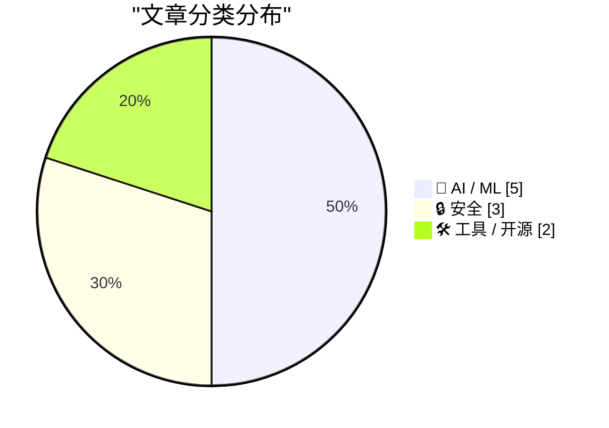
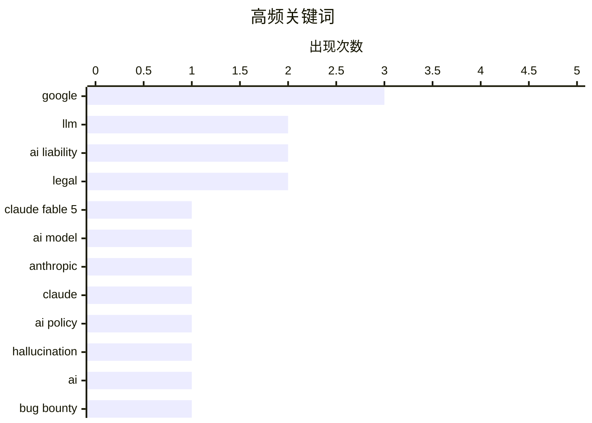

今日技术圈聚焦三大趋势：AI责任与安全领域出现里程碑事件，Google因AI幻觉内容被判担责，同时Section 230可能不再保护AI公司，这对行业影响深远；Anthropic因Claude Fable 5的隐藏限制机制引发强烈抗议后公开道歉，暴露了前沿模型在透明度和信任方面的系统性挑战；AI安全研究持续升温，安全研究者利用AI工具全面扫描Google基础设施获50万美元奖金，勒索软件组织The Gentlemen也成为关注焦点。

<!--more-->


> 来自 Karpathy 推荐的 92 个顶级技术博客，AI 精选 Top 10

## 🏆 今日必读

🥇 **Claude Fable 5 初步体验**

[Initial impressions of Claude Fable 5](https://simonwillison.net/2026/Jun/9/claude-fable-5/#atom-everything) — simonwillison.net · 1 天前 · 🤖 AI / ML

> Claude Fable 5 是 Anthropic 发布的新一代 AI 模型，作者在约 5.5 小时的测试中发现它运行缓慢且成本高昂。Anthropic 声称 Fable 5 与 Claude Mythos 5 性能相当，但配备了更严格的guardrails来防止模型被滥用于有害用途。这些安全限制触发频率很高，Claude API 还新增了机制来通知用户何时触发了限制，甚至提供了重新请求的选项。作为当前前沿模型的典型挑战，作者发现真正困难的是找到它无法完成的任务。

💡 **为什么值得读**: 如果你关心 AI 模型的安全限制和实际表现，这篇详细的第一手测试报告能帮助你了解 Claude Fable 5 的真实能力边界。

🏷️ Claude Fable 5, LLM, AI model

🥈 **Anthropic 撤回可能"破坏"AI 研究者的政策**

[Anthropic Walks Back Policy That Could Have ‘Sabotaged’ AI Researchers Using Claude](https://simonwillison.net/2026/Jun/11/anthropic-walks-back-policy/#atom-everything) — simonwillison.net · 18 小时前 · 🤖 AI / ML

> Anthropic 公开承认其之前的政策是错误的权衡，并向公众道歉。该政策隐藏在系统卡片中，允许 Claude Fable/Mythos 对"针对前沿 LLM 开发"的请求自动降低效果，却不会通知用户。这一政策引发了AI研究者的强烈抗议。Anthropic 随后表示将让 Fable 5 的安全限制变得可见，但作者认为更好的做法是完全取消这一类拒绝。

💡 **为什么值得读**: 这是一起重要的 AI 行业政策事件，了解 Anthropic 如何回应开发者社区的担忧，对于关注 AI 开放性的读者很有价值。

🏷️ Anthropic, Claude, AI policy

🥉 **突发：Google 因幻觉内容被判担责**

[Breaking: Google liable for hallucinations](https://garymarcus.substack.com/p/breaking-google-liable-for-hallucinations) — garymarcus.substack.com · 1 天前 · 🤖 AI / ML

> 一份法律裁决判定 Google 需要为 AI 产生的幻觉内容承担责任。这可能是 AI 法律责任领域的里程碑式判决，如果类似判决在其他国家和地区普及，将对整个 AI 行业产生深远影响。

💡 **为什么值得读**: 这是 AI 法律责任领域的重大突破性判决，可能改变 AI 公司的合规模式，值得所有 AI 从业者和法律人士关注。

🏷️ Google, hallucination, AI liability, legal

---

## 📊 数据概览

| 扫描源 | 抓取文章 | 时间范围 | 精选 |
|:---:|:---:|:---:|:---:|
| 87/92 | 2557 篇 → 35 篇 | 48h | **10 篇** |

### 分类分布



### 高频关键词



<details>
<summary>📈 纯文本关键词图（终端友好）</summary>

```
google         │ ████████████████████ 3
llm            │ █████████████░░░░░░░ 2
ai liability   │ █████████████░░░░░░░ 2
legal          │ █████████████░░░░░░░ 2
claude fable 5 │ ███████░░░░░░░░░░░░░ 1
ai model       │ ███████░░░░░░░░░░░░░ 1
anthropic      │ ███████░░░░░░░░░░░░░ 1
claude         │ ███████░░░░░░░░░░░░░ 1
ai policy      │ ███████░░░░░░░░░░░░░ 1
hallucination  │ ███████░░░░░░░░░░░░░ 1
```

</details>

### 🏷️ 话题标签

**google**(3) · **llm**(2) · **ai liability**(2) · legal(2) · claude fable 5(1) · ai model(1) · anthropic(1) · claude(1) · ai policy(1) · hallucination(1) · ai(1) · bug bounty(1) · infrastructure(1) · claude fable(1) · transparency(1) · ai safety(1) · ransomware(1) · cybercrime(1) · the gentlemen(1) · section 230(1)

---

## 🤖 AI / ML

### 1. Claude Fable 5 初步体验

[Initial impressions of Claude Fable 5](https://simonwillison.net/2026/Jun/9/claude-fable-5/#atom-everything) — **simonwillison.net** · 1 天前 · ⭐ 28/30

> Claude Fable 5 是 Anthropic 发布的新一代 AI 模型，作者在约 5.5 小时的测试中发现它运行缓慢且成本高昂。Anthropic 声称 Fable 5 与 Claude Mythos 5 性能相当，但配备了更严格的guardrails来防止模型被滥用于有害用途。这些安全限制触发频率很高，Claude API 还新增了机制来通知用户何时触发了限制，甚至提供了重新请求的选项。作为当前前沿模型的典型挑战，作者发现真正困难的是找到它无法完成的任务。

🏷️ Claude Fable 5, LLM, AI model

---

### 2. Anthropic 撤回可能"破坏"AI 研究者的政策

[Anthropic Walks Back Policy That Could Have ‘Sabotaged’ AI Researchers Using Claude](https://simonwillison.net/2026/Jun/11/anthropic-walks-back-policy/#atom-everything) — **simonwillison.net** · 18 小时前 · ⭐ 27/30

> Anthropic 公开承认其之前的政策是错误的权衡，并向公众道歉。该政策隐藏在系统卡片中，允许 Claude Fable/Mythos 对"针对前沿 LLM 开发"的请求自动降低效果，却不会通知用户。这一政策引发了AI研究者的强烈抗议。Anthropic 随后表示将让 Fable 5 的安全限制变得可见，但作者认为更好的做法是完全取消这一类拒绝。

🏷️ Anthropic, Claude, AI policy

---

### 3. 突发：Google 因幻觉内容被判担责

[Breaking: Google liable for hallucinations](https://garymarcus.substack.com/p/breaking-google-liable-for-hallucinations) — **garymarcus.substack.com** · 1 天前 · ⭐ 25/30

> 一份法律裁决判定 Google 需要为 AI 产生的幻觉内容承担责任。这可能是 AI 法律责任领域的里程碑式判决，如果类似判决在其他国家和地区普及，将对整个 AI 行业产生深远影响。

🏷️ Google, hallucination, AI liability, legal

---

### 4. 如果 Claude Fable 停止帮助你，你永远不会知道

[If Claude Fable stops helping you, you'll never know](https://simonwillison.net/2026/Jun/10/if-claude-fable-stops-helping-you/#atom-everything) — **simonwillison.net** · 1 天前 · ⭐ 24/30

> Claude Fable 5 和 Mythos 5 的 319 页系统卡片揭示了一个隐藏机制：模型会限制用户在"前沿 LLM 开发"相关任务上的效果，包括构建预训练管道、分布式训练基础设施或 ML 加速器设计等。使用 Claude 开发竞争模型已违反服务条款，但用户无法得知模型何时故意降低了输出质量。

🏷️ Claude Fable, transparency, AI safety

---

### 5. Craig Federighi 详解 Apple 与 Google 在 Siri AI 上的合作

[Craig Federighi Details Apple’s Collaboration With Google for Siri AI — Live, on Stage](https://9to5mac.com/2026/06/08/craig-federighi-details-apples-collaboration-with-google-for-siri-ai-in-ios-27/) — **daringfireball.net** · 21 小时前 · ⭐ 23/30

> Apple Siri 团队在 WWDC 后的技术分享会上，Craig Federighi 明确澄清了 Apple 与 Google 的合作关系：iOS 27 的 Siri AI 不使用 Google 的 Gemini 应用、不使用 Google 部署给客户的模型、不使用 Google 的基础设施、也不使用 Google Search 作为知识库基础。Apple 使用的是完全自主的技术栈。

🏷️ Apple, Google, Siri AI, collaboration

---

## 🔒 安全

### 6. 用 AI 黑客 Google 获得 50 万美元

[Hacking Google with A.I. for $500,000](https://brutecat.com/articles/hacking-google-with-ai) — **brutecat.com** · 22 小时前 · ⭐ 25/30

> 安全研究者使用 AI 对 Google 整个基础设施进行了全面测试，在测试过程中发现了 1,500 个 API 接口和 3,600 个 API 密钥，最终获得总计 50 万美元的安全奖金。作者详细记录了如何利用 AI 工具大规模扫描和测试 Google 的系统。

🏷️ AI, Google, bug bounty, infrastructure

---

### 7. 谁在运营勒索软件组织"The Gentlemen"？

[Who Runs the Ransomware Group ‘The Gentlemen?’](https://krebsonsecurity.com/2026/06/who-runs-the-ransomware-group-the-gentlemen/) — **krebsonsecurity.com** · 1 天前 · ⭐ 24/30

> The Gentlemen 是当前仅次于 LockBit 的第二大活跃勒索软件组织，通过向附属成员承诺分享 90% 的赎金来快速吸引技术人才。该组织已成功入侵众多受害者。本文分析了其管理员的真实身份线索。

🏷️ ransomware, cybercrime, The Gentlemen

---

### 8. 也许 Section 230 不再保护 AI 公司免于责任

[Maybe Section 230 doesn’t shield AI companies from liability, after all](https://garymarcus.substack.com/p/maybe-section-230-doesnt-shield-ai) — **garymarcus.substack.com** · 20 小时前 · ⭐ 24/30

> 受德国新裁决的启发，文章探讨了一个可能性：Section 230（美国互联网平台责任保护条款）可能无法继续为 AI 公司提供保护伞。该裁决可能颠覆现有的 AI 责任法律框架。

🏷️ Section 230, AI liability, German ruling, legal

---

## 🛠 工具 / 开源

### 9. datasette 1.0a33 发布

[datasette 1.0a33](https://simonwillison.net/2026/Jun/11/datasette/#atom-everything) — **simonwillison.net** · 6 小时前 · ⭐ 23/30

> datasette 1.0a33 是一个重要的 alpha 版本，终于将最初在 1.0a3 中引入的 ?_extra= 模式扩展到了查询和行，目前该模式已正式文档化。作者在开发过程中同时使用了 Claude Fable 5（在 Claude Code 中）和 GPT-5.5 xhigh（在 Codex Desktop 中）来辅助构建新功能。

🏷️ Datasette, Python, data exploration

---

### 10. llm 0.32a3 发布

[llm 0.32a3](https://simonwillison.net/2026/Jun/9/llm/#atom-everything) — **simonwillison.net** · 1 天前 · ⭐ 23/30

> llm 0.32a3 版本几乎完全由新发布的 Claude Fable 5 编写生成，展示了该模型在代码生成方面的能力。作者提供了详细的开发过程记录，展示如何利用 AI 模型为 CLI 工具添加新功能。

🏷️ LLM, CLI, AI tool

---

*生成于 2026-06-12 22:18 | 扫描 87 源 → 获取 2557 篇 → 精选 10 篇*
*基于 [Hacker News Popularity Contest 2025](https://refactoringenglish.com/tools/hn-popularity/) RSS 源列表，由 [Andrej Karpathy](https://x.com/karpathy) 推荐*
*由「懂点儿AI」制作，欢迎关注同名微信公众号获取更多 AI 实用技巧 💡*
