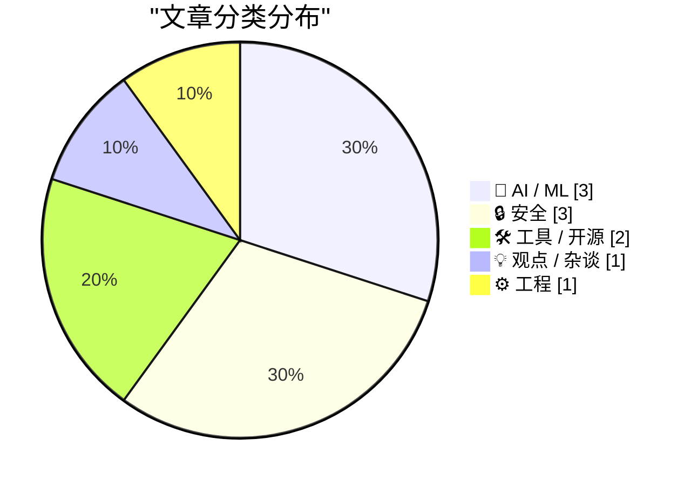
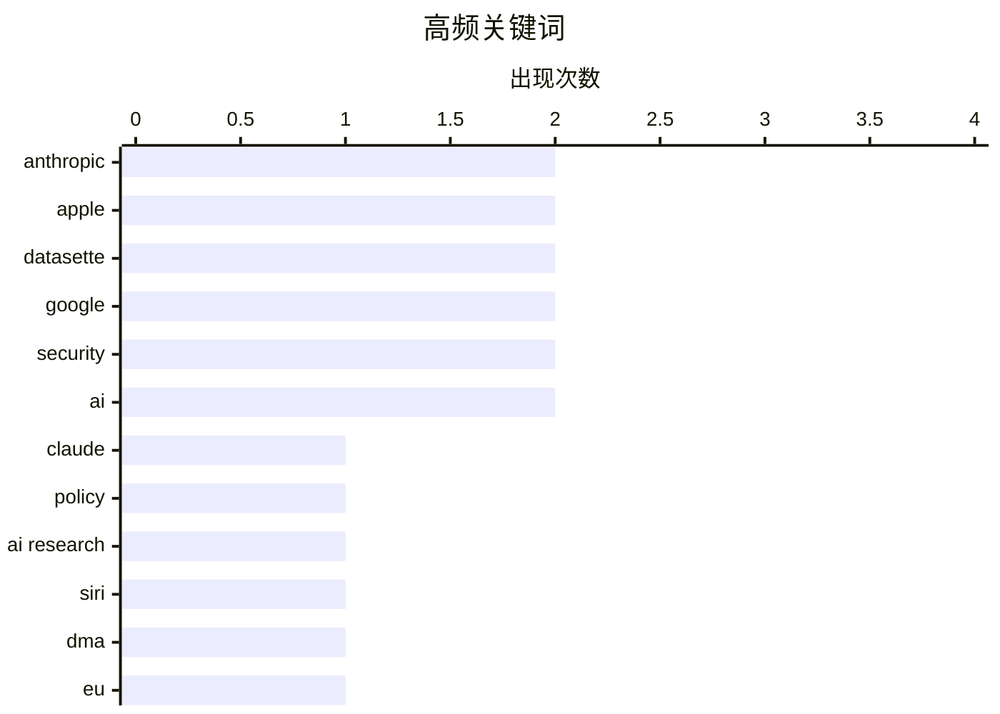

今日AI圈焦点集中于监管与安全双重挑战：Anthropic因限制AI研究人员政策引发强烈反弹后致歉撤销，欧盟DMA法规更导致Siri AI功能延迟上线，凸显AI发展与隐私监管间的深层矛盾；与此同时，AI安全成为本周热点，安全研究员通过AI工具从Google获取50万美元漏洞赏金，而关于Section 230是否适用于AI公司的法律讨论也在升温。市场竞争层面，OpenAI考虑大幅降价预示AI大模型市场进入价格战前夜，Datasette等开发者工具的持续迭代则展示AI辅助编程生态的稳步推进。

<!--more-->


> 来自 Karpathy 推荐的 92 个顶级技术博客，AI 精选 Top 10

## 🏆 今日必读

🥇 **Anthropic撤回可能"破坏"AI研究人员的Claude政策**

[Anthropic Walks Back Policy That Could Have ‘Sabotaged’ AI Researchers Using Claude](https://simonwillison.net/2026/Jun/11/anthropic-walks-back-policy/#atom-everything) — simonwillison.net · 1 天前 · 🤖 AI / ML

> Anthropic宣布撤回Fable 5中针对"前沿LLM开发请求"的隐藏限制政策，该政策曾允许Claude在不被用户察觉的情况下降低AI研究人员的使用效率。Wired报道后引发业界强烈反弹，Anthropic公开承认"做出了错误的权衡"并致歉。新政策将让相关限制变得可见，但作者认为最理想的做法是完全取消这类拒绝类别。

💡 **为什么值得读**: 对AI研究社区有重要参考价值，反映了AI公司安全政策与开源研究之间的权衡困境

🏷️ Anthropic, Claude, policy, AI research

🥈 **因DMA要求，Siri AI在欧盟延迟至iOS 27和iPadOS 27**

[Apple: ‘Due to DMA, Siri AI Delayed in EU for iOS 27 and iPadOS 27’](https://www.apple.com/newsroom/2026/06/due-to-dma-siri-ai-delayed-in-eu-for-ios-27-and-ipados-27/) — daringfireball.net · 1 天前 · 🤖 AI / ML

> 欧盟DMA法规要求AI系统获得几乎无限制访问用户设备的权限，包括读取/发送消息、购买、访问文件和在任何应用上执行操作。Apple警告这会带来严重安全风险，AI系统可能被劫持以窃取密码、照片等个人数据，甚至在未经用户同意的情况下永久更改文件和应用设置。为此Apple设计了"Trusted System Agent"作为虚拟助手与系统之间的安全中介，计划在欧盟逐步推出该方案后再上线Siri AI。

💡 **为什么值得读**: 揭示了AI助手全球化部署面临的新型监管和技术安全挑战

🏷️ Siri, DMA, EU, Apple

🥉 **也许Section 230根本不保护AI公司**

[Maybe Section 230 doesn’t shield AI companies from liability, after all](https://garymarcus.substack.com/p/maybe-section-230-doesnt-shield-ai) — garymarcus.substack.com · 1 天前 · 🔒 安全

> 受德国新裁决启发，探讨Section 230（美国互联网平台责任保护条款）是否应该适用于AI公司。该裁决可能颠覆现有法律框架，对AI公司的责任界定产生重大影响。

💡 **为什么值得读**: 法律爱好者可了解AI责任领域的前沿判例和监管趋势

🏷️ Section 230, AI liability, regulation, German ruling

---

## 📊 数据概览

| 扫描源 | 抓取文章 | 时间范围 | 精选 |
|:---:|:---:|:---:|:---:|
| 87/92 | 2557 篇 → 35 篇 | 48h | **10 篇** |

### 分类分布



### 高频关键词



<details>
<summary>📈 纯文本关键词图（终端友好）</summary>

```
anthropic   │ ████████████████████ 2
apple       │ ████████████████████ 2
datasette   │ ████████████████████ 2
google      │ ████████████████████ 2
security    │ ████████████████████ 2
ai          │ ████████████████████ 2
claude      │ ██████████░░░░░░░░░░ 1
policy      │ ██████████░░░░░░░░░░ 1
ai research │ ██████████░░░░░░░░░░ 1
siri        │ ██████████░░░░░░░░░░ 1
```

</details>

### 🏷️ 话题标签

**anthropic**(2) · **apple**(2) · **datasette**(2) · google(2) · security(2) · ai(2) · claude(1) · policy(1) · ai research(1) · siri(1) · dma(1) · eu(1) · section 230(1) · ai liability(1) · regulation(1) · german ruling(1) · sqlite(1) · database(1) · remote attestation(1) · deflation(1)

---

## 🤖 AI / ML

### 1. Anthropic撤回可能"破坏"AI研究人员的Claude政策

[Anthropic Walks Back Policy That Could Have ‘Sabotaged’ AI Researchers Using Claude](https://simonwillison.net/2026/Jun/11/anthropic-walks-back-policy/#atom-everything) — **simonwillison.net** · 1 天前 · ⭐ 27/30

> Anthropic宣布撤回Fable 5中针对"前沿LLM开发请求"的隐藏限制政策，该政策曾允许Claude在不被用户察觉的情况下降低AI研究人员的使用效率。Wired报道后引发业界强烈反弹，Anthropic公开承认"做出了错误的权衡"并致歉。新政策将让相关限制变得可见，但作者认为最理想的做法是完全取消这类拒绝类别。

🏷️ Anthropic, Claude, policy, AI research

---

### 2. 因DMA要求，Siri AI在欧盟延迟至iOS 27和iPadOS 27

[Apple: ‘Due to DMA, Siri AI Delayed in EU for iOS 27 and iPadOS 27’](https://www.apple.com/newsroom/2026/06/due-to-dma-siri-ai-delayed-in-eu-for-ios-27-and-ipados-27/) — **daringfireball.net** · 1 天前 · ⭐ 25/30

> 欧盟DMA法规要求AI系统获得几乎无限制访问用户设备的权限，包括读取/发送消息、购买、访问文件和在任何应用上执行操作。Apple警告这会带来严重安全风险，AI系统可能被劫持以窃取密码、照片等个人数据，甚至在未经用户同意的情况下永久更改文件和应用设置。为此Apple设计了"Trusted System Agent"作为虚拟助手与系统之间的安全中介，计划在欧盟逐步推出该方案后再上线Siri AI。

🏷️ Siri, DMA, EU, Apple

---

### 3. OpenAI考虑大幅降价

[Breaking: OpenAI is pondering “drastic” price cuts.](https://garymarcus.substack.com/p/breaking-openai-is-pondering-drastic) — **garymarcus.substack.com** · 1 天前 · ⭐ 22/30

> OpenAI正在考虑"大幅"降低AI服务价格，作者认为这反映出公司面临的竞争压力和市场挑战。价格调整可能预示AI大模型市场竞争格局的变化。

🏷️ OpenAI, pricing, LLM, business

---

## 🔒 安全

### 4. 也许Section 230根本不保护AI公司

[Maybe Section 230 doesn’t shield AI companies from liability, after all](https://garymarcus.substack.com/p/maybe-section-230-doesnt-shield-ai) — **garymarcus.substack.com** · 1 天前 · ⭐ 24/30

> 受德国新裁决启发，探讨Section 230（美国互联网平台责任保护条款）是否应该适用于AI公司。该裁决可能颠覆现有法律框架，对AI公司的责任界定产生重大影响。

🏷️ Section 230, AI liability, regulation, German ruling

---

### 5. Google新远程认证方案和旧方案一样糟糕

[Pluralistic: Google's new remote attestation scheme is every bit as terrible as its old remote attestation scheme (12 Jun 2026)](https://pluralistic.net/2026/06/12/compelled-speech/) — **pluralistic.net** · 1 小时前 · ⭐ 23/30

> 文章批评Google的远程认证方案即使升级也未能解决根本问题。作者回顾了"agentic AI"概念出现前的传统技术背景，浏览器曾被称为"user agent"代表用户在互联网上执行操作。新方案采用QR码形式但作者认为仍然存在缺陷。

🏷️ Google, remote attestation, security

---

### 6. 用AI黑掉Google，奖金500000美元

[Hacking Google with A.I. for $500,000](https://brutecat.com/articles/hacking-google-with-ai) — **brutecat.com** · 1 天前 · ⭐ 23/30

> 安全研究员通过AI在Google基础设施上发现1,500个API、3,600个密钥，获取了500,000美元漏洞赏金。展示了对Google大规模系统进行AI驱动安全测试的成果。

🏷️ AI, Google, security, bounty

---

## 🛠 工具 / 开源

### 7. datasette 1.0a33发布

[datasette 1.0a33](https://simonwillison.net/2026/Jun/11/datasette/#atom-everything) — **simonwillison.net** · 1 天前 · ⭐ 23/30

> Datasette 1.0a33是通往稳定版1.0的重要里程碑，首次将?_extra=查询参数模式从表扩展到查询和行。该模式现已加入官方文档。开发者使用Claude Fable 5和GPT-5.5构建了API explorer工具，展示了当前AI辅助编程工具的成熟度。

🏷️ Datasette, SQLite, database

---

### 8. datasette-agent 0.2a0发布

[datasette-agent 0.2a0](https://simonwillison.net/2026/Jun/10/datasette-agent/#atom-everything) — **simonwillison.net** · 1 天前 · ⭐ 22/30

> Datasette Agent 0.2a0新增两项重要功能：一是工具可在执行过程中通过context.ask_user()向用户提问，支持是/否、多选和自由文本模式，问题未回答时代理暂停执行；二是新增内置save_query工具，允许将编写SQL保存为命名查询。

🏷️ Datasette, agent, tool execution

---

## 💡 观点 / 杂谈

### 9. AI将大幅通缩

[AI will be massively deflationary](https://geohot.github.io//blog/jekyll/update/2026/06/11/ai-will-be-deflationary.html) — **geohot.github.io** · 1 天前 · ⭐ 23/30

> 作者调侃Anthropic批评者仍然相信其营销话术，认为Claude是递归自我改进的神，暗示这赋予了Anthropic比实际更大的影响力。文章探讨AI对经济的通缩影响。

🏷️ AI, deflation, economy, Anthropic

---

## ⚙️ 工程

### 10. 终于可以远程开机Mac

[You can finally power on a Mac remotely](https://www.jeffgeerling.com/blog/2026/power-on-your-mac-remotely/) — **jeffgeerling.com** · 8 小时前 · ⭐ 22/30

> Apple在macOS 26.5中正式支持远程开机功能，用户可通过网络远程唤醒Mac而无需物理按下电源按钮。该功能被媒体猜测是对M4 mini电源按钮位置争议的回应，但作者更看重其对远程服务器管理和自动化场景的实际价值。

🏷️ Apple, remote control, Mac

---

*生成于 2026-06-13 22:18 | 扫描 87 源 → 获取 2557 篇 → 精选 10 篇*
*基于 [Hacker News Popularity Contest 2025](https://refactoringenglish.com/tools/hn-popularity/) RSS 源列表，由 [Andrej Karpathy](https://x.com/karpathy) 推荐*
*由「懂点儿AI」制作，欢迎关注同名微信公众号获取更多 AI 实用技巧 💡*
