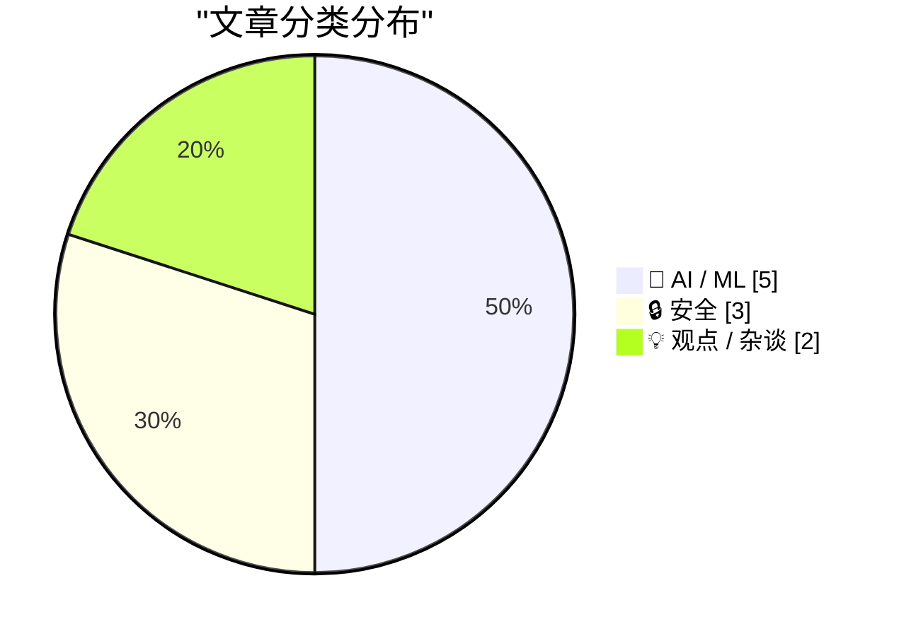
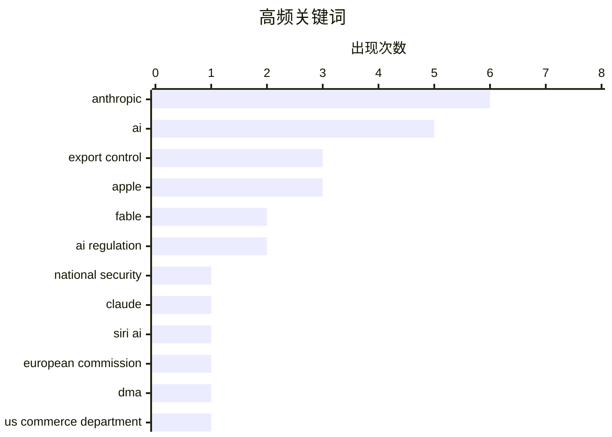

今日看点：美国政府以国家安全为由向Anthropic下达出口管制指令，紧急暂停Fable 5和Mythos 5对所有外国人的访问权限，AI模型出口管制收紧信号明显；Apple在WWDC 2026上宣布的Private Cloud Compute对第三方开发者设限，引发生态争议；与此同时，硅谷科技公司加速IPO进程，OpenAI和Anthropic先后递交上市申请，行业面临流动性大考。

<!--more-->


> 来自 Karpathy 推荐的 92 个顶级技术博客，AI 精选 Top 10

## 🏆 今日必读

🥇 **美国政府指令要求暂停Fable 5和Mythos 5模型访问**

[Statement on the US government directive to suspend access to Fable 5 and Mythos 5](https://simonwillison.net/2026/Jun/13/us-government-directive-to-suspend-access/#atom-everything) — simonwillison.net · 21 小时前 · 🤖 AI / ML

> 美国政府以国家安全为由，向Anthropic发出出口管制指令，要求立即停止向所有外国人（包括海外员工）提供Fable 5和Mythos 5模型访问权限。政府未披露具体安全关切细节，但声称发现了一种可能“越狱”Fable 5的方法。Anthropic审查了该演示，发现所谓的漏洞相对简单，其他公开可用的模型也能发现类似问题。其他Anthropic模型（如Claude Sonnet、Haiku等）不受此次指令影响。

💡 **为什么值得读**: 这是AI行业首次因国家安全理由对前沿模型实施出口限制的标志性事件，反映了生成式AI技术在地缘政治中的敏感地位。

🏷️ AI, export control, Anthropic, national security

🥈 **U.S. Government Directs Anthropic to Shut Down Fable 5 and Mythos 5 Models on National Security Grounds**

[U.S. Government Directs Anthropic to Shut Down Fable 5 and Mythos 5 Models on National Security Grounds](https://www.anthropic.com/news/fable-mythos-access) — daringfireball.net · 5 小时前 · 🤖 AI / ML

> Anthropic:


  The US government, citing national security authorities, has
issued an export control directive to suspend all access to Fable
5 and Mythos 5 by any foreign national, whether inside or 

🏷️ AI, export control, Anthropic, Fable

🥉 **Claude Fable is relentlessly proactive**

[Claude Fable is relentlessly proactive](https://simonwillison.net/2026/Jun/11/fable-is-relentlessly-proactive/#atom-everything) — simonwillison.net · 1 天前 · 🤖 AI / ML

> <p>After two days of experience with <a href="https://simonwillison.net/2026/Jun/9/claude-fable-5/">Claude Fable 5</a> I think the best way to describe it is <strong>relentlessly proactive</strong>. I

🏷️ Claude, Anthropic, AI, Fable

---

## 📊 数据概览

| 扫描源 | 抓取文章 | 时间范围 | 精选 |
|:---:|:---:|:---:|:---:|
| 87/92 | 2557 篇 → 30 篇 | 48h | **10 篇** |

### 分类分布



### 高频关键词



<details>
<summary>📈 纯文本关键词图（终端友好）</summary>

```
anthropic           │ ████████████████████ 6
ai                  │ █████████████████░░░ 5
export control      │ ██████████░░░░░░░░░░ 3
apple               │ ██████████░░░░░░░░░░ 3
fable               │ ███████░░░░░░░░░░░░░ 2
ai regulation       │ ███████░░░░░░░░░░░░░ 2
national security   │ ███░░░░░░░░░░░░░░░░░ 1
claude              │ ███░░░░░░░░░░░░░░░░░ 1
siri ai             │ ███░░░░░░░░░░░░░░░░░ 1
european commission │ ███░░░░░░░░░░░░░░░░░ 1
```

</details>

### 🏷️ 话题标签

**anthropic**(6) · **ai**(5) · **export control**(3) · apple(3) · fable(2) · ai regulation(2) · national security(1) · claude(1) · siri ai(1) · european commission(1) · dma(1) · us commerce department(1) · model shutdown(1) · us government(1) · silicon valley(1) · startups(1) · openai(1) · private cloud compute(1) · developer(1) · wwdc(1)

---

## 🤖 AI / ML

### 1. 美国政府指令要求暂停Fable 5和Mythos 5模型访问

[Statement on the US government directive to suspend access to Fable 5 and Mythos 5](https://simonwillison.net/2026/Jun/13/us-government-directive-to-suspend-access/#atom-everything) — **simonwillison.net** · 21 小时前 · ⭐ 27/30

> 美国政府以国家安全为由，向Anthropic发出出口管制指令，要求立即停止向所有外国人（包括海外员工）提供Fable 5和Mythos 5模型访问权限。政府未披露具体安全关切细节，但声称发现了一种可能“越狱”Fable 5的方法。Anthropic审查了该演示，发现所谓的漏洞相对简单，其他公开可用的模型也能发现类似问题。其他Anthropic模型（如Claude Sonnet、Haiku等）不受此次指令影响。

🏷️ AI, export control, Anthropic, national security

---

### 2. U.S. Government Directs Anthropic to Shut Down Fable 5 and Mythos 5 Models on National Security Grounds

[U.S. Government Directs Anthropic to Shut Down Fable 5 and Mythos 5 Models on National Security Grounds](https://www.anthropic.com/news/fable-mythos-access) — **daringfireball.net** · 5 小时前 · ⭐ 27/30

> Anthropic:


  The US government, citing national security authorities, has
issued an export control directive to suspend all access to Fable
5 and Mythos 5 by any foreign national, whether inside or 

🏷️ AI, export control, Anthropic, Fable

---

### 3. Claude Fable is relentlessly proactive

[Claude Fable is relentlessly proactive](https://simonwillison.net/2026/Jun/11/fable-is-relentlessly-proactive/#atom-everything) — **simonwillison.net** · 1 天前 · ⭐ 24/30

> <p>After two days of experience with <a href="https://simonwillison.net/2026/Jun/9/claude-fable-5/">Claude Fable 5</a> I think the best way to describe it is <strong>relentlessly proactive</strong>. I

🏷️ Claude, Anthropic, AI, Fable

---

### 4. Apple’s Private Cloud Compute Is Severely Limited for Third-Party Developers

[Apple’s Private Cloud Compute Is Severely Limited for Third-Party Developers](https://developer.apple.com/private-cloud-compute/) — **daringfireball.net** · 4 小时前 · ⭐ 22/30

> From Apple’s Developer site:


  To ensure getting started with a large cloud model is as
accessible as possible, developers in the App Store Small Business
Program with fewer than two million first t

🏷️ Apple, Private Cloud Compute, AI, developer

---

### 5. Why are cached input tokens cheaper with AI services?

[Why are cached input tokens cheaper with AI services?](https://xeiaso.net/notes/2026/why-llm-cached-token-cheaper/) — **xeiaso.net** · 1 天前 · ⭐ 22/30

> TL;DR: the GPU doesn't have to math as hard

🏷️ AI, tokens, caching, cost optimization

---

## 🔒 安全

### 6. The European Commission Response to Siri AI and the DMA

[The European Commission Response to Siri AI and the DMA](https://www.linkedin.com/posts/thomas-regnier-24a05810b_what-is-the-true-story-behind-apples-decision-activity-7470439874664280064-TuEt) — **daringfireball.net** · 1 天前 · ⭐ 24/30

> Thomas Regnier, spokesperson for the European Commission, in a statement posted to LinkedIn (with edited video, if you’d like to watch him read parts aloud):


  What is the true story behind Apple’s 

🏷️ Apple, Siri AI, European Commission, DMA

---

### 7. Breaking news: US Commerce Department effectively shuts down Anthropic’s latest models

[Breaking news: US Commerce Department effectively shuts down Anthropic’s latest models](https://garymarcus.substack.com/p/breaking-news-us-commerce-department) — **garymarcus.substack.com** · 20 小时前 · ⭐ 24/30

> After two years of underregulating AI, the US government suddenly takes the nuclear option

🏷️ Anthropic, US Commerce Department, AI regulation, model shutdown

---

### 8. Dangerous Technology For Americans Only

[Dangerous Technology For Americans Only](https://lucumr.pocoo.org/2026/6/13/americans-only/) — **lucumr.pocoo.org** · 22 小时前 · ⭐ 23/30

> There is a bit of schadenfreude on Twitter right now about Anthropic being hit
by the US government’s export control directive to suspend access to Fable and
Mythos.  Anthropic and
their leadership ha

🏷️ Anthropic, export control, AI regulation, US government

---

## 💡 观点 / 杂谈

### 9. Premium: The Silicon Valley Bubble (Part 1)

[Premium: The Silicon Valley Bubble (Part 1)](https://www.wheresyoured.at/premium-the-silicon-valley-bubble-part-1/) — **wheresyoured.at** · 1 天前 · ⭐ 23/30

> Friends, I believe we&#x2019;re approaching the end of this era. Both OpenAI and Anthropic have filed the paperwork to go public, starting a race for exit liquidity for two companies that burn billion

🏷️ Silicon Valley, startups, OpenAI, Anthropic

---

### 10. ★ The Talk Show: Live From WWDC 2026

[★ The Talk Show: Live From WWDC 2026](https://daringfireball.net/2026/06/the_talk_show_live_from_wwdc_2026) — **daringfireball.net** · 22 小时前 · ⭐ 22/30

> Recorded in front of a live audience at The California Theatre in San Jose on Tuesday 9 June 2026, special guests Joanna Stern and Nilay Patel join John Gruber to discuss Apple’s announcements at WWDC

🏷️ WWDC, Apple, podcast, 2026

---

*生成于 2026-06-14 22:18 | 扫描 87 源 → 获取 2557 篇 → 精选 10 篇*
*基于 [Hacker News Popularity Contest 2025](https://refactoringenglish.com/tools/hn-popularity/) RSS 源列表，由 [Andrej Karpathy](https://x.com/karpathy) 推荐*
*由「懂点儿AI」制作，欢迎关注同名微信公众号获取更多 AI 实用技巧 💡*
