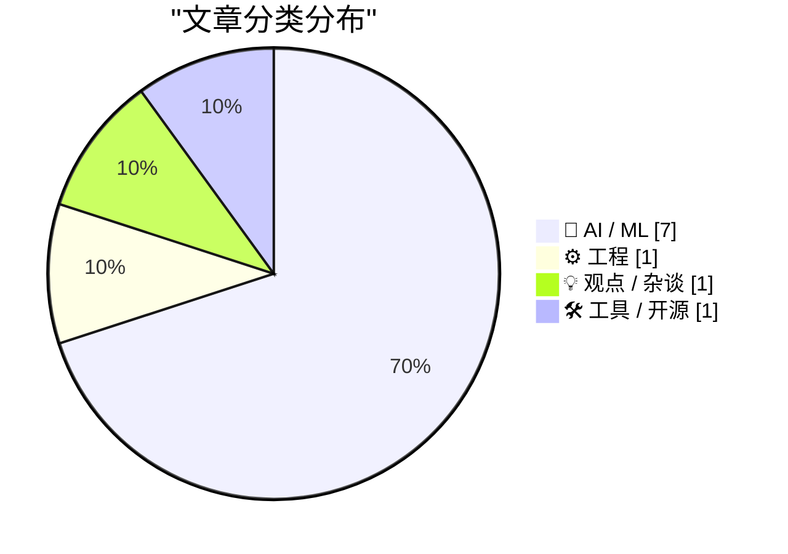
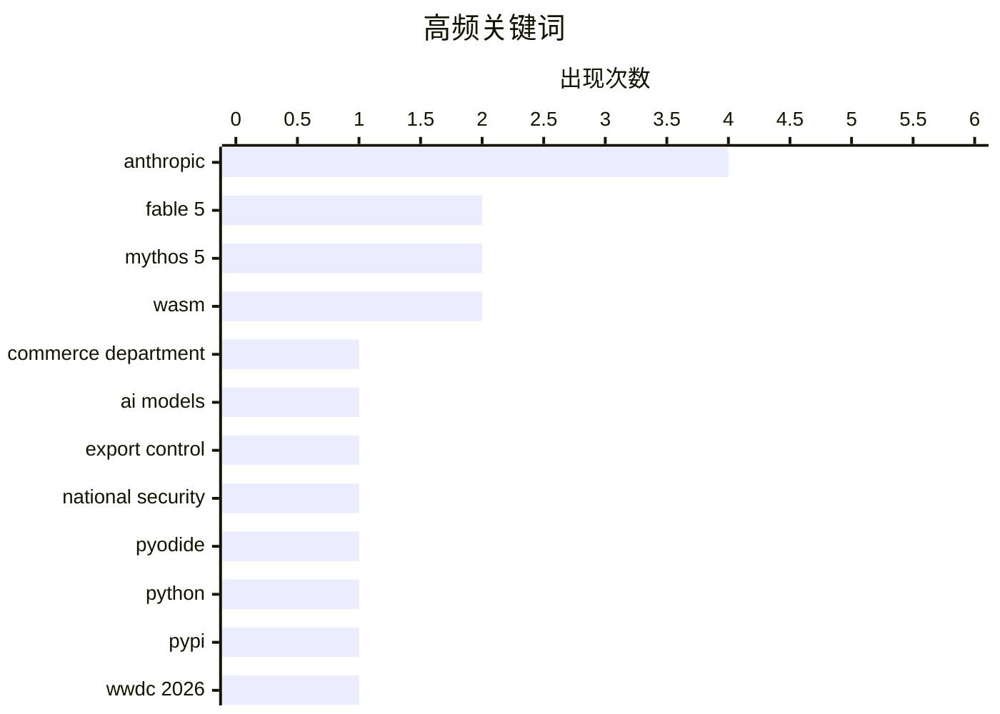

美国政府对Anthropic实施紧急出口管制，一刀切禁止外国访问其最新模型，从监管空白直接跳至“核选项”，暴露AI政策制定严重失序。与此同时，白宫缺乏统一监管框架，各州被迫自行制定AI政策，行业面临政策碎片化风险。技术圈另一亮点在于WebAssembly生态加速发展，Pyodide 314.0支持直接向PyPI发布WASM轮子，luau-wasm等运行时相继面世，浏览器端Python/Lua运行正成为新基建。

<!--more-->


> 来自 Karpathy 推荐的 92 个顶级技术博客，AI 精选 Top 10

## 🏆 今日必读

🥇 **美国商务部有效阻止Anthropic最新模型：监管180度大转弯**

[Breaking news: US Commerce Department effectively shuts down Anthropic’s latest models](https://garymarcus.substack.com/p/breaking-news-us-commerce-department) — garymarcus.substack.com · 1 天前 · 🤖 AI / ML

> 美国商务部在两年AI监管不力后突然采取极端措施，有效关闭了Anthropic的最新模型。Gary Marcus报道了这一突发事件，认为政府从监管空白直接跳到核选项，反映出AI政策制定的混乱。政府此前缺乏系统监管，如今却一刀切地阻止技术出口，行业措手不及。

💡 **为什么值得读**: 揭示了美国AI监管政策从放任到封禁的剧烈转变，是理解当前AI地缘政治局势的关键报道。

🏷️ Anthropic, Commerce Department, AI models

🥈 **Anthropic声明：政府指令要求暂停Fable 5和Mythos 5访问**

[Statement on the US government directive to suspend access to Fable 5 and Mythos 5](https://simonwillison.net/2026/Jun/13/us-government-directive-to-suspend-access/#atom-everything) — simonwillison.net · 1 天前 · 🤖 AI / ML

> 美国政府援引国家安全权力发布出口管制指令，要求立即暂停Fable 5和Mythos 5对所有外国公民的访问，包括Anthropic的外籍员工。指令于下午5:21分送达，未提供具体安全关切细节。政府声称发现了绕开或"越狱"Fable 5的方法。Anthropic确认其他所有模型不受影响。

💡 **为什么值得读**: 这是了解美国政府如何以国家安全为由限制AI技术出口的第一手官方声明。

🏷️ Fable 5, Mythos 5, export control, Anthropic

🥉 **Anthropic官方声明：政府要求关闭Fable 5和Mythos 5**

[U.S. Government Directs Anthropic to Shut Down Fable 5 and Mythos 5 Models on National Security Grounds](https://www.anthropic.com/news/fable-mythos-access) — daringfireball.net · 1 天前 · 🤖 AI / ML

> 美国政府援引国家安全权威发布出口管制指令，要求暂停Fable 5和Mythos 5对任何外国国民的访问，包括在美的外国员工。指令导致必须 abruptedly为所有客户禁用这两款模型以确保合规。政府未说明具体安全担忧，但声称发现了"越狱"方法。Anthropic审查后发现这些漏洞相对简单，其他公开模型也能发现。

💡 **为什么值得读**: 官方声明揭示了政府禁用AI模型的具体理由和执行方式，对理解当前AI出口管制有重要参考价值。

🏷️ Anthropic, Fable 5, Mythos 5, national security

---

## 📊 数据概览

| 扫描源 | 抓取文章 | 时间范围 | 精选 |
|:---:|:---:|:---:|:---:|
| 87/92 | 2557 篇 → 23 篇 | 48h | **10 篇** |

### 分类分布



### 高频关键词



<details>
<summary>📈 纯文本关键词图（终端友好）</summary>

```
anthropic           │ ████████████████████ 4
fable 5             │ ██████████░░░░░░░░░░ 2
mythos 5            │ ██████████░░░░░░░░░░ 2
wasm                │ ██████████░░░░░░░░░░ 2
commerce department │ █████░░░░░░░░░░░░░░░ 1
ai models           │ █████░░░░░░░░░░░░░░░ 1
export control      │ █████░░░░░░░░░░░░░░░ 1
national security   │ █████░░░░░░░░░░░░░░░ 1
pyodide             │ █████░░░░░░░░░░░░░░░ 1
python              │ █████░░░░░░░░░░░░░░░ 1
```

</details>

### 🏷️ 话题标签

**anthropic**(4) · **fable 5**(2) · **mythos 5**(2) · wasm(2) · commerce department(1) · ai models(1) · export control(1) · national security(1) · pyodide(1) · python(1) · pypi(1) · wwdc 2026(1) · apple(1) · technology(1) · conference(1) · export controls(1) · ai regulation(1) · ai(1) · thinking(1) · human-machine(1)

---

## 🤖 AI / ML

### 1. 美国商务部有效阻止Anthropic最新模型：监管180度大转弯

[Breaking news: US Commerce Department effectively shuts down Anthropic’s latest models](https://garymarcus.substack.com/p/breaking-news-us-commerce-department) — **garymarcus.substack.com** · 1 天前 · ⭐ 27/30

> 美国商务部在两年AI监管不力后突然采取极端措施，有效关闭了Anthropic的最新模型。Gary Marcus报道了这一突发事件，认为政府从监管空白直接跳到核选项，反映出AI政策制定的混乱。政府此前缺乏系统监管，如今却一刀切地阻止技术出口，行业措手不及。

🏷️ Anthropic, Commerce Department, AI models

---

### 2. Anthropic声明：政府指令要求暂停Fable 5和Mythos 5访问

[Statement on the US government directive to suspend access to Fable 5 and Mythos 5](https://simonwillison.net/2026/Jun/13/us-government-directive-to-suspend-access/#atom-everything) — **simonwillison.net** · 1 天前 · ⭐ 26/30

> 美国政府援引国家安全权力发布出口管制指令，要求立即暂停Fable 5和Mythos 5对所有外国公民的访问，包括Anthropic的外籍员工。指令于下午5:21分送达，未提供具体安全关切细节。政府声称发现了绕开或"越狱"Fable 5的方法。Anthropic确认其他所有模型不受影响。

🏷️ Fable 5, Mythos 5, export control, Anthropic

---

### 3. Anthropic官方声明：政府要求关闭Fable 5和Mythos 5

[U.S. Government Directs Anthropic to Shut Down Fable 5 and Mythos 5 Models on National Security Grounds](https://www.anthropic.com/news/fable-mythos-access) — **daringfireball.net** · 1 天前 · ⭐ 26/30

> 美国政府援引国家安全权威发布出口管制指令，要求暂停Fable 5和Mythos 5对任何外国国民的访问，包括在美的外国员工。指令导致必须 abruptedly为所有客户禁用这两款模型以确保合规。政府未说明具体安全担忧，但声称发现了"越狱"方法。Anthropic审查后发现这些漏洞相对简单，其他公开模型也能发现。

🏷️ Anthropic, Fable 5, Mythos 5, national security

---

### 4. 危险技术只给美国人：技术分裂世界的警示

[Dangerous Technology For Americans Only](https://lucumr.pocoo.org/2026/6/13/americans-only/) — **lucumr.pocoo.org** · 1 天前 · ⭐ 24/30

> Anthropic因政府出口管制被要求关闭Fable和Mythos，这反映了技术政策的讽刺——企业曾声称技术危险需要严格控制，现在政府将此 framing 付诸实施。作者警告不应将此作为笑料，因为真正的问题是：美国正在划定只有美国人应拥有这些技术的界限。这预示着走向技术分裂的世界：如果模型对所有人太危险，对美国人同样应该如此。

🏷️ Anthropic, export controls, AI regulation

---

### 5. 机器语言的的人类路由器

[Human Routers of Machine Words](https://borretti.me/article/human-routers-of-machine-words) — **borretti.me** · 1 天前 · ⭐ 23/30

> 探讨使用AI进行思考的人们——他们作为AI生成内容与现实世界之间的中介角色。文章分析了人类如何利用AI作为思维工具，在信息传播和观点塑造中扮演路由器角色。

🏷️ AI, thinking, human-machine, collaboration

---

### 6. OpenAI WebRTC音频会话更新：新增文档上下文支持

[OpenAI WebRTC Audio Session, now with document context](https://simonwillison.net/2026/Jun/12/openai-webrtc/#atom-everything) — **simonwillison.net** · 1 天前 · ⭐ 22/30

> OpenAI WebRTC Audio Session工具更新，新增文档上下文支持。用户可选择GPT-Realtime-2模型（"首个具有GPT-5类推理的语音模型"，知识截止2024年9月），并可粘贴大段文档内容进行语音对话。该工具最初于2024年12月构建，用于体验OpenAI实时音频API。

🏷️ OpenAI, WebRTC, audio, document context

---

### 7. 白宫混乱的AI政策：各州被迫自谋出路

[The White House’s shambolic AI policy](https://garymarcus.substack.com/p/the-white-houses-shambolic-ai-policy) — **garymarcus.substack.com** · 1 天前 · ⭐ 22/30

> Gary Marcus批评白宫AI政策混乱无序，缺乏清晰的联邦框架导致各州被迫自行制定AI监管政策。作者分析了当前政策失灵的根源，并探讨了可能更好的替代方案。

🏷️ AI policy, White House, regulation

---

## ⚙️ 工程

### 8. Pyodide 314.0发布：现在可直接向PyPI发布WASM轮子

[Publishing WASM wheels to PyPI for use with Pyodide](https://simonwillison.net/2026/Jun/13/publishing-wasm-wheels/#atom-everything) — **simonwillison.net** · 22 小时前 · ⭐ 25/30

> Pyodide 314.0版本重大更新，现在可将为Pyodide构建的Python包直接发布到PyPI并在运行时安装。此前维护者需手动构建和托管超过300个包，成为社区瓶颈。开发者只需按PEP783定义的PyEmscripten平台构建并发布WASM轮子，与Linux、macOS、Windows原生轮子流程一致。

🏷️ Pyodide, WASM, Python, PyPI

---

## 💡 观点 / 杂谈

### 9. The Talk Show特别节目：WWDC 2026现场录制

[★ The Talk Show: Live From WWDC 2026](https://daringfireball.net/2026/06/the_talk_show_live_from_wwdc_2026) — **daringfireball.net** · 1 天前 · ⭐ 25/30

> 2026年6月9日在圣何塞加州剧院现场录制，Joanna Stern和Nilay Patel作为特别嘉宾，与John Gruber讨论苹果在WWDC 2026上的发布内容。节目在观众面前实时录制，是Daring Fireball的经典Talk Show形式。

🏷️ WWDC 2026, Apple, technology, conference

---

## 🛠 工具 / 开源

### 10. luau-wasm 0.1a0发布：Lua的WebAssembly运行时

[luau-wasm 0.1a0](https://simonwillison.net/2026/Jun/13/luau-wasm/#atom-everything) — **simonwillison.net** · 23 小时前 · ⭐ 22/30

> luau-wasm 0.1a0版本发布，这是一个Lua语言的WebAssembly运行时实现。配合Pyodide的WASM轮子发布功能实现，允许在浏览器中运行Lua代码。

🏷️ Lua, WASM, compiler, luau

---

*生成于 2026-06-15 22:18 | 扫描 87 源 → 获取 2557 篇 → 精选 10 篇*
*基于 [Hacker News Popularity Contest 2025](https://refactoringenglish.com/tools/hn-popularity/) RSS 源列表，由 [Andrej Karpathy](https://x.com/karpathy) 推荐*
*由「懂点儿AI」制作，欢迎关注同名微信公众号获取更多 AI 实用技巧 💡*
