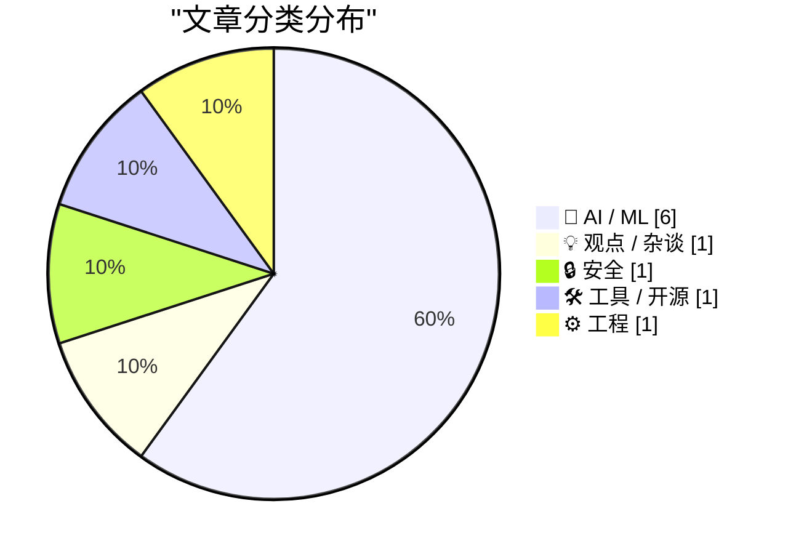
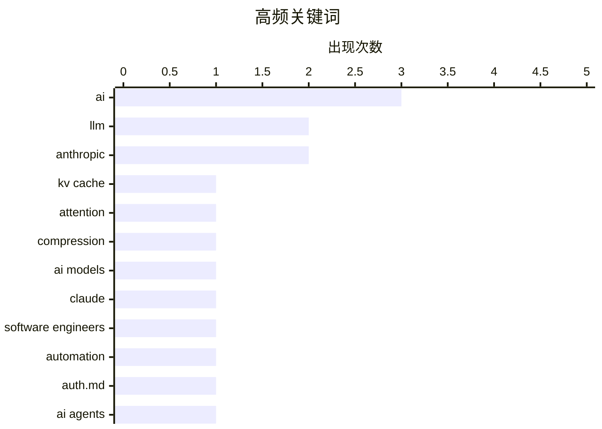

今日技术圈聚焦三大趋势：一是AI基础设施持续演进，KV cache压缩技术迭代加速，GPU硬件寿命话题引发讨论，同时WASM等工具链完善为开发者提供新选择；二是AI行业面临“成长烦恼”，Anthropic内部冲突导致模型下线的消息撕开光环，AI经济性问题与安全性讨论再度升温；三是关于AI与软件工程关系的反思持续深入，业界普遍认为AI当前仍无法替代专业工程师，但正催生“业余开发者”生态的崛起。

<!--more-->


> 来自 Karpathy 推荐的 92 个顶级技术博客，AI 精选 Top 10

## 🏆 今日必读

🥇 **A brief history of KV cache compression developments**

[A brief history of KV cache compression developments](https://martinalderson.com/posts/a-brief-history-of-kv-cache-compression-developments/?utm_source=rss&amp;utm_medium=rss&amp;utm_campaign=feed) — martinalderson.com · 22 小时前 · 🤖 AI / ML

> A brief history of KV cache compression developments

🏷️ KV cache, LLM, attention, compression

🥈 **"They screwed us": Personality clashes sent Anthropic's models offline**

["They screwed us": Personality clashes sent Anthropic's models offline](https://simonwillison.net/2026/Jun/15/axios-clashes-anthropics/#atom-everything) — simonwillison.net · 7 小时前 · 🤖 AI / ML

> "They screwed us": Personality clashes sent Anthropic's models offline

🏷️ Anthropic, AI models, Claude

🥉 **Why AI hasn’t replaced software engineers, and won’t**

[Why AI hasn’t replaced software engineers, and won’t](https://simonwillison.net/2026/Jun/14/why-ai-hasnt-replaced-software-engineers/#atom-everything) — simonwillison.net · 22 小时前 · 💡 观点 / 杂谈

> Why AI hasn’t replaced software engineers, and won’t

🏷️ AI, software engineers, automation

---

## 📊 数据概览

| 扫描源 | 抓取文章 | 时间范围 | 精选 |
|:---:|:---:|:---:|:---:|
| 87/92 | 2560 篇 → 27 篇 | 48h | **10 篇** |

### 分类分布



### 高频关键词



<details>
<summary>📈 纯文本关键词图（终端友好）</summary>

```
ai                 │ ████████████████████ 3
llm                │ █████████████░░░░░░░ 2
anthropic          │ █████████████░░░░░░░ 2
kv cache           │ ███████░░░░░░░░░░░░░ 1
attention          │ ███████░░░░░░░░░░░░░ 1
compression        │ ███████░░░░░░░░░░░░░ 1
ai models          │ ███████░░░░░░░░░░░░░ 1
claude             │ ███████░░░░░░░░░░░░░ 1
software engineers │ ███████░░░░░░░░░░░░░ 1
automation         │ ███████░░░░░░░░░░░░░ 1
```

</details>

### 🏷️ 话题标签

**ai**(3) · **llm**(2) · **anthropic**(2) · kv cache(1) · attention(1) · compression(1) · ai models(1) · claude(1) · software engineers(1) · automation(1) · auth.md(1) · ai agents(1) · protocol(1) · authentication(1) · economics(1) · nvidia(1) · pyodide(1) · wasm(1) · python(1) · pypi(1)

---

## 🤖 AI / ML

### 1. A brief history of KV cache compression developments

[A brief history of KV cache compression developments](https://martinalderson.com/posts/a-brief-history-of-kv-cache-compression-developments/?utm_source=rss&amp;utm_medium=rss&amp;utm_campaign=feed) — **martinalderson.com** · 22 小时前 · ⭐ 25/30

> A brief history of KV cache compression developments

🏷️ KV cache, LLM, attention, compression

---

### 2. "They screwed us": Personality clashes sent Anthropic's models offline

["They screwed us": Personality clashes sent Anthropic's models offline](https://simonwillison.net/2026/Jun/15/axios-clashes-anthropics/#atom-everything) — **simonwillison.net** · 7 小时前 · ⭐ 24/30

> "They screwed us": Personality clashes sent Anthropic's models offline

🏷️ Anthropic, AI models, Claude

---

### 3. AI's Brokenomics

[AI's Brokenomics](https://www.wheresyoured.at/brokenomics/) — **wheresyoured.at** · 2 小时前 · ⭐ 23/30

> AI's Brokenomics

🏷️ AI, economics, NVIDIA

---

### 4. AI GPUs probably live longer than three years

[AI GPUs probably live longer than three years](https://seangoedecke.com/ai-gpus-live-longer-than-three-years/) — **seangoedecke.com** · 22 小时前 · ⭐ 22/30

> AI GPUs probably live longer than three years

🏷️ GPU, AI hardware, infrastructure

---

### 5. Pluralistic: AI and amateurism (15 Jun 2026)

[Pluralistic: AI and amateurism (15 Jun 2026)](https://pluralistic.net/2026/06/15/vernacular/) — **pluralistic.net** · 6 小时前 · ⭐ 21/30

> Pluralistic: AI and amateurism (15 Jun 2026)

🏷️ AI, amateurism, generative content

---

### 6. ‘Anthropic’s Safety Superpower’

[‘Anthropic’s Safety Superpower’](https://stratechery.com/2026/anthropics-safety-superpower/) — **daringfireball.net** · 4 小时前 · ⭐ 20/30

> ‘Anthropic’s Safety Superpower’

🏷️ Anthropic, AI safety, LLM

---

## 💡 观点 / 杂谈

### 7. Why AI hasn’t replaced software engineers, and won’t

[Why AI hasn’t replaced software engineers, and won’t](https://simonwillison.net/2026/Jun/14/why-ai-hasnt-replaced-software-engineers/#atom-everything) — **simonwillison.net** · 22 小时前 · ⭐ 24/30

> Why AI hasn’t replaced software engineers, and won’t

🏷️ AI, software engineers, automation

---

## 🔒 安全

### 8. WorkOS Launches Auth.md — an Open Protocol for Agent Registration

[WorkOS Launches Auth.md — an Open Protocol for Agent Registration](https://workos.com/auth-md?utm_source=daringfireball&amp;utm_medium=newsletter&amp;utm_campaign=q22026) — **daringfireball.net** · 4 小时前 · ⭐ 23/30

> WorkOS Launches Auth.md — an Open Protocol for Agent Registration

🏷️ Auth.md, AI agents, protocol, authentication

---

## 🛠 工具 / 开源

### 9. Publishing WASM wheels to PyPI for use with Pyodide

[Publishing WASM wheels to PyPI for use with Pyodide](https://simonwillison.net/2026/Jun/13/publishing-wasm-wheels/#atom-everything) — **simonwillison.net** · 1 天前 · ⭐ 22/30

> Publishing WASM wheels to PyPI for use with Pyodide

🏷️ Pyodide, WASM, Python, PyPI

---

## ⚙️ 工程

### 10. Mapping SQLite result columns back to their source `table.column`

[Mapping SQLite result columns back to their source `table.column`](https://simonwillison.net/2026/Jun/13/sqlite-column-provenance/#atom-everything) — **simonwillison.net** · 1 天前 · ⭐ 21/30

> Mapping SQLite result columns back to their source `table.column`

🏷️ SQLite, database, provenance

---

*生成于 2026-06-16 22:18 | 扫描 87 源 → 获取 2560 篇 → 精选 10 篇*
*基于 [Hacker News Popularity Contest 2025](https://refactoringenglish.com/tools/hn-popularity/) RSS 源列表，由 [Andrej Karpathy](https://x.com/karpathy) 推荐*
*由「懂点儿AI」制作，欢迎关注同名微信公众号获取更多 AI 实用技巧 💡*
