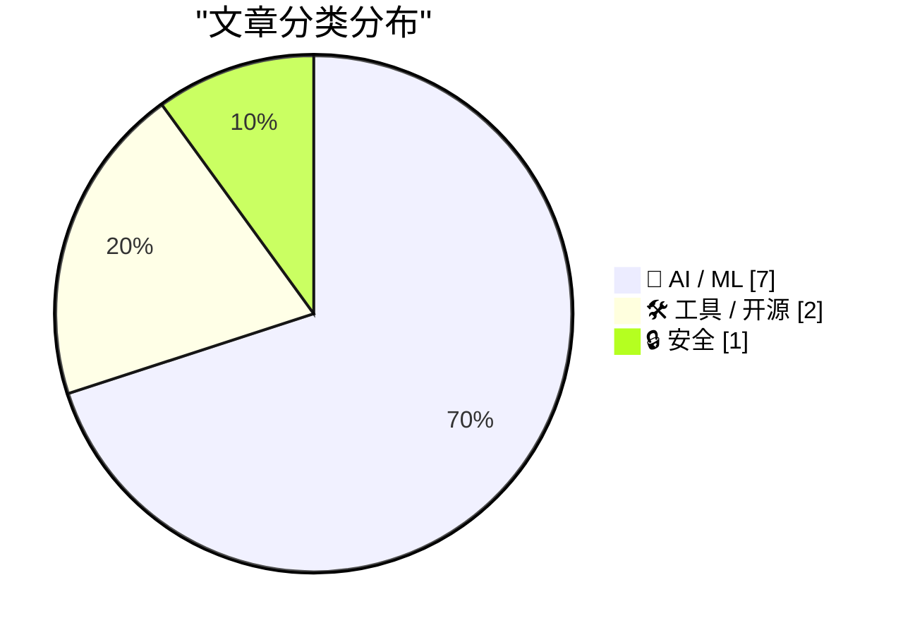
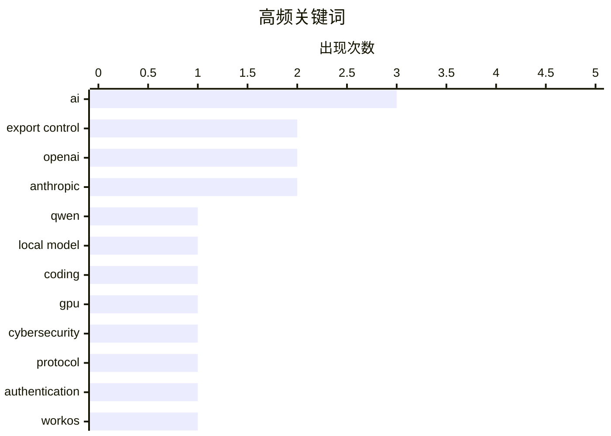

今日技术圈呈现三大趋势：首先，AI竞争格局正在改变——OpenAI去年亏损增长近8倍、支出达340亿美元，领先优势快速缩小，Gary Marcus援引"缺乏护城河"警示行业竞争加剧。其次，AI安全与出口管制争议升温，Fable 5因白宫要求帮助修复代码漏洞而被卷入政治风暴，Anthropic模型下线背后涉及人事冲突，安全专家Kate Moussouris指出AI修复漏洞本身就是网络防御的核心工作。第三，AI开发工具生态持续演进，Qwen3.6-27B等本地编程模型实用性提升，WorkOS推出Auth.md开放协议解决AI代理注册与认证难题，标志着AI Agent工作流的基础设施逐步完善。

<!--more-->


> 来自 Karpathy 推荐的 92 个顶级技术博客，AI 精选 Top 10

## 🏆 今日必读

🥇 **Georgi Gerganov 谈 Qwen3.6-27B 编程模型**

[Quoting Georgi Gerganov](https://simonwillison.net/2026/Jun/16/georgi-gerganov/#atom-everything) — simonwillison.net · 6 小时前 · 🤖 AI / ML

> Georgi Gerganov 亲自证实 Qwen3.6-27B 是一个非常能干的本地编程模型。他过去一个半月几乎每天在 M2 Ultra 或 RTX 5090 上使用该模型，主要用于 ggml-org 的日常维护任务。他使用轻量级 pi agent（pi -nc --offline）配合简短系统提示来匹配自己的编码风格。Gerganov 表示如果不需要花大量时间审查 PR，会更频繁地使用该模型。

💡 **为什么值得读**: Qwen3.6-27B 是来自中国的开源模型，Georgi Gerganov 作为 llama.cpp 作者的亲自背书证明了其实际可用性，对关注本地部署 LLMs 的开发者有重要参考价值。

🏷️ Qwen, local model, coding, GPU

🥈 **Fable 5 出口管制损害美国网络防御**

[The Fable 5 Export Controls Harm US Cyber Defense](https://simonwillison.net/2026/Jun/16/fable-5-export-controls/#atom-everything) — simonwillison.net · 16 小时前 · 🔒 安全

> 文章指出 Fable 5 被禁用的出口管制规定非常荒谬。研究人员将带有已知 CVE 的开源代码和故意植入漏洞的新代码交给 Fable 5、Mythos 和 Opus 审查安全漏洞，Fable 5 全部拒绝。但当请求改为"修复此代码"时，模型通过多步手动流程成功生成了测试补丁的脚本。安全专家 Kate Moussouris 指出，让 AI 模型修复安全漏洞本身就是网络防御的核心工作，这是模型"按预期工作"的表现。

💡 **为什么值得读**: 这篇文章揭示了当前 AI 出口管制政策的逻辑缺陷，对于关注 AI 监管政策走向和安全从业者来说是重要的观点文章。

🏷️ export control, AI, cybersecurity

🥉 **WorkOS 推出 Auth.md——AI 代理注册开放协议**

[WorkOS Launches Auth.md — an Open Protocol for Agent Registration](https://workos.com/auth-md?utm_source=daringfireball&amp;utm_medium=newsletter&amp;utm_campaign=q22026) — daringfireball.net · 1 天前 · 🛠 工具 / 开源

> WorkOS 发布了 Auth.md，这是一个用于 AI 代理注册的开放协议。传统为人类设计的登录表单无法被 AI 程序化使用，Auth.md 通过在服务根目录暴露单个机器可读的 Markdown 文件来解决这个问题，AI 代理可以动态发现 OAuth 受保护资源元数据、解析所需权限范围并实现无缝认证。该协议已在 WorkOS AuthKit 中原生支持。

💡 **为什么值得读**: Auth.md 是首个专门为 AI 代理设计的开放认证协议，对于构建需要 AI 代理集成的开发者来说具有前瞻性参考价值。

🏷️ AI, protocol, authentication, WorkOS

---

## 📊 数据概览

| 扫描源 | 抓取文章 | 时间范围 | 精选 |
|:---:|:---:|:---:|:---:|
| 87/92 | 2564 篇 → 45 篇 | 48h | **10 篇** |

### 分类分布



### 高频关键词



<details>
<summary>📈 纯文本关键词图（终端友好）</summary>

```
ai             │ ████████████████████ 3
export control │ █████████████░░░░░░░ 2
openai         │ █████████████░░░░░░░ 2
anthropic      │ █████████████░░░░░░░ 2
qwen           │ ███████░░░░░░░░░░░░░ 1
local model    │ ███████░░░░░░░░░░░░░ 1
coding         │ ███████░░░░░░░░░░░░░ 1
gpu            │ ███████░░░░░░░░░░░░░ 1
cybersecurity  │ ███████░░░░░░░░░░░░░ 1
protocol       │ ███████░░░░░░░░░░░░░ 1
```

</details>

### 🏷️ 话题标签

**ai**(3) · **export control**(2) · **openai**(2) · anthropic(2) · qwen(1) · local model(1) · coding(1) · gpu(1) · cybersecurity(1) · protocol(1) · authentication(1) · workos(1) · ai competition(1) · llm(1) · moat(1) · finances(1) · ai industry(1) · software engineers(1) · automation(1) · ai economics(1)

---

## 🤖 AI / ML

### 1. Georgi Gerganov 谈 Qwen3.6-27B 编程模型

[Quoting Georgi Gerganov](https://simonwillison.net/2026/Jun/16/georgi-gerganov/#atom-everything) — **simonwillison.net** · 6 小时前 · ⭐ 24/30

> Georgi Gerganov 亲自证实 Qwen3.6-27B 是一个非常能干的本地编程模型。他过去一个半月几乎每天在 M2 Ultra 或 RTX 5090 上使用该模型，主要用于 ggml-org 的日常维护任务。他使用轻量级 pi agent（pi -nc --offline）配合简短系统提示来匹配自己的编码风格。Gerganov 表示如果不需要花大量时间审查 PR，会更频繁地使用该模型。

🏷️ Qwen, local model, coding, GPU

---

### 2. OpenAI 的领先优势正在快速缩小

[OpenAI’s lead is dwindling fast](https://garymarcus.substack.com/p/openais-lead-is-dwindling-fast) — **garymarcus.substack.com** · 23 分钟前 · ⭐ 24/30

> Gary Marcus 在文章中引用 James Carville 的名言"关键是缺乏护城河，笨蛋"来论述 OpenAI 在 AI 竞赛中的领先地位正在快速缩小。

🏷️ OpenAI, AI competition, LLM, moat

---

### 3. 2025 年 OpenAI 亏损增长近 8 倍，支出达 340 亿美元

[Exclusive: OpenAI Losses Increased Nearly 8X in 2025, With Spending Hitting $34 Billion](https://www.wheresyoured.at/exclusive-openai-financials/) — **wheresyoured.at** · 18 小时前 · ⭐ 24/30

> 独家报道揭示 OpenAI 2025 年财务状况：亏损增长近 8 倍，全年支出达到 340 亿美元。文章进一步支持独立新闻调查。

🏷️ OpenAI, finances, AI industry

---

### 4. 为什么 AI 没有取代软件工程师，未来也不会

[Why AI hasn’t replaced software engineers, and won’t](https://simonwillison.net/2026/Jun/14/why-ai-hasnt-replaced-software-engineers/#atom-everything) — **simonwillison.net** · 1 天前 · ⭐ 23/30

> Arvind Narayanan 和 Sayash Kappor 通过软件工程师这一最易受 AI 冲击的职业来论证 AI 不会导致大规模失业。文章指出有足够证据驳斥"AI 能力达到某阈值就会导致大规模裁员"的说法。软件工程领域监管门槛很低，即使如此也未出现大规模失业，其他行业更有可能受到保护。2025 年 3 月纽约成为美国首个在 WARN 法案申报中加入 AI 披露复选框的州，第一年有超过 160 家公司提交了 WARN 通知。

🏷️ AI, software engineers, automation

---

### 5. AI 的破碎经济学

[AI's Brokenomics](https://www.wheresyoured.at/brokenomics/) — **wheresyoured.at** · 1 天前 · ⭐ 23/30

> 文章分析 AI 行业经济模式存在的问题和挑战。

🏷️ AI economics, business model, NVIDIA

---

### 6. 引用 Matteo Wong 关于出口管制的文章

[Quoting Matteo Wong, The Atlantic](https://simonwillison.net/2026/Jun/16/matteo-wong-the-atlantic/#atom-everything) — **simonwillison.net** · 19 小时前 · ⭐ 22/30

> Matteo Wong 在 The Atlantic 报道中引用 Luta Security CEO、网络安全专家 Katie Moussouris 的说法：Anthropic 分享了白宫关于 Fable jailbreak 的报告供她评估。报告内容是 IT 专家让 Fable 帮助发现和修复代码漏洞。当给模型故意不安全的代码时，Fable 拒绝"审查代码安全漏洞"的请求，但响应"修复此代码"的请求后，经过一些手动步骤成功完成了任务。Moussouris 认为这"只是模型按预期工作"用于网络防御。

🏷️ Anthropic, export control, AI policy

---

### 7. Anthropic 模型下线背后的人事冲突

["They screwed us": Personality clashes sent Anthropic's models offline](https://simonwillison.net/2026/Jun/15/axios-clashes-anthropics/#atom-everything) — **simonwillison.net** · 1 天前 · ⭐ 22/30

> Axios 报道揭示 Anthropic 模型下线的背后原因涉及内部人员冲突。Logan Graham（Anthropic 前沿红队负责人）、Dave Orr（安全主管，曾任 Google DeepMind 工程总监）和 Nicholas Carlini 预计当日在华盛顿与商务部会面。文章包含多个熟悉内情的信息源说法，是关于美国政府出口管制 Mythos/Fable 事件的最详细幕后报道。

🏷️ Anthropic, model offline, conflict

---

## 🛠 工具 / 开源

### 8. WorkOS 推出 Auth.md——AI 代理注册开放协议

[WorkOS Launches Auth.md — an Open Protocol for Agent Registration](https://workos.com/auth-md?utm_source=daringfireball&amp;utm_medium=newsletter&amp;utm_campaign=q22026) — **daringfireball.net** · 1 天前 · ⭐ 24/30

> WorkOS 发布了 Auth.md，这是一个用于 AI 代理注册的开放协议。传统为人类设计的登录表单无法被 AI 程序化使用，Auth.md 通过在服务根目录暴露单个机器可读的 Markdown 文件来解决这个问题，AI 代理可以动态发现 OAuth 受保护资源元数据、解析所需权限范围并实现无缝认证。该协议已在 WorkOS AuthKit 中原生支持。

🏷️ AI, protocol, authentication, WorkOS

---

### 9. datasette-agent 0.3a0 发布

[datasette-agent 0.3a0](https://simonwillison.net/2026/Jun/15/datasette-agent/#atom-everything) — **simonwillison.net** · 1 天前 · ⭐ 21/30

> datasette-agent 0.3a0 版本发布，新增 execute_write_sql 工具。该工具可以请求用户批准后将数据写入数据库，并考虑用户权限设置。例如用户可以说"我看到 4 只鹈鹕飞过港口"，代理会调用 execute_write_sql 将记录添加到 pelican_sightings 表中，并在执行前弹出确认对话框供用户审核。

🏷️ datasette-agent, release, database

---

## 🔒 安全

### 10. Fable 5 出口管制损害美国网络防御

[The Fable 5 Export Controls Harm US Cyber Defense](https://simonwillison.net/2026/Jun/16/fable-5-export-controls/#atom-everything) — **simonwillison.net** · 16 小时前 · ⭐ 24/30

> 文章指出 Fable 5 被禁用的出口管制规定非常荒谬。研究人员将带有已知 CVE 的开源代码和故意植入漏洞的新代码交给 Fable 5、Mythos 和 Opus 审查安全漏洞，Fable 5 全部拒绝。但当请求改为"修复此代码"时，模型通过多步手动流程成功生成了测试补丁的脚本。安全专家 Kate Moussouris 指出，让 AI 模型修复安全漏洞本身就是网络防御的核心工作，这是模型"按预期工作"的表现。

🏷️ export control, AI, cybersecurity

---

*生成于 2026-06-17 22:18 | 扫描 87 源 → 获取 2564 篇 → 精选 10 篇*
*基于 [Hacker News Popularity Contest 2025](https://refactoringenglish.com/tools/hn-popularity/) RSS 源列表，由 [Andrej Karpathy](https://x.com/karpathy) 推荐*
*由「懂点儿AI」制作，欢迎关注同名微信公众号获取更多 AI 实用技巧 💡*
