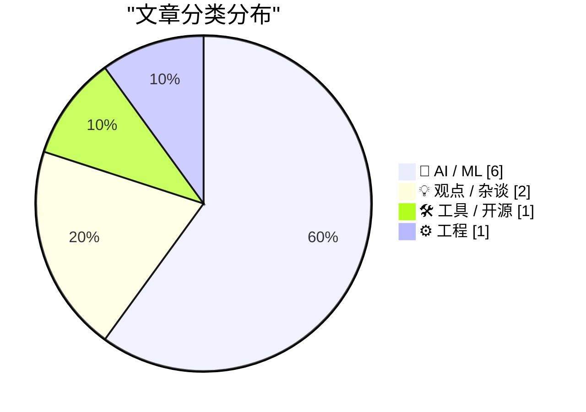
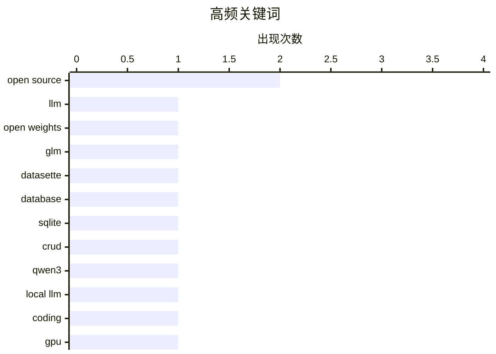

今日开源大模型领域竞争激烈：国产GLM-5.2以100万token上下文窗口登顶开源模型榜首，Qwen3.6-27B获推荐为本地编码首选。与此同时，OpenAI护城河正在消失，Gary Marcus指出其技术优势正被快速蚕食。AI落地方面，苹果新版Siri AI体验获好评，Claude亦首次成功用于Lean 4形式化数学证明。但业界开始反思：AI提升个人效率却未转化为组织生产力，开源项目可持续性困境同样值得关注。

<!--more-->


> 来自 Karpathy 推荐的 92 个顶级技术博客，AI 精选 Top 10

## 🏆 今日必读

🥇 **GLM-5.2：可能是最强的纯文本开源大语言模型**

[GLM-5.2 is probably the most powerful text-only open weights LLM](https://simonwillison.net/2026/Jun/17/glm-52/#atom-everything) — simonwillison.net · 14 小时前 · 🤖 AI / ML

> 中国AI实验室Z.ai发布了GLM-5.2，这是一个753B参数、1.51TB大小的MoE模型（40个活跃专家），采用纯文本输入，于6月13日面向订阅用户发布，6月16日全面开源（MIT许可）。上下文窗口从GLM-5.1的20万token提升到100万token。该模型在Artificial Analysis基准测试中成为新的开源模型领导者。GLM-5V-Turbo为同系列的视觉模型，但未开源权重。

💡 **为什么值得读**: 对于关注开源大模型和AI基准测试的技术人员，这是目前最强的纯文本开源选择，值得了解其性能表现。

🏷️ LLM, open weights, GLM, open source

🥈 **datasette 1.0a34 版本发布**

[datasette 1.0a34](https://simonwillison.net/2026/Jun/16/datasette/#atom-everything) — simonwillison.net · 1 天前 · 🛠 工具 / 开源

> Datasette 1.0a34版本新增了在Web界面中插入、编辑和删除数据行的功能，这些功能可在表页面和行页面中使用。该功能的灵感来源于Datasette Agent项目，作者在为其添加SQL写入支持时意识到通过聊天界面可以写入但UI界面却不行，这一反差促成了此功能的开发。

💡 **为什么值得读**: 对于需要通过Web界面管理SQLite数据库的用户，这一版本大幅提升了工具的可用性。

🏷️ datasette, database, SQLite, CRUD

🥉 **Qwen3.6-27B： Georgi Gerganov 推荐用于编码任务的本地模型**

[Quoting Georgi Gerganov](https://simonwillison.net/2026/Jun/16/georgi-gerganov/#atom-everything) — simonwillison.net · 1 天前 · 🤖 AI / ML

> GGML项目维护者Georgi Gerganov表示，Qwen3.6-27B是一个非常有能力的本地编码模型，过去一个半月他几乎每天都在M2 Ultra或RTX 5090上使用它。他使用轻量级的pi agent（带-offline参数）和简短的系统提示来匹配自己的编码风格。

💡 **为什么值得读**: 对于寻求本地运行的高效编码助手的开发者，Qwen3.6-27B得到了知名ML框架维护者的亲自背书。

🏷️ Qwen3, local LLM, coding, GPU

---

## 📊 数据概览

| 扫描源 | 抓取文章 | 时间范围 | 精选 |
|:---:|:---:|:---:|:---:|
| 87/92 | 2564 篇 → 34 篇 | 48h | **10 篇** |

### 分类分布



### 高频关键词



<details>
<summary>📈 纯文本关键词图（终端友好）</summary>

```
open source  │ ████████████████████ 2
llm          │ ██████████░░░░░░░░░░ 1
open weights │ ██████████░░░░░░░░░░ 1
glm          │ ██████████░░░░░░░░░░ 1
datasette    │ ██████████░░░░░░░░░░ 1
database     │ ██████████░░░░░░░░░░ 1
sqlite       │ ██████████░░░░░░░░░░ 1
crud         │ ██████████░░░░░░░░░░ 1
qwen3        │ ██████████░░░░░░░░░░ 1
local llm    │ ██████████░░░░░░░░░░ 1
```

</details>

### 🏷️ 话题标签

**open source**(2) · **llm**(1) · **open weights**(1) · glm(1) · datasette(1) · database(1) · sqlite(1) · crud(1) · qwen3(1) · local llm(1) · coding(1) · gpu(1) · siri(1) · apple intelligence(1) · wwdc(1) · voice ai(1) · lean 4(1) · formal proof(1) · theorem proving(1) · claude(1)

---

## 🤖 AI / ML

### 1. GLM-5.2：可能是最强的纯文本开源大语言模型

[GLM-5.2 is probably the most powerful text-only open weights LLM](https://simonwillison.net/2026/Jun/17/glm-52/#atom-everything) — **simonwillison.net** · 14 小时前 · ⭐ 24/30

> 中国AI实验室Z.ai发布了GLM-5.2，这是一个753B参数、1.51TB大小的MoE模型（40个活跃专家），采用纯文本输入，于6月13日面向订阅用户发布，6月16日全面开源（MIT许可）。上下文窗口从GLM-5.1的20万token提升到100万token。该模型在Artificial Analysis基准测试中成为新的开源模型领导者。GLM-5V-Turbo为同系列的视觉模型，但未开源权重。

🏷️ LLM, open weights, GLM, open source

---

### 2. Qwen3.6-27B： Georgi Gerganov 推荐用于编码任务的本地模型

[Quoting Georgi Gerganov](https://simonwillison.net/2026/Jun/16/georgi-gerganov/#atom-everything) — **simonwillison.net** · 1 天前 · ⭐ 22/30

> GGML项目维护者Georgi Gerganov表示，Qwen3.6-27B是一个非常有能力的本地编码模型，过去一个半月他几乎每天都在M2 Ultra或RTX 5090上使用它。他使用轻量级的pi agent（带-offline参数）和简短的系统提示来匹配自己的编码风格。

🏷️ Qwen3, local LLM, coding, GPU

---

### 3. MacBreak Weekly：新版 Siri AI 体验如何？

[Yours Truly on MacBreak Weekly: Is the New Siri AI Good?](https://twit.tv/shows/macbreak-weekly/episodes/1029?autostart=false) — **daringfireball.net** · 22 小时前 · ⭐ 22/30

> MacBreak Weekly本期节目深入探讨苹果WWDC后发布的新版Siri及其Apple Intelligence功能。John Gruber作为嘉宾参与讨论，分享了一周来实际使用新Siri AI的体验，并给予了好评。节目还讨论了这些功能为何今年晚些时候不会在欧盟上线，以及iPhone Ultra是否可能延迟发布。

🏷️ Siri, Apple Intelligence, WWDC, voice AI

---

### 4. 使用 Lean 4 和 Claude 形式化证明环定理

[Formalizing a ring theorem with Lean 4 and Claude](https://www.johndcook.com/blog/2026/06/17/rings-with-lean-claude/) — **johndcook.com** · 23 小时前 · ⭐ 22/30

> 作者测试了Claude生成Lean 4代码来证明定理的能力，之前成功验证了一些计算，这次让Claude形式化证明一个关于半范数的pqr定理。虽然之前尝试失败，但本次实验展示了AI辅助形式化数学证明的可行性。

🏷️ Lean 4, formal proof, theorem proving, Claude

---

### 5. OpenAI 的领先优势正在快速消失

[OpenAI’s lead is dwindling fast](https://garymarcus.substack.com/p/openais-lead-is-dwindling-fast) — **garymarcus.substack.com** · 1 天前 · ⭐ 21/30

> Gary Marcus撰文指出OpenAI的竞争优势正在缩小，核心原因在于缺乏真正的护城河（moat）。随着其他AI实验室的快速发展，OpenAI之前的技术优势正在被蚕食。

🏷️ OpenAI, competition, AI, moat

---

### 6. Flax 调试技巧：追踪参数变化

[Flax debugging: making a hash of things](https://www.gilesthomas.com/2026/06/hashing-jax-parameters) — **gilesthomas.com** · 1 天前 · ⭐ 21/30

> 作者在调试一个JAX/Flax NNX训练循环时，发现了一个有用的调试技巧——通过计算参数的张量哈希来检查梯度是否真正被应用到参数上。因为77M参数的模型中，每次更新可能只改变少量参数，直接打印难以察觉变化。

🏷️ Flax, JAX, debugging, machine learning

---

## 💡 观点 / 杂谈

### 7. 你变快了，但你的公司没有

[You Got Faster. Your Company Didn’t.](https://terriblesoftware.org/2026/06/17/you-got-faster-your-company-didnt/) — **terriblesoftware.org** · 20 小时前 · ⭐ 22/30

> 文章指出AI让个人工作效率提升，但这种提升并没有转化为公司整体生产力的增长——因为最耗时的部分（沟通协调、等待他人）被外包给了同事。个人变快反而可能加剧团队内的瓶颈。

🏷️ AI productivity, company efficiency, workflow

---

### 8. 开源与无形之手

[Open Source vs the Invisible Hand](https://nesbitt.io/2026/06/18/open-source-vs-the-invisible-hand.html) — **nesbitt.io** · 4 小时前 · ⭐ 21/30

> 文章讨论了一个开源项目每周下载量达到1000万次，却只有一名维护者且没有资金支持的现象，探讨开源项目可持续发展的商业模式和社区支持问题。

🏷️ open source, maintainer, sustainability

---

## 🛠 工具 / 开源

### 9. datasette 1.0a34 版本发布

[datasette 1.0a34](https://simonwillison.net/2026/Jun/16/datasette/#atom-everything) — **simonwillison.net** · 1 天前 · ⭐ 22/30

> Datasette 1.0a34版本新增了在Web界面中插入、编辑和删除数据行的功能，这些功能可在表页面和行页面中使用。该功能的灵感来源于Datasette Agent项目，作者在为其添加SQL写入支持时意识到通过聊天界面可以写入但UI界面却不行，这一反差促成了此功能的开发。

🏷️ datasette, database, SQLite, CRUD

---

## ⚙️ 工程

### 10. 《程序员的逻辑》v0.15 发布

[Logic for Programmers v0.15, Livecoding](https://buttondown.com/hillelwayne/archive/logic-for-programmers-v015-livecoding/) — **buttondown.com/hillelwayne** · 21 小时前 · ⭐ 21/30

> Logic for Programmers（程序员的逻辑）发布v0.15版本，这是第一个正式候选版本，所有内容已完成校对，除非有重大问题，下一版本将是1.0并提供印刷版。作者还测试了更小边距的PDF格式以适配手机和电脑阅读。

🏷️ logic, programming, formal methods, release

---

*生成于 2026-06-18 14:08 | 扫描 87 源 → 获取 2564 篇 → 精选 10 篇*
*基于 [Hacker News Popularity Contest 2025](https://refactoringenglish.com/tools/hn-popularity/) RSS 源列表，由 [Andrej Karpathy](https://x.com/karpathy) 推荐*
*由「懂点儿AI」制作，欢迎关注同名微信公众号获取更多 AI 实用技巧 💡*
