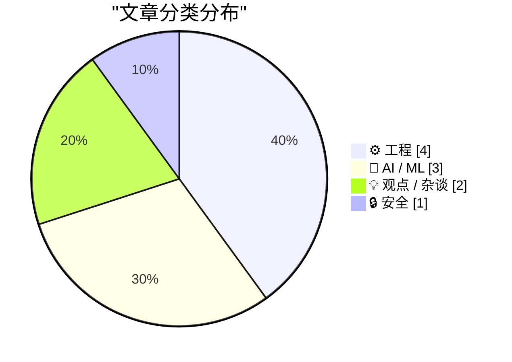
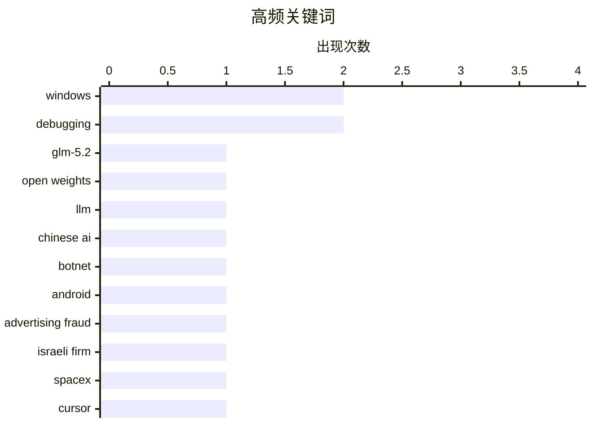

# 今日看点
AI大模型领域持续爆发，中国团队Z.ai开源7530亿参数的GLM-5.2，上下文窗口突破100万token，成为开源模型新标杆；同时SpaceX宣布600亿美元收购Cursor，引发科技公司高估值争议。安全领域曝出Popa僵尸网络与以色列上市公司Alarum的关联，揭示了寄生于合法 residential proxy 服务的黑色产业链。此外，工程界重新审视纯文本价值——Markdown因被LLM智能体广泛采用而迎来新一轮增长，学者指出其成功本质是纯文本在人和机器可读性上的天然优势。

<!--more-->


> 来自 Karpathy 推荐的 92 个顶级技术博客，AI 精选 Top 10

## 🏆 今日必读

🥇 **GLM-5.2 或将成为最强大的纯文本开源大模型**

[GLM-5.2 is probably the most powerful text-only open weights LLM](https://simonwillison.net/2026/Jun/17/glm-52/#atom-everything) — simonwillison.net · 22 小时前 · 🤖 AI / ML

> 中国AI实验室Z.ai于6月13日发布GLM-5.2，6月16日全面开源并采用MIT许可证。该模型拥有7530亿参数、1.51TB规模，采用40个活跃专家的混合专家架构（MoE），是纯文本输入模型。上下文窗口从GLM-5.1的20万token扩展至100万token。Artificial Analysis基准测试显示GLM-5.2已成为新的开源权重模型领跑者。

💡 **为什么值得读**: 对于关注开源大模型发展的人来说，这篇文章提供了最新的模型性能参考和关键参数信息。

🏷️ GLM-5.2, open weights, LLM, Chinese AI

🥈 **“Popa”僵尸网络与以色列上市公司关联**

[‘Popa’ Botnet Linked to Publicly-Traded Israeli Firm](https://krebsonsecurity.com/2026/06/popa-botnet-linked-to-publicly-traded-israeli-firm/) — krebsonsecurity.com · 4 小时前 · 🔒 安全

> 过去四年，一个名为Popa的安卓僵尸网络迫使数百万台消费电视盒子中继互联网流量，涉及广告欺诈、账户接管和大规模数据抓取。本周，多家安全公司研究证实Popa僵尸网络与NetNut相关联——NetNut是一家由上市公司Alarum Technologies Ltd（NASDAQ: ALAR）运营的“住宅代理”服务提供商。

💡 **为什么值得读**: 这是近期重要的安全威胁情报，揭示了僵尸网络与上市公司之间的直接关联，对安全研究人员和普通用户都有参考价值。

🏷️ botnet, Android, advertising fraud, Israeli firm

🥉 **SpaceX以600亿美元收购Cursor**

[SpaceX, Newly Public, to Acquire Cursor for $60 Billion in SpaceX Funny-Money Stock](https://www.cnbc.com/2026/06/16/spacex-spcx-cursor-acquisition-ipo.html) — daringfireball.net · 5 小时前 · 💡 观点 / 杂谈

> SpaceX以600亿美元A类普通股收购Cursor，相当于其IPO估值的3.4%稀释。Cursor于去年11月突破10亿美元年度经常性收入，位列2026年CNBC创新者50强第37名。SpaceX当日股价上涨约16%，市值超越亚马逊和微软，成为美国第四大公司。作者认为这一估值简直疯狂——SpaceX尚未盈利，市盈率为无穷大。

💡 **为什么值得读**: 文章对这笔收购的财务分析揭示了当前科技并购市场的估值泡沫问题，值得关注行业动态的读者思考。

🏷️ SpaceX, Cursor, acquisition, $60 billion

---

## 📊 数据概览

| 扫描源 | 抓取文章 | 时间范围 | 精选 |
|:---:|:---:|:---:|:---:|
| 86/92 | 2540 篇 → 34 篇 | 48h | **10 篇** |

### 分类分布



### 高频关键词



<details>
<summary>📈 纯文本关键词图（终端友好）</summary>

```
windows           │ ████████████████████ 2
debugging         │ ████████████████████ 2
glm-5.2           │ ██████████░░░░░░░░░░ 1
open weights      │ ██████████░░░░░░░░░░ 1
llm               │ ██████████░░░░░░░░░░ 1
chinese ai        │ ██████████░░░░░░░░░░ 1
botnet            │ ██████████░░░░░░░░░░ 1
android           │ ██████████░░░░░░░░░░ 1
advertising fraud │ ██████████░░░░░░░░░░ 1
israeli firm      │ ██████████░░░░░░░░░░ 1
```

</details>

### 🏷️ 话题标签

**windows**(2) · **debugging**(2) · **glm-5.2**(1) · open weights(1) · llm(1) · chinese ai(1) · botnet(1) · android(1) · advertising fraud(1) · israeli firm(1) · spacex(1) · cursor(1) · acquisition(1) · $60 billion(1) · ai(1) · digital sovereignty(1) · risk(1) · technology policy(1) · getlastinputinfo(1) · api(1)

---

## ⚙️ 工程

### 1. 为何GetLastInputInfo()不返回被模拟用户的信息？

[Why doesn’t Get­Last­Input­Info() return info for the user I’m impersonating?](https://devblogs.microsoft.com/oldnewthing/20260618-00/?p=112444) — **devblogs.microsoft.com/oldnewthing** · 8 小时前 · ⭐ 22/30

> Windows API GetLastInputInfo()的设计不考虑用户模拟——函数名称本身就说明了这一点。该API返回的是系统最后检测到的输入时间，而非特定用户模拟上下文下的输入信息。

🏷️ Windows, GetLastInputInfo, API, impersonation

---

### 2. Markdown的历史与成功原因

[Yours Truly on The Vergecast: ‘# the **Epic** Story of Markdown’](https://www.theverge.com/podcast/950082/markdown-history-gruber-vergecast) — **daringfireball.net** · 1 天前 · ⭐ 21/30

> Markdown近年来因被采用为LLM智能体的标准语言而迎来新一轮增长。作者认为Markdown成功的关键并非语法本身，而是纯文本的胜利——无论是系统配置还是人机可读文本交换，纯文本都具有显著的优势。Markdown是一套格式约定，而非真正的“语法”。

🏷️ Markdown, history, documentation, John Gruber

---

### 3. 我讨厌编译器

[I hate compilers](https://xeiaso.net/notes/2026/anubis-wasm-vendor-binary/) — **xeiaso.net** · 22 小时前 · ⭐ 21/30

> 作者讨论编译器的不确定性——相同的输入字节并不总是产生相同的输出字节，这是一个复杂的问题。

🏷️ compiler, programming, debugging, tools

---

### 4. Windows栈限制检查回顾与后续

[Windows stack limit checking retrospective, follow-up](https://devblogs.microsoft.com/oldnewthing/20260617-00/?p=112436) — **devblogs.microsoft.com/oldnewthing** · 1 天前 · ⭐ 21/30

> 文章回顾了Windows栈限制检查的实现细节，讨论了用于传递所需栈分配大小的寄存器选择问题。

🏷️ Windows, stack, debugging, low-level

---

## 🤖 AI / ML

### 5. GLM-5.2 或将成为最强大的纯文本开源大模型

[GLM-5.2 is probably the most powerful text-only open weights LLM](https://simonwillison.net/2026/Jun/17/glm-52/#atom-everything) — **simonwillison.net** · 22 小时前 · ⭐ 24/30

> 中国AI实验室Z.ai于6月13日发布GLM-5.2，6月16日全面开源并采用MIT许可证。该模型拥有7530亿参数、1.51TB规模，采用40个活跃专家的混合专家架构（MoE），是纯文本输入模型。上下文窗口从GLM-5.1的20万token扩展至100万token。Artificial Analysis基准测试显示GLM-5.2已成为新的开源权重模型领跑者。

🏷️ GLM-5.2, open weights, LLM, Chinese AI

---

### 6. 用Lean 4和Claude形式化环定理

[Formalizing a ring theorem with Lean 4 and Claude](https://www.johndcook.com/blog/2026/06/17/rings-with-lean-claude/) — **johndcook.com** · 1 天前 · ⭐ 22/30

> 作者测试Claude生成Lean 4代码来证明定理的能力。本次实验中，他要求Claude用Lean 4形式化证明一个环定理（pqr定理的变体），探索AI在形式化数学证明中的应用潜力。

🏷️ Lean 4, Claude, formal verification, theorem proving

---

### 7. MacBreak Weekly访谈：新Siri AI好吗？

[Yours Truly on MacBreak Weekly: Is the New Siri AI Good?](https://twit.tv/shows/macbreak-weekly/episodes/1029?autostart=false) — **daringfireball.net** · 1 天前 · ⭐ 21/30

> 作者作为嘉宾参与MacBreak Weekly，讨论苹果WWDC发布的新Siri。文章探讨了Apple Intelligence和新Siri为何今年不会首先登陆欧盟，以及iPhone Ultra是否可能延迟发布。作者表示经过一周实际使用后，新Siri确实很好用。

🏷️ Siri, Apple Intelligence, WWDC, AI assistant

---

## 💡 观点 / 杂谈

### 8. SpaceX以600亿美元收购Cursor

[SpaceX, Newly Public, to Acquire Cursor for $60 Billion in SpaceX Funny-Money Stock](https://www.cnbc.com/2026/06/16/spacex-spcx-cursor-acquisition-ipo.html) — **daringfireball.net** · 5 小时前 · ⭐ 22/30

> SpaceX以600亿美元A类普通股收购Cursor，相当于其IPO估值的3.4%稀释。Cursor于去年11月突破10亿美元年度经常性收入，位列2026年CNBC创新者50强第37名。SpaceX当日股价上涨约16%，市值超越亚马逊和微软，成为美国第四大公司。作者认为这一估值简直疯狂——SpaceX尚未盈利，市盈率为无穷大。

🏷️ SpaceX, Cursor, acquisition, $60 billion

---

### 9. AI数字主权风险不存在

[Pluralistic: AI digital sovereignty risk doesn't exist (18 Jun 2026)](https://pluralistic.net/2026/06/18/their-trillions-our-billions/) — **pluralistic.net** · 6 小时前 · ⭐ 22/30

> 作者以数学论证批判“AI数字主权风险”概念：如果风险+AI=风险-AI，那么AI=0。作者将此与区块链泡沫时期类比，认为所谓的AI主权风险与当年的区块链神棍话术如出一辙。本质上，AI是一种工具，本身不创造新的风险类别。

🏷️ AI, digital sovereignty, risk, technology policy

---

## 🔒 安全

### 10. “Popa”僵尸网络与以色列上市公司关联

[‘Popa’ Botnet Linked to Publicly-Traded Israeli Firm](https://krebsonsecurity.com/2026/06/popa-botnet-linked-to-publicly-traded-israeli-firm/) — **krebsonsecurity.com** · 4 小时前 · ⭐ 24/30

> 过去四年，一个名为Popa的安卓僵尸网络迫使数百万台消费电视盒子中继互联网流量，涉及广告欺诈、账户接管和大规模数据抓取。本周，多家安全公司研究证实Popa僵尸网络与NetNut相关联——NetNut是一家由上市公司Alarum Technologies Ltd（NASDAQ: ALAR）运营的“住宅代理”服务提供商。

🏷️ botnet, Android, advertising fraud, Israeli firm

---

*生成于 2026-06-19 22:18 | 扫描 86 源 → 获取 2540 篇 → 精选 10 篇*
*基于 [Hacker News Popularity Contest 2025](https://refactoringenglish.com/tools/hn-popularity/) RSS 源列表，由 [Andrej Karpathy](https://x.com/karpathy) 推荐*
*由「懂点儿AI」制作，欢迎关注同名微信公众号获取更多 AI 实用技巧 💡*
