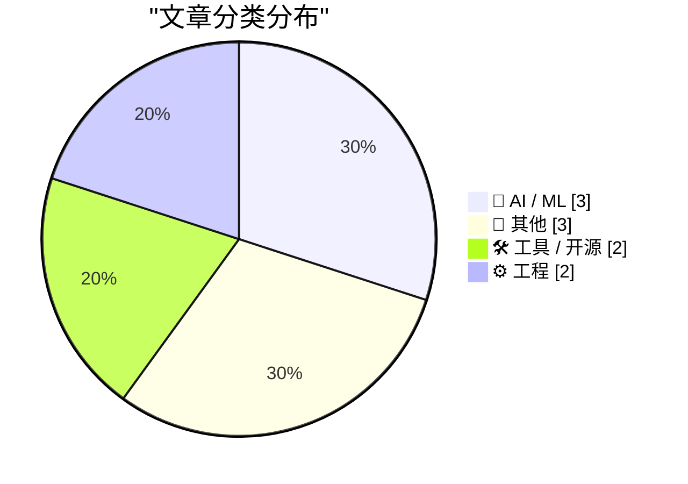
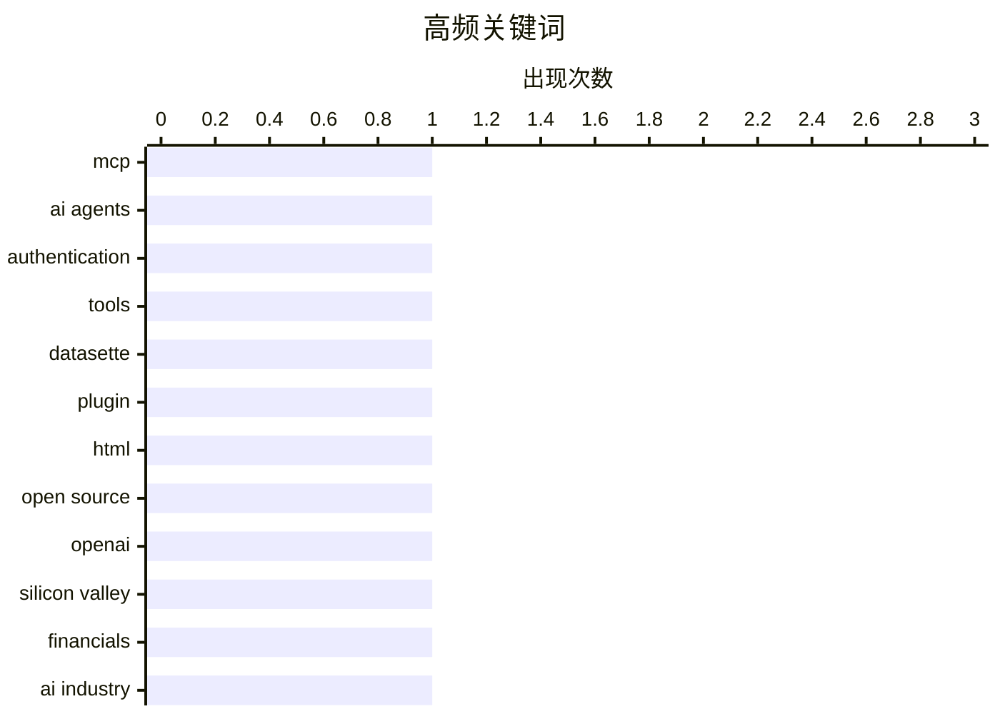

今日技术圈关注三大趋势：一是AI安全架构再引热议，MCP协议主张将认证流程与Agent上下文隔离以降低敏感凭证泄露风险，同时OpenAI年支出34亿但收入130亿的财务数据加剧了业界对AI投资泡沫的讨论；二是开放协议与去中心化持续推进，AT Protocol明确否认"实例"概念以强化去中心化设计，Datasette则推出新插件允许在数据库沙箱中托管自定义HTML应用；三是科技并购加速整合，Fox宣布以250亿美元收购Roku，争夺联网电视广告市场。

<!--more-->


> 来自 Karpathy 推荐的 92 个顶级技术博客，AI 精选 Top 10

## 🏆 今日必读

🥇 **MCP的核心价值在于将认证流程与Agent上下文隔离**

[Quoting Sean Lynch](https://simonwillison.net/2026/Jun/19/sean-lynch/#atom-everything) — simonwillison.net · 23 小时前 · 🤖 AI / ML

> MCP（Model Context Protocol）相比传统skills/CLI的核心优势在于将认证流程完全隔离在Agent的上下文窗口之外，甚至可以脱离整个测试框架独立运行。这一设计使得AI Agent无需直接处理敏感的认证凭证，降低了安全风险。Sean Lynch提出MCP的理想形态可能就是一个API认证网关，其他功能都是次要的。如果MCP能成功解决认证隔离问题，即使仅作为认证网关也是巨大的进步。该观点引发了对Agent安全架构的讨论。

💡 **为什么值得读**: 如果你关注AI Agent的安全架构设计，这篇文章提供了关于认证隔离的重要思考方向。

🏷️ MCP, AI agents, authentication, tools

🥈 **Datasette Apps：在数据库中托管自定义HTML应用的新插件**

[Datasette Apps: Host custom HTML applications inside Datasette](https://simonwillison.net/2026/Jun/18/datasette-apps/#atom-everything) — simonwillison.net · 1 天前 · 🛠 工具 / 开源

> Datasette发布了新插件datasette-apps，允许在受严格约束的iframe沙箱中托管自包含的HTML+JavaScript应用。这些应用可以使用JavaScript运行只读SQL查询来访问Datasette中的数据，也可以通过配置存储查询来执行写操作。文章提供了两个示例：一个简单应用和一个复杂的自定义时间线示例，展示了该插件的灵活性和潜力。

💡 **为什么值得读**: 如果你使用SQLite数据库并希望构建数据驱动的Web应用，这个插件提供了轻量级解决方案

🏷️ Datasette, plugin, HTML, open source

🥉 **硅谷泡沫：OpenAI财务透视（第二部分）**

[Premium: The Silicon Valley Bubble (Part 2)](https://www.wheresyoured.at/premium-the-silicon-valley-bubble-part-2/) — wheresyoured.at · 1 天前 · 🤖 AI / ML

> 本文是关于OpenAI 2024和2025年审计财务数据的独家报道。OpenAI在2024年支出34亿美元以实现130.7亿美元的收入，引发了对硅谷AI投资泡沫的讨论。文章发布后引发广泛反应，包括对OpenAI巨额支出与收入不成比例的震惊，以及对AI行业可持续性的质疑。这是硅谷AI泡沫系列文章的第二部分。

💡 **为什么值得读**: 如果你关注AI行业的商业可持续性和投资泡沫问题，这篇文章提供了关键财务数据

🏷️ OpenAI, Silicon Valley, financials, AI industry

---

## 📊 数据概览

| 扫描源 | 抓取文章 | 时间范围 | 精选 |
|:---:|:---:|:---:|:---:|
| 79/92 | 2392 篇 → 25 篇 | 48h | **10 篇** |

### 分类分布



### 高频关键词



<details>
<summary>📈 纯文本关键词图（终端友好）</summary>

```
mcp            │ ████████████████████ 1
ai agents      │ ████████████████████ 1
authentication │ ████████████████████ 1
tools          │ ████████████████████ 1
datasette      │ ████████████████████ 1
plugin         │ ████████████████████ 1
html           │ ████████████████████ 1
open source    │ ████████████████████ 1
openai         │ ████████████████████ 1
silicon valley │ ████████████████████ 1
```

</details>

### 🏷️ 话题标签

**mcp**(1) · **ai agents**(1) · **authentication**(1) · tools(1) · datasette(1) · plugin(1) · html(1) · open source(1) · openai(1) · silicon valley(1) · financials(1) · ai industry(1) · fox(1) · roku(1) · acquisition(1) · streaming(1) · package management(1) · releases(1) · advisories(1) · trump mobile(1)

---

## 🤖 AI / ML

### 1. MCP的核心价值在于将认证流程与Agent上下文隔离

[Quoting Sean Lynch](https://simonwillison.net/2026/Jun/19/sean-lynch/#atom-everything) — **simonwillison.net** · 23 小时前 · ⭐ 24/30

> MCP（Model Context Protocol）相比传统skills/CLI的核心优势在于将认证流程完全隔离在Agent的上下文窗口之外，甚至可以脱离整个测试框架独立运行。这一设计使得AI Agent无需直接处理敏感的认证凭证，降低了安全风险。Sean Lynch提出MCP的理想形态可能就是一个API认证网关，其他功能都是次要的。如果MCP能成功解决认证隔离问题，即使仅作为认证网关也是巨大的进步。该观点引发了对Agent安全架构的讨论。

🏷️ MCP, AI agents, authentication, tools

---

### 2. 硅谷泡沫：OpenAI财务透视（第二部分）

[Premium: The Silicon Valley Bubble (Part 2)](https://www.wheresyoured.at/premium-the-silicon-valley-bubble-part-2/) — **wheresyoured.at** · 1 天前 · ⭐ 22/30

> 本文是关于OpenAI 2024和2025年审计财务数据的独家报道。OpenAI在2024年支出34亿美元以实现130.7亿美元的收入，引发了对硅谷AI投资泡沫的讨论。文章发布后引发广泛反应，包括对OpenAI巨额支出与收入不成比例的震惊，以及对AI行业可持续性的质疑。这是硅谷AI泡沫系列文章的第二部分。

🏷️ OpenAI, Silicon Valley, financials, AI industry

---

### 3. AT Protocol中不存在"实例"

[There Are No Instances in atproto](https://overreacted.io/there-are-no-instances-in-atproto/) — **overreacted.io** · 1 天前 · ⭐ 18/30

> 本文讨论了AT Protocol（atproto）中的架构概念，作者指出atproto中不存在传统意义上的"实例"（instances）概念，这类似于当年RSS和Google Reader的关系。这一设计是atproto去中心化架构的核心特征，与传统的联邦社交网络协议有本质区别。

🏷️ atproto, decentralized, protocol

---

## 📝 其他

### 4. Fox以250亿美元收购Roku

[Fox to Buy Roku Streaming Service in $25 Billion Deal](https://www.wsj.com/business/deals/fox-roku-deal-f6e564f9?st=mKdQwC&amp;reflink=desktopwebshare_permalink) — **daringfireball.net** · 1 天前 · ⭐ 21/30

> Fox Corp宣布以约250亿美元收购流媒体平台Roku，这是Fox迄今为止最大的一笔交易。合并后的公司将在联网电视流媒体领域与亚马逊和Netflix展开更激烈的广告收入竞争。Roku拥有约25%的智能电视界面市场份额，同时运营广告支持的Roku Channel。Fox在2020年以4亿美元收购了Tubi，并将整合Fox One和Fox Nation订阅服务。

🏷️ Fox, Roku, acquisition, streaming

---

### 5. Trump Mobile T1手机与HTC U24 Pro高度相似

[Trump Mobile T1 Phone Is a Gold-Painted Two-Year-Old HTC U24 Pro](https://www.nbcnews.com/tech/gadgets/trump-mobile-t1-phone-nearly-identical-htc-device-analysis-rcna349293) — **daringfireball.net** · 1 天前 · ⭐ 18/30

> 根据iFixit与NBC News合作的技术分析，Trump Mobile T1手机与两年前的HTC U24 Pro几乎完全相同。T1最初标榜"美国制造"，但实际上是由台湾HTC使用中国零部件生产的手机。价格方面，T1售价500美元，仅比HTC原版470美元略高。这一发现引发了关于产品原产地的讨论。

🏷️ Trump Mobile, HTC, hardware, iFixit

---

### 6. 关于老年人和大型眼镜的思考

[‘What’s the Deal With Old Guys and Giant Glasses?’](https://www.youtube.com/watch?v=8DYGxn6Xvt0) — **daringfireball.net** · 20 小时前 · ⭐ 17/30

> 本文讨论了新技术早期采用者通常是年轻人，但Snap Specs可能会改变这一观念。视频探讨了直接在养老院进行直销的可能性，暗示老年人可能成为智能眼镜等新技术的潜在用户群体。这是一个关于技术采用年龄偏见的有趣思考。

🏷️ Snap Specs, wearables, elderly, adoption

---

## 🛠 工具 / 开源

### 7. Datasette Apps：在数据库中托管自定义HTML应用的新插件

[Datasette Apps: Host custom HTML applications inside Datasette](https://simonwillison.net/2026/Jun/18/datasette-apps/#atom-everything) — **simonwillison.net** · 1 天前 · ⭐ 24/30

> Datasette发布了新插件datasette-apps，允许在受严格约束的iframe沙箱中托管自包含的HTML+JavaScript应用。这些应用可以使用JavaScript运行只读SQL查询来访问Datasette中的数据，也可以通过配置存储查询来执行写操作。文章提供了两个示例：一个简单应用和一个复杂的自定义时间线示例，展示了该插件的灵活性和潜力。

🏷️ Datasette, plugin, HTML, open source

---

### 8. 本周包管理动态：2026年6月20日

[This Week in Package Management: 20 June 2026](https://nesbitt.io/2026/06/20/this-week-in-package-management.html) — **nesbitt.io** · 12 小时前 · ⭐ 20/30

> 本文汇集了本周包管理领域的发布公告、安全公告和相关文章。由于提供的文本内容有限，无法提取具体的技术细节或讨论主题。

🏷️ package management, releases, advisories

---

## ⚙️ 工程

### 9. 当HMODULE最低位被设置时意味着什么

[What does it mean when the bottom bit of my HMODULE is set?](https://devblogs.microsoft.com/oldnewthing/20260619-00/?p=112447) — **devblogs.microsoft.com/oldnewthing** · 1 天前 · ⭐ 18/30

> 本文解释了在Windows系统中当HMODULE的最低位被设置时的技术含义。HMODULE是Windows用于标识模块句柄的数据结构，最低位的特殊设置通常表示某种特定的模块类型或状态。这是Windows底层技术机制的详细解析。

🏷️ HMODULE, Windows, programming

---

### 10. 全页瘫痪：完成的困难

[Full Page Paralysis](https://blog.jim-nielsen.com/2026/full-page-paralysis/) — **blog.jim-nielsen.com** · 1 天前 · ⭐ 18/30

> 本文探讨了"全页瘫痪"现象——与"空白页瘫痪"相对的概念。作者认为开始一件事很容易，但完成才是真正困难的。在软件领域被称为"最后90%"，在物流领域被称为"最后一英里"。完成使事物变得真实和有限，会受到评判。作者表示自己不受空白页瘫痪困扰，但面对即将发布成品时却感到瘫痪。

🏷️ software development, project completion, productivity, psychology

---

*生成于 2026-06-21 22:18 | 扫描 79 源 → 获取 2392 篇 → 精选 10 篇*
*基于 [Hacker News Popularity Contest 2025](https://refactoringenglish.com/tools/hn-popularity/) RSS 源列表，由 [Andrej Karpathy](https://x.com/karpathy) 推荐*
*由「懂点儿AI」制作，欢迎关注同名微信公众号获取更多 AI 实用技巧 💡*
