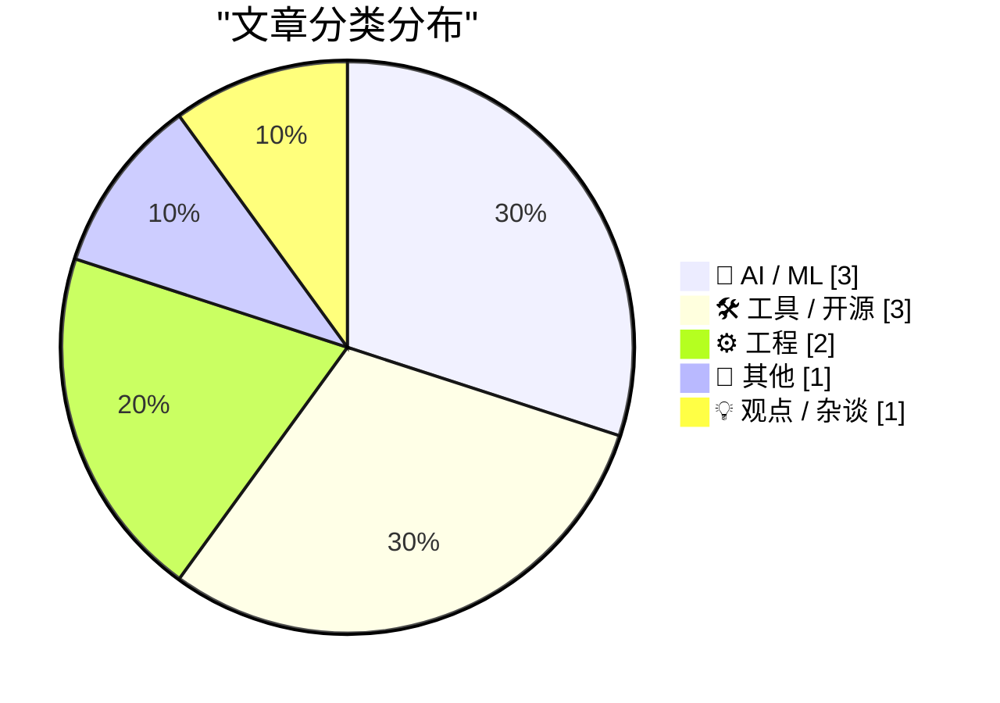
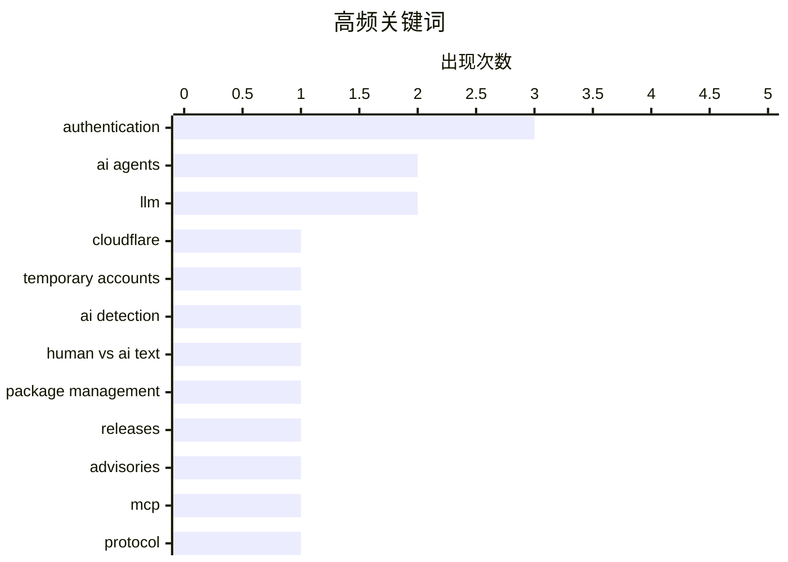

今日技术圈呈现三大趋势：一是AI代理开发工具快速迭代，Cloudflare推出无需注册的临时部署功能，MCP协议将认证剥离出代理上下文；二是AI生成内容的辨别难题引发广泛讨论，如何区分人机写作成为行业痛点；三是开发者基础设施持续演进，Mux强化视频智能工作流，包管理生态保持活跃。

<!--more-->


> 来自 Karpathy 推荐的 92 个顶级技术博客，AI 精选 Top 10

## 🏆 今日必读

🥇 **面向AI代理的Cloudflare临时账户**

[Temporary Cloudflare Accounts for AI agents](https://simonwillison.net/2026/Jun/21/temporary-cloudflare-accounts/#atom-everything) — simonwillison.net · 17 分钟前 · ⚙️ 工程

> Cloudflare推出了临时账户功能，允许用户无需创建账户即可部署项目。使用命令`npx wrangler deploy --temporary`可将应用部署到新的临时项目，该项目将存活60分钟后自动失效。作者使用GPT-5.5在Codex Desktop中构建了一个重定向解析测试应用，验证了临时部署功能可用。部署完成后系统会输出一个URL用于认领项目。该功能虽标榜为AI代理设计，但实际上对所有用户都有价值。

💡 **为什么值得读**: 如果你需要快速测试Cloudflare Workers应用或让AI代理自动部署工具，这是目前最简便的方案。

🏷️ Cloudflare, authentication, AI agents, temporary accounts

🥈 **AI的十万个为什么**

[The 100,000 whys of AI](https://lcamtuf.substack.com/p/the-100000-whys-of-ai) — lcamtuf.substack.com · 16 小时前 · 🤖 AI / ML

> 作者与技术人员反复讨论的一个核心问题是：能否区分人类写作和AI生成的文本。这是一个痛苦的争论，因为随着AI技术发展，区分两者的难度日益增加。文章探讨了在AI时代如何辨别内容来源的挑战。

💡 **为什么值得读**: 如果你关心AI生成内容的可信度和辨别问题，这篇文章提供了有深度的思考视角。

🏷️ AI detection, human vs AI text, LLM, authentication

🥉 **This Week in Package Management: 20 June 2026**

[This Week in Package Management: 20 June 2026](https://nesbitt.io/2026/06/20/this-week-in-package-management.html) — nesbitt.io · 1 天前 · 🛠 工具 / 开源

> Releases, advisories, and articles from across the package management world

🏷️ package management, releases, advisories

---

## 📊 数据概览

| 扫描源 | 抓取文章 | 时间范围 | 精选 |
|:---:|:---:|:---:|:---:|
| 87/92 | 2566 篇 → 16 篇 | 48h | **10 篇** |

### 分类分布



### 高频关键词



<details>
<summary>📈 纯文本关键词图（终端友好）</summary>

```
authentication     │ ████████████████████ 3
ai agents          │ █████████████░░░░░░░ 2
llm                │ █████████████░░░░░░░ 2
cloudflare         │ ███████░░░░░░░░░░░░░ 1
temporary accounts │ ███████░░░░░░░░░░░░░ 1
ai detection       │ ███████░░░░░░░░░░░░░ 1
human vs ai text   │ ███████░░░░░░░░░░░░░ 1
package management │ ███████░░░░░░░░░░░░░ 1
releases           │ ███████░░░░░░░░░░░░░ 1
advisories         │ ███████░░░░░░░░░░░░░ 1
```

</details>

### 🏷️ 话题标签

**authentication**(3) · **ai agents**(2) · **llm**(2) · cloudflare(1) · temporary accounts(1) · ai detection(1) · human vs ai text(1) · package management(1) · releases(1) · advisories(1) · mcp(1) · protocol(1) · chess(1) · z3(1) · code generation(1) · video api(1) · mux(1) · developers(1) · streaming(1) · svg(1)

---

## 🤖 AI / ML

### 1. AI的十万个为什么

[The 100,000 whys of AI](https://lcamtuf.substack.com/p/the-100000-whys-of-ai) — **lcamtuf.substack.com** · 16 小时前 · ⭐ 23/30

> 作者与技术人员反复讨论的一个核心问题是：能否区分人类写作和AI生成的文本。这是一个痛苦的争论，因为随着AI技术发展，区分两者的难度日益增加。文章探讨了在AI时代如何辨别内容来源的挑战。

🏷️ AI detection, human vs AI text, LLM, authentication

---

### 2. Sean Lynch谈MCP的真正价值

[Quoting Sean Lynch](https://simonwillison.net/2026/Jun/19/sean-lynch/#atom-everything) — **simonwillison.net** · 1 天前 · ⭐ 21/30

> Sean Lynch评论Model Context Protocol（MCP）相对Skills/CLI的核心优势在于：将认证流程隔离到代理的上下文窗口之外，甚至完全脱离框架本身。他建议MCP的理想形态可能只是一个认证网关，用于API访问，这本身就是一个有价值的改进。

🏷️ MCP, AI agents, authentication, protocol

---

### 3. 我懂功夫

[I know Kung-fu](https://idiallo.com/blog/i-know-kung-fu) — **idiallo.com** · 1 天前 · ⭐ 15/30

> 文章以《黑客帝国》中Neo被植入格斗技能的场景为引，探讨知识获取的哲学问题。电影跳过了Neo实际学习和训练的过程，直接展示他已经掌握技能。如果现实中存在这种能力——知识可以瞬间上传到大脑——会是怎样的？作者思考了这种信息传输方式对学习的意义。

🏷️ Matrix, knowledge upload, AI, learning

---

## 🛠 工具 / 开源

### 4. This Week in Package Management: 20 June 2026

[This Week in Package Management: 20 June 2026](https://nesbitt.io/2026/06/20/this-week-in-package-management.html) — **nesbitt.io** · 1 天前 · ⭐ 22/30

> Releases, advisories, and articles from across the package management world

🏷️ package management, releases, advisories

---

### 5. Mux——面向开发者的视频基础设施

[Mux — Video for Developers](https://www.mux.com/?utm_campaign=fireball&amp;utm_source=DF) — **daringfireball.net** · 42 分钟前 · ⭐ 17/30

> Mux是面向开发者的视频基础设施平台，将视频数据转化为视频智能。开发者只需配置一次视频工作流，系统即可自动处理每个新上传的视频，支持提问、摘要、查找关键时刻等功能，无需资产webhooks或自托管粘合代码。已被Synthesia、Shopify和美国足球联合会信任使用。

🏷️ video API, Mux, developers, streaming

---

### 6. 哪种Copyleft许可证适合SVG？

[Which Copyleft Licence is Suitable for an SVG?](https://shkspr.mobi/blog/2026/06/which-copyleft-licence-is-suitable-for-an-svg/) — **shkspr.mobi** · 1 天前 · ⭐ 17/30

> 文章探讨了SVG（可缩放矢量图形）格式适合的开源许可证。SVG是一种使用XML和数学运算精确描述图像的格式，可在任意尺寸下保持清晰。作者分析了不同copyleft许可证对SVG文件的适用性。

🏷️ SVG, copyleft, licence, open source

---

## ⚙️ 工程

### 7. 面向AI代理的Cloudflare临时账户

[Temporary Cloudflare Accounts for AI agents](https://simonwillison.net/2026/Jun/21/temporary-cloudflare-accounts/#atom-everything) — **simonwillison.net** · 17 分钟前 · ⭐ 24/30

> Cloudflare推出了临时账户功能，允许用户无需创建账户即可部署项目。使用命令`npx wrangler deploy --temporary`可将应用部署到新的临时项目，该项目将存活60分钟后自动失效。作者使用GPT-5.5在Codex Desktop中构建了一个重定向解析测试应用，验证了临时部署功能可用。部署完成后系统会输出一个URL用于认领项目。该功能虽标榜为AI代理设计，但实际上对所有用户都有价值。

🏷️ Cloudflare, authentication, AI agents, temporary accounts

---

### 8. 用Claude生成Z3/Python代码解决棋盘谜题

[All pieces on a 6 by 5 board](https://www.johndcook.com/blog/2026/06/20/z3-python-claude/) — **johndcook.com** · 1 天前 · ⭐ 19/30

> 作者系列文章探讨如何让LLM生成代码解决棋类问题。之前尝试过用Claude和ChatGPT生成Prolog，本文使用Claude生成Z3/Python代码来解答一个经典谜题：在6×5的棋盘上放置所有棋子（王、后、两个车、两个象、两个马和八个兵）。

🏷️ LLM, chess, Z3, code generation

---

## 📝 其他

### 9. Bobby Prince去世

[Bobby Prince has died](https://oldvcr.blogspot.com/feeds/8983624217005254252/comments/default) — **oldvcr.blogspot.com** · 1 天前 · ⭐ 17/30

> 著名游戏音乐人Bobby Prince于81岁去世。他90年代为id Software多款游戏创作音乐，包括《Commander Keen》《Wolfenstein 3D》《Duke Nukem 3D》等，最著名的是《Doom》和《Quake》系列。他与John Carmack等开发者长期合作，为FPS游戏音乐树立了标杆。

🏷️ Bobby Prince, FPS, game music, obituary

---

## 💡 观点 / 杂谈

### 10. 论粗俗唯物主义

[On Vulgar Materialism](https://borretti.me/article/on-vulgar-materialism) — **borretti.me** · 22 小时前 · ⭐ 15/30

> 文章探讨了AI时代的一种技术观点：足够先进的犬儒主义与天真无邪难以区分。评论认为，当前AI发展中存在一种粗俗唯物主义的倾向，即对技术进步的盲目崇拜或批判。

🏷️ materialism, cynicism, philosophy

---

*生成于 2026-06-22 22:18 | 扫描 87 源 → 获取 2566 篇 → 精选 10 篇*
*基于 [Hacker News Popularity Contest 2025](https://refactoringenglish.com/tools/hn-popularity/) RSS 源列表，由 [Andrej Karpathy](https://x.com/karpathy) 推荐*
*由「懂点儿AI」制作，欢迎关注同名微信公众号获取更多 AI 实用技巧 💡*
