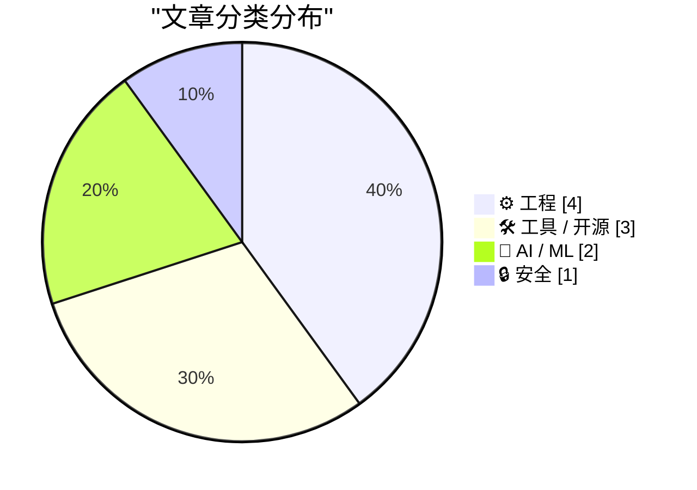
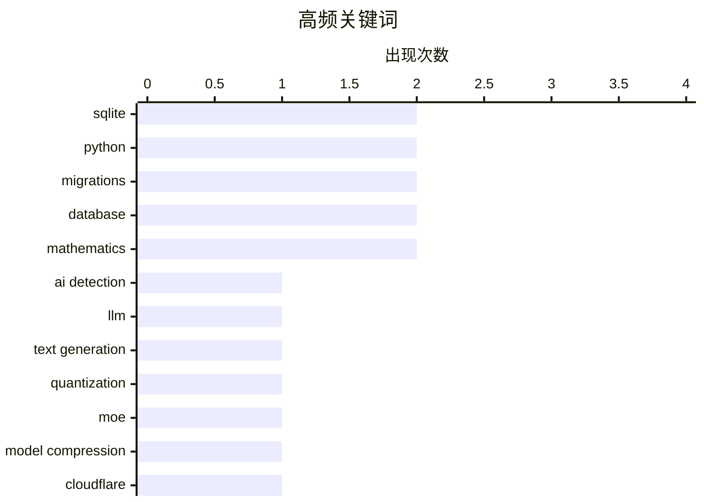

今日技术圈聚焦三大趋势：AI领域继续围绕内容检测与模型效率展开热议，专家感知量化的突破使大模型在本地设备运行成为可能；同时，开发者工具持续进化，sqlite-utils 4.0引入迁移和嵌套事务能力，Cloudflare也推出临时部署账户降低使用门槛；安全层面，伴随AI生成内容的泛滥，如何有效区分人机文本已成为业界待解的核心难题。

<!--more-->


> 来自 Karpathy 推荐的 92 个顶级技术博客，AI 精选 Top 10

## 🏆 今日必读

🥇 **AI的十万个辨别难题**

[The 100,000 whys of AI](https://lcamtuf.substack.com/p/the-100000-whys-of-ai) — lcamtuf.substack.com · 1 天前 · 🤖 AI / ML

> 文章探讨了一个核心难题：如何区分人类撰写的文本和AI生成的文本。作者认为这是与技术同行持续争论的最痛苦问题之一。随着AI生成内容的大量涌现，检测变得更加困难且充满争议。文章分析了当前检测方法的局限性和面临的挑战，指出这个问题没有简单的技术解决方案。

💡 **为什么值得读**: 对于所有需要判断内容来源（学生作业、新闻、合同等）的读者来说，这是必须了解的现实问题。

🏷️ AI detection, LLM, text generation

🥈 **专家感知量化：接近Q4质量，接近Q2大小？**

[Expert-aware quantisation: near-Q4 quality at near-Q2 size?](https://martinalderson.com/posts/expert-aware-quantisation/?utm_source=rss&amp;utm_medium=rss&amp;utm_campaign=feed) — martinalderson.com · 22 小时前 · 🤖 AI / ML

> 文章提出了一种针对MoE（混合专家）模型的新型量化方法。核心思路是先分析模型找出对特定任务重要的专家，然后对不活跃的"冷"专家进行硬量化。实验结果显示，这种方法能在接近Q2大小的模型体积下，达到接近Q4的输出质量。这使得在本地设备上运行大型语言模型成为可能。

💡 **为什么值得读**: 为希望在个人电脑上运行70B等大模型的用户提供了实用的压缩方案。

🏷️ quantization, MoE, model compression

🥉 **sqlite-utils 4.0rc1 新增迁移和嵌套事务**

[sqlite-utils 4.0rc1 adds migrations and nested transactions](https://simonwillison.net/2026/Jun/21/sqlite-utils-40rc1/#atom-everything) — simonwillison.net · 22 小时前 · 🛠 工具 / 开源

> sqlite-utils 4.0rc1发布，这是该库的首个候选版本。主要新特性包括：1）新增迁移功能，支持数据库模式升级；2）支持嵌套事务；3）新增多个CLI命令如`.accesslog`、`.archive`等。大版本号升级意味着存在一些向后不兼容的变更，需要用户测试反馈。

💡 **为什么值得读**: 这是sqlite-utils三年来的重大更新，现有用户应尽快测试以便平稳升级。

🏷️ SQLite, Python, migrations, database

---

## 📊 数据概览

| 扫描源 | 抓取文章 | 时间范围 | 精选 |
|:---:|:---:|:---:|:---:|
| 87/92 | 2568 篇 → 24 篇 | 48h | **10 篇** |

### 分类分布



### 高频关键词



<details>
<summary>📈 纯文本关键词图（终端友好）</summary>

```
sqlite          │ ████████████████████ 2
python          │ ████████████████████ 2
migrations      │ ████████████████████ 2
database        │ ████████████████████ 2
mathematics     │ ████████████████████ 2
ai detection    │ ██████████░░░░░░░░░░ 1
llm             │ ██████████░░░░░░░░░░ 1
text generation │ ██████████░░░░░░░░░░ 1
quantization    │ ██████████░░░░░░░░░░ 1
moe             │ ██████████░░░░░░░░░░ 1
```

</details>

### 🏷️ 话题标签

**sqlite**(2) · **python**(2) · **migrations**(2) · database(2) · mathematics(2) · ai detection(1) · llm(1) · text generation(1) · quantization(1) · moe(1) · model compression(1) · cloudflare(1) · ai agents(1) · temporary accounts(1) · zig(1) · programming language(1) · open source(1) · cybersecurity(1) · business travel(1) · espionage(1)

---

## ⚙️ 工程

### 1. 向Zig软件基金会再捐40万美元

[Pledging Another $400,000 to the Zig Software Foundation](https://mitchellh.com/writing/zig-donation-2026) — **mitchellh.com** · 1 天前 · ⭐ 19/30

> 作者宣布再次向Zig软件基金会捐赠40万美元。这是继之前50万美元之后的再次大额捐赠。Zig是一门新兴的系统级编程语言，旨在作为C的现代替代品。作者持续的资金支持体现了对该语言发展的高度信心。

🏷️ Zig, programming language, open source

---

### 2. Lobachevsky积分公式

[Lobachevsky’s integral formula](https://www.johndcook.com/blog/2026/06/22/lobachevskys-integral-formula/) — **johndcook.com** · 2 小时前 · ⭐ 18/30

> 文章介绍了Lobachevsky积分定理：如果f是周期为π的偶函数，则特定积分具有简洁形式。该定理在傅里叶分析和信号处理中很有用。特别情况下f(x)=1时，可以简化复杂积分计算。作者还提到了jinc函数的类似公式。

🏷️ mathematics, Fourier analysis, signal processing

---

### 3. 素数阶棋盘上的皇后问题

[Queens on a prime order board](https://www.johndcook.com/blog/2026/06/21/queens-prime/) — **johndcook.com** · 21 小时前 · ⭐ 17/30

> n皇后问题要求在n×n棋盘上放置n个皇后，使任意两个不在同一行、列或对角线上。当n是≥5的素数时，只需在斜率为2,3,4…的直线上放置皇后即可找到解。这一简洁的解法将问题复杂度大幅降低。

🏷️ algorithm, n-queens problem, mathematics

---

### 4. 纪念拼写检查波纹线的发明者

[In memory of the man who put red and green squiggles under words](https://devblogs.microsoft.com/oldnewthing/20260622-00/?p=112451) — **devblogs.microsoft.com/oldnewthing** · 8 小时前 · ⭐ 16/30

> 文章纪念了拼写检查波纹线（红色和绿色波浪线）的发明者。这一功能最初在Word中引入，随后扩展到几乎所有文字处理器，甚至非文字处理软件。波纹线成为了文字处理的标准功能，极大改善了用户的拼写和语法检查体验。

🏷️ Word, spell check, Microsoft

---

## 🛠 工具 / 开源

### 5. sqlite-utils 4.0rc1 新增迁移和嵌套事务

[sqlite-utils 4.0rc1 adds migrations and nested transactions](https://simonwillison.net/2026/Jun/21/sqlite-utils-40rc1/#atom-everything) — **simonwillison.net** · 22 小时前 · ⭐ 21/30

> sqlite-utils 4.0rc1发布，这是该库的首个候选版本。主要新特性包括：1）新增迁移功能，支持数据库模式升级；2）支持嵌套事务；3）新增多个CLI命令如`.accesslog`、`.archive`等。大版本号升级意味着存在一些向后不兼容的变更，需要用户测试反馈。

🏷️ SQLite, Python, migrations, database

---

### 6. sqlite-utils 4.0rc1 发布公告

[sqlite-utils 4.0rc1](https://simonwillison.net/2026/Jun/21/sqlite-utils/#atom-everything) — **simonwillison.net** · 22 小时前 · ⭐ 21/30

> sqlite-utils 4.0rc1正式发布，这是该库的首个候选版本。主要新特性包括迁移功能、嵌套事务支持以及多个新的CLI命令。这是一个大版本更新，存在一些向后不兼容的变更，作者呼吁用户测试并反馈问题。

🏷️ SQLite, Python, migrations, database

---

### 7. AI代理的临时Cloudflare账户

[Temporary Cloudflare Accounts for AI agents](https://simonwillison.net/2026/Jun/21/temporary-cloudflare-accounts/#atom-everything) — **simonwillison.net** · 1 天前 · ⭐ 19/30

> Cloudflare推出了新功能，允许用户无需创建账户即可部署项目。使用命令`npx wrangler deploy --temporary`，应用会被部署到一个新的临时项目，有效期60分钟。作者用GPT-5.5 xhigh成功构建了一个重定向解析工具进行测试，临时部署按预期工作。

🏷️ Cloudflare, AI agents, temporary accounts

---

## 🤖 AI / ML

### 8. AI的十万个辨别难题

[The 100,000 whys of AI](https://lcamtuf.substack.com/p/the-100000-whys-of-ai) — **lcamtuf.substack.com** · 1 天前 · ⭐ 26/30

> 文章探讨了一个核心难题：如何区分人类撰写的文本和AI生成的文本。作者认为这是与技术同行持续争论的最痛苦问题之一。随着AI生成内容的大量涌现，检测变得更加困难且充满争议。文章分析了当前检测方法的局限性和面临的挑战，指出这个问题没有简单的技术解决方案。

🏷️ AI detection, LLM, text generation

---

### 9. 专家感知量化：接近Q4质量，接近Q2大小？

[Expert-aware quantisation: near-Q4 quality at near-Q2 size?](https://martinalderson.com/posts/expert-aware-quantisation/?utm_source=rss&amp;utm_medium=rss&amp;utm_campaign=feed) — **martinalderson.com** · 22 小时前 · ⭐ 22/30

> 文章提出了一种针对MoE（混合专家）模型的新型量化方法。核心思路是先分析模型找出对特定任务重要的专家，然后对不活跃的"冷"专家进行硬量化。实验结果显示，这种方法能在接近Q2大小的模型体积下，达到接近Q4的输出质量。这使得在本地设备上运行大型语言模型成为可能。

🏷️ quantization, MoE, model compression

---

## 🔒 安全

### 10.  paranoid旅行者的网络安全指南

[Cybersecurity for the paranoid business traveller](https://shkspr.mobi/blog/2026/06/cybersecurity-for-the-paranoid-business-traveller/) — **shkspr.mobi** · 10 小时前 · ⭐ 18/30

> 文章为商务旅行者提供了全面的安全建议。作者根据多年在不同风险容忍度的组织工作经历，总结了针对间谍活动、勒索和国家支持攻击的个人防护措施。包括设备安全、网络使用、证件保管等方面的具体建议。

🏷️ cybersecurity, business travel, espionage

---

*生成于 2026-06-23 22:18 | 扫描 87 源 → 获取 2568 篇 → 精选 10 篇*
*基于 [Hacker News Popularity Contest 2025](https://refactoringenglish.com/tools/hn-popularity/) RSS 源列表，由 [Andrej Karpathy](https://x.com/karpathy) 推荐*
*由「懂点儿AI」制作，欢迎关注同名微信公众号获取更多 AI 实用技巧 💡*
