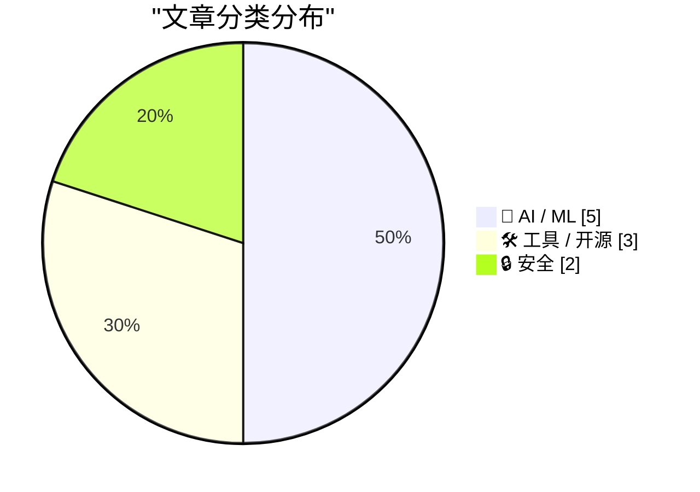
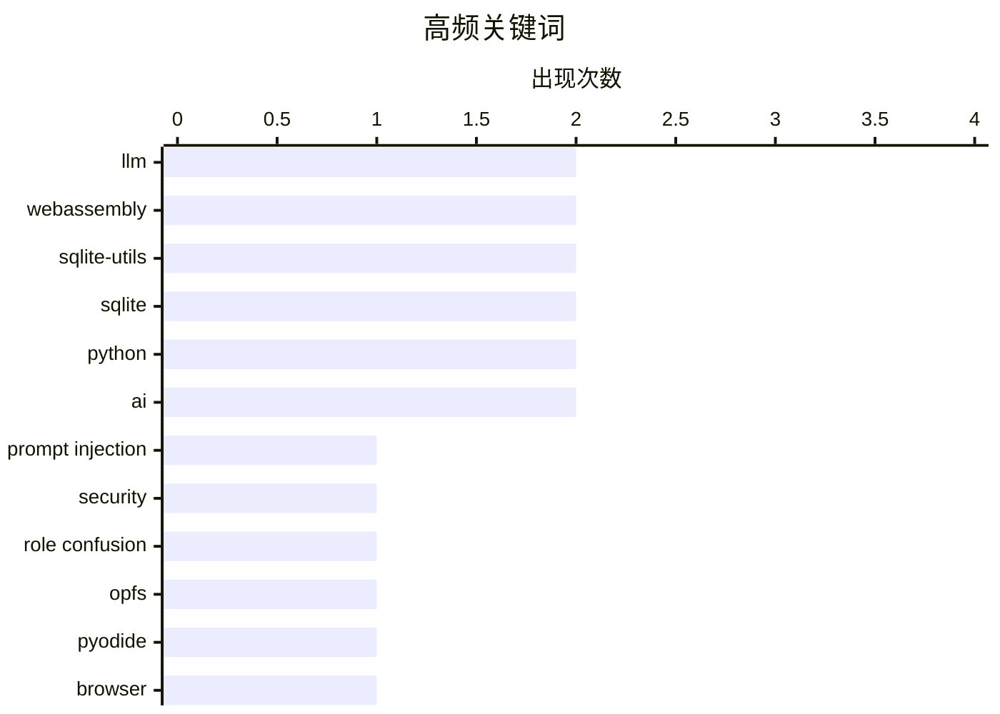

今日技术圈关注三大趋势：AI安全领域再爆隐患，最新研究揭示大语言模型无法有效区分系统指令与用户输入，导致提示注入攻击可绑过安全限制；浏览器端AI应用加速落地，Pyodide、WebGPU等技术正在将Python环境和轻量模型移植至用户本地运行，同时专家感知量化技术可在极小体积下保持输出质量，为本地部署提供新思路；此外，AI基础设施的能源消耗问题引发监管关注，塔斯马尼亚绿党推动对当地AI数据中心的议会调查。

<!--more-->


> 来自 Karpathy 推荐的 92 个顶级技术博客，AI 精选 Top 10

## 🏆 今日必读

🥇 **提示注入即角色混淆**

[Prompt Injection as Role Confusion](https://simonwillison.net/2026/Jun/22/prompt-injection-as-role-confusion/#atom-everything) — simonwillison.net · 22 小时前 · 🔒 安全

> 论文研究了大型语言模型能否区分自身特权文本（如<system>、<assistant>等角色标签包裹的内容）与用户输入（<user>标签包裹的不可信内容）。研究发现模型不仅无法有效区分这两类文本，反而更重视文本的格式风格而非实际内容。这一发现导致了严重的提示注入漏洞——攻击者可通过伪装成角色标签的格式来绑过安全限制。作者呼吁需要从根本上重新设计模型的指令解析机制。

💡 **为什么值得读**: 深入剖析了当前LLM安全模型的核心缺陷，对从事AI安全研究和防御的开发者具有重要参考价值

🏷️ prompt injection, LLM, security, role confusion

🥈 **OPFS + Pyodide 测试工具**

[OPFS + Pyodide test harness](https://simonwillison.net/2026/Jun/23/opfs-pyodide/#atom-everything) — simonwillison.net · 3 小时前 · 🛠 工具 / 开源

> Datasette Lite 是一个完全在浏览器中运行Python应用的工具，使用Pyodide和WebAssembly实现。开发者为其构建了一个测试界面，用于验证OPFS（源私有文件系统）是否支持在用户本地计算机上编辑持久化的SQLite文件。该工具可在不同浏览器中测试OPFS的兼容性和功能表现。

💡 **为什么值得读**: 为需要在浏览器中实现本地文件持久化存储的Web开发者提供了实用的测试方案

🏷️ OPFS, Pyodide, WebAssembly, browser

🥉 **即将到来的循环**

[The Coming Loop](https://lucumr.pocoo.org/2026/6/23/the-coming-loop/) — lucumr.pocoo.org · 22 小时前 · 🤖 AI / ML

> 当前越来越多人基于编码Agent构建能够自动运行的工作循环：任务进入队列后由机器取出执行，然后由 harness 判断是否完成，未完成则继续注入新消息或启动新会话。这种模式使得任务可以跨越模型本身会说「我完成了」的节点持续运行。实际上每个编码Agent内部都已经存在一个工具调用循环。

💡 **为什么值得读**: 对理解AI Agent架构设计和构建自动化工作流程具有重要启发意义

🏷️ AI coding agents, automation, Claude, programming

---

## 📊 数据概览

| 扫描源 | 抓取文章 | 时间范围 | 精选 |
|:---:|:---:|:---:|:---:|
| 87/92 | 2569 篇 → 34 篇 | 48h | **10 篇** |

### 分类分布



### 高频关键词



<details>
<summary>📈 纯文本关键词图（终端友好）</summary>

```
llm              │ ████████████████████ 2
webassembly      │ ████████████████████ 2
sqlite-utils     │ ████████████████████ 2
sqlite           │ ████████████████████ 2
python           │ ████████████████████ 2
ai               │ ████████████████████ 2
prompt injection │ ██████████░░░░░░░░░░ 1
security         │ ██████████░░░░░░░░░░ 1
role confusion   │ ██████████░░░░░░░░░░ 1
opfs             │ ██████████░░░░░░░░░░ 1
```

</details>

### 🏷️ 话题标签

**llm**(2) · **webassembly**(2) · **sqlite-utils**(2) · sqlite(2) · python(2) · ai(2) · prompt injection(1) · security(1) · role confusion(1) · opfs(1) · pyodide(1) · browser(1) · ai coding agents(1) · automation(1) · claude(1) · programming(1) · quantization(1) · moe(1) · model compression(1) · image inpainting(1)

---

## 🤖 AI / ML

### 1. 即将到来的循环

[The Coming Loop](https://lucumr.pocoo.org/2026/6/23/the-coming-loop/) — **lucumr.pocoo.org** · 22 小时前 · ⭐ 24/30

> 当前越来越多人基于编码Agent构建能够自动运行的工作循环：任务进入队列后由机器取出执行，然后由 harness 判断是否完成，未完成则继续注入新消息或启动新会话。这种模式使得任务可以跨越模型本身会说「我完成了」的节点持续运行。实际上每个编码Agent内部都已经存在一个工具调用循环。

🏷️ AI coding agents, automation, Claude, programming

---

### 2. 专家感知量化：接近Q4质量，接近Q2大小？

[Expert-aware quantisation: near-Q4 quality at near-Q2 size?](https://martinalderson.com/posts/expert-aware-quantisation/?utm_source=rss&amp;utm_medium=rss&amp;utm_campaign=feed) — **martinalderson.com** · 1 天前 · ⭐ 24/30

> 通过对MoE（混合专家）模型进行性能分析，找出对特定任务重要的专家，然后对这些「冷门」专家进行高强度量化。实验结果显示，该方法可在接近Q2量化级别（极小体积）的情况下达到接近Q4级别的输出质量，为本地模型部署提供了新的优化思路。

🏷️ quantization, MoE, LLM, model compression

---

### 3. 将Moebius 0.2B图像修复模型移植到浏览器运行

[Porting the Moebius 0.2B image inpainting model to run in the browser with Claude Code](https://simonwillison.net/2026/Jun/22/porting-moebius/#atom-everything) — **simonwillison.net** · 22 小时前 · ⭐ 23/30

> Moebius是一个0.2B参数的轻量级图像修复（inpainting）框架，原本需要PyTorch和NVIDIA CUDA运行。开发者成功将其移植到WebGPU上，现在可直接在浏览器中运行图像修复功能。用户可以标记图像中需要移除的区域，模型会自动想象并填充合适的内容。

🏷️ image inpainting, browser ML, WebAssembly, Claude Code

---

### 4. 我们的水电值得更好的AI数据中心

[Our hydro deserves better than a chatbot](https://hey.paris/posts/ai-data-centres-tasmania/) — **hey.paris** · 22 小时前 · ⭐ 23/30

> 塔斯马尼亚绿党宣布将推动对州内AI数据中心的紧急议会调查。这些项目似乎在缺乏具体监管和公众参与的情况下获批。能源部长证实Firmus公司计划在两到三个「AI工厂」地点消耗400-500兆瓦电力，超过了该州最大用电户Bell Bay铝厂的335兆瓦，引发了对能源消耗的担忧。

🏷️ AI, data centers, energy, Tasmania

---

### 5. Liminality

[Liminality](https://geohot.github.io//blog/jekyll/update/2026/06/23/liminality.html) — **geohot.github.io** · 15 小时前 · ⭐ 22/30

> 文章以《钢之炼金术师》的炼金术设定类比AI的发展：人类将灵魂注入贤者之石以为能解决所有问题并战胜死亡，实际上贤者之石被用来创造拟人化的愚者（homunculus），如Chat、Claude、GLM等AI助手。愚者是创造它的灵魂的混合物。

🏷️ AI, Fullmetal Alchemist, philosophy, machine learning

---

## 🛠 工具 / 开源

### 6. OPFS + Pyodide 测试工具

[OPFS + Pyodide test harness](https://simonwillison.net/2026/Jun/23/opfs-pyodide/#atom-everything) — **simonwillison.net** · 3 小时前 · ⭐ 24/30

> Datasette Lite 是一个完全在浏览器中运行Python应用的工具，使用Pyodide和WebAssembly实现。开发者为其构建了一个测试界面，用于验证OPFS（源私有文件系统）是否支持在用户本地计算机上编辑持久化的SQLite文件。该工具可在不同浏览器中测试OPFS的兼容性和功能表现。

🏷️ OPFS, Pyodide, WebAssembly, browser

---

### 7. sqlite-utils 4.0rc1 发布

[sqlite-utils 4.0rc1](https://simonwillison.net/2026/Jun/21/sqlite-utils/#atom-everything) — **simonwillison.net** · 1 天前 · ⭐ 23/30

> sqlite-utils是一个Python库和CLI工具，提供在SQLite基础上的高级操作功能。4.0版本带来了一些向后不兼容的变更，包括迁移功能和对嵌套事务的支持。这是第一个候选版本，作者希望更多用户测试后再发布稳定版。

🏷️ sqlite-utils, SQLite, release, Python

---

### 8. sqlite-utils 4.0rc1 新增迁移和嵌套事务支持

[sqlite-utils 4.0rc1 adds migrations and nested transactions](https://simonwillison.net/2026/Jun/21/sqlite-utils-40rc1/#atom-everything) — **simonwillison.net** · 1 天前 · ⭐ 22/30

> sqlite-utils 4.0引入了迁移功能，允许定义数据库结构变更的版本化脚本；同时支持嵌套事务，可更精细地控制数据库操作的回滚行为。这些改进使得数据库 schema 管理更加规范和灵活。

🏷️ sqlite-utils, SQLite, migrations, Python

---

## 🔒 安全

### 9. 提示注入即角色混淆

[Prompt Injection as Role Confusion](https://simonwillison.net/2026/Jun/22/prompt-injection-as-role-confusion/#atom-everything) — **simonwillison.net** · 22 小时前 · ⭐ 25/30

> 论文研究了大型语言模型能否区分自身特权文本（如<system>、<assistant>等角色标签包裹的内容）与用户输入（<user>标签包裹的不可信内容）。研究发现模型不仅无法有效区分这两类文本，反而更重视文本的格式风格而非实际内容。这一发现导致了严重的提示注入漏洞——攻击者可通过伪装成角色标签的格式来绑过安全限制。作者呼吁需要从根本上重新设计模型的指令解析机制。

🏷️ prompt injection, LLM, security, role confusion

---

### 10. Scattered Spider黑客在审判第一天认罪

[Scattered Spider Hackers Plead Guilty on Day 1 of Trial](https://krebsonsecurity.com/2026/06/scattered-spider-hackers-plead-guilty-on-day-1-of-trial/) — **krebsonsecurity.com** · 6 小时前 · ⭐ 22/30

> 两名男子在英国对2024年8月针对伦敦交通系统的网络攻击认罪，他们是知名网络犯罪集团Scattered Spider的核心成员。这起攻击导致伦敦公共交通系统瘫痪。原计划为期六周的审判在第一天即因认罪而提前结束。

🏷️ Scattered Spider, cybersecurity, ransomware, transport

---

*生成于 2026-06-24 22:18 | 扫描 87 源 → 获取 2569 篇 → 精选 10 篇*
*基于 [Hacker News Popularity Contest 2025](https://refactoringenglish.com/tools/hn-popularity/) RSS 源列表，由 [Andrej Karpathy](https://x.com/karpathy) 推荐*
*由「懂点儿AI」制作，欢迎关注同名微信公众号获取更多 AI 实用技巧 💡*
