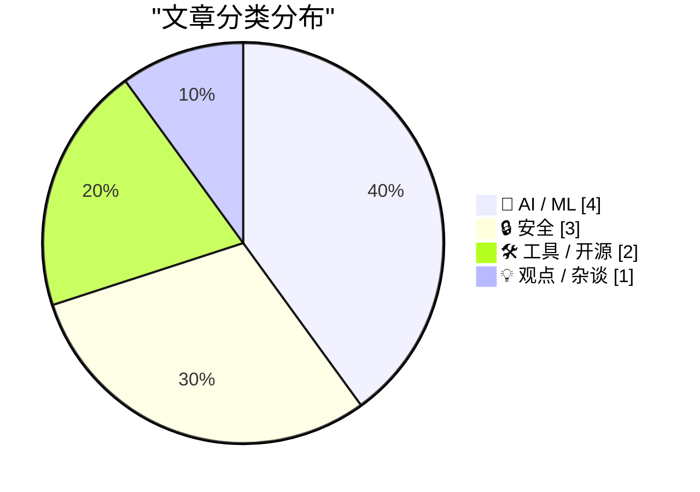
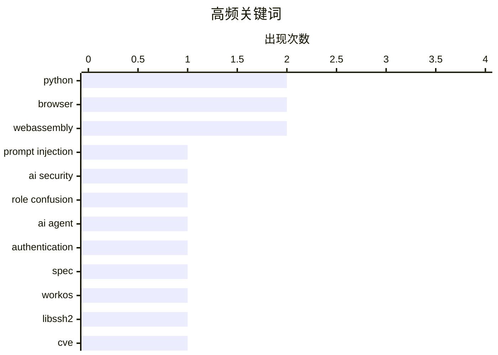

今日技术圈关注三大趋势：AI安全领域持续发酵，提示注入攻击出现新型混淆手法，同时WorkOS推出首个AI代理身份认证规范；浏览器端侧AI模型加速落地，Moebius图像修复模型成功移植至浏览器运行；网络安全事件再有新进展，知名黑客组织Scattered Spider在审判首日认罪。

<!--more-->


> 来自 Karpathy 推荐的 92 个顶级技术博客，AI 精选 Top 10

## 🏆 今日必读

🥇 **Prompt Injection as Role Confusion**

[Prompt Injection as Role Confusion](https://simonwillison.net/2026/Jun/22/prompt-injection-as-role-confusion/#atom-everything) — simonwillison.net · 1 天前 · 🔒 安全

> Prompt Injection as Role Confusion

🏷️ prompt injection, AI security, role confusion

🥈 **[Sponsor] WorkOS: Agents Need Auth. There’s Now a Spec for It.**

[[Sponsor] WorkOS: Agents Need Auth. There’s Now a Spec for It.](http://workos.com/auth-md?utm_source=daringfireball&amp;utm_medium=newsletter&amp;utm_campaign=q32026) — daringfireball.net · 3 小时前 · 🤖 AI / ML

> [Sponsor] WorkOS: Agents Need Auth. There’s Now a Spec for It.

🏷️ AI agent, authentication, spec, WorkOS

🥉 **"No way to prevent this" say users of only language where this regularly happens**

["No way to prevent this" say users of only language where this regularly happens](https://xeiaso.net/shitposts/no-way-to-prevent-this/memory-safety/CVE-2026-55200/) — xeiaso.net · 22 小时前 · 🔒 安全

> "No way to prevent this" say users of only language where this regularly happens

🏷️ libssh2, CVE, vulnerability, SSH

---

## 📊 数据概览

| 扫描源 | 抓取文章 | 时间范围 | 精选 |
|:---:|:---:|:---:|:---:|
| 86/92 | 2545 篇 → 34 篇 | 48h | **10 篇** |

### 分类分布



### 高频关键词



<details>
<summary>📈 纯文本关键词图（终端友好）</summary>

```
python           │ ████████████████████ 2
browser          │ ████████████████████ 2
webassembly      │ ████████████████████ 2
prompt injection │ ██████████░░░░░░░░░░ 1
ai security      │ ██████████░░░░░░░░░░ 1
role confusion   │ ██████████░░░░░░░░░░ 1
ai agent         │ ██████████░░░░░░░░░░ 1
authentication   │ ██████████░░░░░░░░░░ 1
spec             │ ██████████░░░░░░░░░░ 1
workos           │ ██████████░░░░░░░░░░ 1
```

</details>

### 🏷️ 话题标签

**python**(2) · **browser**(2) · **webassembly**(2) · prompt injection(1) · ai security(1) · role confusion(1) · ai agent(1) · authentication(1) · spec(1) · workos(1) · libssh2(1) · cve(1) · vulnerability(1) · ssh(1) · llm(1) · resume(1) · hiring(1) · ai-generated(1) · datasette(1) · database(1)

---

## 🤖 AI / ML

### 1. [Sponsor] WorkOS: Agents Need Auth. There’s Now a Spec for It.

[[Sponsor] WorkOS: Agents Need Auth. There’s Now a Spec for It.](http://workos.com/auth-md?utm_source=daringfireball&amp;utm_medium=newsletter&amp;utm_campaign=q32026) — **daringfireball.net** · 3 小时前 · ⭐ 25/30

> [Sponsor] WorkOS: Agents Need Auth. There’s Now a Spec for It.

🏷️ AI agent, authentication, spec, WorkOS

---

### 2. Quoting Tom MacWright

[Quoting Tom MacWright](https://simonwillison.net/2026/Jun/24/tom-macwright/#atom-everything) — **simonwillison.net** · 4 小时前 · ⭐ 24/30

> Quoting Tom MacWright

🏷️ LLM, resume, hiring, AI-generated

---

### 3. Porting the Moebius 0.2B image inpainting model to run in the browser with Claude Code

[Porting the Moebius 0.2B image inpainting model to run in the browser with Claude Code](https://simonwillison.net/2026/Jun/22/porting-moebius/#atom-everything) — **simonwillison.net** · 1 天前 · ⭐ 24/30

> Porting the Moebius 0.2B image inpainting model to run in the browser with Claude Code

🏷️ browser, inpainting, model, WebAssembly

---

### 4. The Coming Loop

[The Coming Loop](https://lucumr.pocoo.org/2026/6/23/the-coming-loop/) — **lucumr.pocoo.org** · 1 天前 · ⭐ 24/30

> The Coming Loop

🏷️ AI agents, coding, automation, loops

---

## 🔒 安全

### 5. Prompt Injection as Role Confusion

[Prompt Injection as Role Confusion](https://simonwillison.net/2026/Jun/22/prompt-injection-as-role-confusion/#atom-everything) — **simonwillison.net** · 1 天前 · ⭐ 25/30

> Prompt Injection as Role Confusion

🏷️ prompt injection, AI security, role confusion

---

### 6. "No way to prevent this" say users of only language where this regularly happens

["No way to prevent this" say users of only language where this regularly happens](https://xeiaso.net/shitposts/no-way-to-prevent-this/memory-safety/CVE-2026-55200/) — **xeiaso.net** · 22 小时前 · ⭐ 25/30

> "No way to prevent this" say users of only language where this regularly happens

🏷️ libssh2, CVE, vulnerability, SSH

---

### 7. Scattered Spider Hackers Plead Guilty on Day 1 of Trial

[Scattered Spider Hackers Plead Guilty on Day 1 of Trial](https://krebsonsecurity.com/2026/06/scattered-spider-hackers-plead-guilty-on-day-1-of-trial/) — **krebsonsecurity.com** · 1 天前 · ⭐ 24/30

> Scattered Spider Hackers Plead Guilty on Day 1 of Trial

🏷️ hacking, cybersecurity, Scattered Spider

---

## 🛠 工具 / 开源

### 8. datasette 1.0a35

[datasette 1.0a35](https://simonwillison.net/2026/Jun/23/datasette/#atom-everything) — **simonwillison.net** · 1 天前 · ⭐ 24/30

> datasette 1.0a35

🏷️ Datasette, Python, database, release

---

### 9. OPFS + Pyodide test harness

[OPFS + Pyodide test harness](https://simonwillison.net/2026/Jun/23/opfs-pyodide/#atom-everything) — **simonwillison.net** · 1 天前 · ⭐ 22/30

> OPFS + Pyodide test harness

🏷️ Pyodide, WebAssembly, browser, Python

---

## 💡 观点 / 杂谈

### 10. How we’ll fight the platform war against Big AI

[How we’ll fight the platform war against Big AI](https://anildash.com/2026/06/23/fight-ai-platform-war/) — **anildash.com** · 1 天前 · ⭐ 22/30

> How we’ll fight the platform war against Big AI

🏷️ AI platforms, Big AI, competition, strategy

---

*生成于 2026-06-25 22:18 | 扫描 86 源 → 获取 2545 篇 → 精选 10 篇*
*基于 [Hacker News Popularity Contest 2025](https://refactoringenglish.com/tools/hn-popularity/) RSS 源列表，由 [Andrej Karpathy](https://x.com/karpathy) 推荐*
*由「懂点儿AI」制作，欢迎关注同名微信公众号获取更多 AI 实用技巧 💡*
