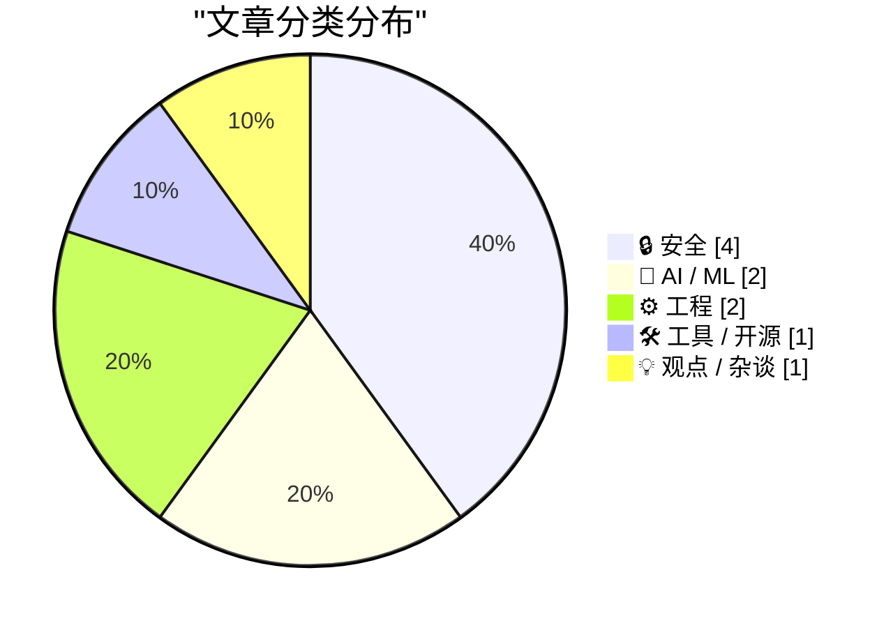
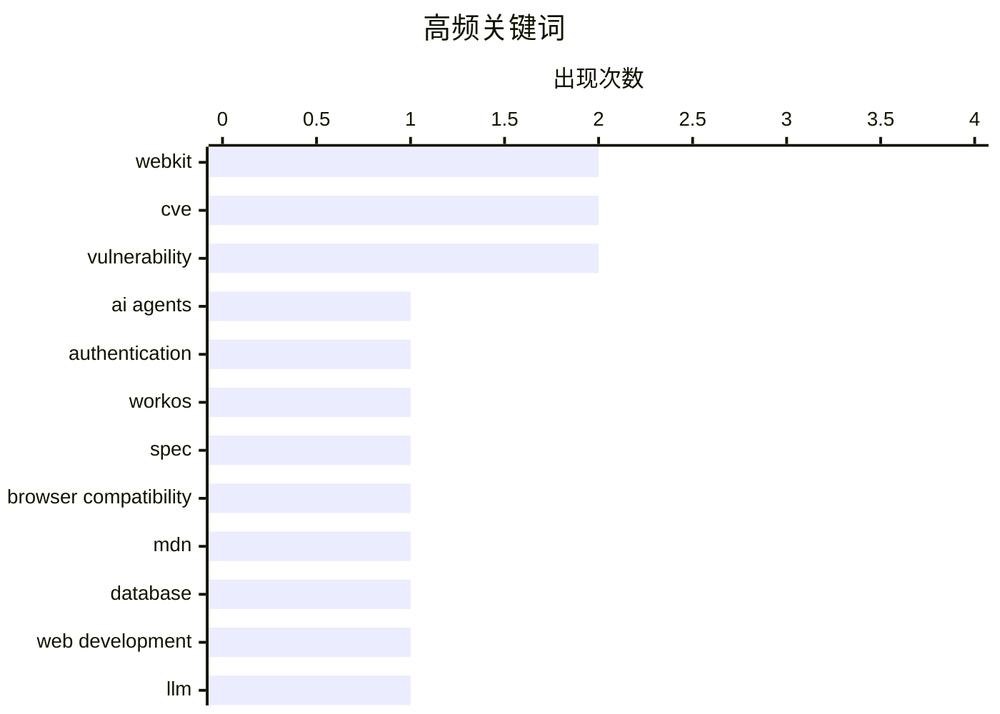

今日技术圈主要关注三大趋势：AI代理身份认证领域终于迎来标准化规范，WorkOS发布的认证Spec或将成为行业基准；Safari 27 Beta带来WebKit多项工程更新，复制菜单等功能持续优化；同时安全话题持续发酵，从越狱法律定性到角色混淆风险，引发业界对语言安全模型的广泛讨论。

<!--more-->


> 来自 Karpathy 推荐的 92 个顶级技术博客，AI 精选 Top 10

## 🏆 今日必读

🥇 **[Sponsor] WorkOS: Agents Need Auth. There’s Now a Spec for It.**

[[Sponsor] WorkOS: Agents Need Auth. There’s Now a Spec for It.](http://workos.com/auth-md?utm_source=daringfireball&amp;utm_medium=newsletter&amp;utm_campaign=q32026) — daringfireball.net · 1 天前 · 🤖 AI / ML

> [Sponsor] WorkOS: Agents Need Auth. There’s Now a Spec for It.

🏷️ AI agents, authentication, WorkOS, spec

🥈 **simonw/browser-compat-db**

[simonw/browser-compat-db](https://simonwillison.net/2026/Jun/24/browser-compat-db/#atom-everything) — simonwillison.net · 22 小时前 · 🛠 工具 / 开源

> simonw/browser-compat-db

🏷️ browser compatibility, MDN, database, web development

🥉 **Quoting Tom MacWright**

[Quoting Tom MacWright](https://simonwillison.net/2026/Jun/24/tom-macwright/#atom-everything) — simonwillison.net · 1 天前 · 🤖 AI / ML

> Quoting Tom MacWright

🏷️ LLM, job applications, AI generated content, career

---

## 📊 数据概览

| 扫描源 | 抓取文章 | 时间范围 | 精选 |
|:---:|:---:|:---:|:---:|
| 86/92 | 2545 篇 → 30 篇 | 48h | **10 篇** |

### 分类分布



### 高频关键词



<details>
<summary>📈 纯文本关键词图（终端友好）</summary>

```
webkit                │ ████████████████████ 2
cve                   │ ████████████████████ 2
vulnerability         │ ████████████████████ 2
ai agents             │ ██████████░░░░░░░░░░ 1
authentication        │ ██████████░░░░░░░░░░ 1
workos                │ ██████████░░░░░░░░░░ 1
spec                  │ ██████████░░░░░░░░░░ 1
browser compatibility │ ██████████░░░░░░░░░░ 1
mdn                   │ ██████████░░░░░░░░░░ 1
database              │ ██████████░░░░░░░░░░ 1
```

</details>

### 🏷️ 话题标签

**webkit**(2) · **cve**(2) · **vulnerability**(2) · ai agents(1) · authentication(1) · workos(1) · spec(1) · browser compatibility(1) · mdn(1) · database(1) · web development(1) · llm(1) · job applications(1) · ai generated content(1) · career(1) · safari 27(1) · beta(1) · new features(1) · om malik(1) · tech journalism(1)

---

## 🔒 安全

### 1. Thoughts on Role Confusion

[Thoughts on Role Confusion](https://www.gilesthomas.com/2026/06/role-confusion) — **gilesthomas.com** · 1 天前 · ⭐ 22/30

> Thoughts on Role Confusion

🏷️ prompt injection, role confusion, AI security

---

### 2. Pluralistic: Jailbreaking isn't theft (25 Jun 2026)

[Pluralistic: Jailbreaking isn't theft (25 Jun 2026)](https://pluralistic.net/2026/06/25/thieve-different/) — **pluralistic.net** · 12 小时前 · ⭐ 21/30

> Pluralistic: Jailbreaking isn't theft (25 Jun 2026)

🏷️ jailbreaking, legal, copyright, user rights

---

### 3. "No way to prevent this" say users of only language where this regularly happens

["No way to prevent this" say users of only language where this regularly happens](https://xeiaso.net/shitposts/no-way-to-prevent-this/memory-safety/CVE-2026-8461/) — **xeiaso.net** · 22 小时前 · ⭐ 21/30

> "No way to prevent this" say users of only language where this regularly happens

🏷️ CVE, FFmpeg, vulnerability, MagicYUV

---

### 4. "No way to prevent this" say users of only language where this regularly happens

["No way to prevent this" say users of only language where this regularly happens](https://xeiaso.net/shitposts/no-way-to-prevent-this/memory-safety/CVE-2026-55200/) — **xeiaso.net** · 1 天前 · ⭐ 21/30

> "No way to prevent this" say users of only language where this regularly happens

🏷️ CVE, libssh2, vulnerability, SSH

---

## 🤖 AI / ML

### 5. [Sponsor] WorkOS: Agents Need Auth. There’s Now a Spec for It.

[[Sponsor] WorkOS: Agents Need Auth. There’s Now a Spec for It.](http://workos.com/auth-md?utm_source=daringfireball&amp;utm_medium=newsletter&amp;utm_campaign=q32026) — **daringfireball.net** · 1 天前 · ⭐ 24/30

> [Sponsor] WorkOS: Agents Need Auth. There’s Now a Spec for It.

🏷️ AI agents, authentication, WorkOS, spec

---

### 6. Quoting Tom MacWright

[Quoting Tom MacWright](https://simonwillison.net/2026/Jun/24/tom-macwright/#atom-everything) — **simonwillison.net** · 1 天前 · ⭐ 23/30

> Quoting Tom MacWright

🏷️ LLM, job applications, AI generated content, career

---

## ⚙️ 工程

### 7. WebKit in Safari 27 Beta

[WebKit in Safari 27 Beta](https://webkit.org/blog/17967/news-from-wwdc26-webkit-in-safari-27-beta/) — **daringfireball.net** · 1 天前 · ⭐ 23/30

> WebKit in Safari 27 Beta

🏷️ Safari 27, WebKit, beta, new features

---

### 8. WebKit Always Enables the Copy Menu Item in Every App

[WebKit Always Enables the Copy Menu Item in Every App](https://lapcatsoftware.com/articles/2026/6/5.html) — **daringfireball.net** · 1 天前 · ⭐ 21/30

> WebKit Always Enables the Copy Menu Item in Every App

🏷️ Safari, WebKit, copy menu, bug

---

## 🛠 工具 / 开源

### 9. simonw/browser-compat-db

[simonw/browser-compat-db](https://simonwillison.net/2026/Jun/24/browser-compat-db/#atom-everything) — **simonwillison.net** · 22 小时前 · ⭐ 23/30

> simonw/browser-compat-db

🏷️ browser compatibility, MDN, database, web development

---

## 💡 观点 / 杂谈

### 10. Om Malik, 1966-2026

[Om Malik, 1966-2026](https://om.co/2026/06/24/1966-2026/) — **daringfireball.net** · 1 小时前 · ⭐ 22/30

> Om Malik, 1966-2026

🏷️ Om Malik, tech journalism, obituary, industry

---

*生成于 2026-06-26 22:18 | 扫描 86 源 → 获取 2545 篇 → 精选 10 篇*
*基于 [Hacker News Popularity Contest 2025](https://refactoringenglish.com/tools/hn-popularity/) RSS 源列表，由 [Andrej Karpathy](https://x.com/karpathy) 推荐*
*由「懂点儿AI」制作，欢迎关注同名微信公众号获取更多 AI 实用技巧 💡*
