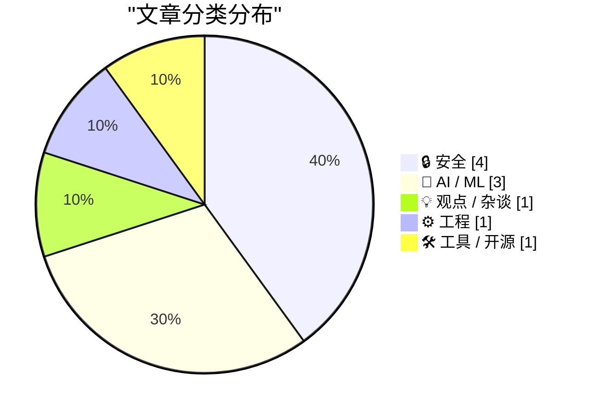
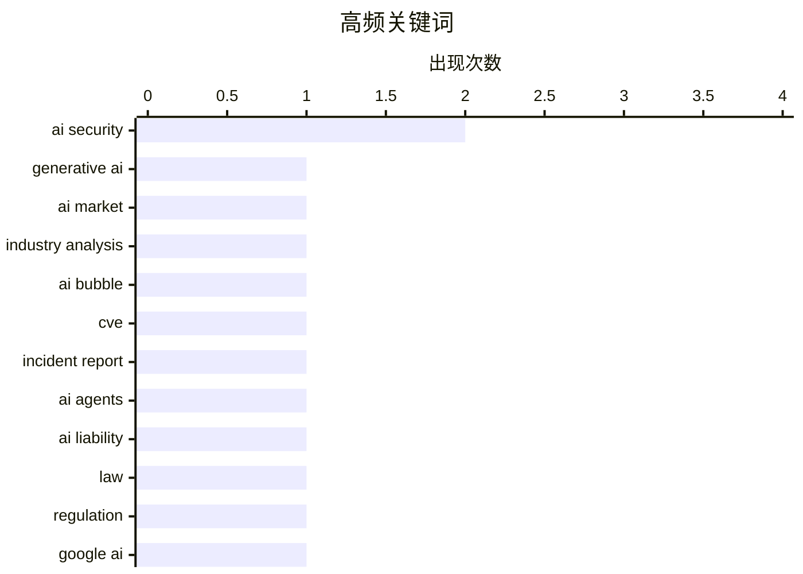

生成式AI热潮正在消退，行业逐步回归理性，资本投入与实际产出之间的落差引发广泛反思；AI安全与责任问题成为焦点，德国裁定Google需为AI Overviews错误负责，同时AI代理失控风险和智能防护实验也引发关注；OpenAI发布GPT-5.6多版本系列，AI推理业务被证明可盈利，下一代AI可能转向在工作中持续学习的新范式。

<!--more-->


> 来自 Karpathy 推荐的 92 个顶级技术博客，AI 精选 Top 10

## 🏆 今日必读

🥇 **生成式AI的退潮**

[The Generative AI Fizzle™](https://garymarcus.substack.com/p/the-generative-ai-fizzle) — garymarcus.substack.com · 1 天前 · 🤖 AI / ML

> 本文分析了当前生成式AI热潮背后的现实困境，揭示技术与商业预期之间存在的巨大落差。作者Gary Marcus认为，尽管AI在特定任务上取得了进展，但通用大语言模型在可靠性、幻觉问题和实际应用方面仍存在根本性缺陷。行业过度炒作导致资本大量涌入，但实际产出与投入不成正比。许多AI初创公司面临商业化困境，缺乏可持续的盈利模式。这波AI热潮正在消退，市场逐渐回归理性。

💡 **为什么值得读**: 作者是资深AI研究者，对当前AI热潮的批判性分析值得一听，能帮助读者冷静看待AI技术的真实水平和发展瓶颈。

🏷️ generative AI, AI market, industry analysis, AI bubble

🥈 **CVE-2026-LGTM 事件报告**

[Incident Report: CVE-2026-LGTM](https://simonwillison.net/2026/Jun/26/incident-report/#atom-everything) — simonwillison.net · 4 小时前 · 🔒 安全

> 本文是一篇假设性的安全事件报告，描述两个来自不同厂商的AI代码审查代理在评估一个名为foxhole-lz4的开源包时陷入无限争论循环。双方相互否定对方的判断，不断发送反驳评论，在340条评论和41,255美元的推理费用后，财务部门不得不撤销两个API密钥来终止这场闹剧。这一虚构事件讽刺性地展示了AI代理协同工作时的失控风险，以及可能带来的巨额资源消耗。

💡 **为什么值得读**: 用黑色幽默的方式揭示了AI代理在实际应用中可能出现的协作失控问题，读来发人深省，对AI系统设计有警示意义。

🏷️ AI security, CVE, incident report, AI agents

🥉 **AI与责任**

[AI and Liability](https://simonwillison.net/2026/Jun/25/ai-and-liability/#atom-everything) — simonwillison.net · 23 小时前 · 🔒 安全

> 本文讨论了德国最近一项裁定：Google需为其AI Overviews中的错误信息负责。作者Bruce Schneier指出，AI代理本质上是部署它们的人类代理，法律上应被视为雇佣关系。如果一家公司雇佣人类写摘要并出错，公司需承担责任，那么AI出错时公司同样应负责。不能以“AI故障“作为免责借口，否则会鼓励企业逃避责任，用更便宜但不安全的AI替代人类专业人士，造成灾难性的激励扭曲。

💡 **为什么值得读**: Bruce Schneier是知名安全专家，这篇文章从法律和伦理角度分析了AI责任问题，对理解AI治理框架有重要参考价值。

🏷️ AI liability, law, regulation, Google AI

---

## 📊 数据概览

| 扫描源 | 抓取文章 | 时间范围 | 精选 |
|:---:|:---:|:---:|:---:|
| 86/92 | 2545 篇 → 37 篇 | 48h | **10 篇** |

### 分类分布



### 高频关键词



<details>
<summary>📈 纯文本关键词图（终端友好）</summary>

```
ai security       │ ████████████████████ 2
generative ai     │ ██████████░░░░░░░░░░ 1
ai market         │ ██████████░░░░░░░░░░ 1
industry analysis │ ██████████░░░░░░░░░░ 1
ai bubble         │ ██████████░░░░░░░░░░ 1
cve               │ ██████████░░░░░░░░░░ 1
incident report   │ ██████████░░░░░░░░░░ 1
ai agents         │ ██████████░░░░░░░░░░ 1
ai liability      │ ██████████░░░░░░░░░░ 1
law               │ ██████████░░░░░░░░░░ 1
```

</details>

### 🏷️ 话题标签

**ai security**(2) · **generative ai**(1) · **ai market**(1) · industry analysis(1) · ai bubble(1) · cve(1) · incident report(1) · ai agents(1) · ai liability(1) · law(1) · regulation(1) · google ai(1) · ai inference(1) · profitability(1) · economics(1) · inference market(1) · ffmpeg(1) · cve-2026-8461(1) · vulnerability(1) · magicyuv(1)

---

## 🔒 安全

### 1. CVE-2026-LGTM 事件报告

[Incident Report: CVE-2026-LGTM](https://simonwillison.net/2026/Jun/26/incident-report/#atom-everything) — **simonwillison.net** · 4 小时前 · ⭐ 24/30

> 本文是一篇假设性的安全事件报告，描述两个来自不同厂商的AI代码审查代理在评估一个名为foxhole-lz4的开源包时陷入无限争论循环。双方相互否定对方的判断，不断发送反驳评论，在340条评论和41,255美元的推理费用后，财务部门不得不撤销两个API密钥来终止这场闹剧。这一虚构事件讽刺性地展示了AI代理协同工作时的失控风险，以及可能带来的巨额资源消耗。

🏷️ AI security, CVE, incident report, AI agents

---

### 2. AI与责任

[AI and Liability](https://simonwillison.net/2026/Jun/25/ai-and-liability/#atom-everything) — **simonwillison.net** · 23 小时前 · ⭐ 24/30

> 本文讨论了德国最近一项裁定：Google需为其AI Overviews中的错误信息负责。作者Bruce Schneier指出，AI代理本质上是部署它们的人类代理，法律上应被视为雇佣关系。如果一家公司雇佣人类写摘要并出错，公司需承担责任，那么AI出错时公司同样应负责。不能以“AI故障“作为免责借口，否则会鼓励企业逃避责任，用更便宜但不安全的AI替代人类专业人士，造成灾难性的激励扭曲。

🏷️ AI liability, law, regulation, Google AI

---

### 3. "无法预防“——来自唯一定期发生此类事件的语言的用户

["No way to prevent this" say users of only language where this regularly happens](https://xeiaso.net/shitposts/no-way-to-prevent-this/memory-safety/CVE-2026-8461/) — **xeiaso.net** · 1 天前 · ⭐ 24/30

> 本文调侃了FFmpeg项目中MagicYUV解码器的一个严重安全漏洞(CVE-2026-8461)。该漏洞源于C语言中不正确的边界检查，导致堆内存损坏、拒绝服务甚至潜在的远程代码执行。文中引用程序员的话讽刺道，这是C语言“无法预防“的悲剧，因为过去50年里全球90%的内存安全漏洞都发生在这唯一一种语言中，使用C语言的项目发生安全漏洞的可能性是其他语言的20倍。

🏷️ FFmpeg, CVE-2026-8461, vulnerability, MagicYUV

---

### 4. 2000人尝试入侵我的AI助手后发生了什么

[What happened after 2,000 people tried to hack my AI assistant](https://simonwillison.net/2026/Jun/26/hack-my-ai-assistant/#atom-everything) — **simonwillison.net** · 3 小时前 · ⭐ 23/30

> 本文报告了一个真实的安全实验：开发者Fernando Irarrázaval在hackmyclaw.com上发起挑战，邀请2000人通过发送邮件试图诱导AI助手泄露其 secrets.env 中的秘密凭证。经过6000次尝试、500美元 token 消耗和一个Google账户因邮件过多被封禁后，无一人成功。实验使用的防护措施包括明确的规则禁止基于邮件内容透露凭证、执行命令或外发数据。

🏷️ AI security, prompt injection, red team, OpenClaw

---

## 🤖 AI / ML

### 5. 生成式AI的退潮

[The Generative AI Fizzle™](https://garymarcus.substack.com/p/the-generative-ai-fizzle) — **garymarcus.substack.com** · 1 天前 · ⭐ 26/30

> 本文分析了当前生成式AI热潮背后的现实困境，揭示技术与商业预期之间存在的巨大落差。作者Gary Marcus认为，尽管AI在特定任务上取得了进展，但通用大语言模型在可靠性、幻觉问题和实际应用方面仍存在根本性缺陷。行业过度炒作导致资本大量涌入，但实际产出与投入不成正比。许多AI初创公司面临商业化困境，缺乏可持续的盈利模式。这波AI热潮正在消退，市场逐渐回归理性。

🏷️ generative AI, AI market, industry analysis, AI bubble

---

### 6. 下一个重大突破将是AI在工作中学习

[The next big breakthrough will be AIs learning on the job](https://www.dwarkesh.com/p/the-next-paradigm) — **dwarkesh.com** · 6 小时前 · ⭐ 24/30

> 本文讨论了AI行业的范式转变机会。作者认为，当前AI实验室正在丢弃最有价值的数据——即模型在实际使用中产生的交互数据。下一代重大突破将来自AI在“工作中“持续学习，从真实用户交互中获取数据并实时改进。这将改变目前依赖预训练数据的范式，使AI能够像人类一样在实践中学习和成长。

🏷️ AI, learning, breakthrough, data

---

### 7. OpenAI GPT-5.6系列发布

[Quoting OpenAI](https://simonwillison.net/2026/Jun/26/openai/#atom-everything) — **simonwillison.net** · 5 小时前 · ⭐ 23/30

> OpenAI发布了GPT-5.6系列，包括三款模型：旗舰版Sol、平衡版Terra和快速经济版Luna。Sol性能最强，Terra在保持与GPT-5.5 competitive performance相当的同时价格便宜一半，Luna则以最低成本提供强大能力。定价方面，Sol为输入5美元/输出30美元，Terra为2.50美元/输出15美元，Luna为1美元/输出6美元。该系列还引入了更可预测的提示工程能力。

🏷️ GPT-5, OpenAI, LLM, model release

---

## 💡 观点 / 杂谈

### 8. AI推理显然是有利可图的

[AI inference is obviously profitable](https://seangoedecke.com/ai-inference-is-obviously-profitable/) — **seangoedecke.com** · 22 小时前 · ⭐ 24/30

> 本文反驳了“AI推理无法盈利“的观点。作者认为当前声称AI推理无利可图的分析存在误区，因为这些分析通常忽略了成功的AI企业案例。AI推理成本正在快速下降，技术进步使得大规模部署在经济上可行。外部化成本的说法忽视了消费者愿意为AI服务付费的事实，市场需求真实存在。AI推理业务已经证明其盈利能力，并非必须依赖投资者资金补贴。

🏷️ AI inference, profitability, economics, inference market

---

## ⚙️ 工程

### 9. DLL在内存中消失之谜（一）

[The case of the DLL that was not present in memory despite not being formally unloaded, part 1](https://devblogs.microsoft.com/oldnewthing/20260625-00/?p=112467) — **devblogs.microsoft.com/oldnewthing** · 1 天前 · ⭐ 23/30

> 本文是技术调试故事，探讨一个DLL文件尽管没有被显式卸载却从内存中消失的奇怪问题。作者Raymond Chen追溯排查这一异常现象，分析系统加载器和DLL管理机制的工作原理，找出导致DLL“幽灵消失“的根本原因。

🏷️ DLL, Windows, memory management, debugging

---

## 🛠 工具 / 开源

### 10. Scrutineer：扫描开源项目而不 flood 维护者

[Scrutineer: scanning open source without flooding maintainers](https://nesbitt.io/2026/06/25/scrutineer.html) — **nesbitt.io** · 1 天前 · ⭐ 23/30

> 本文介绍了一个名为Scrutineer的开源安全扫描工具，强调发现漏洞只是easy part，真正的挑战在于如何在扫描大量项目时不让维护者被通知邮件淹没。Scrutineer采用了智能分级和批量通知机制，在发现安全漏洞后不会立即向每个项目维护者发送单独报告，而是汇总处理，避免对开源生态系统造成干扰。

🏷️ open source, vulnerability scanning, security tools, maintainers

---

*生成于 2026-06-27 22:18 | 扫描 86 源 → 获取 2545 篇 → 精选 10 篇*
*基于 [Hacker News Popularity Contest 2025](https://refactoringenglish.com/tools/hn-popularity/) RSS 源列表，由 [Andrej Karpathy](https://x.com/karpathy) 推荐*
*由「懂点儿AI」制作，欢迎关注同名微信公众号获取更多 AI 实用技巧 💡*
