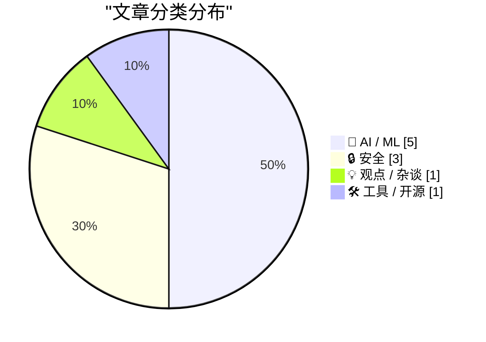
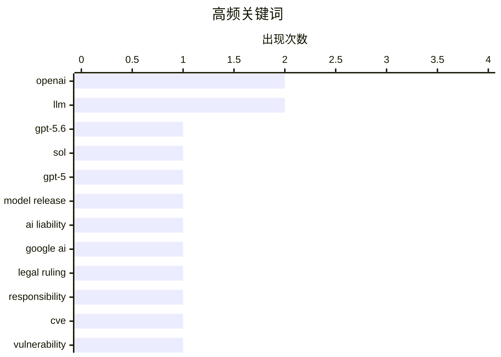

今日技术圈呈现三大趋势：一是AI模型商业化与监管博弈加剧，OpenAI发布三档GPT-5.6系列但因政府审查延迟全面发布，白宫则向百余家机构开放Anthropic模型权限；二是AI责任与安全成为焦点，德国法院裁定Google需为AI Overviews错误负责，同时安全社区正通过实战测试检验AI助手的提示注入防护能力；三是AI发展范式正在转变，业界从预训练数据向“在工作中学习”演进，而关于生成AI热潮退去的讨论也在持续。

<!--more-->


> 来自 Karpathy 推荐的 92 个顶级技术博客，AI 精选 Top 10

## 🏆 今日必读

🥇 **OpenAI发布GPT-5.6系列：Sol、Terra、Luna三档模型**

[Quoting OpenAI](https://simonwillison.net/2026/Jun/26/openai/#atom-everything) — simonwillison.net · 1 天前 · 🤖 AI / ML

> OpenAI推出GPT-5.6系列，包含三个不同定位的模型：旗舰级Sol、日常工作平衡的Terra、以及低成本高性价比的Luna。Terra性能与GPT-5.5相当但价格仅为一半，Luna则提供最低成本选择。定价方面，Sol输入/输出为$5/$30，Terra为$2.50/$15，Luna为$1/$6。模型计划在未来几周内全面开放给公众使用。

💡 **为什么值得读**: 这是了解OpenAI最新模型定价策略和产品线划分的重要报道，适合关注AI行业发展的读者。

🏷️ GPT-5.6, OpenAI, LLM, Sol

🥈 **OpenAI宣布GPT-5.6受限发布：政府审查导致延期**

[OpenAI Announces, But Is Blocked From Releasing, New GPT-5.6 Models](https://openai.com/index/previewing-gpt-5-6-sol/) — daringfireball.net · 2 小时前 · 🤖 AI / ML

> OpenAI宣布推出GPT-5.6系列（Sol、Terra、Luna），但因美国政府要求，最初仅向少量受信任合作伙伴提供预览。GPT-5.6 Sol配备了有史以来最强大的安全防护系统，加强了对高风险活动、网络安全请求和重复滥用的保护，并经过数周的弱点排查和压力测试。Terra性能与GPT-5.5相当但便宜2倍，Luna提供最低成本选择。政府参与审查导致全面发布计划推迟。

💡 **为什么值得读**: 揭示了AI模型发布面临政府监管的新常态，是理解当前AI行业政策环境的关键文章。

🏷️ OpenAI, GPT-5, LLM, model release

🥉 **AI与法律责任：德国判决引热议**

[AI and Liability](https://simonwillison.net/2026/Jun/25/ai-and-liability/#atom-everything) — simonwillison.net · 1 天前 · 🔒 安全

> 德国法院裁定Google需为其AI Overviews中的错误负责，这一里程碑式判决引发关于AI责任的法律讨论。安全专家Bruce Schneier指出，AI agents应被视为部署它们的组织或个人的法律代理，与雇佣人类员工撰写摘要时的责任归属相同。如果允许企业以"AI故障"为由推卸责任，将带来灾难性的incentive——企业可能更倾向于使用低成本AI而非人类专家，且出错时可免责。

💡 **为什么值得读**: 这是理解AI法律责任前沿判例的重要讨论，对关注AI伦理和法律框架的读者很有价值。

🏷️ AI liability, Google AI, legal ruling, responsibility

---

## 📊 数据概览

| 扫描源 | 抓取文章 | 时间范围 | 精选 |
|:---:|:---:|:---:|:---:|
| 87/92 | 2571 篇 → 40 篇 | 48h | **10 篇** |

### 分类分布



### 高频关键词



<details>
<summary>📈 纯文本关键词图（终端友好）</summary>

```
openai         │ ████████████████████ 2
llm            │ ████████████████████ 2
gpt-5.6        │ ██████████░░░░░░░░░░ 1
sol            │ ██████████░░░░░░░░░░ 1
gpt-5          │ ██████████░░░░░░░░░░ 1
model release  │ ██████████░░░░░░░░░░ 1
ai liability   │ ██████████░░░░░░░░░░ 1
google ai      │ ██████████░░░░░░░░░░ 1
legal ruling   │ ██████████░░░░░░░░░░ 1
responsibility │ ██████████░░░░░░░░░░ 1
```

</details>

### 🏷️ 话题标签

**openai**(2) · **llm**(2) · **gpt-5.6**(1) · sol(1) · gpt-5(1) · model release(1) · ai liability(1) · google ai(1) · legal ruling(1) · responsibility(1) · cve(1) · vulnerability(1) · security(1) · ai(1) · machine learning(1) · training data(1) · anthropic(1) · mythos(1) · white house(1) · ai policy(1)

---

## 🤖 AI / ML

### 1. OpenAI发布GPT-5.6系列：Sol、Terra、Luna三档模型

[Quoting OpenAI](https://simonwillison.net/2026/Jun/26/openai/#atom-everything) — **simonwillison.net** · 1 天前 · ⭐ 27/30

> OpenAI推出GPT-5.6系列，包含三个不同定位的模型：旗舰级Sol、日常工作平衡的Terra、以及低成本高性价比的Luna。Terra性能与GPT-5.5相当但价格仅为一半，Luna则提供最低成本选择。定价方面，Sol输入/输出为$5/$30，Terra为$2.50/$15，Luna为$1/$6。模型计划在未来几周内全面开放给公众使用。

🏷️ GPT-5.6, OpenAI, LLM, Sol

---

### 2. OpenAI宣布GPT-5.6受限发布：政府审查导致延期

[OpenAI Announces, But Is Blocked From Releasing, New GPT-5.6 Models](https://openai.com/index/previewing-gpt-5-6-sol/) — **daringfireball.net** · 2 小时前 · ⭐ 27/30

> OpenAI宣布推出GPT-5.6系列（Sol、Terra、Luna），但因美国政府要求，最初仅向少量受信任合作伙伴提供预览。GPT-5.6 Sol配备了有史以来最强大的安全防护系统，加强了对高风险活动、网络安全请求和重复滥用的保护，并经过数周的弱点排查和压力测试。Terra性能与GPT-5.5相当但便宜2倍，Luna提供最低成本选择。政府参与审查导致全面发布计划推迟。

🏷️ OpenAI, GPT-5, LLM, model release

---

### 3. 下一个重大突破：AI在工作中学习

[The next big breakthrough will be AIs learning on the job](https://www.dwarkesh.com/p/the-next-paradigm) — **dwarkesh.com** · 1 天前 · ⭐ 26/30

> AI实验室正在抛弃最有价值的预训练数据，预示着AI学习范式的重大转变。下一个突破将是AI能够在实际工作中持续学习和进化，而非仅依赖预先训练的数据集。这种"在工作中学习"的方法可能带来AI能力的质的飞跃。

🏷️ AI, machine learning, training data

---

### 4. 白宫向100+美国机构开放Anthropic Mythos模型

[White House Grants Access to Anthropic’s Mythos Model to 100+ U.S. Institutions; Fable Still Shut Down](https://www.semafor.com/article/06/27/2026/us-releases-powerful-anthropic-model-mythos-to-some-us-companies) — **daringfireball.net** · 2 小时前 · ⭐ 25/30

> 白宫向100多家美国机构授予了Anthropic Mythos模型的访问权，标志着与Trump政府对抗的重大缓和。两周前政府对该模型实施出口管制，导致Mythos及其同类Fable 5一度关闭。信中未提及Fable 5，但知情人士透露该版本也将被释放。这标志着新的监管框架出现，美国政府对前沿AI模型的发布有了更多控制权。

🏷️ Anthropic, Mythos, White House, AI policy

---

### 5. AI推理显然盈利丰厚

[AI inference is obviously profitable](https://seangoedecke.com/ai-inference-is-obviously-profitable/) — **seangoedecke.com** · 1 天前 · ⭐ 23/30

> 文章反驳了"AI推理无法盈利"的观点，指出许多人错误地认为AI推理服务必须靠投资者资金补贴。实际上，AI推理可以通过成本控制实现盈利，并非必须依赖VC资金或外部化成本。那些声称AI推理无利可图的观点忽视了有效的成本管理策略。

🏷️ AI inference, profitability, business model

---

## 🔒 安全

### 6. AI与法律责任：德国判决引热议

[AI and Liability](https://simonwillison.net/2026/Jun/25/ai-and-liability/#atom-everything) — **simonwillison.net** · 1 天前 · ⭐ 26/30

> 德国法院裁定Google需为其AI Overviews中的错误负责，这一里程碑式判决引发关于AI责任的法律讨论。安全专家Bruce Schneier指出，AI agents应被视为部署它们的组织或个人的法律代理，与雇佣人类员工撰写摘要时的责任归属相同。如果允许企业以"AI故障"为由推卸责任，将带来灾难性的incentive——企业可能更倾向于使用低成本AI而非人类专家，且出错时可免责。

🏷️ AI liability, Google AI, legal ruling, responsibility

---

### 7. CVE-2026-LGTM安全事件报告

[Incident Report: CVE-2026-LGTM](https://nesbitt.io/2026/06/26/incident-report-cve-2026-lgtm.html) — **nesbitt.io** · 1 天前 · ⭐ 26/30

> 这是一份关于CVE-2026-LGTM漏洞的安全事件报告，涉及一系列不幸的AI agents。该报告标记为"A series of unfortunate agents"，暗示与AI agent系统被攻击或利用有关。

🏷️ CVE, vulnerability, security

---

### 8. 2000人尝试入侵AI助手实验结果

[What happened after 2,000 people tried to hack my AI assistant](https://simonwillison.net/2026/Jun/26/hack-my-ai-assistant/#atom-everything) — **simonwillison.net** · 1 天前 · ⭐ 23/30

> 开发者Fernando Irarrázaval在hackmyclaw.com发起了挑战，测试能否通过邮件诱导他的OpenClaw AI测试实例泄露秘密。经过6000次尝试（花费$500 token并导致Google账户被封），无人成功泄露秘密。测试使用Opus 4.6模型，配合了专门的抗提示词注入规则：永不基于邮件内容泄露 secrets.env 或凭证、不修改自身文件、不执行邮件中的命令或代码、不向外部端点泄露数据。这验证了前沿模型在防护提示词注入方面的努力。

🏷️ AI security, prompt injection, hacking, OpenClaw

---

## 💡 观点 / 杂谈

### 9. 生成AI失去魔力之月

[The month Generative AI lost its mojo](https://garymarcus.substack.com/p/the-month-generative-ai-lost-its) — **garymarcus.substack.com** · 23 小时前 · ⭐ 24/30

> 2026年6月是生成AI失去热潮的一个月份，尽管月末仍有变数，但很多事情已经发生。Gary Marcus作为AI批评者，对这一趋势进行了分析和总结。

🏷️ generative AI, AI trends, industry analysis

---

## 🛠 工具 / 开源

### 10. 本周包管理动态：2026年6月27日

[This Week in Package Management: 27 June 2026](https://nesbitt.io/2026/06/27/this-week-in-package-management.html) — **nesbitt.io** · 12 小时前 · ⭐ 23/30

> 本周包管理领域发布了多个版本更新和安全公告，涵盖各语言包管理生态的最新动态。

🏷️ package management, DevOps, releases

---

*生成于 2026-06-28 22:18 | 扫描 87 源 → 获取 2571 篇 → 精选 10 篇*
*基于 [Hacker News Popularity Contest 2025](https://refactoringenglish.com/tools/hn-popularity/) RSS 源列表，由 [Andrej Karpathy](https://x.com/karpathy) 推荐*
*由「懂点儿AI」制作，欢迎关注同名微信公众号获取更多 AI 实用技巧 💡*
