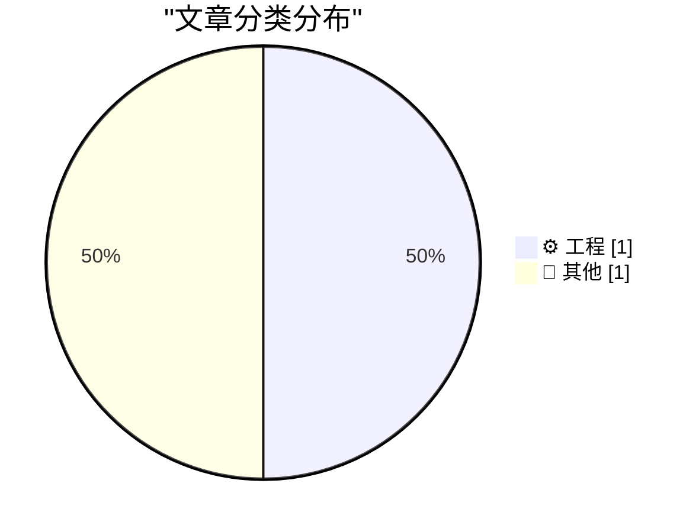
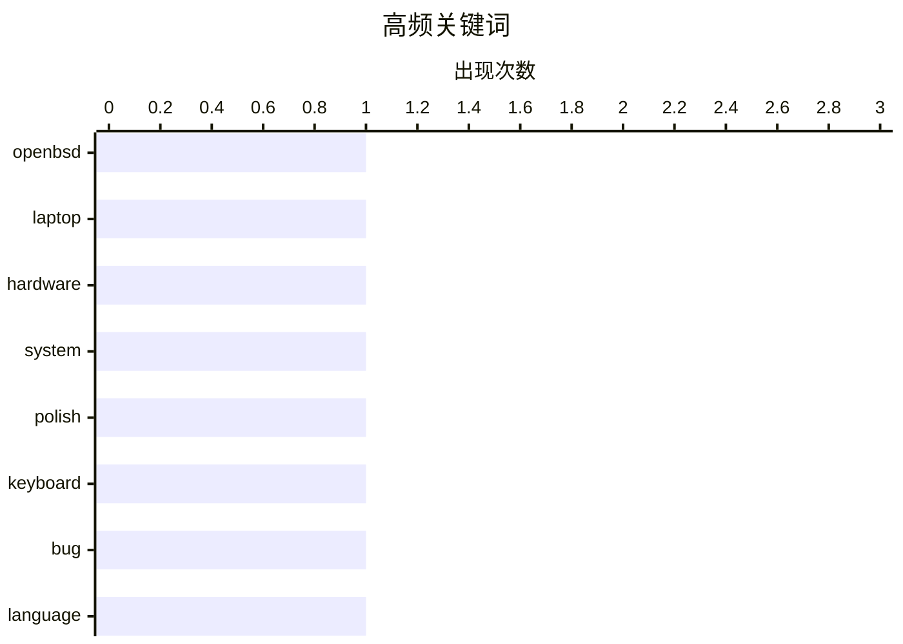

今日看点：开源社区持续关注小众硬件的自由计算可能，Lemote Yeeloong笔记本运行OpenBSD的实践揭示了非主流硬件的兼容挑战；与此同时，一个跨越三十年的波兰语键盘Bug的终结，反映了软件国际化进程中容易被忽视的边缘问题仍需技术社区持续跟进。

<!--more-->


> 来自 Karpathy 推荐的 92 个顶级技术博客，AI 精选 Top 2

## 📊 数据概览

| 扫描源 | 抓取文章 | 时间范围 | 精选 |
|:---:|:---:|:---:|:---:|
| 51/92 | 1690 篇 → 2 篇 | 48h | **2 篇** |

### 分类分布



### 高频关键词



<details>
<summary>📈 纯文本关键词图（终端友好）</summary>

```
openbsd  │ ████████████████████ 1
laptop   │ ████████████████████ 1
hardware │ ████████████████████ 1
system   │ ████████████████████ 1
polish   │ ████████████████████ 1
keyboard │ ████████████████████ 1
bug      │ ████████████████████ 1
language │ ████████████████████ 1
```

</details>

### 🏷️ 话题标签

**openbsd**(1) · **laptop**(1) · **hardware**(1) · system(1) · polish(1) · keyboard(1) · bug(1) · language(1)

---

## ⚙️ 工程

### 1. 在Lemote Yeeloong笔记本上驯服"巨龙"：OpenBSD实战笔记

[Working around dragons with the Lemote Yeeloong laptop and OpenBSD](https://oldvcr.blogspot.com/feeds/4105976086519173967/comments/default) — **oldvcr.blogspot.com** · 19 小时前 · ⭐ 15/30

> 本文探讨了在中国产Lemote Yeeloong笔记本上运行OpenBSD系统所面临的挑战与解决方案。Lemote Yeeloong是少数支持自由BIOS的笔记本电脑之一，曾被视为追求计算自由（Free Computing）用户的重要硬件选择。作者以"驯龙"比喻解决OpenBSD在此硬件上的兼容性问题，记录了包括显卡、无线网卡等关键组件的驱动配置过程。文章强调了真正的启蒙来源于完全自由的计算体验，呼应了自由软件运动的核心理念。

🏷️ OpenBSD, laptop, hardware, system

---

## 📝 其他

### 2. 消失的波兰字母S：一个跨越三十年的键盘Bug

[The curious case of the disappearing Polish S](https://aresluna.org/the-curious-case-of-the-disappearing-polish-s) — **aresluna.org** · 1 天前 · ⭐ 15/30

> 本文揭示了一个历时三十年的波兰语键盘输入Bug的来龙去脉。文章指出，这个被称为"消失的波兰S"的问题源于早期键盘驱动与波兰语特殊字符（如ś、ź）处理机制的冲突。问题的特殊性在于它跨越了多个操作系统版本和硬件平台却始终未被彻底修复，反映了软件国际化中容易被忽视的边缘案例。作者通过追溯Bug的产生源头、演变过程及各种临时解决方案，呈现了语言本地化工作中看似微小却影响深远的技术细节。最终揭示了该Bug如何在三十年间逐步被暴露、认识和终结的过程。

🏷️ Polish, keyboard, bug, language

---

*生成于 2026-06-29 22:38 | 扫描 51 源 → 获取 1690 篇 → 精选 2 篇*
*基于 [Hacker News Popularity Contest 2025](https://refactoringenglish.com/tools/hn-popularity/) RSS 源列表，由 [Andrej Karpathy](https://x.com/karpathy) 推荐*
*由「懂点儿AI」制作，欢迎关注同名微信公众号获取更多 AI 实用技巧 💡*
