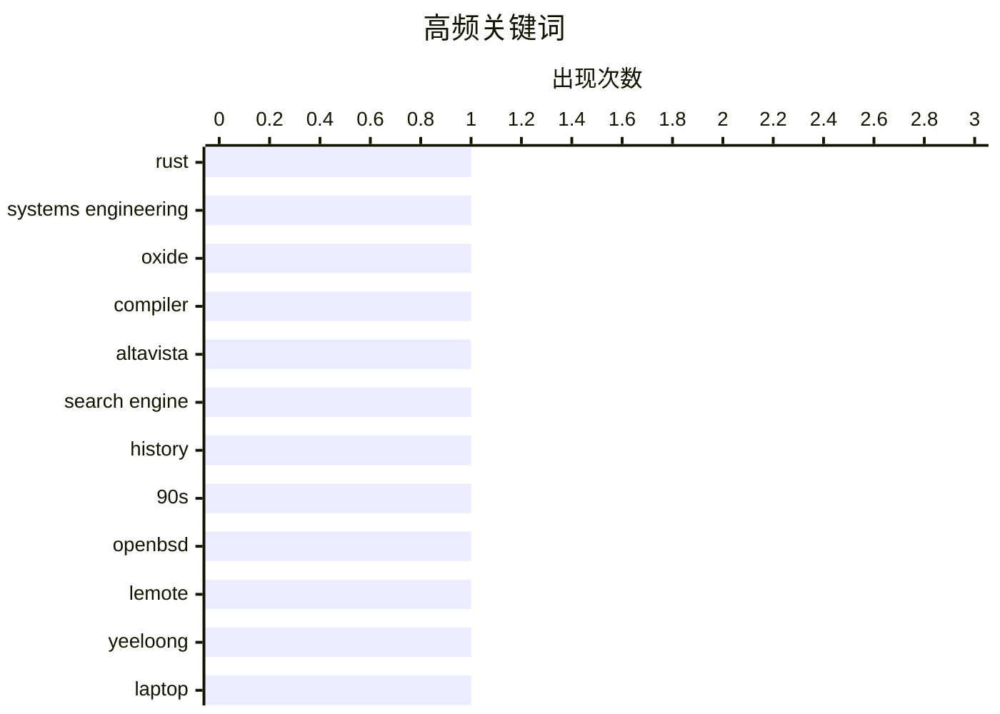

今日看点：AI热潮下，技术圈开始反思智能的边界——Bryan Cantrill分享 Oxide公司工程实践中的致命Bug，指出人类独特的价值观和非常规思维仍是解决复杂工程问题的关键，AI建议甚至存在误导风险。与此同时，技术怀旧持续升温，Altavista等早期互联网时代的经典产品引发开发者集体回忆，成为技术社区的热门话题。

<!--more-->


> 来自 Karpathy 推荐的 92 个顶级技术博客，AI 精选 Top 4

## 🏆 今日必读

🥇 **仅有智能是不够的**

[Notes from Bryan Cantrill’s “Intelligence is not Enough”](https://blog.jim-nielsen.com/2026/intelligence-isnt-enough/) — blog.jim-nielsen.com · 1 天前 · ⚙️ 工程

> Bryan Cantrill在演讲中分享了 Oxide 公司在工程实践中遇到的公司级致命 bug，这些问题若无法解决将导致公司倒闭。团队面临的最大挑战是没有任何先例可循，且能找到的相关文档和知识都是错误的。最终的解决方案完全违背了现有技术和知识框架，甚至超出了人工智能能够建议的范围。Cantrill 通过这些亲身经历的工程难题，揭示了一个核心观点：在技术领域，智能并非万能，人类独特的价值观和非常规思维在解决复杂问题时不可或缺。

💡 **为什么值得读**: 这篇演讲通过真实的工程案例，深刻诠释了人类创造力与人工智能的根本区别，对于任何关注技术决策和创新思维的人都具有重要启发。

🏷️ Rust, systems engineering, Oxide, compiler

🥈 **What happened to Altavista**

[What happened to Altavista](https://dfarq.homeip.net/what-happened-to-altavista/?utm_source=rss&#038;utm_medium=rss&#038;utm_campaign=what-happened-to-altavista) — dfarq.homeip.net · 11 小时前 · 📝 其他

> For as long as I can remember, my home page has been about:blank. But for a good chunk of the 1990s, I would have done well to set it to altavista.digital.com. Here’s what happened to Altavista, the s

🏷️ Altavista, search engine, history, 90s

🥉 **Working around dragons with the Lemote Yeeloong laptop and OpenBSD**

[Working around dragons with the Lemote Yeeloong laptop and OpenBSD](https://oldvcr.blogspot.com/feeds/4105976086519173967/comments/default) — oldvcr.blogspot.com · 1 天前 · ⚙️ 工程

> Behold: <a href="https://commons.wikimedia.org/wiki/File:GNU_and_Stallman_2012.JPG">the Guru of GNU</a>! (Photo by Habib Mhenni, Wikimedia Commons, CC BY-SA 3.0.)

<div class="separator" style="clear:

🏷️ OpenBSD, Lemote, Yeeloong, laptop

---

## 📊 数据概览

| 扫描源 | 抓取文章 | 时间范围 | 精选 |
|:---:|:---:|:---:|:---:|
| 51/92 | 1692 篇 → 4 篇 | 48h | **4 篇** |

### 分类分布


### 高频关键词



<details>
<summary>📈 纯文本关键词图（终端友好）</summary>

```
rust                │ ████████████████████ 1
systems engineering │ ████████████████████ 1
oxide               │ ████████████████████ 1
compiler            │ ████████████████████ 1
altavista           │ ████████████████████ 1
search engine       │ ████████████████████ 1
history             │ ████████████████████ 1
90s                 │ ████████████████████ 1
openbsd             │ ████████████████████ 1
lemote              │ ████████████████████ 1
```

</details>

### 🏷️ 话题标签

**rust**(1) · **systems engineering**(1) · **oxide**(1) · compiler(1) · altavista(1) · search engine(1) · history(1) · 90s(1) · openbsd(1) · lemote(1) · yeeloong(1) · laptop(1) · keyboards(1) · mechanical(1) · personal(1)

---

## ⚙️ 工程

### 1. 仅有智能是不够的

[Notes from Bryan Cantrill’s “Intelligence is not Enough”](https://blog.jim-nielsen.com/2026/intelligence-isnt-enough/) — **blog.jim-nielsen.com** · 1 天前 · ⭐ 24/30

> Bryan Cantrill在演讲中分享了 Oxide 公司在工程实践中遇到的公司级致命 bug，这些问题若无法解决将导致公司倒闭。团队面临的最大挑战是没有任何先例可循，且能找到的相关文档和知识都是错误的。最终的解决方案完全违背了现有技术和知识框架，甚至超出了人工智能能够建议的范围。Cantrill 通过这些亲身经历的工程难题，揭示了一个核心观点：在技术领域，智能并非万能，人类独特的价值观和非常规思维在解决复杂问题时不可或缺。

🏷️ Rust, systems engineering, Oxide, compiler

---

### 2. Working around dragons with the Lemote Yeeloong laptop and OpenBSD

[Working around dragons with the Lemote Yeeloong laptop and OpenBSD](https://oldvcr.blogspot.com/feeds/4105976086519173967/comments/default) — **oldvcr.blogspot.com** · 1 天前 · ⭐ 12/30

> Behold: <a href="https://commons.wikimedia.org/wiki/File:GNU_and_Stallman_2012.JPG">the Guru of GNU</a>! (Photo by Habib Mhenni, Wikimedia Commons, CC BY-SA 3.0.)

<div class="separator" style="clear:

🏷️ OpenBSD, Lemote, Yeeloong, laptop

---

## 📝 其他

### 3. What happened to Altavista

[What happened to Altavista](https://dfarq.homeip.net/what-happened-to-altavista/?utm_source=rss&#038;utm_medium=rss&#038;utm_campaign=what-happened-to-altavista) — **dfarq.homeip.net** · 11 小时前 · ⭐ 12/30

> For as long as I can remember, my home page has been about:blank. But for a good chunk of the 1990s, I would have done well to set it to altavista.digital.com. Here’s what happened to Altavista, the s

🏷️ Altavista, search engine, history, 90s

---

### 4. My favorite keyboards

[My favorite keyboards](https://fabiensanglard.net/keyboards/index.html) — **fabiensanglard.net** · 1 天前 · ⭐ 8/30

> 

🏷️ keyboards, mechanical, personal

---

*生成于 2026-06-30 22:29 | 扫描 51 源 → 获取 1692 篇 → 精选 4 篇*
*基于 [Hacker News Popularity Contest 2025](https://refactoringenglish.com/tools/hn-popularity/) RSS 源列表，由 [Andrej Karpathy](https://x.com/karpathy) 推荐*
*由「懂点儿AI」制作，欢迎关注同名微信公众号获取更多 AI 实用技巧 💡*
