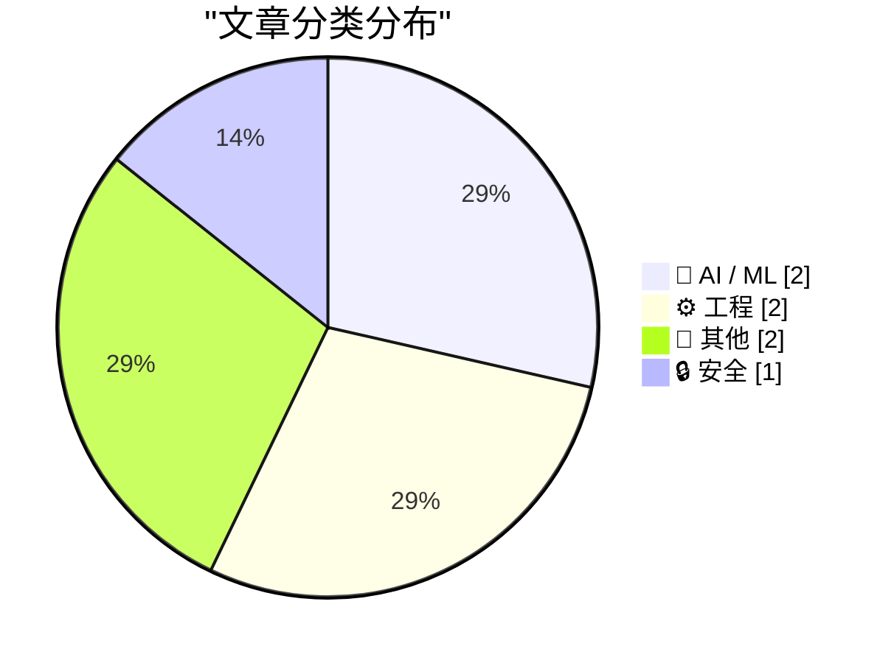
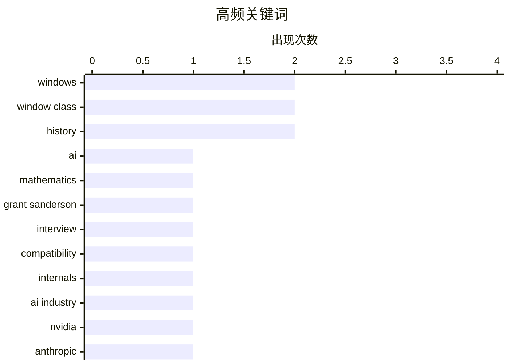

今日技术圈聚焦三大趋势：一是AI应用与挑战并存，从AI辅助数学证明的潜力到行业商业化困境，表明AI技术正进入务实审视阶段；二是Windows系统兼容性难题再现，窗口类扩展字节的历史设计被滥用，引发新旧应用兼容危机；三是网络安全意识持续提升，HTTPS从8年前被敦促推广到如今成为标配，记录了行业安全实践的演进。此外，科技怀旧亦成热点，Altavista、Apricot Computers等早期互联网先驱引发关注。

<!--more-->


> 来自 Karpathy 推荐的 92 个顶级技术博客，AI 精选 Top 7

## 🏆 今日必读

🥇 **Grant Sanderson – AI与数学的未来**

[Grant Sanderson – AI and the future of math](https://www.dwarkesh.com/p/grant-sanderson-2) — dwarkesh.com · 6 小时前 · 🤖 AI / ML

> Grant Sanderson（3Blue1Brown创始人）与主持人对谈AI将如何改变数学领域。数学被认为是人类最先见证超级智能出现的领域，因为数学具有明确的验证标准，AI生成的证明可以被验证真伪。讨论了当前AI在数学证明方面的能力边界，以及未来可能出现的AI辅助数学发现形式。认为AI不会取代数学家，而是会成为强大的工具，帮助人类探索更深层的数学结构。

💡 **为什么值得读**: 适合对AI未来发展趋势和数学领域变革感兴趣的人深入了解超级智能可能首先出现的场景

🏷️ AI, mathematics, Grant Sanderson, interview

🥈 **Windows窗口类扩展字节的滥用与兼容性问题**

[A compatibility note on the abuse of Windows window class extra bytes](https://devblogs.microsoft.com/oldnewthing/20260630-00/?p=112488) — devblogs.microsoft.com/oldnewthing · 8 小时前 · ⚙️ 工程

> 文章探讨了Windows窗口类扩展字节（extra bytes）的历史兼容性问题。开发者发现某些应用程序滥用了窗口类额外字节空间来存储非预期用途的数据，导致与现代Windows版本的兼容性问题。Windows原本设计为每个窗口类预留少量额外字节用于存储窗口特定数据，但被某些程序用于存储更大量的私有数据。这种滥用造成了向后兼容性的挑战，Microsoft需要在这篇文章中说明其兼容性处理方案。

💡 **为什么值得读**: 适合Windows开发者了解底层窗口机制的历史问题和兼容性解决方案

🏷️ Windows, window class, compatibility, internals

🥉 **AI行业正在失败**

[The AI Industry Is Losing](https://www.wheresyoured.at/the-ai-industry-is-losing/) — wheresyoured.at · 7 小时前 · 🤖 AI / ML

> 文章分析了当前AI行业面临的困境和挑战。作者认为AI行业正在“失败”，可能指商业化困难、技术瓶颈或市场预期与现实之间的差距。文中提到NVIDIA、Anthropic等公司的详细分析，以及对AI技术发展方向的深度思考。这是一篇付费订阅Newsletter的节选内容，作者提供每周5000-18000字的深度分析。

💡 **为什么值得读**: 适合想了解AI行业商业现状和未来挑战的从业者阅读

🏷️ AI industry, NVIDIA, Anthropic, market analysis

---

## 📊 数据概览

| 扫描源 | 抓取文章 | 时间范围 | 精选 |
|:---:|:---:|:---:|:---:|
| 51/92 | 1692 篇 → 7 篇 | 48h | **7 篇** |

### 分类分布



### 高频关键词



<details>
<summary>📈 纯文本关键词图（终端友好）</summary>

```
windows         │ ████████████████████ 2
window class    │ ████████████████████ 2
history         │ ████████████████████ 2
ai              │ ██████████░░░░░░░░░░ 1
mathematics     │ ██████████░░░░░░░░░░ 1
grant sanderson │ ██████████░░░░░░░░░░ 1
interview       │ ██████████░░░░░░░░░░ 1
compatibility   │ ██████████░░░░░░░░░░ 1
internals       │ ██████████░░░░░░░░░░ 1
ai industry     │ ██████████░░░░░░░░░░ 1
```

</details>

### 🏷️ 话题标签

**windows**(2) · **window class**(2) · **history**(2) · ai(1) · mathematics(1) · grant sanderson(1) · interview(1) · compatibility(1) · internals(1) · ai industry(1) · nvidia(1) · anthropic(1) · market analysis(1) · https(1) · security(1) · troy hunt(1) · ssl/tls(1) · api(1) · evolution(1) · apricot(1)

---

## 🤖 AI / ML

### 1. Grant Sanderson – AI与数学的未来

[Grant Sanderson – AI and the future of math](https://www.dwarkesh.com/p/grant-sanderson-2) — **dwarkesh.com** · 6 小时前 · ⭐ 26/30

> Grant Sanderson（3Blue1Brown创始人）与主持人对谈AI将如何改变数学领域。数学被认为是人类最先见证超级智能出现的领域，因为数学具有明确的验证标准，AI生成的证明可以被验证真伪。讨论了当前AI在数学证明方面的能力边界，以及未来可能出现的AI辅助数学发现形式。认为AI不会取代数学家，而是会成为强大的工具，帮助人类探索更深层的数学结构。

🏷️ AI, mathematics, Grant Sanderson, interview

---

### 2. AI行业正在失败

[The AI Industry Is Losing](https://www.wheresyoured.at/the-ai-industry-is-losing/) — **wheresyoured.at** · 7 小时前 · ⭐ 23/30

> 文章分析了当前AI行业面临的困境和挑战。作者认为AI行业正在“失败”，可能指商业化困难、技术瓶颈或市场预期与现实之间的差距。文中提到NVIDIA、Anthropic等公司的详细分析，以及对AI技术发展方向的深度思考。这是一篇付费订阅Newsletter的节选内容，作者提供每周5000-18000字的深度分析。

🏷️ AI industry, NVIDIA, Anthropic, market analysis

---

## ⚙️ 工程

### 3. Windows窗口类扩展字节的滥用与兼容性问题

[A compatibility note on the abuse of Windows window class extra bytes](https://devblogs.microsoft.com/oldnewthing/20260630-00/?p=112488) — **devblogs.microsoft.com/oldnewthing** · 8 小时前 · ⭐ 24/30

> 文章探讨了Windows窗口类扩展字节（extra bytes）的历史兼容性问题。开发者发现某些应用程序滥用了窗口类额外字节空间来存储非预期用途的数据，导致与现代Windows版本的兼容性问题。Windows原本设计为每个窗口类预留少量额外字节用于存储窗口特定数据，但被某些程序用于存储更大量的私有数据。这种滥用造成了向后兼容性的挑战，Microsoft需要在这篇文章中说明其兼容性处理方案。

🏷️ Windows, window class, compatibility, internals

---

### 4. Windows中窗口和类扩展字节的演变

[The evolution of window and class extra bytes in Windows](https://devblogs.microsoft.com/oldnewthing/20260629-00/?p=112484) — **devblogs.microsoft.com/oldnewthing** · 1 天前 · ⭐ 22/30

> 文章回顾了Windows窗口类扩展字节（class extra bytes）的设计演变过程。窗口类扩展字节原本设计用于在窗口结构中存储少量类级别的数据，其预期用途通过前缀编码在数据结构中标识。随着时间推移，这个设计被各种应用程序以不同方式使用，导致了兼容性和演进问题。文章详细解释了这些字节的设计意图和实际使用情况的变化。

🏷️ Windows, window class, API, evolution

---

## 📝 其他

### 5. Apricot Computers：被低估的英国品牌

[Apricot Computers: An underrated British brand](https://dfarq.homeip.net/apricot-computers-an-underrated-british-brand/?utm_source=rss&#038;utm_medium=rss&#038;utm_campaign=apricot-computers-an-underrated-british-brand) — **dfarq.homeip.net** · 11 小时前 · ⭐ 16/30

> 文章介绍了Apricot Computers——一个被历史遗忘的英国电脑品牌。与Sinclair、Amstrad和Acorn相比，Apricot在英国电脑发展史上的贡献较少被提及。文章通过1990年代初的电视节目回顾了这个品牌的兴衰，介绍了其产品线和在英国计算机市场中的地位。Apricot在1980年代曾推出过具有创新性的个人电脑产品。

🏷️ Apricot, British computers, history

---

### 6. Altavista发生了什么

[What happened to Altavista](https://dfarq.homeip.net/what-happened-to-altavista/?utm_source=rss&#038;utm_medium=rss&#038;utm_campaign=what-happened-to-altavista) — **dfarq.homeip.net** · 1 天前 · ⭐ 16/30

> 文章回顾了Altavista搜索引擎的兴衰历史。Altavista曾是1990年代中期最流行的搜索引擎之一，其主页曾被设置为作者浏览器的默认首页。文章分析了Altavista从鼎盛到衰落的过程，探讨了这个曾经领先的搜索技术为何最终被Google超越。Altavista在1990年代后期曾是互联网搜索的代名词。

🏷️ Altavista, search engine, history

---

## 🔒 安全

### 7. 每周更新510：与Scott Helme现场录制

[Weekly Update 510: Live From Mallorca with Scott Helme](https://www.troyhunt.com/weekly-update-510/) — **troyhunt.com** · 6 小时前 · ⭐ 23/30

> Troy Hunt与Scott Helme在Mallorca现场录制的一期播客，回顾了他们8年前创建WhyNoHTTPS网站的经历。该网站旨在敦促公司实现HTTPS传输加密安全功能，通过曝光未使用HTTPS的网站来推动行业安全实践改进。讨论了HTTPS普及历程中的挑战和成就，以及当前网络安全现状。

🏷️ HTTPS, security, Troy Hunt, SSL/TLS

---

*生成于 2026-07-01 22:39 | 扫描 51 源 → 获取 1692 篇 → 精选 7 篇*
*基于 [Hacker News Popularity Contest 2025](https://refactoringenglish.com/tools/hn-popularity/) RSS 源列表，由 [Andrej Karpathy](https://x.com/karpathy) 推荐*
*由「懂点儿AI」制作，欢迎关注同名微信公众号获取更多 AI 实用技巧 💡*
