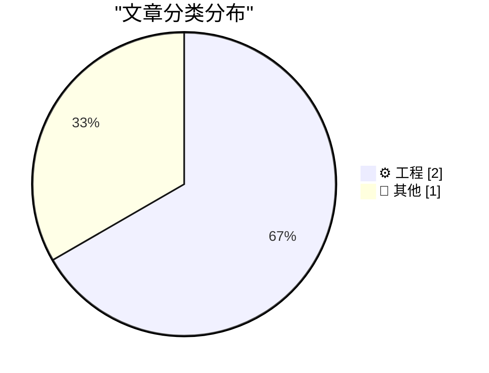
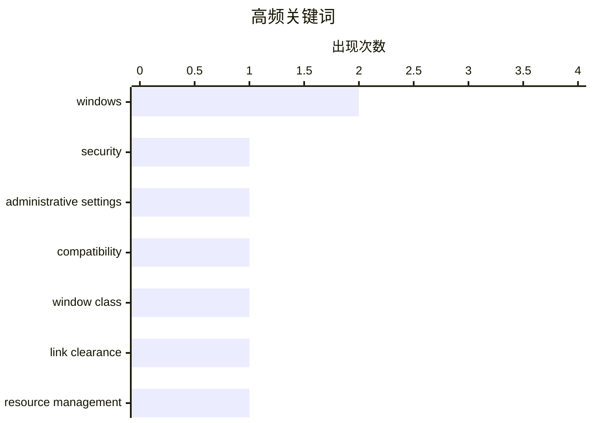

今日技术焦点集中在Windows系统层面：工程师们正深入探讨从进程内部修改管理员设置的可行方案，同时窗口类额外字节的滥用问题也引发兼容性担忧，引发开发者对Windows底层机制的持续关注。技术社区方面，2026年上半年度优质资源推荐新鲜出炉，为开发者提供丰富的学习材料。整体来看，今日热点呈现“深耕系统底层”与“资源整合并重”的双轨趋势。

<!--more-->


> 来自 Karpathy 推荐的 92 个顶级技术博客，AI 精选 Top 3

## 🏆 今日必读

🥇 **从气密舱门的另一侧打开：更改管理员设置**

[It rather involved being on the other side of this airtight hatchway: Changing administrative settings](https://devblogs.microsoft.com/oldnewthing/20260701-00/?p=112498) — devblogs.microsoft.com/oldnewthing · 8 小时前 · ⚙️ 工程

> 本文探讨了如何在 Windows 系统中从进程内部更改管理员设置的问题。作者以一个需要修改系统策略但缺乏相应权限的场景为例，解释了传统方法在处理此类需求时的局限性，并讨论了可能的解决方案。

💡 **为什么值得读**: 适合对 Windows 系统管理、用户权限控制或 UAC 机制感兴趣的开发者和技术支持人员。

🏷️ Windows, security, administrative settings

🥈 **关于滥用 Windows 窗口类额外字节的兼容性说明**

[A compatibility note on the abuse of Windows window class extra bytes](https://devblogs.microsoft.com/oldnewthing/20260630-00/?p=112488) — devblogs.microsoft.com/oldnewthing · 1 天前 · ⚙️ 工程

> 文章讨论了 Windows 窗口类（Window Class）中 extra bytes 的使用问题及其对兼容性的影响。作者指出，部分应用程序滥用窗口类的额外字节空间来存储数据，这种做法在不同 Windows 版本间可能产生兼容性问题，并提供了相关技术细节和注意事项。

💡 **为什么值得读**: 适合 Windows 桌面应用程序开发者阅读，尤其是涉及窗口管理、消息处理或需要维护旧代码兼容性的程序员。

🏷️ Windows, compatibility, window class

🥉 **2026 年中期链接清理**

[2026 mid-year link clearance](https://devblogs.microsoft.com/oldnewthing/20260630-01/?p=112494) — devblogs.microsoft.com/oldnewthing · 1 天前 · 📝 其他

> 这是一篇中期链接推荐文章，作者整理并分享了 2026 年上半年发现的一系列有趣的技术文章、工具或资源。内容涵盖多个技术领域，旨在为读者提供有价值的阅读材料和工具参考。

💡 **为什么值得读**: 适合希望了解近期技术动态、发现优质技术资源的读者，尤其是关注微软生态或 Windows 开发的从业者。

🏷️ link clearance, resource management

---

## 📊 数据概览

| 扫描源 | 抓取文章 | 时间范围 | 精选 |
|:---:|:---:|:---:|:---:|
| 1/92 | 10 篇 → 3 篇 | 48h | **3 篇** |

### 分类分布



### 高频关键词



<details>
<summary>📈 纯文本关键词图（终端友好）</summary>

```
windows                 │ ████████████████████ 2
security                │ ██████████░░░░░░░░░░ 1
administrative settings │ ██████████░░░░░░░░░░ 1
compatibility           │ ██████████░░░░░░░░░░ 1
window class            │ ██████████░░░░░░░░░░ 1
link clearance          │ ██████████░░░░░░░░░░ 1
resource management     │ ██████████░░░░░░░░░░ 1
```

</details>

### 🏷️ 话题标签

**windows**(2) · **security**(1) · **administrative settings**(1) · compatibility(1) · window class(1) · link clearance(1) · resource management(1)

---

## ⚙️ 工程

### 1. 从气密舱门的另一侧打开：更改管理员设置

[It rather involved being on the other side of this airtight hatchway: Changing administrative settings](https://devblogs.microsoft.com/oldnewthing/20260701-00/?p=112498) — **devblogs.microsoft.com/oldnewthing** · 8 小时前 · ⭐ 24/30

> 本文探讨了如何在 Windows 系统中从进程内部更改管理员设置的问题。作者以一个需要修改系统策略但缺乏相应权限的场景为例，解释了传统方法在处理此类需求时的局限性，并讨论了可能的解决方案。

🏷️ Windows, security, administrative settings

---

### 2. 关于滥用 Windows 窗口类额外字节的兼容性说明

[A compatibility note on the abuse of Windows window class extra bytes](https://devblogs.microsoft.com/oldnewthing/20260630-00/?p=112488) — **devblogs.microsoft.com/oldnewthing** · 1 天前 · ⭐ 24/30

> 文章讨论了 Windows 窗口类（Window Class）中 extra bytes 的使用问题及其对兼容性的影响。作者指出，部分应用程序滥用窗口类的额外字节空间来存储数据，这种做法在不同 Windows 版本间可能产生兼容性问题，并提供了相关技术细节和注意事项。

🏷️ Windows, compatibility, window class

---

## 📝 其他

### 3. 2026 年中期链接清理

[2026 mid-year link clearance](https://devblogs.microsoft.com/oldnewthing/20260630-01/?p=112494) — **devblogs.microsoft.com/oldnewthing** · 1 天前 · ⭐ 14/30

> 这是一篇中期链接推荐文章，作者整理并分享了 2026 年上半年发现的一系列有趣的技术文章、工具或资源。内容涵盖多个技术领域，旨在为读者提供有价值的阅读材料和工具参考。

🏷️ link clearance, resource management

---

*生成于 2026-07-02 22:27 | 扫描 1 源 → 获取 10 篇 → 精选 3 篇*
*基于 [Hacker News Popularity Contest 2025](https://refactoringenglish.com/tools/hn-popularity/) RSS 源列表，由 [Andrej Karpathy](https://x.com/karpathy) 推荐*
*由「懂点儿AI」制作，欢迎关注同名微信公众号获取更多 AI 实用技巧 💡*
