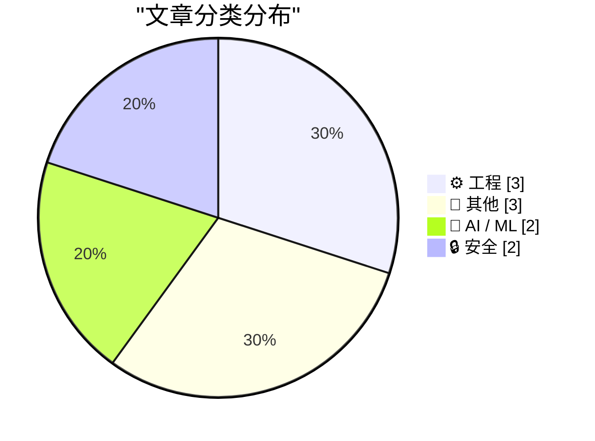
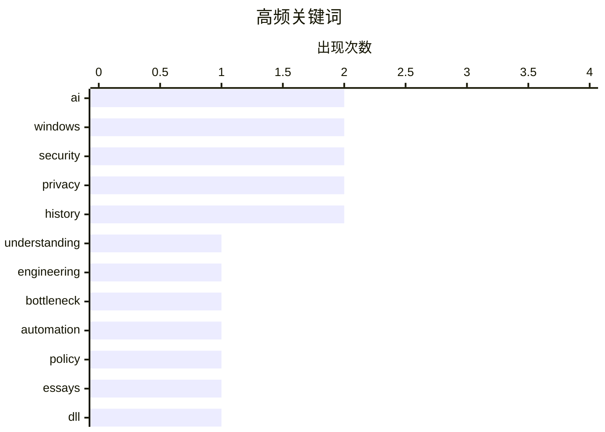

今日技术圈聚焦三大趋势：AI编程时代“理解力”反而成为开发者的新瓶颈，Geoffrey Litt指出AI放大了我们理解代码的能力而非替代它；Clickhouse在可观测性领域持续扩张，逐步奠定行业地位；数据隐私与安全议题持续发酵，荷兰情报机构被曝对bulk datasets处理存在不当，引发数字化主权讨论。

<!--more-->


> 来自 Karpathy 推荐的 92 个顶级技术博客，AI 精选 Top 10

## 🏆 今日必读

🥇 **理解是新的瓶颈**

[Understanding is the new bottleneck](https://geoffreylitt.com/2026/07/02/understanding-is-the-new-bottleneck.html) — geoffreylitt.com · 12 小时前 · 🤖 AI / ML

> 本文探讨了AI编程时代开发者核心能力的变化。作者Geoffrey Litt（Notion设计工程师）认为，尽管AI能生成代码，但理解代码、诊断问题、追踪bug等能力仍是AI无法替代的关键技能。他以自己的实际工作场景为例，说明当遇到复杂问题时，知道“去哪里找答案”比“直接获得答案”更有价值。文章强调，在AI时代“理解”的能力反而成为新的瓶颈，因为AI放大了我们理解代码的能力，而非替代它。

💡 **为什么值得读**: 对AI编程工具感到焦虑的开发者，这篇文章提供了独特的视角：与其担心被AI取代，不如聚焦AI无法替代的理解能力。

🏷️ AI, understanding, engineering, bottleneck

🥈 **The Winning Essays for the Big Questions About AI**

[The Winning Essays for the Big Questions About AI](https://www.dwarkesh.com/p/blog-prize-winners) — dwarkesh.com · 1 天前 · 🤖 AI / ML

> Abolishing pandemics/ Getting out of the way of AI automation/ Learning from Honk Kong MTR's business model

🏷️ AI, automation, policy,  essays

🥉 **The case of the thread executing from an unloaded third-party DLL**

[The case of the thread executing from an unloaded third-party DLL](https://devblogs.microsoft.com/oldnewthing/20260702-00/?p=112500) — devblogs.microsoft.com/oldnewthing · 8 小时前 · ⚙️ 工程

> Oops, I didn't realize that I was still doing that.
The post The case of the thread executing from an unloaded third-party DLL appeared first on The Old New Thing.

🏷️ Windows, DLL, thread, debugging

---

## 📊 数据概览

| 扫描源 | 抓取文章 | 时间范围 | 精选 |
|:---:|:---:|:---:|:---:|
| 52/92 | 1707 篇 → 12 篇 | 48h | **10 篇** |

### 分类分布



### 高频关键词



<details>
<summary>📈 纯文本关键词图（终端友好）</summary>

```
ai            │ ████████████████████ 2
windows       │ ████████████████████ 2
security      │ ████████████████████ 2
privacy       │ ████████████████████ 2
history       │ ████████████████████ 2
understanding │ ██████████░░░░░░░░░░ 1
engineering   │ ██████████░░░░░░░░░░ 1
bottleneck    │ ██████████░░░░░░░░░░ 1
automation    │ ██████████░░░░░░░░░░ 1
policy        │ ██████████░░░░░░░░░░ 1
```

</details>

### 🏷️ 话题标签

**ai**(2) · **windows**(2) · **security**(2) · privacy(2) · history(2) · understanding(1) · engineering(1) · bottleneck(1) · automation(1) · policy(1) ·  essays(1) · dll(1) · thread(1) · debugging(1) · clickhouse(1) · observability(1) · database(1) · monitoring(1) · admin(1) · settings(1)

---

## ⚙️ 工程

### 1. The case of the thread executing from an unloaded third-party DLL

[The case of the thread executing from an unloaded third-party DLL](https://devblogs.microsoft.com/oldnewthing/20260702-00/?p=112500) — **devblogs.microsoft.com/oldnewthing** · 8 小时前 · ⭐ 24/30

> Oops, I didn't realize that I was still doing that.
The post The case of the thread executing from an unloaded third-party DLL appeared first on The Old New Thing.

🏷️ Windows, DLL, thread, debugging

---

### 2. Clickhouse is winning the Observability Wars

[Clickhouse is winning the Observability Wars](https://matduggan.com/clickhouse-is-winning-the-observability-wars/) — **matduggan.com** · 1 天前 · ⭐ 24/30

> For roughly the last ten years, a meaningful percentage of my working hours have been spent thinking about observability. If you&apos;re not familiar with the term, "observability" is what we call it 

🏷️ Clickhouse, observability, database, monitoring

---

### 3. It rather involved being on the other side of this airtight hatchway: Changing administrative settings

[It rather involved being on the other side of this airtight hatchway: Changing administrative settings](https://devblogs.microsoft.com/oldnewthing/20260701-00/?p=112498) — **devblogs.microsoft.com/oldnewthing** · 1 天前 · ⭐ 22/30

> Unlocking the door from the inside.
The post It rather involved being on the other side of this airtight hatchway: Changing administrative settings appeared first on The Old New Thing.

🏷️ Windows, admin, settings, security

---

## 📝 其他

### 4. The earliest surviving Tom’s Hardware Guide article

[The earliest surviving Tom’s Hardware Guide article](https://dfarq.homeip.net/the-earliest-surviving-toms-hardware-guide-article/?utm_source=rss&#038;utm_medium=rss&#038;utm_campaign=the-earliest-surviving-toms-hardware-guide-article) — **dfarq.homeip.net** · 1 天前 · ⭐ 16/30

> The earliest dated article still active on Tom’s Hardware Guide is dated July 1, 1996. It was an article about CPU softmenus, something we pretty much take for granted today, but at the time was only 

🏷️ Tom's Hardware, hardware, history

---

### 5. This Page Left Intentionally Blank

[This Page Left Intentionally Blank](https://blog.jim-nielsen.com/2026/intentionally-blank/) — **blog.jim-nielsen.com** · 3 小时前 · ⭐ 15/30

> <p>I was <a href="https://mastodon.social/@jimniels/116850947778348241" >popping off</a> about negation being an act of creativity, when <a href="https://blakewatson.com/blank/" >Blake Watson introduc

🏷️ web design, blank page, creative

---

### 6. Summary of reading: April - June 2026

[Summary of reading: April - June 2026](https://eli.thegreenplace.net/2026/summary-of-reading-april-june-2026/) — **eli.thegreenplace.net** · 1 天前 · ⭐ 15/30

> <ul class="simple">
<li>"The Nuremberg Trial" by John Tusa and Ann Tusa - a detailed, meticulously
researched account of the Nuremberg Trials. There's not a whole lot of side
questing in this book - i

🏷️ reading, books, history, Nuremberg

---

## 🤖 AI / ML

### 7. 理解是新的瓶颈

[Understanding is the new bottleneck](https://geoffreylitt.com/2026/07/02/understanding-is-the-new-bottleneck.html) — **geoffreylitt.com** · 12 小时前 · ⭐ 26/30

> 本文探讨了AI编程时代开发者核心能力的变化。作者Geoffrey Litt（Notion设计工程师）认为，尽管AI能生成代码，但理解代码、诊断问题、追踪bug等能力仍是AI无法替代的关键技能。他以自己的实际工作场景为例，说明当遇到复杂问题时，知道“去哪里找答案”比“直接获得答案”更有价值。文章强调，在AI时代“理解”的能力反而成为新的瓶颈，因为AI放大了我们理解代码的能力，而非替代它。

🏷️ AI, understanding, engineering, bottleneck

---

### 8. The Winning Essays for the Big Questions About AI

[The Winning Essays for the Big Questions About AI](https://www.dwarkesh.com/p/blog-prize-winners) — **dwarkesh.com** · 1 天前 · ⭐ 25/30

> Abolishing pandemics/ Getting out of the way of AI automation/ Learning from Honk Kong MTR's business model

🏷️ AI, automation, policy,  essays

---

## 🔒 安全

### 9. Digitale Autonomie 2.0: en nu echt

[Digitale Autonomie 2.0: en nu echt](https://berthub.eu/articles/posts/digitale-autonomie-2-0-surf-privacy-security/) — **berthub.eu** · 10 小时前 · ⭐ 20/30

> Afgelopen 25 juni deed ik het openingspraatje van de Surf Privacy en Security Conferentie. Nou heb ik vaker over digitale autonomie gesproken, maar deze keer heb ik het nadrukkelijk meer over wat er n

🏷️ digital autonomy, privacy, security, Netherlands

---

### 10. Bulkdatasets AIVD en MIVD: de schaduw geheime dienst

[Bulkdatasets AIVD en MIVD: de schaduw geheime dienst](https://berthub.eu/articles/posts/de-schaduwgeheimedienst/) — **berthub.eu** · 1 天前 · ⭐ 20/30

> Uit een vandaag verschenen onderzoeksrapport (PDF) blijkt dat de AIVD en MIVD slordig en soms onrechtmatig omgaan met bulkdatasets.
Bulkdatasets zijn grote bestanden vol data over vaak miljoenen wille

🏷️ privacy, surveillance, bulk data, Dutch intelligence

---

*生成于 2026-07-03 22:33 | 扫描 52 源 → 获取 1707 篇 → 精选 10 篇*
*基于 [Hacker News Popularity Contest 2025](https://refactoringenglish.com/tools/hn-popularity/) RSS 源列表，由 [Andrej Karpathy](https://x.com/karpathy) 推荐*
*由「懂点儿AI」制作，欢迎关注同名微信公众号获取更多 AI 实用技巧 💡*
