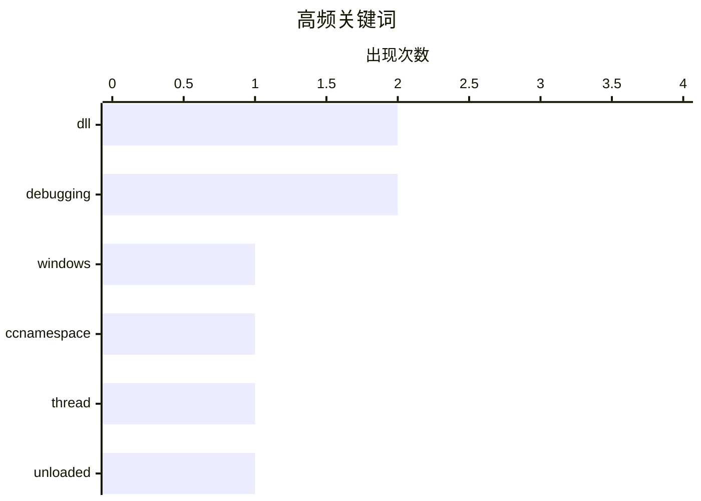

今日技术圈关注DLL生命周期管理问题。Windows系统曝出CcNamespace.dll因设计缺陷导致依赖它的多个DLL被提前卸载，暴露了复杂依赖关系下的生命周期管理挑战。与此同时，第三方组件回调函数与DLL生命周期不同步引发的use-after-free漏洞同样值得警惕。两个案例均指向同一核心问题：组件间依赖管理不当可能导致严重的内存安全与系统稳定性风险。

<!--more-->


> 来自 Karpathy 推荐的 92 个顶级技术博客，AI 精选 Top 2

## 📊 数据概览

| 扫描源 | 抓取文章 | 时间范围 | 精选 |
|:---:|:---:|:---:|:---:|
| 1/92 | 10 篇 → 2 篇 | 48h | **2 篇** |

### 分类分布


### 高频关键词



<details>
<summary>📈 纯文本关键词图（终端友好）</summary>

```
dll         │ ████████████████████ 2
debugging   │ ████████████████████ 2
windows     │ ██████████░░░░░░░░░░ 1
ccnamespace │ ██████████░░░░░░░░░░ 1
thread      │ ██████████░░░░░░░░░░ 1
unloaded    │ ██████████░░░░░░░░░░ 1
```

</details>

### 🏷️ 话题标签

**dll**(2) · **debugging**(2) · **windows**(1) · ccnamespace(1) · thread(1) · unloaded(1)

---

## ⚙️ 工程

### 1. 如何认定 CcNamespace.dll 是导致一组 DLL 提前卸载的罪魁祸首？

[How did we conclude that CcNamespace.dll was the ringleader of a group of DLLs that unloaded prematurely?](https://devblogs.microsoft.com/oldnewthing/20260703-00/?p=112504) — **devblogs.microsoft.com/oldnewthing** · 8 小时前 · ⭐ 23/30

> Windows 团队遇到一组 DLL 意外提前卸载的问题，多个组件在不该被卸载时就被移除了。通过对内存转储进行调试分析，团队追踪到 CcNamespace.dll 是这一切的源头——它持有对这些 DLL 的引用，当它被卸载时，依赖它的其他 DLL 也随之被卸载。问题根源在于 CcNamespace.dll 的设计缺陷导致其生命周期管理不当。这个案例展示了 Windows 系统中 DLL 依赖关系管理的复杂性，以及调试此类问题的典型方法论。

🏷️ DLL, Windows, debugging, CcNamespace

---

### 2. 线程在第三方 DLL 卸载后仍在执行的离奇案例

[The case of the thread executing from an unloaded third-party DLL](https://devblogs.microsoft.com/oldnewthing/20260702-00/?p=112500) — **devblogs.microsoft.com/oldnewthing** · 1 天前 · ⭐ 23/30

> 某第三方 DLL 被卸载后，系统检测到仍有线程在该 DLL 的代码地址空间中执行，这是一个典型的 use-after-free 漏洞场景。问题根源在于该第三方库的回调函数在 DLL 卸载后仍被系统调用，导致线程跳转到已释放的内存区域。调试过程中发现，调用方并未意识到回调的生命周期与 DLL 生命周期绑定，一旦 DLL 卸载而回调未被正确清理，就会触发访问违例。作者通过详细的调试日志和代码分析，揭示了第三方组件与主程序之间生命周期同步的重要性。

🏷️ DLL, thread, unloaded, debugging

---

*生成于 2026-07-04 22:32 | 扫描 1 源 → 获取 10 篇 → 精选 2 篇*
*基于 [Hacker News Popularity Contest 2025](https://refactoringenglish.com/tools/hn-popularity/) RSS 源列表，由 [Andrej Karpathy](https://x.com/karpathy) 推荐*
*由「懂点儿AI」制作，欢迎关注同名微信公众号获取更多 AI 实用技巧 💡*
