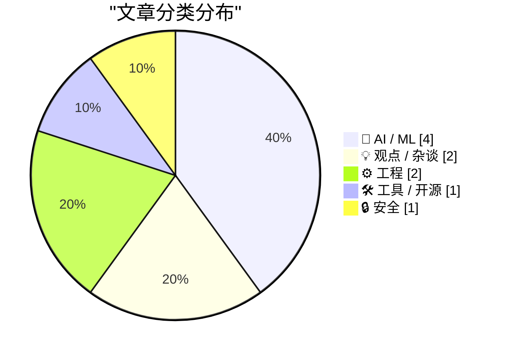
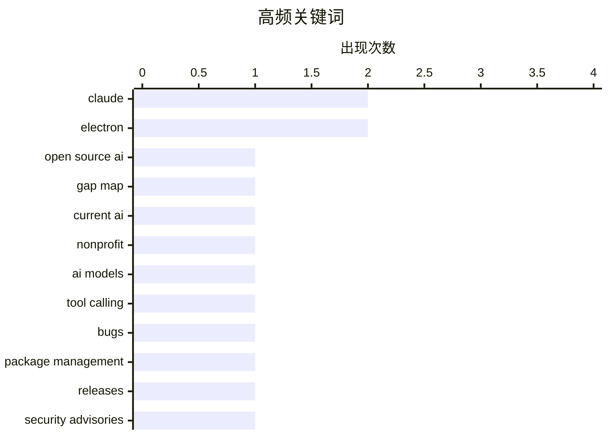

今日技术圈聚焦三大趋势：AI领域持续火热，开源AI与模型质量成为讨论焦点，同时数据与后验方差的技术探讨也在推进；Electron框架引发争议，多篇观点文章探讨其对原生应用体验的影响；工程实践方面则涵盖DLL调试、条码技术及包管理等细分议题，安全隐私议题亦值得关注。

<!--more-->


> 来自 Karpathy 推荐的 92 个顶级技术博客，AI 精选 Top 10

## 🏆 今日必读

🥇 **Open Source AI Gap Map**

[Open Source AI Gap Map](https://simonwillison.net/2026/Jul/3/open-source-ai-gap-map/#atom-everything) — simonwillison.net · 1 天前 · 🤖 AI / ML

> Open Source AI Gap Map

🏷️ Open Source AI, Gap Map, Current AI, nonprofit

🥈 **Better Models: Worse Tools**

[Better Models: Worse Tools](https://lucumr.pocoo.org/2026/7/4/better-models-worse-tools/) — lucumr.pocoo.org · 23 小时前 · 🤖 AI / ML

> Better Models: Worse Tools

🏷️ Claude, AI models, tool calling, bugs

🥉 **This Week in Package Management: 4 July 2026**

[This Week in Package Management: 4 July 2026](https://nesbitt.io/2026/07/04/this-week-in-package-management.html) — nesbitt.io · 13 小时前 · 🛠 工具 / 开源

> This Week in Package Management: 4 July 2026

🏷️ package management, releases, security advisories

---

## 📊 数据概览

| 扫描源 | 抓取文章 | 时间范围 | 精选 |
|:---:|:---:|:---:|:---:|
| 88/92 | 2588 篇 → 21 篇 | 48h | **10 篇** |

### 分类分布



### 高频关键词



<details>
<summary>📈 纯文本关键词图（终端友好）</summary>

```
claude             │ ████████████████████ 2
electron           │ ████████████████████ 2
open source ai     │ ██████████░░░░░░░░░░ 1
gap map            │ ██████████░░░░░░░░░░ 1
current ai         │ ██████████░░░░░░░░░░ 1
nonprofit          │ ██████████░░░░░░░░░░ 1
ai models          │ ██████████░░░░░░░░░░ 1
tool calling       │ ██████████░░░░░░░░░░ 1
bugs               │ ██████████░░░░░░░░░░ 1
package management │ ██████████░░░░░░░░░░ 1
```

</details>

### 🏷️ 话题标签

**claude**(2) · **electron**(2) · **open source ai**(1) · gap map(1) · current ai(1) · nonprofit(1) · ai models(1) · tool calling(1) · bugs(1) · package management(1) · releases(1) · security advisories(1) · mac app(1) · criticism(1) · native apps(1) · software development(1) · windows(1) · debugging(1) · kernel(1) · dll(1)

---

## 🤖 AI / ML

### 1. Open Source AI Gap Map

[Open Source AI Gap Map](https://simonwillison.net/2026/Jul/3/open-source-ai-gap-map/#atom-everything) — **simonwillison.net** · 1 天前 · ⭐ 24/30

> Open Source AI Gap Map

🏷️ Open Source AI, Gap Map, Current AI, nonprofit

---

### 2. Better Models: Worse Tools

[Better Models: Worse Tools](https://lucumr.pocoo.org/2026/7/4/better-models-worse-tools/) — **lucumr.pocoo.org** · 23 小时前 · ⭐ 24/30

> Better Models: Worse Tools

🏷️ Claude, AI models, tool calling, bugs

---

### 3. Does additional data always reduce posterior variance?

[Does additional data always reduce posterior variance?](https://www.johndcook.com/blog/2026/07/03/does-additional-data-always-reduce-posterior-variance/) — **johndcook.com** · 20 小时前 · ⭐ 21/30

> Does additional data always reduce posterior variance?

🏷️ Bayesian statistics, posterior variance, uncertainty

---

### 4. Fable's judgement

[Fable's judgement](https://simonwillison.net/2026/Jul/3/judgement/#atom-everything) — **simonwillison.net** · 1 天前 · ⭐ 19/30

> Fable's judgement

🏷️ Fable, Claude Code, AI engineering, tool

---

## 💡 观点 / 杂谈

### 5. ★ Claude’s Criminally Bad Electron Mac App Is an Inside Job

[★ Claude’s Criminally Bad Electron Mac App Is an Inside Job](https://daringfireball.net/2026/07/claudes_criminally_bad_mac_app_is_an_inside_job) — **daringfireball.net** · 1 天前 · ⭐ 23/30

> ★ Claude’s Criminally Bad Electron Mac App Is an Inside Job

🏷️ Claude, Electron, Mac app, criticism

---

### 6. From the DF Archive: ‘Electron and the Decline of Native Apps’

[From the DF Archive: ‘Electron and the Decline of Native Apps’](https://daringfireball.net/2018/12/electron_and_the_decline_of_native_apps) — **daringfireball.net** · 3 小时前 · ⭐ 21/30

> From the DF Archive: ‘Electron and the Decline of Native Apps’

🏷️ Electron, native apps, software development

---

## ⚙️ 工程

### 7. How did we conclude that CcNamespace.dll was the ringleader of a group of DLLs that unloaded prematurely?

[How did we conclude that CcNamespace.dll was the ringleader of a group of DLLs that unloaded prematurely?](https://devblogs.microsoft.com/oldnewthing/20260703-00/?p=112504) — **devblogs.microsoft.com/oldnewthing** · 1 天前 · ⭐ 21/30

> How did we conclude that CcNamespace.dll was the ringleader of a group of DLLs that unloaded prematurely?

🏷️ Windows, debugging, kernel, DLL

---

### 8. Combined 1D and 2D Barcodes

[Combined 1D and 2D Barcodes](https://shkspr.mobi/blog/2026/07/combined-1d-and-2d-barcodes/) — **shkspr.mobi** · 11 小时前 · ⭐ 19/30

> Combined 1D and 2D Barcodes

🏷️ barcode, QR code, UPC, innovation

---

## 🛠 工具 / 开源

### 9. This Week in Package Management: 4 July 2026

[This Week in Package Management: 4 July 2026](https://nesbitt.io/2026/07/04/this-week-in-package-management.html) — **nesbitt.io** · 13 小时前 · ⭐ 24/30

> This Week in Package Management: 4 July 2026

🏷️ package management, releases, security advisories

---

## 🔒 安全

### 10. Swimming Pools, Pee, and Trying to Delete Your Data From the Internet

[Swimming Pools, Pee, and Trying to Delete Your Data From the Internet](https://www.troyhunt.com/swimming-pools-pee-and-trying-to-delete-your-data-from-the-internet/) — **troyhunt.com** · 1 天前 · ⭐ 20/30

> Swimming Pools, Pee, and Trying to Delete Your Data From the Internet

🏷️ privacy, data deletion, internet

---

*生成于 2026-07-05 23:08 | 扫描 88 源 → 获取 2588 篇 → 精选 10 篇*
*基于 [Hacker News Popularity Contest 2025](https://refactoringenglish.com/tools/hn-popularity/) RSS 源列表，由 [Andrej Karpathy](https://x.com/karpathy) 推荐*
*由「懂点儿AI」制作，欢迎关注同名微信公众号获取更多 AI 实用技巧 💡*
