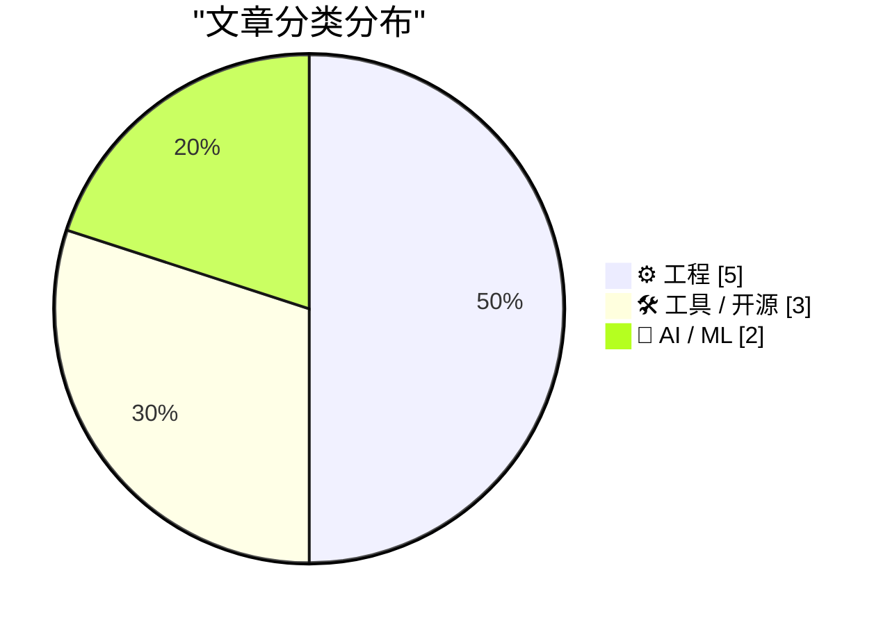
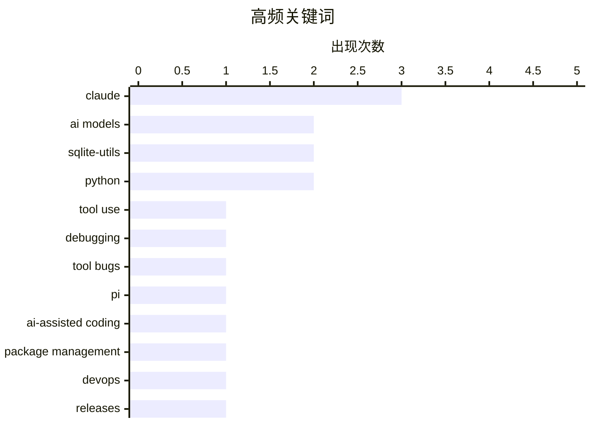

今日看点：AI领域出现值得关注的能力退化现象——最新Claude模型在工具调用任务上反而不及旧版，疑因模型过度优化对话能力导致；AI辅助编程工具持续渗透工程实践，Claude Fable在sqlite-utils发布审查中发现多个潜在问题；工程创新方面，极简代码实现再有突破，445字节数据即可渲染世界地图，显示技术边界仍在被不断探索。

<!--more-->


> 来自 Karpathy 推荐的 92 个顶级技术博客，AI 精选 Top 10

## 🏆 今日必读

🥇 **更好的模型，更差的工具**

[Better Models: Worse Tools](https://simonwillison.net/2026/Jul/4/better-models-worse-tools/#atom-everything) — simonwillison.net · 23 小时前 · 🤖 AI / ML

> 新版Claude模型（Opus 4.8和Sonnet 5）在调用Pi的edit工具时，会在edits[]数组中添加额外的虚构字段，导致参数与schema不匹配而被拒绝，但编辑内容本身通常是正确的。令作者惊讶的是，这种问题在更新的Anthropic模型上反而比旧模型更严重，即SOTA模型在特定工具schema上的表现反而退化。作者推测这可能与更近期模型在训练中过度优化对话能力有关。

💡 **为什么值得读**: 揭示了一个反直觉的现象：最新最强的大模型在特定工具调用任务上反而退化了，值得所有LLM应用开发者关注。

🏷️ Claude, AI models, tool use, debugging

🥈 **更好的模型，更差的工具**

[Better Models: Worse Tools](https://lucumr.pocoo.org/2026/7/4/better-models-worse-tools/) — lucumr.pocoo.org · 1 天前 · 🤖 AI / ML

> 新版Claude模型（Opus 4.8和Sonnet 5）在调用Pi的edit工具时，会在edits[]数组中添加额外的虚构字段，导致参数与schema不匹配而被拒绝，但编辑内容本身通常是正确的。令作者惊讶的是，这种问题在更新的Anthropic模型上反而比旧模型更严重，即SOTA模型在特定工具schema上的表现反而退化。作者推测这可能与更近期模型在训练中过度优化对话能力有关。

💡 **为什么值得读**: 揭示了一个反直觉的现象：最新最强的大模型在特定工具调用任务上反而退化了，值得所有LLM应用开发者关注。

🏷️ Claude, AI models, tool bugs, Pi

🥉 **sqlite-utils 4.0rc2：Claude Fable编写（花费约$149.25）**

[sqlite-utils 4.0rc2, mostly written by Claude Fable (for about $149.25)](https://simonwillison.net/2026/Jul/5/sqlite-utils-fable/#atom-everything) — simonwillison.net · 21 小时前 · ⚙️ 工程

> 作者在Claude Fable订阅剩余几天内，让其帮助审查sqlite-utils 4.0rc1并准备稳定版发布。Fable在初始报告中发现了5个被分类为"releas"的重大问题，这些都是作者自己尚未遇到的。通过Fable的协助，作者得以在正式发布前修复这些潜在破坏性变更。

💡 **为什么值得读**: 展示了AI编程助手在代码审查中的实际价值——能发现开发者自己遗漏的重大问题。

🏷️ sqlite-utils, Claude, AI-assisted coding, Python

---

## 📊 数据概览

| 扫描源 | 抓取文章 | 时间范围 | 精选 |
|:---:|:---:|:---:|:---:|
| 88/92 | 2588 篇 → 15 篇 | 48h | **10 篇** |

### 分类分布



### 高频关键词



<details>
<summary>📈 纯文本关键词图（终端友好）</summary>

```
claude             │ ████████████████████ 3
ai models          │ █████████████░░░░░░░ 2
sqlite-utils       │ █████████████░░░░░░░ 2
python             │ █████████████░░░░░░░ 2
tool use           │ ███████░░░░░░░░░░░░░ 1
debugging          │ ███████░░░░░░░░░░░░░ 1
tool bugs          │ ███████░░░░░░░░░░░░░ 1
pi                 │ ███████░░░░░░░░░░░░░ 1
ai-assisted coding │ ███████░░░░░░░░░░░░░ 1
package management │ ███████░░░░░░░░░░░░░ 1
```

</details>

### 🏷️ 话题标签

**claude**(3) · **ai models**(2) · **sqlite-utils**(2) · python(2) · tool use(1) · debugging(1) · tool bugs(1) · pi(1) · ai-assisted coding(1) · package management(1) · devops(1) · releases(1) · bayesian statistics(1) · posterior variance(1) · statistics(1) · pldi(1) · programming languages(1) · conference(1) · database(1) · release(1)

---

## ⚙️ 工程

### 1. sqlite-utils 4.0rc2：Claude Fable编写（花费约$149.25）

[sqlite-utils 4.0rc2, mostly written by Claude Fable (for about $149.25)](https://simonwillison.net/2026/Jul/5/sqlite-utils-fable/#atom-everything) — **simonwillison.net** · 21 小时前 · ⭐ 24/30

> 作者在Claude Fable订阅剩余几天内，让其帮助审查sqlite-utils 4.0rc1并准备稳定版发布。Fable在初始报告中发现了5个被分类为"releas"的重大问题，这些都是作者自己尚未遇到的。通过Fable的协助，作者得以在正式发布前修复这些潜在破坏性变更。

🏷️ sqlite-utils, Claude, AI-assisted coding, Python

---

### 2. 额外数据总是减少后验方差吗？

[Does additional data always reduce posterior variance?](https://www.johndcook.com/blog/2026/07/03/does-additional-data-always-reduce-posterior-variance/) — **johndcook.com** · 1 天前 · ⭐ 21/30

> 从贝叶斯角度探讨额外数据对不确定性的影响。虽然更多数据通常会使后验分布更集中（减少后验方差），但这并不总是意味着置信区间变小。作者指出新信息确实会减少对估计量的不确定性，关键在于理解"更集中"与"置信区间缩小"之间的细微差别。

🏷️ Bayesian statistics, posterior variance, statistics

---

### 3. 旅行笔记：PLDI Boulder

[Travel notes: PLDI Boulder](https://bernsteinbear.com/blog/travel-notes-pldi-boulder/?utm_source=rss) — **bernsteinbear.com** · 22 小时前 · ⭐ 20/30

> 作者参加了2026年6月的PLDI会议，这是他第四次参加。会议期间结识了新朋友，进行了研究讨论，在一场演讲中提问，并展示了PLDI给Aaron和Jacob。作者还怀念了CF Bolz-Tereick和Chris Fallin等常参加会议的熟人，期待明年再会。

🏷️ PLDI, programming languages, conference

---

### 4. 仅用500字节构建世界地图

[Building a World Map with only 500 bytes](https://simonwillison.net/2026/Jul/4/building-a-world-map-with-only-500-bytes/#atom-everything) — **simonwillison.net** · 23 小时前 · ⭐ 18/30

> Iwo Kadziela在Codex辅助下找到一种方法，仅用445字节数据生成可信的ASCII世界地图。关键技术是利用deflate压缩，并通过JavaScript的fetch()配合data: URI和DecompressionStream('deflate-raw')实现解压缩渲染。

🏷️ ASCII, data compression, visualization, 500 bytes

---

### 5. 组合一维和二维条码

[Combined 1D and 2D Barcodes](https://shkspr.mobi/blog/2026/07/combined-1d-and-2d-barcodes/) — **shkspr.mobi** · 1 天前 · ⭐ 17/30

> 作者尝试将传统UPC一维条码嵌入QR二维码中。设计思路是：当手机靠近条码时无法识别角落的方形定位符，会自动读取中间的UPC号码；当远离时则可识别完整的QR码内容。

🏷️ QR code, barcode, UPC, embedded

---

## 🛠 工具 / 开源

### 6. 本周包管理动态：2026年7月4日

[This Week in Package Management: 4 July 2026](https://nesbitt.io/2026/07/04/this-week-in-package-management.html) — **nesbitt.io** · 1 天前 · ⭐ 22/30

> [内容被截断，无有效信息可摘要]

🏷️ package management, DevOps, releases

---

### 7. sqlite-utils 4.0rc2 发布

[sqlite-utils 4.0rc2](https://simonwillison.net/2026/Jul/5/sqlite-utils/#atom-everything) — **simonwillison.net** · 21 小时前 · ⭐ 19/30

> sqlite-utils 4.0rc2版本发布，是继rc1之后的候选版本。该版本由Claude Fable协助完成最终审查，发现了多个潜在破坏性变更并进行了修复。

🏷️ sqlite-utils, Python, database, release

---

### 8. Fantastical 4.1.15新增日历镜像功能

[Fantastical 4.1.15 Adds Calendar Mirroring](https://flexibits.com/blog/2026/06/double-booked-never-heard-of-it-meet-calendar-mirroring-in-fantastical/) — **daringfireball.net** · 1 天前 · ⭐ 16/30

> Fantastical 4.1.15引入日历镜像功能，允许用户连接两个独立日历（如工作和个人日历），自动将一方的事件同步到另一方。关键特点是所有事件信息仅保存在本地设备，不上传至Flexibits服务器。用户可选择显示完整事件详情或仅显示"忙碌"标记。

🏷️ Fantastical, calendar, iOS, macOS

---

## 🤖 AI / ML

### 9. 更好的模型，更差的工具

[Better Models: Worse Tools](https://simonwillison.net/2026/Jul/4/better-models-worse-tools/#atom-everything) — **simonwillison.net** · 23 小时前 · ⭐ 26/30

> 新版Claude模型（Opus 4.8和Sonnet 5）在调用Pi的edit工具时，会在edits[]数组中添加额外的虚构字段，导致参数与schema不匹配而被拒绝，但编辑内容本身通常是正确的。令作者惊讶的是，这种问题在更新的Anthropic模型上反而比旧模型更严重，即SOTA模型在特定工具schema上的表现反而退化。作者推测这可能与更近期模型在训练中过度优化对话能力有关。

🏷️ Claude, AI models, tool use, debugging

---

### 10. 更好的模型，更差的工具

[Better Models: Worse Tools](https://lucumr.pocoo.org/2026/7/4/better-models-worse-tools/) — **lucumr.pocoo.org** · 1 天前 · ⭐ 26/30

> 新版Claude模型（Opus 4.8和Sonnet 5）在调用Pi的edit工具时，会在edits[]数组中添加额外的虚构字段，导致参数与schema不匹配而被拒绝，但编辑内容本身通常是正确的。令作者惊讶的是，这种问题在更新的Anthropic模型上反而比旧模型更严重，即SOTA模型在特定工具schema上的表现反而退化。作者推测这可能与更近期模型在训练中过度优化对话能力有关。

🏷️ Claude, AI models, tool bugs, Pi

---

*生成于 2026-07-06 22:18 | 扫描 88 源 → 获取 2588 篇 → 精选 10 篇*
*基于 [Hacker News Popularity Contest 2025](https://refactoringenglish.com/tools/hn-popularity/) RSS 源列表，由 [Andrej Karpathy](https://x.com/karpathy) 推荐*
*由「懂点儿AI」制作，欢迎关注同名微信公众号获取更多 AI 实用技巧 💡*
