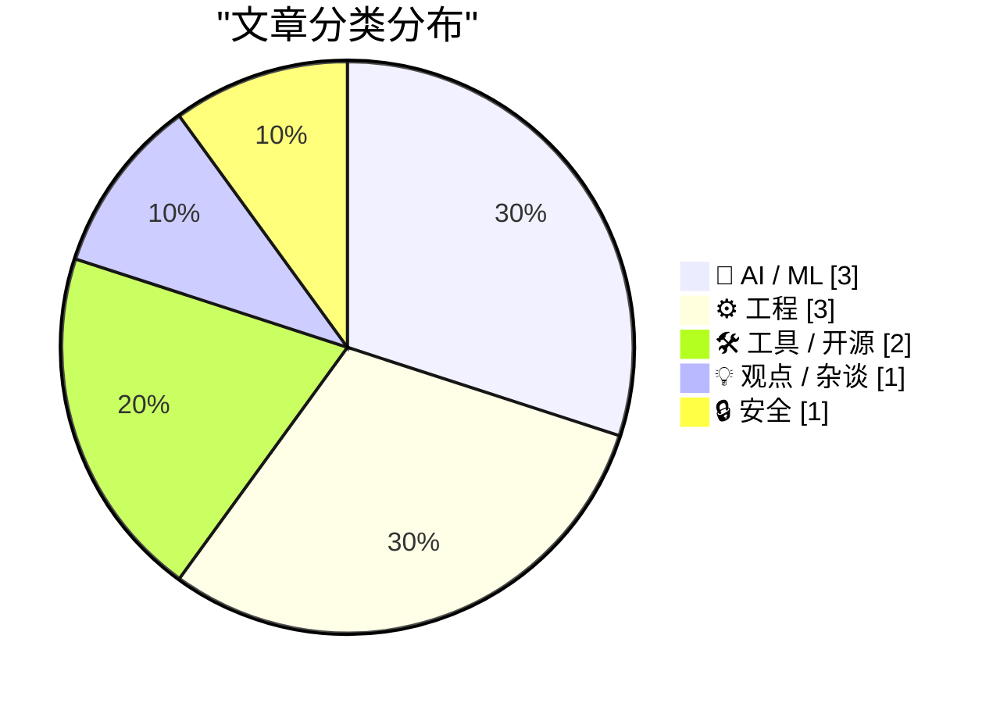
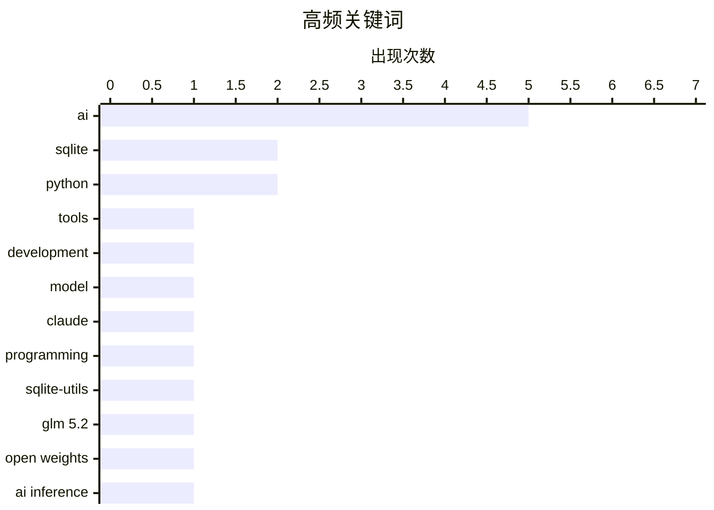

今日技术圈呈现两大趋势：一是AI领域出现反思潮，从模型性能与工具质量的矛盾，到GLM 5.2揭示的AI价格战趋势，再到开发者对AI的倦怠感，行业正从狂热转向理性审视；二是开发者工具持续迭代，sqlite-utils在AI辅助下快速更新，同时Apple在macOS 27中为Markdown引入系统级UTI支持，显示生态整合加速。此外，极简编程挑战（500字节世界地图）和内容真实性协议C2PA则展现了技术探索的多元面向。

<!--more-->


> 来自 Karpathy 推荐的 92 个顶级技术博客，AI 精选 Top 10

## 🏆 今日必读

🥇 **Better Models: Worse Tools**

[Better Models: Worse Tools](https://simonwillison.net/2026/Jul/4/better-models-worse-tools/#atom-everything) — simonwillison.net · 1 天前 · 🤖 AI / ML

> Better Models: Worse Tools

🏷️ AI, tools, development, model

🥈 **sqlite-utils 4.0rc2, mostly written by Claude Fable (for about $149.25)**

[sqlite-utils 4.0rc2, mostly written by Claude Fable (for about $149.25)](https://simonwillison.net/2026/Jul/5/sqlite-utils-fable/#atom-everything) — simonwillison.net · 1 天前 · 🛠 工具 / 开源

> sqlite-utils 4.0rc2, mostly written by Claude Fable (for about $149.25)

🏷️ Claude, AI, programming, sqlite-utils

🥉 **GLM 5.2 and the coming AI margin collapse (part 1)**

[GLM 5.2 and the coming AI margin collapse (part 1)](https://martinalderson.com/posts/the-upcoming-ai-margin-collapse-part-1-glm-5-2/?utm_source=rss&amp;utm_medium=rss&amp;utm_campaign=feed) — martinalderson.com · 22 小时前 · 🤖 AI / ML

> GLM 5.2 and the coming AI margin collapse (part 1)

🏷️ GLM 5.2, open weights, AI inference, model competition

---

## 📊 数据概览

| 扫描源 | 抓取文章 | 时间范围 | 精选 |
|:---:|:---:|:---:|:---:|
| 87/92 | 2564 篇 → 24 篇 | 48h | **10 篇** |

### 分类分布



### 高频关键词



<details>
<summary>📈 纯文本关键词图（终端友好）</summary>

```
ai           │ ████████████████████ 5
sqlite       │ ████████░░░░░░░░░░░░ 2
python       │ ████████░░░░░░░░░░░░ 2
tools        │ ████░░░░░░░░░░░░░░░░ 1
development  │ ████░░░░░░░░░░░░░░░░ 1
model        │ ████░░░░░░░░░░░░░░░░ 1
claude       │ ████░░░░░░░░░░░░░░░░ 1
programming  │ ████░░░░░░░░░░░░░░░░ 1
sqlite-utils │ ████░░░░░░░░░░░░░░░░ 1
glm 5.2      │ ████░░░░░░░░░░░░░░░░ 1
```

</details>

### 🏷️ 话题标签

**ai**(5) · **sqlite**(2) · **python**(2) · tools(1) · development(1) · model(1) · claude(1) · programming(1) · sqlite-utils(1) · glm 5.2(1) · open weights(1) · ai inference(1) · model competition(1) · cli(1) · database(1) · markdown(1) · apple(1) · uti(1) · macos(1) · fatigue(1)

---

## 🤖 AI / ML

### 1. Better Models: Worse Tools

[Better Models: Worse Tools](https://simonwillison.net/2026/Jul/4/better-models-worse-tools/#atom-everything) — **simonwillison.net** · 1 天前 · ⭐ 25/30

> Better Models: Worse Tools

🏷️ AI, tools, development, model

---

### 2. GLM 5.2 and the coming AI margin collapse (part 1)

[GLM 5.2 and the coming AI margin collapse (part 1)](https://martinalderson.com/posts/the-upcoming-ai-margin-collapse-part-1-glm-5-2/?utm_source=rss&amp;utm_medium=rss&amp;utm_campaign=feed) — **martinalderson.com** · 22 小时前 · ⭐ 24/30

> GLM 5.2 and the coming AI margin collapse (part 1)

🏷️ GLM 5.2, open weights, AI inference, model competition

---

### 3. Allen Pike, Back in November: ‘Why Is ChatGPT for Mac So Good?’

[Allen Pike, Back in November: ‘Why Is ChatGPT for Mac So Good?’](https://allenpike.com/2025/why-is-chatgpt-so-good-claude/) — **daringfireball.net** · 4 小时前 · ⭐ 20/30

> Allen Pike, Back in November: ‘Why Is ChatGPT for Mac So Good?’

🏷️ ChatGPT, Mac, AI, desktop

---

## ⚙️ 工程

### 4. sqlite-utils 4.0rc3

[sqlite-utils 4.0rc3](https://simonwillison.net/2026/Jul/6/sqlite-utils/#atom-everything) — **simonwillison.net** · 16 小时前 · ⭐ 23/30

> sqlite-utils 4.0rc3

🏷️ SQLite, Python, CLI, database

---

### 5. sqlite-utils 4.0rc2

[sqlite-utils 4.0rc2](https://simonwillison.net/2026/Jul/5/sqlite-utils/#atom-everything) — **simonwillison.net** · 1 天前 · ⭐ 20/30

> sqlite-utils 4.0rc2

🏷️ SQLite, Python, release

---

### 6. Building a World Map with only 500 bytes

[Building a World Map with only 500 bytes](https://simonwillison.net/2026/Jul/4/building-a-world-map-with-only-500-bytes/#atom-everything) — **simonwillison.net** · 1 天前 · ⭐ 19/30

> Building a World Map with only 500 bytes

🏷️ compression, ASCII, data, visualization

---

## 🛠 工具 / 开源

### 7. sqlite-utils 4.0rc2, mostly written by Claude Fable (for about $149.25)

[sqlite-utils 4.0rc2, mostly written by Claude Fable (for about $149.25)](https://simonwillison.net/2026/Jul/5/sqlite-utils-fable/#atom-everything) — **simonwillison.net** · 1 天前 · ⭐ 24/30

> sqlite-utils 4.0rc2, mostly written by Claude Fable (for about $149.25)

🏷️ Claude, AI, programming, sqlite-utils

---

### 8. Markdown Now Has a UTI in Apple’s Version 27 OSes

[Markdown Now Has a UTI in Apple’s Version 27 OSes](https://developer.apple.com/documentation/uniformtypeidentifiers/uttype-swift.struct/markdown) — **daringfireball.net** · 1 小时前 · ⭐ 23/30

> Markdown Now Has a UTI in Apple’s Version 27 OSes

🏷️ Markdown, Apple, UTI, macOS

---

## 💡 观点 / 杂谈

### 9. I'm just so bored of AI

[I'm just so bored of AI](https://shkspr.mobi/blog/2026/07/im-just-so-bored-of-ai/) — **shkspr.mobi** · 10 小时前 · ⭐ 23/30

> I'm just so bored of AI

🏷️ AI, fatigue, technology, criticism

---

## 🔒 安全

### 10. C2PA only works if everything is signed

[C2PA only works if everything is signed](https://seangoedecke.com/c2pa-only-works-if-everything-is-signed/) — **seangoedecke.com** · 22 小时前 · ⭐ 22/30

> C2PA only works if everything is signed

🏷️ C2PA, AI, digital, signature

---

*生成于 2026-07-07 22:19 | 扫描 87 源 → 获取 2564 篇 → 精选 10 篇*
*基于 [Hacker News Popularity Contest 2025](https://refactoringenglish.com/tools/hn-popularity/) RSS 源列表，由 [Andrej Karpathy](https://x.com/karpathy) 推荐*
*由「懂点儿AI」制作，欢迎关注同名微信公众号获取更多 AI 实用技巧 💡*
