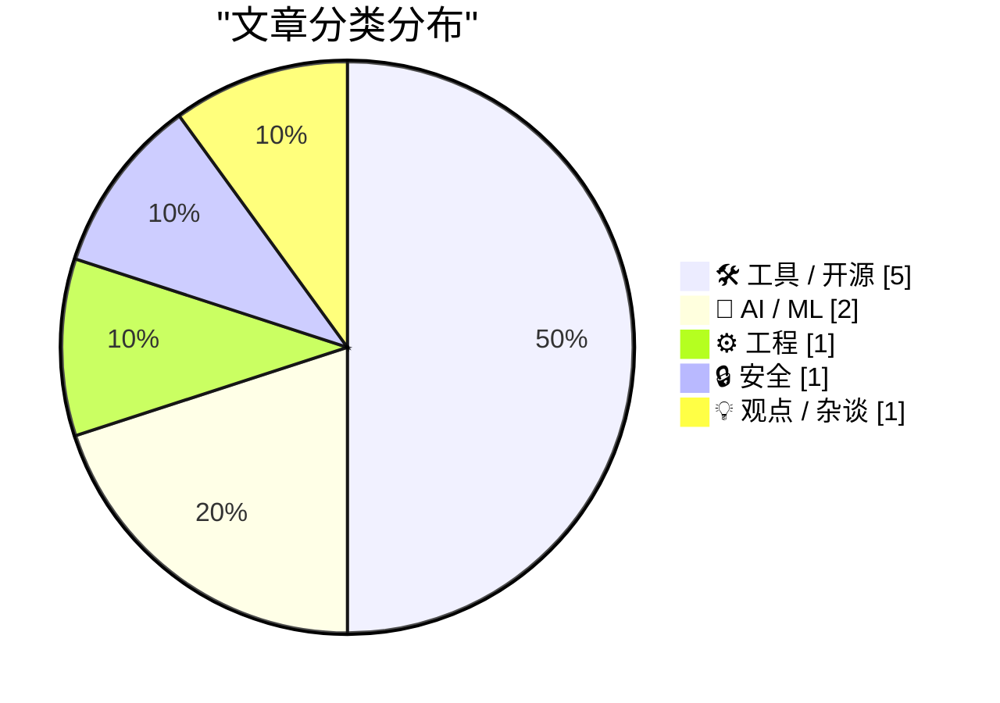
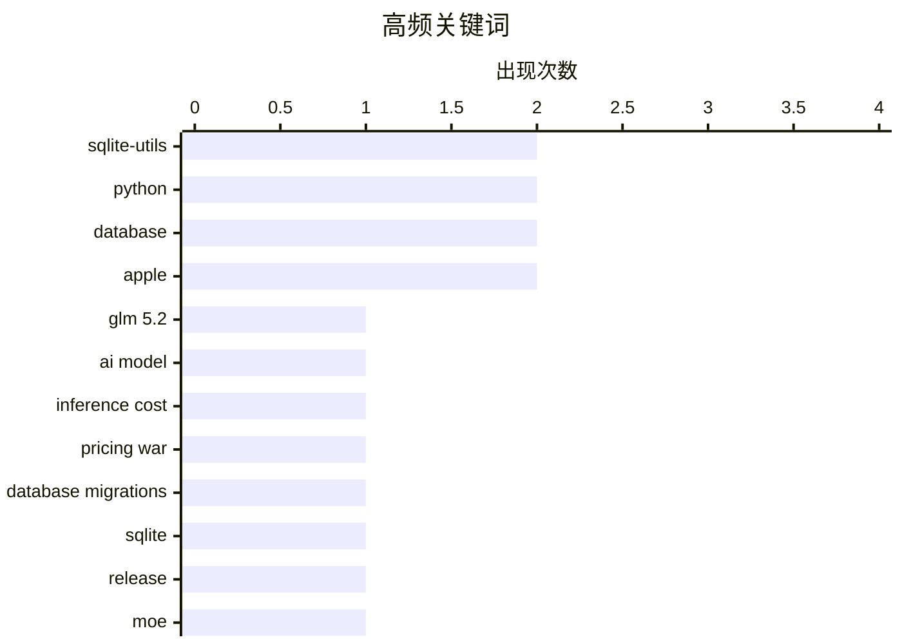

AI开源大模型竞争加剧，GLM 5.2以GPT-4o仅15-20%的价格实现对标性能，腾讯发布2950亿参数的Hy3开源MoE模型，行业预计低价竞争将导致AI推理利润率大幅压缩。SQLite工具链迎来重大更新，sqlite-utils 4.0首次支持数据库架构迁移和嵌套事务，推动SQLite在生产环境中的可用性提升。苹果系统层面持续迭代，iOS 27为Markdown引入统一类型标识符，并为Siri AI新增语速与表达力自定义选项。

<!--more-->


> 来自 Karpathy 推荐的 92 个顶级技术博客，AI 精选 Top 10

## 🏆 今日必读

🥇 **GLM 5.2 与即将到来的 AI 利润率崩溃（第一部分）**

[GLM 5.2 and the coming AI margin collapse (part 1)](https://martinalderson.com/posts/the-upcoming-ai-margin-collapse-part-1-glm-5-2/?utm_source=rss&amp;utm_medium=rss&amp;utm_campaign=feed) — martinalderson.com · 1 天前 · 🤖 AI / ML

> GLM 5.2 是首个可称为 Opus 和 GPT 在智能体工作方面真正竞争对手的开源权重模型，价格仅为后者的 15-20%。该模型的出现标志着开源大模型在性价比上实现突破，为 AI 推理服务市场带来重大变革。作者认为这将导致 AI 推理利润率大幅压缩，因为低价竞争者正在侵蚀传统闭源模型的利润空间。

💡 **为什么值得读**: 对于关注 AI 行业发展趋势和商业化前景的从业者，这篇文章提供了关于开源模型崛起如何改变市场格局的关键洞察。

🏷️ GLM 5.2, AI model, inference cost, pricing war

🥈 **sqlite-utils 4.0，现在支持数据库架构迁移**

[sqlite-utils 4.0, now with database schema migrations](https://simonwillison.net/2026/Jul/7/sqlite-utils-4/#atom-everything) — simonwillison.net · 2 小时前 · ⚙️ 工程

> sqlite-utils 4.0 正式发布，这是该项目的第 124 个版本，也是自 2020 年 11 月 3.0 以来首次重大版本升级。新版本引入三大核心功能：数据库架构迁移（schema migrations）、嵌套事务（通过新的 db.atomic() 方法）以及复合外键支持。这些功能显著提升了 SQLite 数据库在生产环境中的可用性。

💡 **为什么值得读**: 如果你是 Python 开发者或经常使用 SQLite，这篇文章能帮助你了解如何用现代方式管理数据库版本和事务，是提升开发效率的实用信息。

🏷️ sqlite-utils, database migrations, Python, SQLite

🥉 **sqlite-utils 4.0 发布**

[sqlite-utils 4.0](https://simonwillison.net/2026/Jul/7/sqlite-utils/#atom-everything) — simonwillison.net · 6 小时前 · 🛠 工具 / 开源

> sqlite-utils 4.0 版本正式发布，带来数据库架构迁移、嵌套事务和复合外键等重大更新。

💡 **为什么值得读**: 这是 sqlite-utils 用户的版本升级指南，可快速了解新功能并决定是否需要迁移。

🏷️ sqlite-utils, Python, database, release

---

## 📊 数据概览

| 扫描源 | 抓取文章 | 时间范围 | 精选 |
|:---:|:---:|:---:|:---:|
| 88/92 | 2590 篇 → 35 篇 | 48h | **10 篇** |

### 分类分布



### 高频关键词



<details>
<summary>📈 纯文本关键词图（终端友好）</summary>

```
sqlite-utils        │ ████████████████████ 2
python              │ ████████████████████ 2
database            │ ████████████████████ 2
apple               │ ████████████████████ 2
glm 5.2             │ ██████████░░░░░░░░░░ 1
ai model            │ ██████████░░░░░░░░░░ 1
inference cost      │ ██████████░░░░░░░░░░ 1
pricing war         │ ██████████░░░░░░░░░░ 1
database migrations │ ██████████░░░░░░░░░░ 1
sqlite              │ ██████████░░░░░░░░░░ 1
```

</details>

### 🏷️ 话题标签

**sqlite-utils**(2) · **python**(2) · **database**(2) · apple(2) · glm 5.2(1) · ai model(1) · inference cost(1) · pricing war(1) · database migrations(1) · sqlite(1) · release(1) · moe(1) · tencent(1) · llm(1) · hy3(1) · web component(1) · gpt-5.5(1) · github(1) · experimental(1) · c2pa(1)

---

## 🛠 工具 / 开源

### 1. sqlite-utils 4.0 发布

[sqlite-utils 4.0](https://simonwillison.net/2026/Jul/7/sqlite-utils/#atom-everything) — **simonwillison.net** · 6 小时前 · ⭐ 24/30

> sqlite-utils 4.0 版本正式发布，带来数据库架构迁移、嵌套事务和复合外键等重大更新。

🏷️ sqlite-utils, Python, database, release

---

### 2. github-code Web 组件

[github-code Web Component](https://simonwillison.net/2026/Jul/7/github-code-component/#atom-everything) — **simonwillison.net** · 6 小时前 · ⭐ 22/30

> 作者使用 GPT-5.5 通过提示词构建了一个实验性 Web 组件，可嵌入 GitHub 代码。该组件接收 GitHub 仓库 URL，自动转换为 raw.githubusercontent.com 链接并获取指定行范围的代码，支持显示行号但不含语法高亮功能。

🏷️ Web Component, GPT-5.5, GitHub, experimental

---

### 3. 苹果 OS 27 为 Markdown 引入统一类型标识符（UTI）

[Markdown Now Has a Uniform Type Identifer (UTI) in Apple’s Version 27 OSes](https://developer.apple.com/documentation/uniformtypeidentifiers/uttype-swift.struct/markdown) — **daringfireball.net** · 1 天前 · ⭐ 22/30

> 苹果在 OS 27 开发者预览版中引入了 Markdown 的统一类型标识符 net.daringfireball.markdown，该 UTI 继承自 public.utf8-plain-text。作者更新了此前的推荐，将 Markdown 类型从 public.plain-text 改为 public.utf8-plain-text，以明确 UTF-8 编码规范。

🏷️ Markdown, UTI, Apple, macOS

---

### 4. sqlite-migrate 0.2 发布

[sqlite-migrate 0.2](https://simonwillison.net/2026/Jul/7/sqlite-migrate/#atom-everything) — **simonwillison.net** · 5 小时前 · ⭐ 20/30

> sqlite-migrate 0.2 版本发布，该库选择退役，转而实现一个兼容层，依赖于新版 sqlite-utils 4.0 的迁移功能。

🏷️ sqlite-migrate, database, migration, compatibility

---

### 5. 苹果 OS 27 测试版为 Siri 新语音推出「语速」和「表达力」滑块

[OS 27 Developer Beta 3 Enables New ‘Pace’ and ‘Expressivity’ Sliders for Siri’s New Voices](https://techcrunch.com/2026/07/06/you-can-now-customize-siris-pace-and-expressivity-in-the-latest-ios-27-beta/) — **daringfireball.net** · 6 小时前 · ⭐ 20/30

> iOS 27 开发者测试版 3 为 Siri AI 引入了语速（Pace）和表达力（Expressivity）两个可调节滑块，用户可自定义 AI 助手说话的语速和情感表达程度。这是苹果持续改进 Siri AI 体验的最新功能更新。

🏷️ iOS 27, Siri, Apple, voice AI

---

## 🤖 AI / ML

### 6. GLM 5.2 与即将到来的 AI 利润率崩溃（第一部分）

[GLM 5.2 and the coming AI margin collapse (part 1)](https://martinalderson.com/posts/the-upcoming-ai-margin-collapse-part-1-glm-5-2/?utm_source=rss&amp;utm_medium=rss&amp;utm_campaign=feed) — **martinalderson.com** · 1 天前 · ⭐ 25/30

> GLM 5.2 是首个可称为 Opus 和 GPT 在智能体工作方面真正竞争对手的开源权重模型，价格仅为后者的 15-20%。该模型的出现标志着开源大模型在性价比上实现突破，为 AI 推理服务市场带来重大变革。作者认为这将导致 AI 推理利润率大幅压缩，因为低价竞争者正在侵蚀传统闭源模型的利润空间。

🏷️ GLM 5.2, AI model, inference cost, pricing war

---

### 7. 腾讯发布 Hy3 大模型

[tencent/Hy3](https://simonwillison.net/2026/Jul/6/hy3/#atom-everything) — **simonwillison.net** · 22 小时前 · ⭐ 23/30

> 腾讯发布 Hy3，这是一款 2950 亿参数的混合专家（MoE）模型，包含 210 亿活跃参数和 38 亿 MTP 层参数，采用 Apache 2.0 开源许可证。该模型在各类产品和生产力任务中表现优异，上下文长度达 256K，可免费在 OpenRouter 上体验至 7 月 21 日。

🏷️ MoE, Tencent, LLM, Hy3

---

## ⚙️ 工程

### 8. sqlite-utils 4.0，现在支持数据库架构迁移

[sqlite-utils 4.0, now with database schema migrations](https://simonwillison.net/2026/Jul/7/sqlite-utils-4/#atom-everything) — **simonwillison.net** · 2 小时前 · ⭐ 24/30

> sqlite-utils 4.0 正式发布，这是该项目的第 124 个版本，也是自 2020 年 11 月 3.0 以来首次重大版本升级。新版本引入三大核心功能：数据库架构迁移（schema migrations）、嵌套事务（通过新的 db.atomic() 方法）以及复合外键支持。这些功能显著提升了 SQLite 数据库在生产环境中的可用性。

🏷️ sqlite-utils, database migrations, Python, SQLite

---

## 🔒 安全

### 9. C2PA 只有在全部签名时才能生效

[C2PA only works if everything is signed](https://seangoedecke.com/c2pa-only-works-if-everything-is-signed/) — **seangoedecke.com** · 1 天前 · ⭐ 22/30

> 欧盟 AI Act 要求 AI 生成内容必须带有水印或数字签名元数据，C2PA Content Credentials 是最知名的实现方案。作者指出 C2PA 的有效性取决于整个供应链的参与——如果创作者、编辑工具、平台等任一环节未签名，整个链条就会断裂，导致标记失效。该方案面临实际执行困难的挑战。

🏷️ C2PA, EU AI Act, digital signatures, content authentication

---

## 💡 观点 / 杂谈

### 10. 美国各州和国际反垄断机构如何击败大型科技公司

[Pluralistic: How US states and international trustbusters can beat Big Tech (07 Jul 2026)](https://pluralistic.net/2026/07/07/going-global/) — **pluralistic.net** · 9 小时前 · ⭐ 21/30

> 本文讨论美国各州和国际监管机构共同对抗大型科技公司的策略，指出他们的共同对手是特朗普及其支持的科技巨头。文章涵盖反垄断执法、技术监管等多个维度。

🏷️ Antitrust, Big Tech, Regulation, Trustbusters

---

*生成于 2026-07-08 22:19 | 扫描 88 源 → 获取 2590 篇 → 精选 10 篇*
*基于 [Hacker News Popularity Contest 2025](https://refactoringenglish.com/tools/hn-popularity/) RSS 源列表，由 [Andrej Karpathy](https://x.com/karpathy) 推荐*
*由「懂点儿AI」制作，欢迎关注同名微信公众号获取更多 AI 实用技巧 💡*
