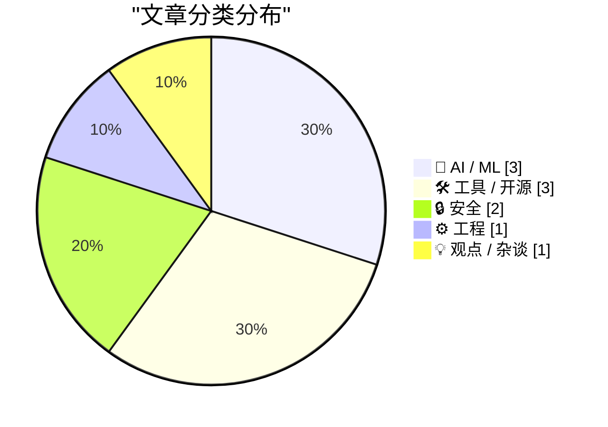
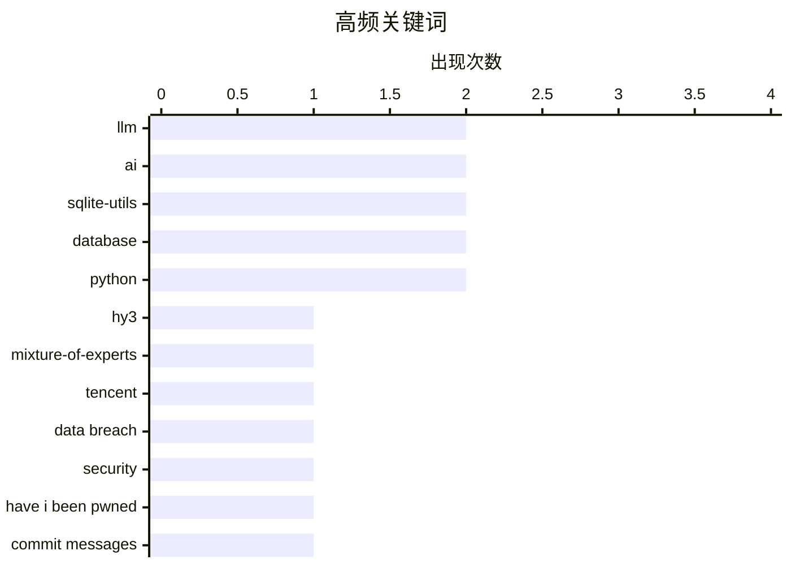

今日技术圈关注三大趋势：一是AI大模型持续爆发，腾讯发布295B参数的MoE开源模型Hy3性能比肩数倍参数旗舰，同时iOS 27 Beta为Siri引入AI语速与表达力控制；二是AI应用争议浮现，工程师Kenton Varda明确禁止团队用AI编写变更描述，认为其缺乏高层理解背景，同日曝光争议安全初创公司由极右翼运营；三是开发者工具生态更新，sqlite-utils 14年来首次大版本升级支持数据库迁移，实验性GitHub代码Web组件亮相。

<!--more-->


> 来自 Karpathy 推荐的 92 个顶级技术博客，AI 精选 Top 10

## 🏆 今日必读

🥇 **腾讯发布Hy3：295B参数MoE开源模型**

[tencent/Hy3](https://simonwillison.net/2026/Jul/6/hy3/#atom-everything) — simonwillison.net · 1 天前 · 🤖 AI / ML

> 腾讯推出Apache 2.0许可的Hy3模型，总参数295B、活跃参数21B、MTP层参数3.8B，上下文长度256K。模型在Hugging Face上大小为598GB（FP8量化版300GB），在OpenRouter免费提供至7月21日。Hy3性能优于同类规模模型，可媲美参数多2-5倍的开源旗舰模型。该模型基于50+产品反馈进行了大规模后训练，在各类产品和生产力任务中表现显著提升。

💡 **为什么值得读**: 对大模型技术演进和MoE架构应用感兴趣的开发者可通过此模型了解当前开源大模型的前沿水平。

🏷️ Hy3, Mixture-of-Experts, LLM, Tencent

🥈 **每周更新511：来自马拉喀什的动态**

[Weekly Update 511: Live from my Riad in Marrakech](https://www.troyhunt.com/weekly-update-511/) — troyhunt.com · 8 小时前 · 🔒 安全

> Troy Hunt从马拉喀什（摩洛哥）发布本周更新，继续讨论数据泄露相关话题。文章以"试图从泳池中去除尿液是徒劳的"比喻，探讨数据泄露处理的困境。

💡 **为什么值得读**: 关注数据安全和泄露事件的读者可通过此更新了解最新行业动态和专家观点。

🏷️ data breach, security, Have I Been Pwned

🥉 **Kenton Varda禁止团队使用AI编写变更描述**

[Quoting Kenton Varda](https://simonwillison.net/2026/Jul/8/kenton-varda/#atom-everything) — simonwillison.net · 2 小时前 · ⚙️ 工程

> Kenton Varda宣布对团队实施AI编写变更描述（包括PR/提交信息、issue/ticket）的禁令。他认为AI生成的变更描述比无用更糟糕：能轻易从代码中看到的细节被列出，但缺少理解代码整体意图所需的高层框架背景。

💡 **为什么值得读**: 对AI辅助编程实践和代码审查中AI使用利弊感兴趣的开发者值得一读。

🏷️ AI, commit messages, software engineering, team workflow

---

## 📊 数据概览

| 扫描源 | 抓取文章 | 时间范围 | 精选 |
|:---:|:---:|:---:|:---:|
| 88/92 | 2590 篇 → 33 篇 | 48h | **10 篇** |

### 分类分布



### 高频关键词



<details>
<summary>📈 纯文本关键词图（终端友好）</summary>

```
llm                │ ████████████████████ 2
ai                 │ ████████████████████ 2
sqlite-utils       │ ████████████████████ 2
database           │ ████████████████████ 2
python             │ ████████████████████ 2
hy3                │ ██████████░░░░░░░░░░ 1
mixture-of-experts │ ██████████░░░░░░░░░░ 1
tencent            │ ██████████░░░░░░░░░░ 1
data breach        │ ██████████░░░░░░░░░░ 1
security           │ ██████████░░░░░░░░░░ 1
```

</details>

### 🏷️ 话题标签

**llm**(2) · **ai**(2) · **sqlite-utils**(2) · database(2) · python(2) · hy3(1) · mixture-of-experts(1) · tencent(1) · data breach(1) · security(1) · have i been pwned(1) · commit messages(1) · software engineering(1) · team workflow(1) · schema migrations(1) · releases(1) · cybersecurity(1) · zero-day(1) · startup(1) · fraud(1)

---

## 🤖 AI / ML

### 1. 腾讯发布Hy3：295B参数MoE开源模型

[tencent/Hy3](https://simonwillison.net/2026/Jul/6/hy3/#atom-everything) — **simonwillison.net** · 1 天前 · ⭐ 25/30

> 腾讯推出Apache 2.0许可的Hy3模型，总参数295B、活跃参数21B、MTP层参数3.8B，上下文长度256K。模型在Hugging Face上大小为598GB（FP8量化版300GB），在OpenRouter免费提供至7月21日。Hy3性能优于同类规模模型，可媲美参数多2-5倍的开源旗舰模型。该模型基于50+产品反馈进行了大规模后训练，在各类产品和生产力任务中表现显著提升。

🏷️ Hy3, Mixture-of-Experts, LLM, Tencent

---

### 2. iOS 27 Beta 3为Siri推出语速和表达力调节功能

[OS 27 Developer Beta 3 Enables New ‘Pace’ and ‘Expressivity’ Sliders for Siri’s New Voices](https://techcrunch.com/2026/07/06/you-can-now-customize-siris-pace-and-expressivity-in-the-latest-ios-27-beta/) — **daringfireball.net** · 1 天前 · ⭐ 24/30

> iOS 27开发者Beta 3引入Siri新的语音控制滑块"Pace"（语速）和"Expressivity"（表达力），此前在首个Beta版本中标记为"即将推出"。作者表示iOS 27开发者Beta稳定性极佳，AI版Siri非常实用，认为这是类似Snow Leopard的"修复和改进基础"年份。

🏷️ iOS 27, Siri, voice assistant, AI

---

### 3. 从零构建LLM系列终章：用JAX实现GPT-2小型模型

[Writing an LLM from scratch, part 34b -- from bigrams to GPT-2, one component at a time (in JAX)](https://www.gilesthomas.com/2026/07/llm-from-scratch-34b-building-and-training-gpt-2-small-in-jax) — **gilesthomas.com** · 3 小时前 · ⭐ 24/30

> 作者完成了从2024年12月开始的长系列——从零构建LLM。阅读Sebastian Raschka的《Build a Large Language Model (from Scratch)》书籍后，经过一系列探索，最终决定不参考原书和之前代码，仅用笔记通过JAX框架从bigrams逐步构建并训练GPT-2小型模型。

🏷️ LLM, GPT-2, JAX, deep learning

---

## 🛠 工具 / 开源

### 4. sqlite-utils 4.0发布：支持数据库Schema迁移

[sqlite-utils 4.0, now with database schema migrations](https://simonwillison.net/2026/Jul/7/sqlite-utils-4/#atom-everything) — **simonwillison.net** · 1 天前 · ⭐ 24/30

> sqlite-utils发布4.0版本（项目第124次发布，首次大版本升级），引入三大核心功能：数据库Schema迁移机制（跟踪已应用的迁移并执行待处理迁移）、嵌套事务支持（通过新的db.atomic()方法）、复合外键支持。同时包含一些破坏性变更。

🏷️ sqlite-utils, database, Python, schema migrations

---

### 5. sqlite-utils 4.0发布

[sqlite-utils 4.0](https://simonwillison.net/2026/Jul/7/sqlite-utils/#atom-everything) — **simonwillison.net** · 1 天前 · ⭐ 24/30

> sqlite-utils 4.0版本发布，这是自2020年11月3.0版本以来的首次重大版本升级，引入数据库迁移、嵌套事务和复合外键支持。

🏷️ sqlite-utils, database, Python, releases

---

### 6. 实验性GitHub代码Web组件发布

[github-code Web Component](https://simonwillison.net/2026/Jul/7/github-code-component/#atom-everything) — **simonwillison.net** · 1 天前 · ⭐ 23/30

> 使用GPT-5.5构建的实验性Web组件，可嵌入GitHub代码。组件接受GitHub文件URL，转换为raw.githubusercontent.com URL并通过fetch()获取内容，显示指定行号范围的代码（无语法高亮）。

🏷️ Web Component, GPT-5.5, GitHub, AI-assisted coding

---

## 🔒 安全

### 7. 每周更新511：来自马拉喀什的动态

[Weekly Update 511: Live from my Riad in Marrakech](https://www.troyhunt.com/weekly-update-511/) — **troyhunt.com** · 8 小时前 · ⭐ 25/30

> Troy Hunt从马拉喀什（摩洛哥）发布本周更新，继续讨论数据泄露相关话题。文章以"试图从泳池中去除尿液是徒劳的"比喻，探讨数据泄露处理的困境。

🏷️ data breach, security, Have I Been Pwned

---

### 8. 争议网络安全初创公司：前科犯与阴谋论者运营

[Felons, Fraudsters Flog Offensive Cybersecurity Startup](https://krebsonsecurity.com/2026/07/felons-fraudsters-flog-offensive-cybersecurity-startup/) — **krebsonsecurity.com** · 9 小时前 · ⭐ 24/30

> 一家提供数百万美元购买流行软件零日漏洞的网络安全初创公司，实际由极右翼阴谋论者和 convicted重刑犯运营。他们的最新 venture 包括虚假情报公司和以假名运营的基于AI的游说平台。

🏷️ cybersecurity, zero-day, startup, fraud

---

## ⚙️ 工程

### 9. Kenton Varda禁止团队使用AI编写变更描述

[Quoting Kenton Varda](https://simonwillison.net/2026/Jul/8/kenton-varda/#atom-everything) — **simonwillison.net** · 2 小时前 · ⭐ 24/30

> Kenton Varda宣布对团队实施AI编写变更描述（包括PR/提交信息、issue/ticket）的禁令。他认为AI生成的变更描述比无用更糟糕：能轻易从代码中看到的细节被列出，但缺少理解代码整体意图所需的高层框架背景。

🏷️ AI, commit messages, software engineering, team workflow

---

## 💡 观点 / 杂谈

### 10. 美国各州和国际监管机构如何击败大型科技公司

[Pluralistic: How US states and international trustbusters can beat Big Tech (07 Jul 2026)](https://pluralistic.net/2026/07/07/going-global/) — **pluralistic.net** · 1 天前 · ⭐ 22/30

> 文章探讨美国各州和国际反垄断监管机构如何对抗大型科技公司，作者认为他们的共同对手是特朗普及其支持的科技巨头。文章还包含丰富多样的有趣链接集锦。

🏷️ Big Tech, antitrust, regulation, trustbusters

---

*生成于 2026-07-09 22:19 | 扫描 88 源 → 获取 2590 篇 → 精选 10 篇*
*基于 [Hacker News Popularity Contest 2025](https://refactoringenglish.com/tools/hn-popularity/) RSS 源列表，由 [Andrej Karpathy](https://x.com/karpathy) 推荐*
*由「懂点儿AI」制作，欢迎关注同名微信公众号获取更多 AI 实用技巧 💡*
