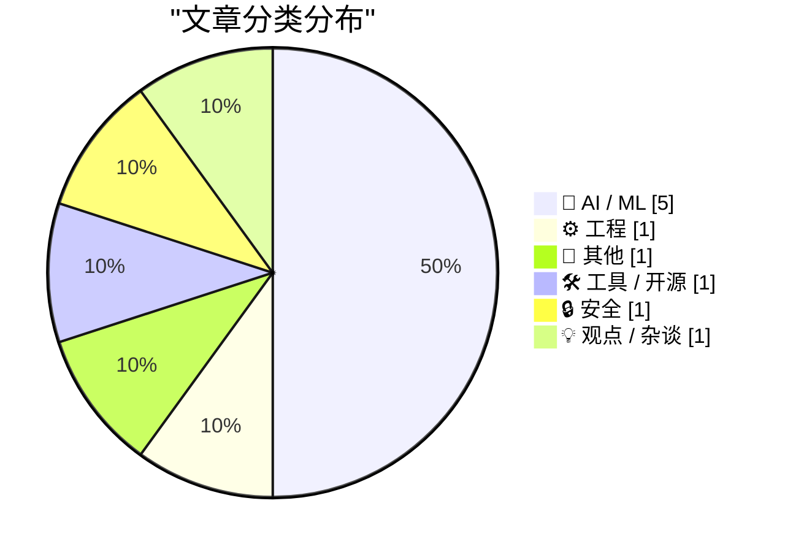
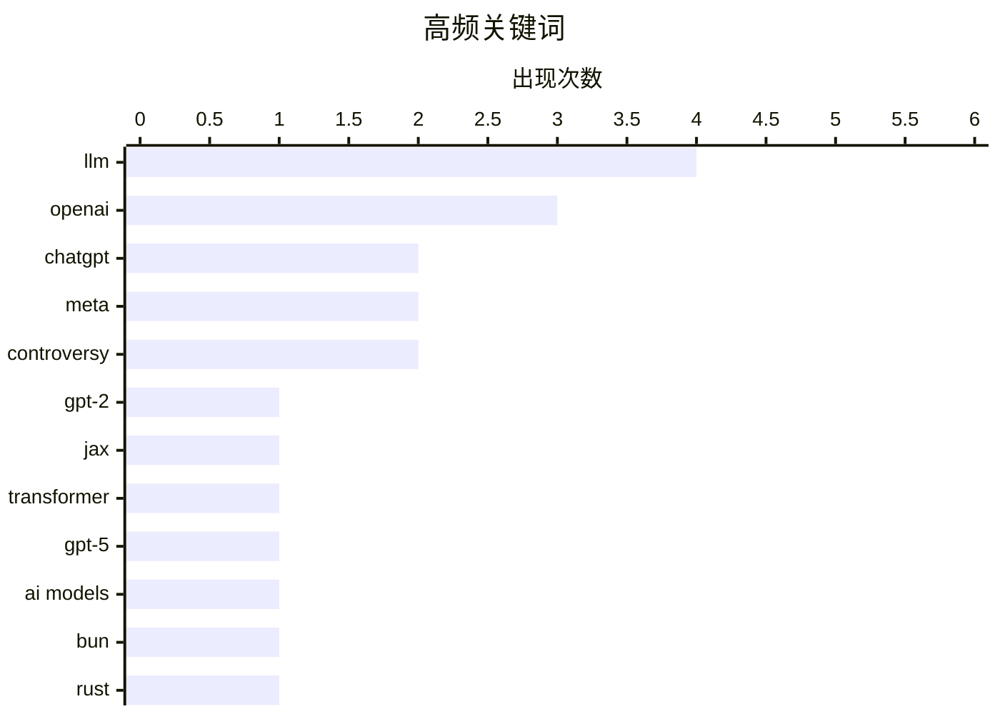

今日AI模型领域持续迭代升级，OpenAI发布GPT-5.6系列（Luna、Terra、Sol三款），在Agents' Last Exam基准测试中刷新成绩，同时ChatGPT语音模式获重大升级；Meta也推出首个提供API的Spark模型Muse Spark 1.1，推动模型API化进程。工程层面，Bun为解决长期稳定性问题宣布从Zig重写为Rust，体现了实际生产环境中对可靠性的重视。此外，Meta默认允许Instagram内容被AI复用的隐私争议仍在持续发酵。

<!--more-->


> 来自 Karpathy 推荐的 92 个顶级技术博客，AI 精选 Top 10

## 🏆 今日必读

🥇 **从零构建 LLM：第 34b 部分 —— 用 JAX 从bigram逐步实现GPT-2**

[Writing an LLM from scratch, part 34b -- from bigrams to GPT-2, one component at a time (in JAX)](https://www.gilesthomas.com/2026/07/llm-from-scratch-34b-building-and-training-gpt-2-small-in-jax) — gilesthomas.com · 1 天前 · 🤖 AI / ML

> 作者完成了博客上历时最长的系列文章——从零构建 LLM。阅读 Sebastian Raschka 的《Build a Large Language Model from Scratch》后，作者决定仅凭笔记、不参考原书代码，用 JAX 从bigram逐步实现并训练 GPT-2。经过 Twitter 投票选择 JAX 是为了确保真正从零构建，而非照搬 PyTorch 代码。

💡 **为什么值得读**: 适合想深入理解 LLM 内部工作原理、跟随完整实现路径的开发者，尤其是对 JAX 实现感兴趣的人。

🏷️ LLM, GPT-2, JAX, transformer

🥈 **GPT-5.6 家族：Luna、Terra、Sol 三款新模型**

[The new GPT-5.6 family: Luna, Terra, Sol](https://simonwillison.net/2026/Jul/9/gpt-5-6/#atom-everything) — simonwillison.net · 2 小时前 · 🤖 AI / ML

> OpenAI 发布 GPT-5.6 系列，包含 Luna、Terra、Sol 三个尺寸（从小到大），定价分别为 $1/$6、$2.50/$15、$5/$30（每百万 token）。在 Agents' Last Exam 基准测试中，GPT-5.6 Sol 达到 53.6 分，超越 Claude Fable 5 共 13.1 分。该系列主打长时运行的专业工作流性能。

💡 **为什么值得读**: 适合关注 LLM 最新发展、对比主流模型能力差距的技术决策者和开发者。

🏷️ GPT-5, OpenAI, LLM, AI models

🥉 **用 Rust 重写 Bun**

[Rewriting Bun in Rust](https://simonwillison.net/2026/Jul/8/rewriting-bun-in-rust/#atom-everything) — simonwillison.net · 22 小时前 · ⚙️ 工程

> Bun 作者 Jarred Sumner 将 Bun 从 Zig 重写为 Rust。Bun 团队此前因混合垃圾回收与手动内存管理导致频繁崩溃，Zig 并未为此场景设计。重写过程采用了复杂的 agentic 工程，包括动态工作流、对抗性审查等技巧，最终解决了长期困扰的稳定性问题。

💡 **为什么值得读**: 适合对编程语言底层实现、Bun 架构演进及大规模代码重写感兴趣的开发者。

🏷️ Bun, Rust, Zig, performance

---

## 📊 数据概览

| 扫描源 | 抓取文章 | 时间范围 | 精选 |
|:---:|:---:|:---:|:---:|
| 88/92 | 2590 篇 → 39 篇 | 48h | **10 篇** |

### 分类分布



### 高频关键词



<details>
<summary>📈 纯文本关键词图（终端友好）</summary>

```
llm         │ ████████████████████ 4
openai      │ ███████████████░░░░░ 3
chatgpt     │ ██████████░░░░░░░░░░ 2
meta        │ ██████████░░░░░░░░░░ 2
controversy │ ██████████░░░░░░░░░░ 2
gpt-2       │ █████░░░░░░░░░░░░░░░ 1
jax         │ █████░░░░░░░░░░░░░░░ 1
transformer │ █████░░░░░░░░░░░░░░░ 1
gpt-5       │ █████░░░░░░░░░░░░░░░ 1
ai models   │ █████░░░░░░░░░░░░░░░ 1
```

</details>

### 🏷️ 话题标签

**llm**(4) · **openai**(3) · **chatgpt**(2) · meta(2) · controversy(2) · gpt-2(1) · jax(1) · transformer(1) · gpt-5(1) · ai models(1) · bun(1) · rust(1) · zig(1) · performance(1) · gpt-live(1) · voice mode(1) · muse spark(1) · ai api(1) · ai image(1) · instagram(1)

---

## 🤖 AI / ML

### 1. 从零构建 LLM：第 34b 部分 —— 用 JAX 从bigram逐步实现GPT-2

[Writing an LLM from scratch, part 34b -- from bigrams to GPT-2, one component at a time (in JAX)](https://www.gilesthomas.com/2026/07/llm-from-scratch-34b-building-and-training-gpt-2-small-in-jax) — **gilesthomas.com** · 1 天前 · ⭐ 25/30

> 作者完成了博客上历时最长的系列文章——从零构建 LLM。阅读 Sebastian Raschka 的《Build a Large Language Model from Scratch》后，作者决定仅凭笔记、不参考原书代码，用 JAX 从bigram逐步实现并训练 GPT-2。经过 Twitter 投票选择 JAX 是为了确保真正从零构建，而非照搬 PyTorch 代码。

🏷️ LLM, GPT-2, JAX, transformer

---

### 2. GPT-5.6 家族：Luna、Terra、Sol 三款新模型

[The new GPT-5.6 family: Luna, Terra, Sol](https://simonwillison.net/2026/Jul/9/gpt-5-6/#atom-everything) — **simonwillison.net** · 2 小时前 · ⭐ 24/30

> OpenAI 发布 GPT-5.6 系列，包含 Luna、Terra、Sol 三个尺寸（从小到大），定价分别为 $1/$6、$2.50/$15、$5/$30（每百万 token）。在 Agents' Last Exam 基准测试中，GPT-5.6 Sol 达到 53.6 分，超越 Claude Fable 5 共 13.1 分。该系列主打长时运行的专业工作流性能。

🏷️ GPT-5, OpenAI, LLM, AI models

---

### 3. GPT-Live 发布：ChatGPT 语音模式重大升级

[Introducing GPT‑Live](https://simonwillison.net/2026/Jul/8/introducing-gptlive/#atom-everything) — **simonwillison.net** · 22 小时前 · ⭐ 24/30

> OpenAI 终于升级了 ChatGPT 语音模式使用的模型，新模型能力大幅提升。GPT-Live 可将复杂问题委托给 GPT-5.5 处理（如需网络搜索、深度推理），同时保持对话流畅。之前的语音模式基于 GPT-4o，知识截止于 2024 年。

🏷️ GPT-Live, ChatGPT, voice mode, OpenAI

---

### 4. Muse Spark 1.1 发布：首个提供 API 的 Spark 模型

[Introducing Muse Spark 1.1](https://simonwillison.net/2026/Jul/9/muse-spark-1-1/#atom-everything) — **simonwillison.net** · 5 小时前 · ⭐ 23/30

> Meta 发布 Muse Spark 1.1，这是首个提供 API 的 Spark 模型，在 agentic 工具调用和计算机使用方面有显著改进。评估报告中展示了「自我对话」特性——模型两个副本相互对话时会产生关于自身存在的有趣陈述。作者已开发 llm-meta-ai 插件支持该模型。

🏷️ Muse Spark, Meta, AI API, LLM

---

### 5. Meta 默认允许 Instagram 账户内容被 AI 复用

[Meta Sets Default for Instagram Accounts to Permit Content Reuse by AI](https://www.nytimes.com/2026/07/08/technology/meta-instagram-ai.html?unlocked_article_code=1.wVA.Q5Do.Uvg5yPwCEB5H) — **daringfireball.net** · 8 小时前 · ⭐ 23/30

> Meta 推出 AI 图像生成器 Muse Image，默认允许成人用户基于公开 Instagram 账户照片创建 AI 图像，所有公开账户自动 opt-in。用户可通过设置关闭此功能。此举被批评将用户视为「臣民」，引发隐私争议。

🏷️ Meta, AI image, Instagram, content rights

---

## ⚙️ 工程

### 6. 用 Rust 重写 Bun

[Rewriting Bun in Rust](https://simonwillison.net/2026/Jul/8/rewriting-bun-in-rust/#atom-everything) — **simonwillison.net** · 22 小时前 · ⭐ 24/30

> Bun 作者 Jarred Sumner 将 Bun 从 Zig 重写为 Rust。Bun 团队此前因混合垃圾回收与手动内存管理导致频繁崩溃，Zig 并未为此场景设计。重写过程采用了复杂的 agentic 工程，包括动态工作流、对抗性审查等技巧，最终解决了长期困扰的稳定性问题。

🏷️ Bun, Rust, Zig, performance

---

## 📝 其他

### 7. OpenAI 搞砸了 ChatGPT Mac 应用

[Today’s the Day OpenAI Fucked Up the ChatGPT Mac App](https://9to5mac.com/2026/07/09/openai-announcing-the-next-chapter-for-chatgpt-today-watch-here/) — **daringfireball.net** · 2 小时前 · ⭐ 22/30

> OpenAI 重新调整了 ChatGPT 桌面应用产品线：原有应用更名为 ChatGPT Classic，Codex 变身为新 ChatGPT 桌面应用（原 Codex 功能保留），用户可同时安装三个应用。159MB 的原生 Mac app 现已成为历史。

🏷️ OpenAI, Mac app, ChatGPT, controversy

---

## 🛠 工具 / 开源

### 8. llm-meta-ai 0.1 发布

[llm-meta-ai 0.1](https://simonwillison.net/2026/Jul/9/llm-meta-ai/#atom-everything) — **simonwillison.net** · 6 小时前 · ⭐ 21/30

> 发布 llm-meta-ai 0.1 插件，允许 LLM 工具运行针对 Meta Muse Spark 1.1 模型的提示词。

🏷️ llm-meta-ai, CLI, LLM, integration

---

## 🔒 安全

### 9. 犯罪分子与欺诈者运营的进攻性网络安全初创公司

[Felons, Fraudsters Flog Offensive Cybersecurity Startup](https://krebsonsecurity.com/2026/07/felons-fraudsters-flog-offensive-cybersecurity-startup/) — **krebsonsecurity.com** · 1 天前 · ⭐ 21/30

> 一家向研究人员提供数百万美元以收购流行软件零日漏洞的网络安全初创公司，由极右翼阴谋论者和伪造情报公司的惯犯运营。该公司还运营过一个基于 AI 的游说平台。

🏷️ cybersecurity, zero-day, startup, controversy

---

## 💡 观点 / 杂谈

### 10. John Ternus 应阻止苹果滑向广告深渊

[★ John Ternus Should Reverse Apple’s Slide Down the Advertising Slippery Slope](https://daringfireball.net/2026/07/ternus_apple_slippery_slope) — **daringfireball.net** · 3 小时前 · ⭐ 21/30

> 作者认为苹果应停止在广告领域的扩张步伐。2014 年 Tim Cook 的隐私信有分量，是因为当时苹果根本不展示广告，如今苹果已大幅加入广告业务，隐私承诺的可信度随之下降。

🏷️ Apple, advertising, privacy, iOS

---

*生成于 2026-07-10 22:19 | 扫描 88 源 → 获取 2590 篇 → 精选 10 篇*
*基于 [Hacker News Popularity Contest 2025](https://refactoringenglish.com/tools/hn-popularity/) RSS 源列表，由 [Andrej Karpathy](https://x.com/karpathy) 推荐*
*由「懂点儿AI」制作，欢迎关注同名微信公众号获取更多 AI 实用技巧 💡*
